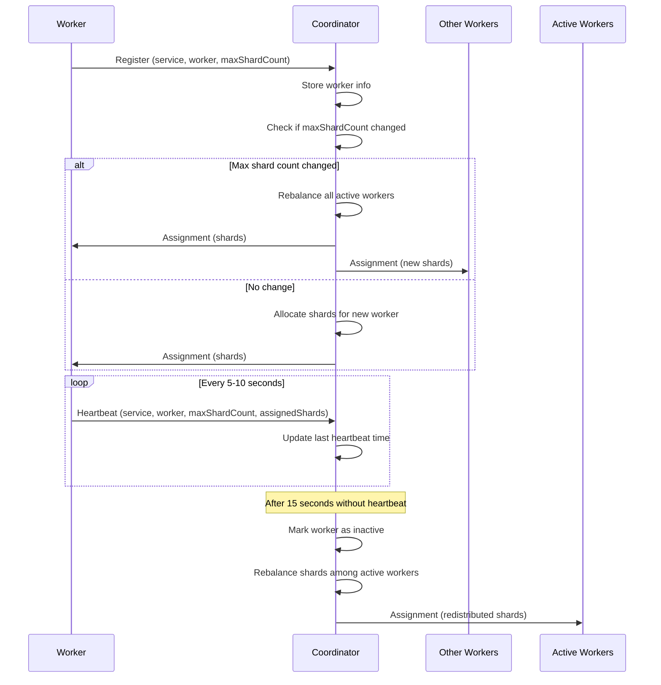

# Coordinator

The coordinator service manages shard distribution across worker processes using ZeroMQ for communication.

## Features

- **Shard Coordination**: Distributes shards among registered workers for different services
- **ZeroMQ Communication**: Uses ZeroMQ ROUTER/DEALER pattern for worker registration and shard assignment
- **Dynamic Load Balancing**: Automatically redistributes shards when workers register or update
- **Heartbeat Monitoring**: Tracks worker health and marks inactive workers after timeout
- **Health Checks**: Includes HTTP health checks for service monitoring

## Configuration

The coordinator uses the following environment variables:

### Required Framework Variables
- `PROCESS_NAME`: Process name (default: 'coordinator')
- `NODE_ENV`: Node environment (default: 'development')
- `PORT`: HTTP server port (default: 3000)
- `LOG_LEVEL`: Logging level (default: 'debug')

### ZeroMQ Configuration
- `SHARD_COORDINATOR_BIND_PORT`: ZeroMQ bind port (default: 5555)
- `SHARD_COORDINATOR_BIND_HOST`: ZeroMQ bind host (default: 'tcp://0.0.0.0')

### Heartbeat Configuration
- `HEARTBEAT_TIMEOUT_SECONDS`: Time before worker is marked inactive (default: 15)
- `HEARTBEAT_CHECK_INTERVAL_SECONDS`: Interval for checking worker heartbeats (default: 5)

## Message Protocol

### Worker Registration

Workers register with the coordinator by sending a registration message:

```typescript
// Registration message
{
  type: 'register',
  data: {
    serviceName: string;      // Name of the service
    workerId: string;          // Unique worker identifier
    maxShardCount: number;     // Maximum number of shards for this service
  }
}
```

The coordinator responds with a shard assignment:

```typescript
// Assignment response
{
  type: 'assignment',
  data: {
    assignedShards: number[];  // Array of shard numbers assigned to this worker
  }
}
```

### Worker Heartbeat

Workers must send periodic heartbeats to maintain their active status:

```typescript
// Heartbeat message
{
  type: 'heartbeat',
  data: {
    serviceName: string;       // Name of the service
    workerId: string;          // Unique worker identifier
    maxShardCount: number;     // Maximum number of shards for this service
    assignedShards: number[];  // Current assigned shards
  }
}
```

**Note**: Heartbeat responses are the same as registration responses (assignment messages).

## Shard Coordination Behavior

### Max Shard Count

The `maxShardCount` is a **service-level property** shared across all workers within a service:

- **Last Value Wins**: The most recently reported `maxShardCount` from any worker becomes the current shard count for the entire service
- **Automatic Rebalancing**: When the shard count changes, all active workers are automatically reassigned new shard ranges
- **Dynamic Scaling**: Workers can report different shard counts as the workload changes, triggering redistribution

### Worker Registration Flow

1. **New Worker**: When a new worker registers, it's added to the service's worker pool
2. **Shard Count Check**: Coordinator checks if the `maxShardCount` has changed
3. **Rebalancing**: If changed, all active workers get rebalanced shards; otherwise only the new worker gets an assignment
4. **Re-registration**: If a worker re-registers (already active), it receives its cached shard assignment

### Shard Allocation

Shards are distributed evenly across active workers:
- Workers are sorted by worker ID for consistent allocation
- Base shards = `Math.floor(maxShardCount / activeWorkerCount)`
- Remainder shards are distributed to the first N workers
- Each worker receives a contiguous or distributed set of shard numbers

Example with 10 shards and 3 workers:
- Worker A: `[0, 1, 2, 3]` (4 shards)
- Worker B: `[4, 5, 6]` (3 shards)
- Worker C: `[7, 8, 9]` (3 shards)

### Heartbeat Monitoring

- Workers should send heartbeats every 5-10 seconds
- Coordinator checks for missing heartbeats every 5 seconds (configurable)
- Workers are marked inactive after 15 seconds without heartbeat (configurable)
- Inactive workers have their shards cleared and redistributed to active workers

### Worker Lifecycle



## Example Worker Client

```typescript
import * as zmq from 'zeromq';

class ShardWorker {
  private socket: zmq.Dealer;
  private serviceName: string;
  private workerId: string;
  private maxShardCount: number;
  private assignedShards: number[] = [];
  private heartbeatInterval: NodeJS.Timeout | null = null;

  constructor(serviceName: string, workerId: string, maxShardCount: number) {
    this.socket = new zmq.Dealer();
    this.serviceName = serviceName;
    this.workerId = workerId;
    this.maxShardCount = maxShardCount;
  }

  async connect(coordinatorUrl: string): Promise<void> {
    await this.socket.connect(coordinatorUrl);
    console.log(`Connected to coordinator at ${coordinatorUrl}`);
  }

  async register(): Promise<void> {
    const message = {
      type: 'register',
      data: {
        serviceName: this.serviceName,
        workerId: this.workerId,
        maxShardCount: this.maxShardCount,
      },
    };

    await this.socket.send(JSON.stringify(message));
    
    // Wait for assignment
    for await (const [response] of this.socket) {
      const assignment = JSON.parse(response.toString());
      if (assignment.type === 'assignment') {
        this.assignedShards = assignment.data.assignedShards;
        console.log(`Assigned shards: ${this.assignedShards.join(', ')}`);
        break;
      }
    }

    // Start heartbeat
    this.startHeartbeat();
  }

  private startHeartbeat(): void {
    this.heartbeatInterval = setInterval(async () => {
      const message = {
        type: 'heartbeat',
        data: {
          serviceName: this.serviceName,
          workerId: this.workerId,
          maxShardCount: this.maxShardCount,
          assignedShards: this.assignedShards,
        },
      };

      try {
        await this.socket.send(JSON.stringify(message));
      } catch (error) {
        console.error('Failed to send heartbeat:', error);
      }
    }, 10000); // Send heartbeat every 10 seconds
  }

  async shutdown(): Promise<void> {
    if (this.heartbeatInterval) {
      clearInterval(this.heartbeatInterval);
    }
    await this.socket.close();
    console.log('Worker shutdown complete');
  }
}

// Usage
const worker = new ShardWorker('my-service', 'worker-1', 100);
await worker.connect('tcp://localhost:5555');
await worker.register();

// Graceful shutdown
process.on('SIGINT', async () => {
  await worker.shutdown();
  process.exit(0);
});
```

## Running the Coordinator

```bash
# Development with auto-reload
pnpm --filter '@krupton/coordinator' dev

# Build
pnpm --filter '@krupton/coordinator' build

# Production
pnpm --filter '@krupton/coordinator' start

# Type checking
pnpm --filter '@krupton/coordinator' typecheck
```

## Architecture

### Modular Structure

The coordinator is organized into modular components in the `lib/` directory:

- **types.ts**: TypeScript type definitions for messages and data structures
- **workerRegistry.ts**: Manages worker state and service configurations
- **shardAllocator.ts**: Handles shard distribution logic
- **messageHandler.ts**: Processes registration and heartbeat messages
- **zmqCoordinator.ts**: ZeroMQ socket management and message routing
- **heartbeatMonitor.ts**: Monitors worker heartbeats and marks inactive workers

### Data Flow

```
Worker Message → ZMQ Coordinator → Message Handler → Worker Registry
                       ↓                                    ↓
                  Send Response ← Shard Allocator ← Update State
```

### ZeroMQ Pattern

The coordinator uses a ROUTER socket:
- **Coordinator**: ROUTER socket binds and receives messages from multiple workers
- **Workers**: DEALER sockets connect and send registration/heartbeat messages
- Worker identities are tracked for routing responses back to specific workers

## Health Monitoring

The coordinator exposes HTTP health checks:

```bash
curl http://localhost:3000/health
```

Response:
```json
{
  "status": "healthy",
  "checks": [
    {
      "component": "Coordinator",
      "isHealthy": true
    }
  ]
}
```

## Metrics

The coordinator integrates with the service framework's metrics system and can expose Prometheus-compatible metrics through the configured metrics context.
