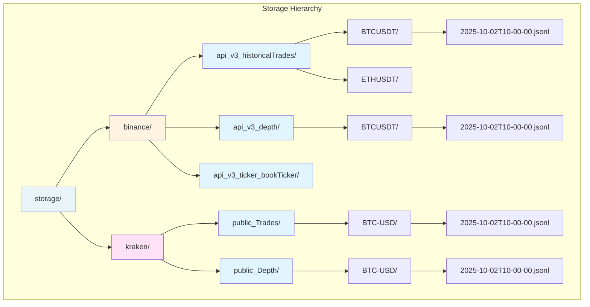
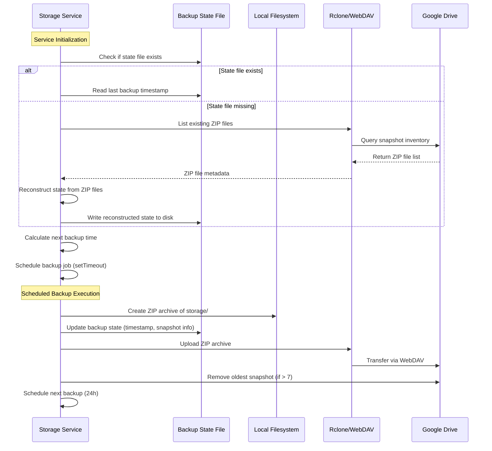
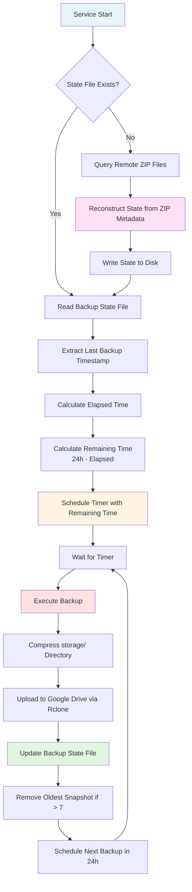
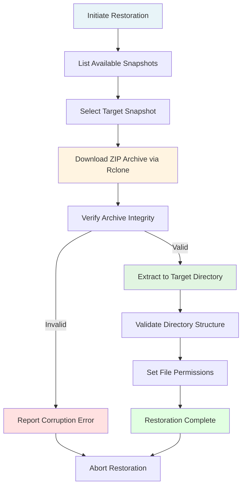

# Market Data Simulator - Persistent Storage System

## Overview

The storage subsystem addresses the requirement for offline development and deterministic testing by persisting REST API responses in a structured format that enables subsequent replay operations.

## Storage Architecture

The storage layer utilizes JSON Lines (JSONL) format, where each line represents a discrete REST API response accompanied by contextual metadata. This format offers several advantages: (1) append-only write operations, (2) human-readable content for debugging purposes, (3) efficient sequential reading for replay operations, and (4) resilience to partial file corruption.

**Figure 1:** Hierarchical organization of persistent storage by platform, full endpoint path, and symbol.

### Path Mapping Convention

REST endpoint paths are converted to filesystem-safe directory names by replacing forward slashes with underscores:

- Binance `/api/v3/historicalTrades` → `api_v3_historicalTrades/`
- Binance `/api/v3/depth` → `api_v3_depth/`
- Binance `/api/v3/ticker/bookTicker` → `api_v3_ticker_bookTicker/`
- Kraken `/public/Trades` → `public_Trades/`
- Kraken `/public/Depth` → `public_Depth/`

This convention ensures each REST endpoint has a dedicated storage location while maintaining human-readable directory names that clearly identify the data source.

## Storage Schema

Each JSONL entry conforms to a standardized schema comprising temporal metadata, endpoint identification, request parameters, and the unmodified REST API response. This schema preserves complete request-response context necessary for accurate replay operations:

- `timestamp`: Unix epoch milliseconds representing the moment of API invocation
- `endpoint`: REST endpoint path identifying the data source
- `params`: Request parameters as key-value pairs
- `response`: Unmodified REST API response payload

## Operational Benefits

The persistent storage approach yields several operational advantages:

**Deterministic Testing:** Replay of identical data sequences enables reproducible test scenarios and facilitates regression testing of data processing logic.

**Development Efficiency:** Elimination of network dependencies and API rate limit constraints accelerates development iteration cycles.

**Analytical Capabilities:** Historical data persistence supports post-hoc analysis, pattern identification, and backtesting of trading strategies.

**Cost Optimization:** Reduction in redundant API calls minimizes potential costs associated with high-frequency data retrieval.

## Backup Strategy

The storage subsystem implements a disaster recovery mechanism that archives the entire storage hierarchy to remote cloud storage, ensuring data durability and facilitating cross-environment synchronization.

### Backup Infrastructure

The backup system leverages rclone with WebDAV protocol to synchronize compressed storage archives to Google Drive. This approach combines the reliability of cloud storage with the efficiency of incremental backup strategies.

**Figure 2:** Backup lifecycle sequence from service initialization through scheduled execution and remote synchronization.

### Backup Configuration

The backup system operates according to the following parameters:

**Frequency:** A single backup operation is executed every 24 hours, balancing data freshness with resource utilization.

**Retention Policy:** Up to seven snapshot archives are maintained in remote storage, providing a rolling week of recovery points while constraining storage costs.

**Backup Scope:** The entire `storage/` directory is archived, capturing all platform-specific data hierarchies in a single compressed artifact.

### State Persistence

Backup execution state is maintained in a dedicated JSON file that records temporal metadata and snapshot inventory. This state file serves dual purposes: (1) enabling precise scheduling of subsequent backup operations, and (2) tracking the retention of remote snapshots.

The state file is deliberately excluded from backup archives to avoid circular dependencies and ensure it accurately reflects the remote storage state rather than historical snapshots. In scenarios where the state file is absent, the system reconstructs it by querying the remote storage location for existing ZIP archives and deriving temporal metadata from their filenames or metadata attributes.

### Scheduling Mechanism

Upon service initialization, the backup scheduler implements a stateful resumption strategy:

1. The system checks for the existence of the local backup state file
2. If absent, the remote storage location is queried via rclone to enumerate existing ZIP archives
3. The state file is reconstructed from the remote snapshot inventory, extracting timestamps and snapshot metadata
4. The reconstructed state is persisted to the local filesystem for subsequent operations
5. The backup state file (either existing or reconstructed) is read to determine the timestamp of the most recent successful backup
6. The elapsed time since the last backup is calculated relative to the current system time
7. The remaining interval until the next scheduled backup is computed by subtracting elapsed time from the 24-hour backup period
8. A timer is established using the remaining interval to trigger the next backup operation
9. Following each successful backup, the timer is reset to execute after a complete 24-hour period

This approach ensures backup operations maintain consistent daily intervals regardless of service restarts or state file loss, preventing both premature backup execution and extended gaps in backup coverage.

**Figure 3:** Backup scheduling state machine illustrating initialization, execution, and rescheduling logic.

### Resilience Considerations

The backup system exhibits several resilience characteristics:

**State Recovery:** Persistent backup state enables recovery from service interruptions without compromising backup schedule integrity.

**Incremental Scheduling:** The remaining-time calculation ensures backups occur at consistent intervals regardless of service uptime patterns.

**Self-Contained Archives:** Complete storage hierarchy compression enables point-in-time restoration without dependency on incremental chain integrity.

**State Reconstruction:** In the absence of local state files, the system autonomously reconstructs scheduling metadata by interrogating the remote storage layer, ensuring operational continuity even after complete local state loss or migration to new environments.

## Metrics and Observability

The storage subsystem exposes operational metrics in Prometheus format via an HTTP endpoint, enabling real-time monitoring of storage operations, backup health, and resource utilization.

### Exposed Metrics

**Operation Counters:** Total counts of write operations (`storage_write_operations_total`), read operations (`storage_read_operations_total`), successful backups (`storage_backup_operations_total`), and backup failures (`storage_backup_failures_total`). These counters include dimensional labels for platform (Binance, Kraken), endpoint path, and operation status.

**Capacity Gauges:** Instantaneous measurements including total storage consumption (`storage_size_bytes`), file count per platform (`storage_file_count`), timestamp of the most recent successful backup (`storage_backup_last_timestamp_seconds`), and total size of backup ZIP archives in remote storage (`storage_backup_size_bytes`).

**Duration Histograms:** Distribution metrics capturing write operation latency (`storage_write_duration_seconds`), backup execution time (`storage_backup_duration_seconds`), and file size distributions (`storage_file_size_bytes`). Default histogram buckets span from 1ms to 10s, enabling percentile calculations.

**System Metrics:** Optional collection of process-level metrics including CPU utilization, memory consumption, heap statistics, and event loop lag, providing holistic operational context.

## Backup Restoration

In disaster recovery scenarios or when migrating to new environments, the storage hierarchy can be reconstructed from remote backup archives through manual restoration procedures.

### Restoration Process

The restoration workflow consists of retrieving a backup snapshot from remote storage, extracting the compressed archive, and verifying the integrity of the restored filesystem hierarchy:

**Figure 4:** Restoration workflow from snapshot selection through extraction and validation.

### Manual Restoration Script

The restoration procedure is implemented as a standalone script that operates independently of the storage service. This separation ensures restoration capability even when the storage subsystem is unavailable or corrupted.

The script accepts parameters specifying the target snapshot identifier (or defaults to the most recent), the destination directory for extraction, and optional validation flags. The restoration logic performs the following operations:

1. **Snapshot Enumeration:** Query the remote storage location via rclone to retrieve the list of available backup archives, sorted by creation timestamp
2. **Archive Retrieval:** Download the selected ZIP archive from Google Drive to a temporary local location
3. **Integrity Verification:** Validate the archive checksum or test the ZIP structure to detect potential corruption during transfer
4. **Extraction:** Decompress the archive contents to the specified destination directory, preserving the original hierarchy
5. **Permission Assignment:** Set appropriate filesystem permissions on directories and files to match operational requirements
6. **Structure Validation:** Verify the presence of expected platform directories and critical subdirectories to confirm restoration success

### Restoration Scenarios

The restoration mechanism addresses several operational scenarios:

**Complete System Failure:** In the event of catastrophic storage failure, restoration from the most recent snapshot enables recovery of all accumulated market data up to the last backup cycle.

**Selective Recovery:** Individual platform directories or endpoint hierarchies can be extracted from backup archives without requiring full restoration, supporting targeted data recovery workflows.

**Environment Migration:** When provisioning new development or production environments, restoration from backup snapshots eliminates the need for extended data collection periods, enabling immediate system operability.

**Data Auditing:** Historical backup snapshots provide point-in-time views of storage state, supporting forensic analysis or data provenance investigations.

### Restoration Considerations

Several operational factors influence restoration procedures:

**Data Freshness:** Restored data reflects storage state at the time of backup execution. Market data accumulated between the last backup and the failure event is not recoverable from backup archives.

**Storage Capacity:** Restoration operations require sufficient local filesystem capacity to accommodate both the compressed archive and the extracted directory hierarchy simultaneously.

**Network Bandwidth:** Archive download duration scales with snapshot size and available network throughput to Google Drive endpoints.

**Service Downtime:** Storage services must be stopped during restoration to prevent concurrent modification of the storage hierarchy, requiring coordination of dependent systems.

