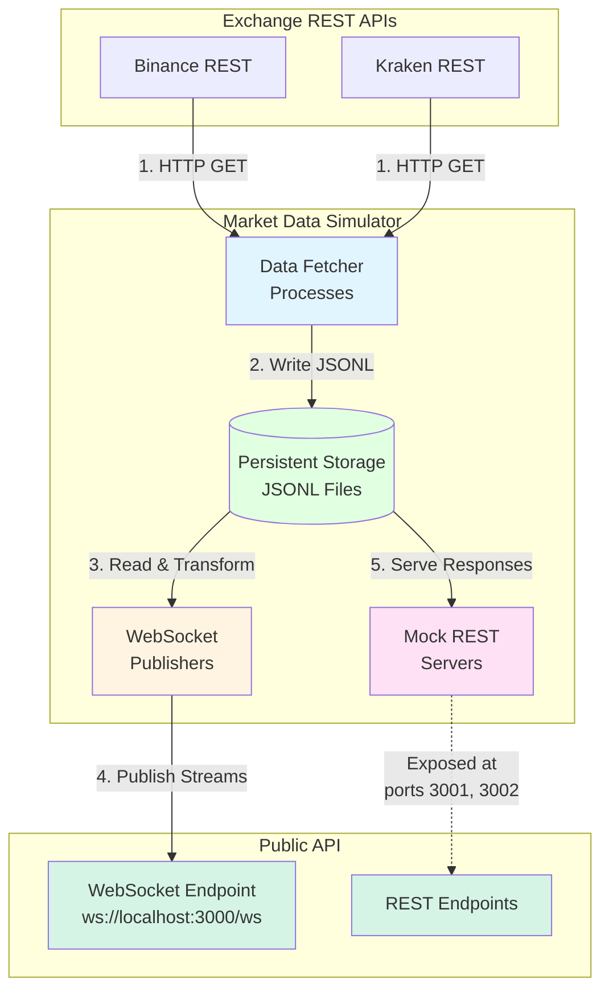

# Market Data Simulator

## Introduction

The market data simulator represents a critical component in the development infrastructure, designed to address the challenge of testing real-time market data processing systems without continuous dependency on live exchange connections. This component transforms historical REST API responses from cryptocurrency exchanges into simulated real-time WebSocket streams, thereby enabling deterministic testing and development workflows. Additionally, the simulator provides mock REST API endpoints that replicate exchange interfaces, offering a comprehensive development environment that mirrors production exchange behavior.

## System Architecture

The simulator architecture integrates multiple subsystems to provide comprehensive market data simulation capabilities. Figure 1 illustrates the high-level data flow between system components.

**Figure 1:** Comprehensive data flow architecture showing the integration of REST data collection, persistent storage, WebSocket stream generation, mock REST API services, and public-api endpoints.

## System Components

The simulator comprises four primary subsystems that work in concert to provide comprehensive market data simulation:

### Data Fetcher

The data fetcher subsystem retrieves market data from cryptocurrency exchange REST API endpoints and persists responses to structured storage. Operating as platform-specific processes, fetchers execute scheduled HTTP requests to collect historical datasets that serve as the foundation for all simulator operations.

For detailed documentation of the fetcher process architecture, data retrieval operations, rate limiting strategies, and storage integration, refer to [002_market_data_simulator_fetcher](./002_market_data_simulator_fetcher.md).

### Persistent Storage System

The simulator incorporates a persistent storage subsystem that enables offline development and deterministic testing capabilities. REST API responses are persisted in structured format to support replay operations without live exchange dependencies.

For comprehensive documentation of the storage architecture, schema design, operational modes, and data management strategies, refer to [002_market_data_simulator_storage](./002_market_data_simulator_storage.md).

### WebSocket Stream Generation

The WebSocket subsystem transforms stored REST API responses into platform-specific WebSocket messages and publishes them to the public-api endpoint. This enables simulation of real-time market data streams without maintaining live exchange connections.

For detailed documentation of data transformation operations, stream publishing architecture, connection management, and timing simulation, refer to [002_market_data_simulator_websockets](./002_market_data_simulator_websockets.md).

### Mock REST API

The simulator exposes mock REST API endpoints that replicate the interface specifications of cryptocurrency exchanges. Each platform operates as an independent Node.js process bound to a dedicated network port, enabling comprehensive testing of systems that interact with both REST and WebSocket APIs.

For detailed documentation of the mock REST API architecture, endpoint replication, process management, and error simulation capabilities, refer to [002_market_data_simulator_mock_rest_api](./002_market_data_simulator_mock_rest_api.md).

## Design Principles

### Platform Extensibility

The system architecture employs interface-based abstraction to facilitate the integration of additional cryptocurrency exchanges. This design pattern decouples platform-specific implementation details from core business logic, enabling consistent integration patterns while preserving exchange-specific message formats.

Key abstraction interfaces include:
- **PlatformDataFetcher:** REST API data retrieval operations
- **PlatformTransformer:** REST-to-WebSocket format transformation
- **PlatformPublisher:** Stream publishing and connection management

### Configuration Management

The simulator utilizes declarative configuration to specify operational parameters including platform selection, symbol lists, fetch intervals, storage settings, and connection endpoints. This approach enables environment-specific customization without code modifications.

### Resilience and Error Handling

Comprehensive error handling mechanisms address various failure scenarios including rate limit violations, network failures, malformed responses, WebSocket disconnections, and storage errors. Recovery strategies include exponential backoff, automatic reconnection, message buffering, and graceful degradation.

