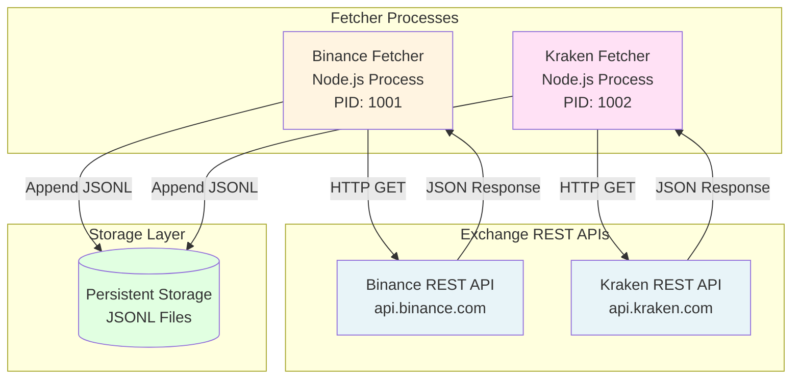
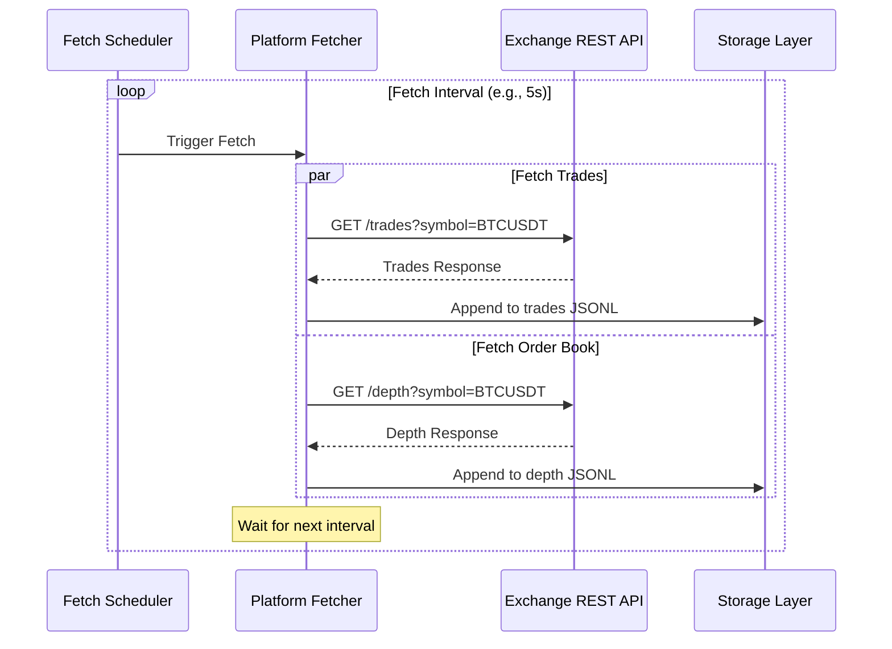
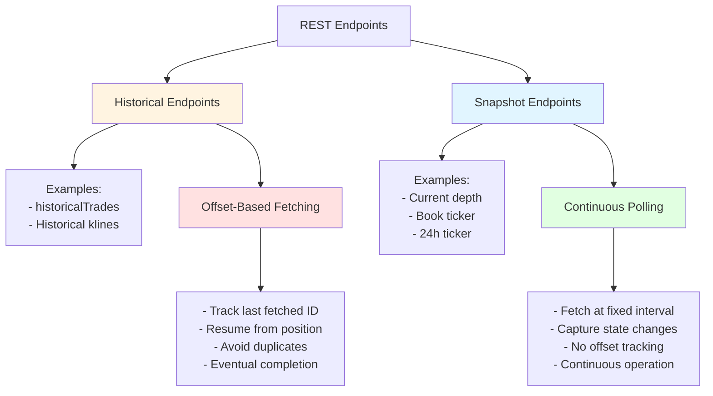
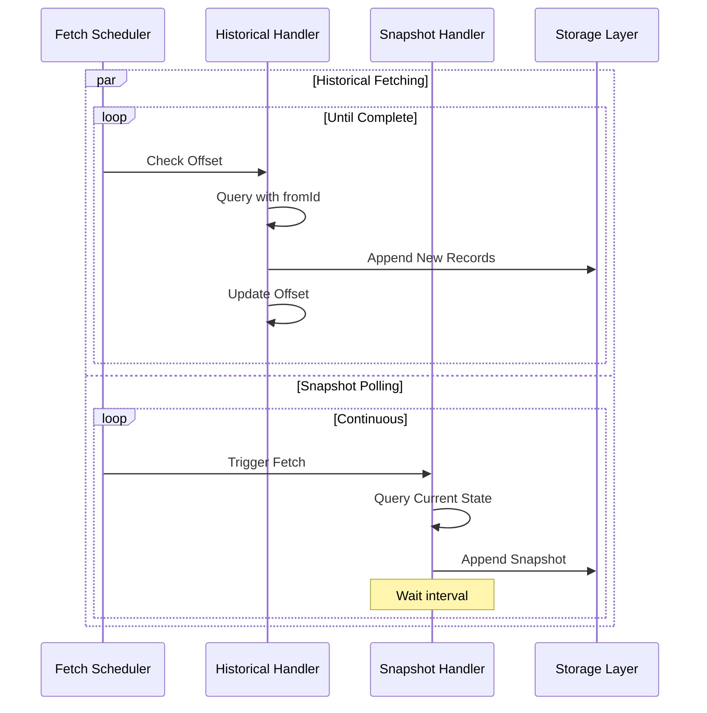
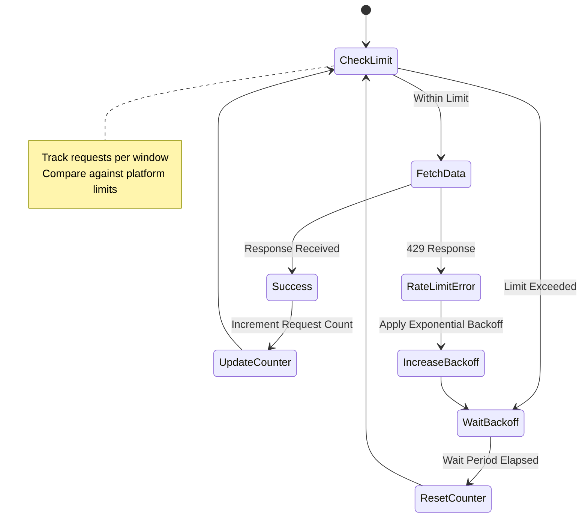

# Market Data Simulator - Data Fetcher

## Overview

The data fetcher subsystem retrieves market data from cryptocurrency exchange REST API endpoints and persists responses to structured storage. This component operates as the primary data collection mechanism, enabling the simulator to maintain historical datasets for subsequent replay through WebSocket streams and mock REST endpoints.

## Process Architecture

The fetcher operates as a collection of platform-specific processes, each responsible for retrieving data from a designated exchange platform. This architectural approach provides process-level isolation and independent failure recovery.



**Figure 1:** Fetcher process architecture showing platform-specific processes retrieving data from exchange APIs and writing to persistent storage.

### Process Isolation

Each exchange platform maintains a dedicated fetcher process:

- **Independent Operation:** Platform-specific rate limits and API characteristics isolated to individual processes
- **Failure Containment:** API failures or rate limit violations affect only the specific platform
- **Resource Allocation:** Per-process memory and connection pool management
- **Lifecycle Management:** Processes can be started, stopped, and restarted independently

## Data Retrieval Operations

Fetcher processes execute periodic HTTP requests to exchange REST endpoints, retrieving market data snapshots.



**Figure 2:** Sequence diagram illustrating periodic data fetching with parallel endpoint requests (applies to snapshot endpoints).

### Fetch Scheduling

Each fetcher implements configurable scheduling strategies:

**Fixed Interval:** Executes requests at regular time intervals (e.g., every 5 seconds). Provides predictable request patterns suitable for stable market conditions.

**Adaptive Interval:** Adjusts fetch frequency based on market activity indicators or rate limit proximity. Increases frequency during high-volatility periods while respecting API constraints.

**Event-Driven:** Responds to external triggers or market events. Less common for historical data collection but useful for specific testing scenarios.

### Endpoint Coverage

Fetchers retrieve data from multiple endpoint types per platform:

**Table 1:** Fetched Endpoints by Platform

| Platform | Endpoint Type | API Path | Fetch Frequency | Purpose |
|----------|--------------|----------|-----------------|---------|
| Binance | Trades | `/api/v3/historicalTrades` | 5-10s | Historical trade executions |
| Binance | Order Book | `/api/v3/depth` | 1-5s | Market depth snapshots |
| Binance | Book Ticker | `/api/v3/ticker/bookTicker` | 1-5s | Best bid/ask quotes |
| Kraken | Trades | `/public/Trades` | 5-10s | Recent trade history |
| Kraken | Order Book | `/public/Depth` | 1-5s | L2 order book data |

### Symbol Management

Fetchers process configured trading pairs with independent scheduling:

- **Multi-Symbol Support:** Single fetcher process handles multiple trading pairs
- **Symbol-Specific Intervals:** Different fetch frequencies per symbol based on trading volume
- **Dynamic Symbol Lists:** Configuration updates enable adding or removing symbols without process restart

## Endpoint Type Strategies

The fetcher employs distinct strategies for different endpoint categories based on their data characteristics.

### Historical vs Snapshot Endpoints

Exchange REST endpoints fall into two primary categories requiring different fetching approaches:



**Figure 2.5:** Endpoint categorization and corresponding fetch strategies.

### Historical Endpoint Strategy

Historical endpoints provide access to past data records that do not change once created. These endpoints require offset-based fetching with position tracking.

**Characteristics:**
- Data records have unique identifiers (trade IDs, timestamps)
- Responses support pagination parameters (`fromId`, `since`, `offset`)
- Historical data remains immutable after creation
- Fetching can eventually reach the "present" and complete

**Fetch Implementation:**

**Offset Discovery:** Fetcher determines the starting position by reading the last entries from existing JSONL files, eliminating the need for separate offset state files.

**Startup Sequence:**
1. List JSONL files in storage directory for symbol/endpoint: `storage/<platform>/<endpoint>/<symbol>/`
2. Identify the most recent file by timestamp in filename
3. Read the last line(s) from the file
4. Parse the last entry to extract highest trade ID or timestamp
5. Resume fetching from that position + 1

**Example - Binance Historical Trades:**
```
Storage directory: storage/binance/api_v3_historicalTrades/BTCUSDT/
Latest file: 2025-10-02T10-00-00.jsonl

Read last line:
{
  "timestamp": 1696248123000,
  "endpoint": "/api/v3/historicalTrades",
  "params": {"symbol": "BTCUSDT", "limit": 1000, "fromId": 1523456789},
  "response": [
    {..., "id": 1523457788, ...},  // Last trade in response
  ]
}

Determine offset: lastTradeId = 1523457788
Next request: GET /api/v3/historicalTrades?symbol=BTCUSDT&fromId=1523457789&limit=1000
```

**Fetch Loop:**
1. Determine current offset from storage files
2. Query API with `fromId` or `since` parameter using last known position
3. Process response and extract new records
4. Write records to storage (append to JSONL)
5. If response empty or below threshold, mark fetching as complete (via in-memory state or config flag)
6. Sleep briefly before next iteration

**Empty Directory Handling:** If no JSONL files exist for a symbol, fetcher starts from beginning (no `fromId` parameter) or from configured starting timestamp.

**Completion Detection:** When API returns fewer records than requested or returns empty array, fetcher can:
- Store completion flag in memory for current session
- Use configuration file to mark symbol as completed
- Simply stop fetching and exit (manual restart needed to resume)

**Benefits of Offset Discovery:**
- Single source of truth: storage files contain all necessary information
- No separate offset state files to maintain and synchronize
- Automatic recovery from any point where data exists
- Simpler architecture with fewer moving parts
- Easier debugging: just inspect the storage files themselves

### Snapshot Endpoint Strategy

Snapshot endpoints provide current market state that changes continuously. These endpoints require periodic polling without offset tracking.

**Characteristics:**
- Represent current state at query time
- No unique identifiers or pagination support
- State changes continuously with market activity
- No concept of "completion" - always fetching current state

**Fetch Implementation:**

**Fixed Interval Polling:**
1. Execute HTTP request at configured interval (e.g., 1 second)
2. Retrieve current state snapshot
3. Append to storage with current timestamp
4. Sleep until next interval
5. Repeat indefinitely

**Example - Order Book Depth:**
```
T=0s:  GET /api/v3/depth?symbol=BTCUSDT&limit=100
       Store snapshot with timestamp 1696248000000

T=1s:  GET /api/v3/depth?symbol=BTCUSDT&limit=100
       Store snapshot with timestamp 1696248001000

T=2s:  GET /api/v3/depth?symbol=BTCUSDT&limit=100
       Store snapshot with timestamp 1696248002000
```

Each fetch captures the current market state at that moment. Historical snapshots remain in storage, enabling replay of market state evolution over time.

**No Offset Tracking:** Snapshot endpoints do not maintain offset state. Process restart simply resumes periodic polling from current time.

### Mixed Strategy Coordination

Fetcher processes coordinate multiple endpoint strategies simultaneously:



**Figure 2.6:** Parallel operation of historical and snapshot fetch strategies.

### Restart and Recovery

Fetcher recovery is automatic through storage file inspection, eliminating the need for separate offset state management.

**Startup Process:**
1. Scan storage directories for existing JSONL files
2. For each configured symbol/endpoint, check if data exists
3. If data exists, read last entry to determine offset
4. If no data exists, start from beginning or configured starting point
5. Begin fetching from determined position

**Manual Control:**

```bash
# Delete storage to restart from beginning
rm -r storage/binance/api_v3_historicalTrades/BTCUSDT/

# Delete specific file to restart from earlier point
rm storage/binance/api_v3_historicalTrades/BTCUSDT/2025-10-02T11-00-00.jsonl

# Start from specific timestamp (via config file)
{
  "startTimestamps": {
    "binance": {
      "BTCUSDT": 1696248000000
    }
  }
}

# Start from specific ID (via config file)
{
  "startIds": {
    "binance": {
      "BTCUSDT": 1523456789
    }
  }
}
```

**Completion Tracking:**

For tracking completion status without separate offset files, fetcher can use:

1. **In-Memory State:** Track completed symbols in process memory (lost on restart)
2. **Config File Flags:** Update configuration file with completion markers
3. **Marker Files:** Create empty `.completed` marker files in storage directories
4. **Log-Based:** Log completion events and check logs on restart

**Example Marker File Approach:**
```
storage/binance/api_v3_historicalTrades/BTCUSDT/.completed
```

When marker file exists, fetcher skips that symbol unless explicitly reset by removing the marker.

## Storage Integration

Fetchers write retrieved data to persistent storage using the JSONL format specified in the storage subsystem documentation.

### Write Operations

Each API response generates a storage entry:

```
{
  "timestamp": 1696248000000,
  "endpoint": "/api/v3/depth",
  "params": {"symbol": "BTCUSDT", "limit": 100},
  "response": { /* complete API response */ }
}
```

**Write Strategy:**
1. Retrieve response from exchange API
2. Wrap response with metadata (timestamp, endpoint, parameters)
3. Serialize to JSON line
4. Append to appropriate JSONL file
5. Optionally flush to disk for durability

### File Organization

Storage files organized by platform, full endpoint path, and symbol:

```
storage/
  binance/
    api_v3_historicalTrades/
      BTCUSDT/
        2025-10-02T10-00-00.jsonl
        2025-10-02T11-00-00.jsonl
      ETHUSDT/
        2025-10-02T10-00-00.jsonl
    api_v3_depth/
      BTCUSDT/
        2025-10-02T10-00-00.jsonl
      ETHUSDT/
        2025-10-02T10-00-00.jsonl
    api_v3_ticker_bookTicker/
      BTCUSDT/
        2025-10-02T10-00-00.jsonl
  kraken/
    public_Trades/
      BTC-USD/
        2025-10-02T10-00-00.jsonl
    public_Depth/
      BTC-USD/
        2025-10-02T10-00-00.jsonl
```

**Path Mapping:** Endpoint paths are converted to directory names by replacing slashes with underscores (e.g., `/api/v3/historicalTrades` → `api_v3_historicalTrades/`).

### File Rotation

Fetchers implement time-based file rotation to manage storage growth:

- **Hourly Rotation:** New file created each hour for high-frequency data
- **Daily Rotation:** New file created daily for lower-frequency data
- **Size-Based Rotation:** Alternative strategy based on file size thresholds

## Rate Limiting

Exchange APIs impose rate limits that fetchers must respect to maintain access.



**Figure 3:** State diagram showing rate limit management with exponential backoff for limit violations.

### Rate Limit Strategies

**Request Counting:** Track requests per time window, comparing against platform-specific limits.

**Token Bucket:** Implement token bucket algorithm for burst allowance while maintaining average rate compliance.

**Adaptive Throttling:** Dynamically adjust fetch intervals based on observed rate limit proximity and 429 responses.

### Platform-Specific Limits

Different exchanges impose varying rate constraints:

**Binance:** Weight-based system where different endpoints consume different weight amounts. Limits typically 1200 weight per minute.

**Kraken:** Request count limits with tier-based variations. Public endpoints generally allow 1 request per second with burst capacity.

## Error Handling

Fetchers implement comprehensive error handling for various failure scenarios:

### Network Errors

**Connection Failures:** Retry with exponential backoff, logging failures for monitoring.

**Timeout Handling:** Configurable request timeouts with retry logic for slow responses.

**DNS Resolution:** Handle DNS failures gracefully with fallback retry mechanisms.

### API Errors

**Rate Limit (429):** Exponential backoff with respect to `Retry-After` headers when provided.

**Invalid Requests (400):** Log configuration errors, skip invalid symbols or parameters.

**Server Errors (500):** Retry with backoff, escalate to alerting if persistent.

**Authentication Errors (401):** Log and halt fetching, require configuration correction.

### Storage Errors

**Disk Full:** Log critical error, attempt to clean old files if rotation policy allows.

**Permission Denied:** Log error and halt, require administrative intervention.

**Corruption Detection:** Validate write operations, log errors for monitoring.

## Configuration

Fetcher processes utilize declarative configuration specifying operational parameters:

**Platform Configuration:**
```
{
  "platform": "binance",
  "enabled": true,
  "apiBaseUrl": "https://api.binance.com",
  "symbols": ["BTCUSDT", "ETHUSDT"],
  "endpoints": {
    "trades": {
      "path": "/api/v3/historicalTrades",
      "interval": 10000,
      "params": {"limit": 1000}
    },
    "depth": {
      "path": "/api/v3/depth",
      "interval": 5000,
      "params": {"limit": 100}
    }
  },
  "rateLimits": {
    "requestsPerMinute": 1200,
    "requestsPerSecond": 20
  }
}
```

**Storage Configuration:**
```
{
  "baseDir": "./storage",
  "rotationInterval": "1h",
  "compression": false,
  "flushInterval": 10000
}
```

## Operational Modes

### Recording Mode

Continuous operation fetching data at configured intervals. Primary mode for building historical datasets.

**Characteristics:**
- Runs indefinitely until manually stopped
- Respects rate limits and fetch intervals
- Writes all responses to storage
- Monitors and logs operational metrics

### Backfill Mode

Historical data retrieval for specific time ranges. Useful for filling gaps in historical datasets.

**Characteristics:**
- Time-bounded operation (start timestamp to end timestamp)
- May use pagination or `since` parameters for historical queries
- Higher fetch frequency when rate limits allow
- Terminates upon reaching end timestamp

### Snapshot Mode

Single-shot data collection without continuous operation. Useful for testing or ad-hoc data collection.

**Characteristics:**
- Executes single fetch cycle across configured endpoints
- Writes responses and terminates
- No interval scheduling or continuous operation
- Useful for configuration testing and validation

## Monitoring and Metrics

Fetcher processes expose operational metrics for monitoring:

**Fetch Metrics:**
- Requests per second by endpoint type
- Success/failure ratios
- Response time distributions
- Rate limit utilization percentage

**Storage Metrics:**
- Bytes written per interval
- JSONL file counts and sizes
- Write operation latencies
- Disk space utilization

**Error Metrics:**
- Error counts by category (network, API, storage)
- Rate limit violations
- Retry attempt distributions
- Backoff duration statistics

## Integration with Simulator Components

Fetcher processes operate as the data source for other simulator components:

**WebSocket Publishers:** Read fetcher-generated JSONL files for transformation and streaming.

**Mock REST Servers:** Serve responses from fetcher-generated storage files.

**Storage System:** Shared storage layer accessed by all simulator components.

The fetcher's output format compatibility ensures seamless integration across the simulator architecture.

