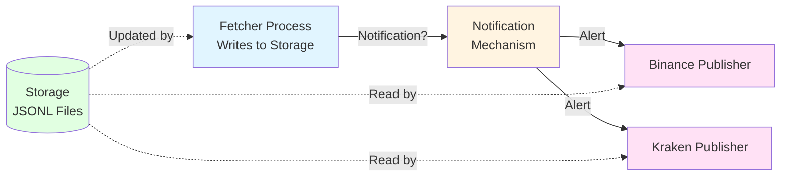
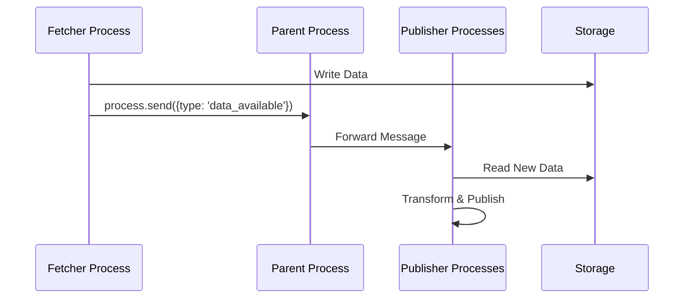
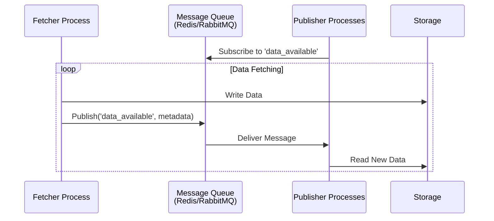
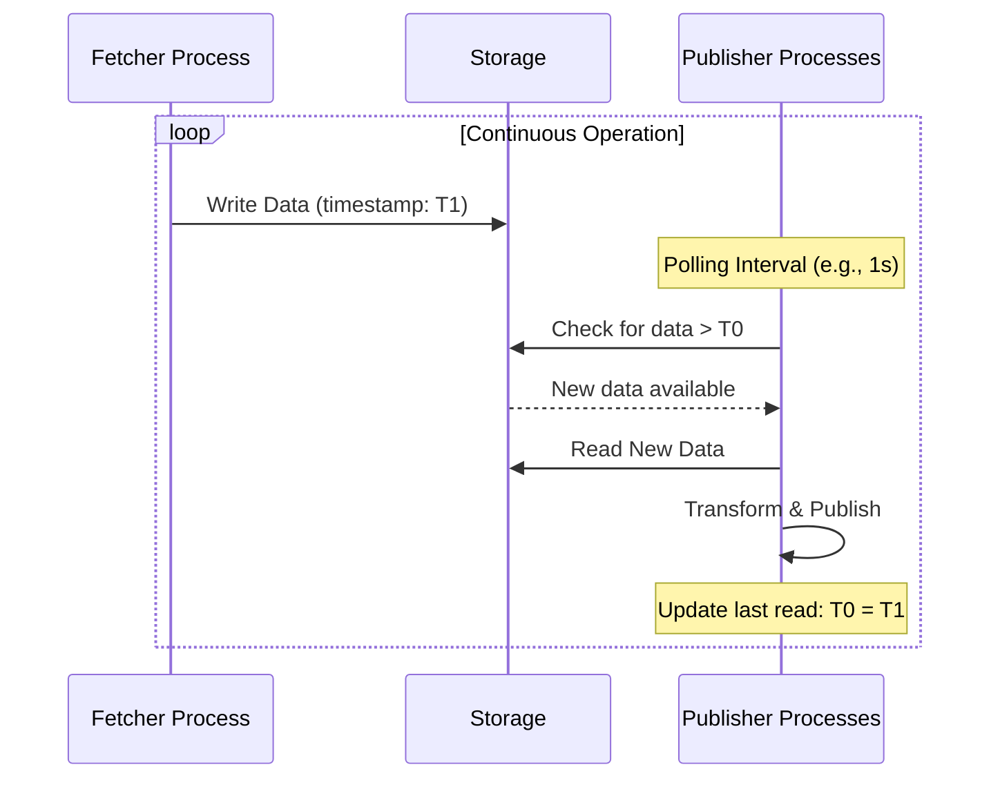
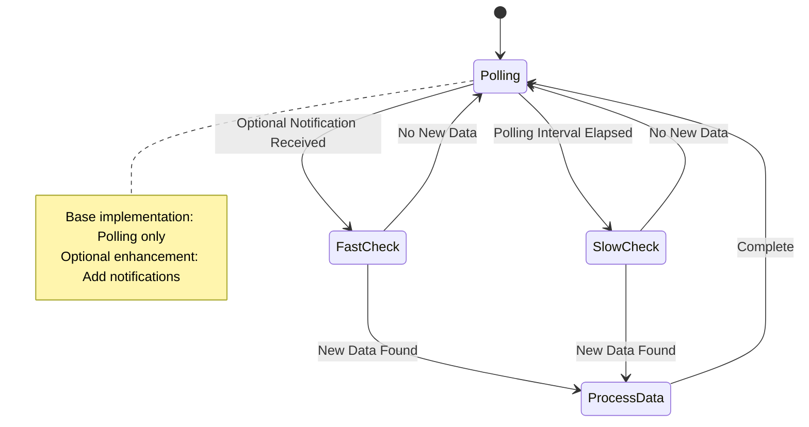

# Market Data Simulator - Inter-Process Notification

## Overview

The market data simulator architecture comprises independent processes for data fetching, storage management, and WebSocket stream publishing. Coordination between these processes requires a notification mechanism to signal when new data becomes available in persistent storage. This document examines alternative approaches to inter-process notification, evaluating their suitability for the simulator's operational requirements.

## Architectural Context

The notification subsystem addresses the coordination challenge between distinct process types:



**Figure 1:** Inter-process notification architecture showing the coordination challenge between fetcher and publisher processes.

## Notification Approaches

Three primary approaches exist for coordinating data availability between processes: Node.js native IPC, message queue systems, and storage polling. Each approach presents distinct trade-offs regarding complexity, latency, and operational characteristics.

### Approach 1: Node.js Native IPC

Node.js provides built-in inter-process communication capabilities through the `child_process` module and process messaging APIs.



**Figure 2:** Sequence diagram showing Node.js IPC-based notification flow through parent process coordination.

#### Characteristics

**Advantages:**
- Native Node.js functionality requires no external dependencies
- Low latency message delivery within process tree
- Simple API using `process.send()` and `process.on('message')`
- Automatic message serialization for JavaScript objects

**Disadvantages:**
- Requires parent-child process relationship or shared parent process
- No built-in message persistence or delivery guarantees
- Limited to processes running on the same host
- Parent process becomes single point of failure for coordination

**Operational Considerations:**
- Process tree architecture requires careful lifecycle management
- Parent process must maintain references to all child processes
- Message buffering logic needed during process restart scenarios
- No automatic retry mechanism for failed deliveries

### Approach 2: Message Queue Systems

Message queue systems provide robust inter-process communication through dedicated message broker infrastructure. Common options include Redis Pub/Sub, RabbitMQ, and ZeroMQ.



**Figure 3:** Sequence diagram illustrating message queue-based notification with pub-sub pattern.

#### Redis Pub/Sub

**Advantages:**
- Lightweight pub-sub mechanism with minimal overhead
- Simple API and wide library support
- Can leverage existing Redis infrastructure if present
- Support for channel patterns and wildcards

**Disadvantages:**
- Messages not persisted; subscribers miss messages during downtime
- No delivery acknowledgment or guarantee mechanisms
- Additional infrastructure dependency
- Network latency for inter-process communication

#### RabbitMQ/AMQP

**Advantages:**
- Message persistence and delivery guarantees
- Sophisticated routing and exchange patterns
- Acknowledgment mechanisms ensure message processing
- Dead letter queues for failed delivery handling

**Disadvantages:**
- Heavier infrastructure footprint
- Additional operational complexity
- Higher latency compared to direct IPC
- Requires message broker maintenance

#### ZeroMQ

**Advantages:**
- Library-based approach without separate broker process
- Multiple messaging patterns (pub-sub, push-pull, request-reply)
- High performance with minimal latency
- Cross-language compatibility

**Disadvantages:**
- Additional native dependency
- No built-in message persistence
- Manual connection management required
- Less common in Node.js ecosystem

### Approach 3: Storage Polling

Storage polling eliminates active notification by having publisher processes periodically check for new data availability.



**Figure 4:** Sequence diagram showing polling-based approach with periodic storage checks.

#### Implementation Strategies

**Timestamp-Based Polling:**
- Publishers track last processed timestamp
- Periodic queries check for newer data
- Simple implementation using file modification times or metadata files

**File Watching:**
- Operating system file watch APIs (fs.watch, chokidar)
- Event-driven notifications for file changes
- Lower latency than fixed-interval polling

#### Characteristics

**Advantages:**
- No inter-process communication complexity
- Process independence; no shared infrastructure required
- Resilient to process failures; natural recovery on restart
- Simple implementation and debugging

**Disadvantages:**
- Polling interval introduces latency (trade-off with system load)
- Repeated storage system queries increase I/O operations
- Potential race conditions during concurrent file operations
- Less efficient for high-frequency data updates

## Comparative Analysis

Table 1 summarizes the key characteristics of each notification approach across multiple evaluation dimensions.

**Table 1:** Comparative Analysis of Notification Approaches

| Dimension | Node.js IPC | Message Queue | Storage Polling |
|-----------|-------------|---------------|-----------------|
| Latency | Very Low (<1ms) | Low-Medium (5-50ms) | Medium-High (100ms-5s) |
| Complexity | Low-Medium | Medium-High | Very Low |
| Dependencies | None | External Broker | None |
| Delivery Guarantee | No | Yes (AMQP) / No (Pub/Sub) | Eventual |
| Process Independence | Low | High | Very High |
| Failure Recovery | Manual | Automatic (AMQP) | Implicit |
| Scalability | Limited | High | Medium |
| Operational Overhead | Low | Medium-High | Low |

## Recommendation Analysis

### Development Phase Considerations

For initial development and testing scenarios, **storage polling** presents the most pragmatic approach:

**Simplicity:** No inter-process coordination infrastructure reduces implementation complexity and debugging difficulty.

**Resilience:** Process independence enables independent development, testing, and restart without coordination concerns.

**Sufficient Performance:** For development workloads, polling intervals of 1-2 seconds provide acceptable latency while minimizing system overhead.

**Implementation Example:**
```
Publisher Process Polling Loop:
  1. Check last processed timestamp
  2. Query storage for new data (modification time > last timestamp)
  3. If new data exists:
     - Read and transform data
     - Publish to WebSocket
     - Update last processed timestamp
  4. Sleep for polling interval (configurable: 1-5 seconds)
  5. Repeat
```

### Production Considerations

Production deployments may warrant evaluation of more sophisticated approaches based on operational requirements:

**High-Frequency Trading Scenarios:** Sub-second latency requirements favor Node.js IPC or message queue systems with optimized configurations.

**Distributed Deployments:** If processes span multiple hosts, message queue systems become necessary for cross-network coordination.

**Existing Infrastructure:** Organizations with existing Redis or RabbitMQ infrastructure may prefer leveraging message queue approaches for consistency.

## Hybrid Approach

A hybrid strategy combines polling simplicity with optional notification optimization:



**Figure 5:** State diagram showing hybrid approach with polling baseline and optional notification acceleration.

### Implementation Strategy

**Baseline Implementation:** Polling-based approach provides functional system without notification dependencies.

**Optional Enhancement:** Message queue or IPC notifications reduce polling frequency and improve latency when performance requirements justify additional complexity.

**Graceful Degradation:** Publishers continue polling if notification system becomes unavailable, ensuring continued operation.

## Recommendation

For the market data simulator implementation, **storage polling** is recommended as the initial approach:

1. **Alignment with Development Goals:** Simplicity and maintainability support rapid development iteration
2. **Adequate Performance:** Development and testing workloads tolerate multi-second latency
3. **Process Independence:** Enables independent process lifecycle management and debugging
4. **Future Flexibility:** Can enhance with notifications if production requirements demand lower latency

The polling approach can be configured with adjustable intervals, allowing performance tuning based on observed workload characteristics. If production deployment reveals inadequate performance, migration to message queue-based notification remains feasible without fundamental architectural changes.

