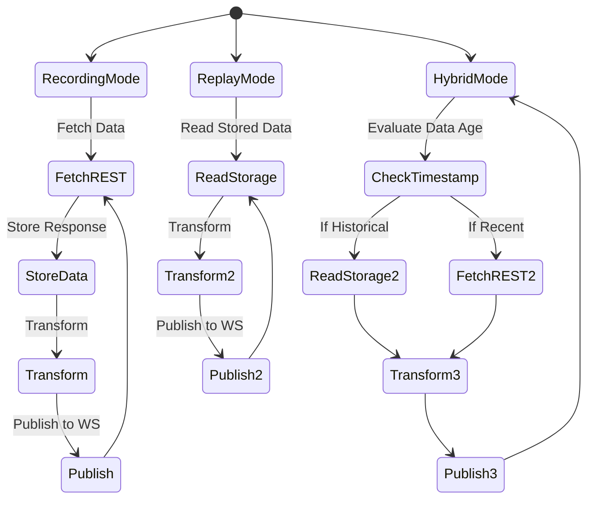

# Market Data Simulator - Persistent Storage System

## Overview

The storage subsystem addresses the requirement for offline development and deterministic testing by persisting REST API responses in a structured format that enables subsequent replay operations.

## Storage Architecture

The storage layer utilizes JSON Lines (JSONL) format, where each line represents a discrete REST API response accompanied by contextual metadata. This format offers several advantages: (1) append-only write operations, (2) human-readable content for debugging purposes, (3) efficient sequential reading for replay operations, and (4) resilience to partial file corruption.

**Figure 1:** Hierarchical organization of persistent storage by platform, full endpoint path, and symbol.

### Path Mapping Convention

REST endpoint paths are converted to filesystem-safe directory names by replacing forward slashes with underscores:

- Binance `/api/v3/historicalTrades` → `api_v3_historicalTrades/`
- Binance `/api/v3/depth` → `api_v3_depth/`
- Binance `/api/v3/ticker/bookTicker` → `api_v3_ticker_bookTicker/`
- Kraken `/public/Trades` → `public_Trades/`
- Kraken `/public/Depth` → `public_Depth/`

This convention ensures each REST endpoint has a dedicated storage location while maintaining human-readable directory names that clearly identify the data source.

## Storage Schema

Each JSONL entry conforms to a standardized schema comprising temporal metadata, endpoint identification, request parameters, and the unmodified REST API response. This schema preserves complete request-response context necessary for accurate replay operations:

- `timestamp`: Unix epoch milliseconds representing the moment of API invocation
- `endpoint`: REST endpoint path identifying the data source
- `params`: Request parameters as key-value pairs
- `response`: Unmodified REST API response payload

## Operational Benefits

The persistent storage approach yields several operational advantages:

**Deterministic Testing:** Replay of identical data sequences enables reproducible test scenarios and facilitates regression testing of data processing logic.

**Development Efficiency:** Elimination of network dependencies and API rate limit constraints accelerates development iteration cycles.

**Analytical Capabilities:** Historical data persistence supports post-hoc analysis, pattern identification, and backtesting of trading strategies.

**Cost Optimization:** Reduction in redundant API calls minimizes potential costs associated with high-frequency data retrieval.

## Operational Modes

The simulator supports multiple operational modes, illustrated in Figure 2.

**Figure 2:** State diagram depicting the three operational modes and their respective data flow patterns.

**Recording Mode:** Executes continuous REST API polling, persists responses with temporal metadata, and performs real-time transformation and publishing operations.

**Replay Mode:** Reads stored responses sequentially from persistent storage, applies original temporal intervals to simulate realistic timing characteristics, and publishes transformed messages without external API dependencies.

**Hybrid Mode:** Dynamically selects data sources based on temporal proximity, utilizing stored historical data while supplementing with live REST API calls for recent market activity, thereby enabling seamless transition between historical and real-time data streams.

