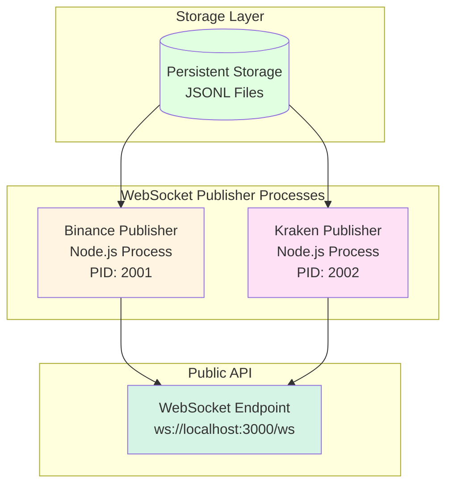
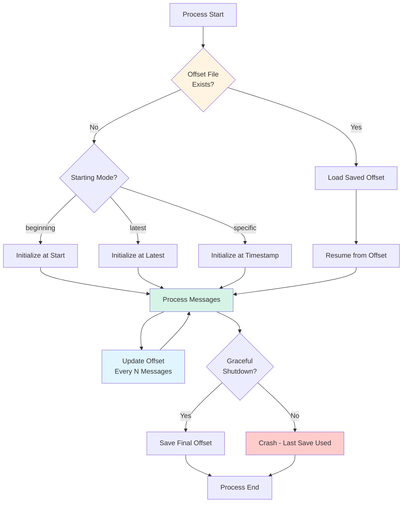
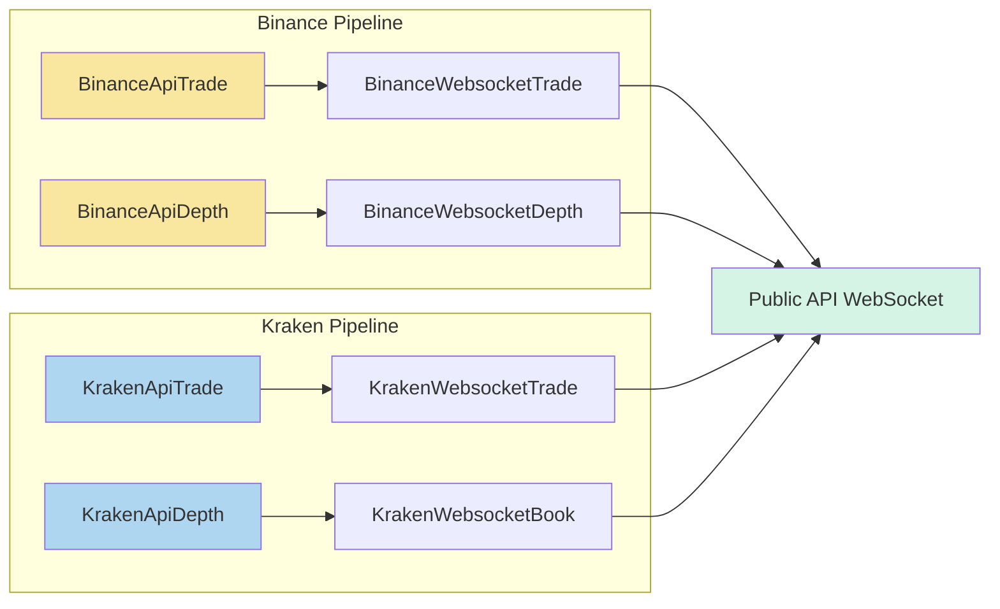
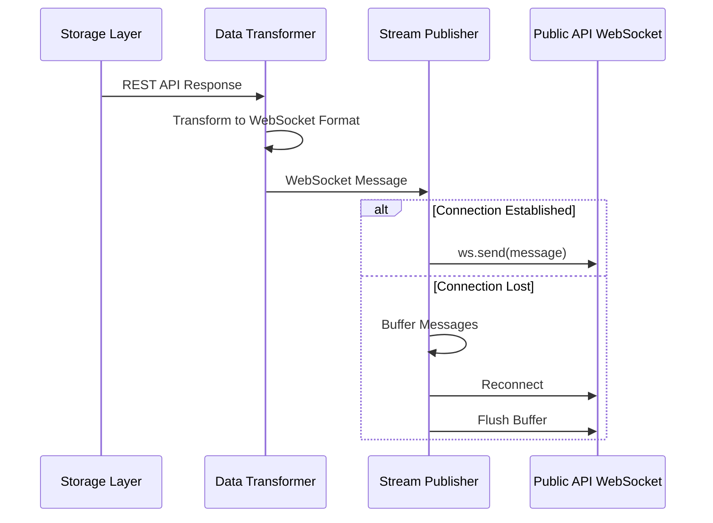
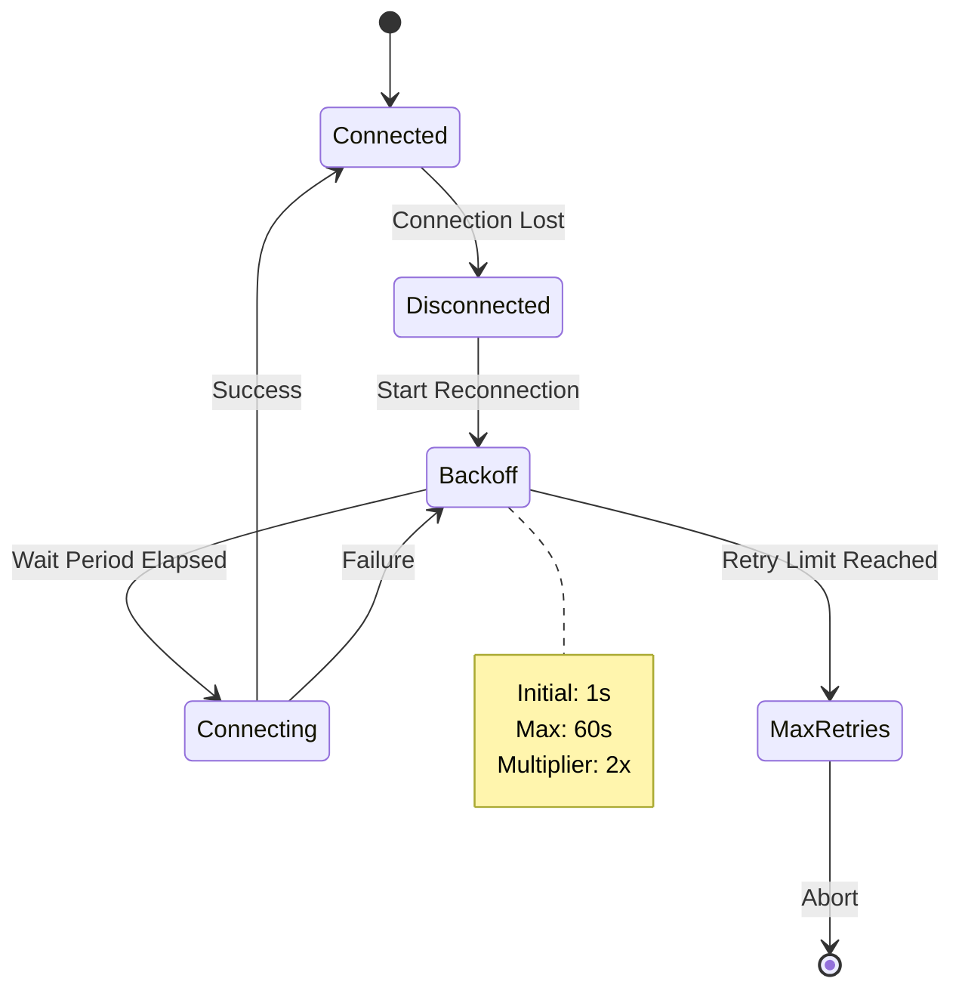
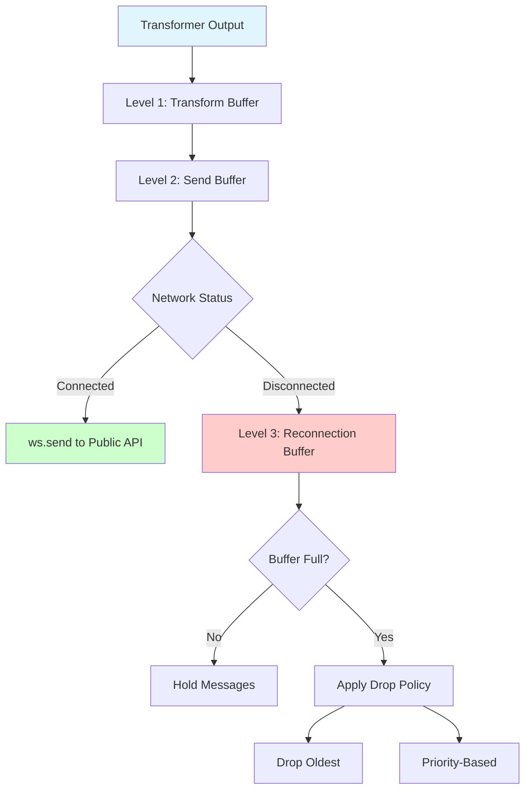

# Market Data Simulator - WebSocket Stream Generation

## Overview

The WebSocket stream generation subsystem transforms REST API responses into platform-specific WebSocket messages that replicate the structure and behavior of native exchange WebSocket streams. This component enables development and testing of real-time market data processing systems without maintaining persistent connections to live exchanges.

## Process Architecture

The WebSocket stream generation operates as a collection of platform-specific publishing processes, each running in isolated Node.js processes. This architectural approach provides several advantages: (1) process-level isolation prevents cross-contamination between platform implementations, (2) independent process management enables per-platform monitoring and lifecycle control, and (3) separate processes facilitate independent restart and failure recovery without affecting other platforms.



**Figure 1:** WebSocket publisher process architecture showing platform-specific processes publishing to the public-api endpoint.

### Process Management

Each platform-specific publisher process operates independently:

- **Process Isolation:** Each exchange platform runs in its own Node.js process with dedicated resources
- **Independent Lifecycle:** Processes can be started, stopped, and restarted independently without affecting other platforms
- **Resource Monitoring:** Per-process memory, CPU, and network metrics enable granular performance tracking
- **Failure Recovery:** Process crashes are isolated to single platforms, allowing automatic restart without system-wide disruption

### Offset Management

Publisher processes maintain persistent state tracking to enable recovery from interruptions and configurable replay positions. Each publisher maintains an offset state file recording its publication progress through the stored data.



**Figure 1.5:** State management flow showing offset initialization, periodic updates, and recovery scenarios.

#### Offset Storage Format

Each publisher maintains a JSON-based offset file tracking its progress through stored data:

**File Location Pattern:** `offset_state/<platform>/<endpoint>/<symbol>_publisher.json`

**Schema Structure:**
- **Platform Identifier:** Exchange platform name
- **Symbol-Specific Tracking:** Separate offsets per trading pair
- **Endpoint Separation:** Independent tracking per REST endpoint path (e.g., `api_v3_historicalTrades`, `api_v3_depth`)
- **File Position:** Current JSONL file and line number
- **Temporal Marker:** Last processed timestamp for temporal ordering

**Example Offset State:**

File: `offset_state/binance/api_v3_historicalTrades/BTCUSDT_publisher.json`
```json
{
  "platform": "binance",
  "endpoint": "api_v3_historicalTrades",
  "symbol": "BTCUSDT",
  "currentFile": "storage/binance/api_v3_historicalTrades/BTCUSDT/2025-10-02T10-00-00.jsonl",
  "lineNumber": 1523,
  "lastTimestamp": 1696248000000,
  "messagesPublished": 1523,
  "lastUpdated": 1696248123000
}
```

File: `offset_state/binance/api_v3_depth/BTCUSDT_publisher.json`
```json
{
  "platform": "binance",
  "endpoint": "api_v3_depth",
  "symbol": "BTCUSDT",
  "currentFile": "storage/binance/api_v3_depth/BTCUSDT/2025-10-02T10-00-00.jsonl",
  "lineNumber": 892,
  "lastTimestamp": 1696248000000,
  "messagesPublished": 892,
  "lastUpdated": 1696248123000
}
```

**File Organization:**
```
offset_state/
  binance/
    api_v3_historicalTrades/
      BTCUSDT_publisher.json
      ETHUSDT_publisher.json
    api_v3_depth/
      BTCUSDT_publisher.json
      ETHUSDT_publisher.json
  kraken/
    public_Trades/
      BTC-USD_publisher.json
    public_Depth/
      BTC-USD_publisher.json
```

#### Atomic Update Strategy

Offset files employ atomic write operations to prevent corruption during process termination:

1. **Serialize State:** Convert offset state to JSON representation
2. **Temporary Write:** Write to temporary file with `.tmp` extension
3. **Filesystem Sync:** Execute `fsync()` to ensure disk persistence
4. **Atomic Rename:** Rename temporary file to actual offset file
5. **Cleanup:** Remove temporary file if rename succeeds

This approach ensures offset files remain in consistent state even during unexpected process termination.

#### Update Frequency

Offset persistence balances recovery granularity against write performance:

- **Message-Based Updates:** Persist offset every 10-50 messages (configurable)
- **Time-Based Updates:** Persist offset every 5-10 seconds if messages processed
- **Shutdown Persistence:** Final offset write during graceful process termination

#### Starting Position Modes

Publisher processes support multiple starting position configurations:

**Beginning Mode:** Process all historical data from earliest available timestamp. Useful for complete data replay and testing scenarios.

**Latest Mode:** Skip to most recent data, ignoring historical backlog. Appropriate for production-like simulations focusing on current market conditions.

**Specific Timestamp Mode:** Begin processing from designated timestamp. Enables replay of specific time periods for debugging or analysis.

**Command-Line Configuration:**
```
--start-from beginning         # Process from earliest data
--start-from latest           # Start from most recent data
--start-from 1696248000000    # Start from specific Unix timestamp
```

#### Recovery Behavior

Process restart recovery depends on termination circumstances:

**Graceful Shutdown:** Process writes final offset before termination. Next startup resumes from exact stopping point with no message loss or duplication.

**Crash Recovery:** Process loads last persisted offset. May re-publish messages processed since last offset write. Downstream consumers should implement idempotent message handling for duplicate tolerance.

**Offset File Corruption:** If offset file corruption detected, process logs error and applies configured fallback strategy (typically beginning or latest mode).

#### Implementation Considerations

The offset management system prioritizes development efficiency:

- **Zero Dependencies:** File-based approach requires no external database processes
- **Human-Readable:** JSON format enables direct inspection and debugging
- **Version Control Exclusion:** Offset files excluded from git repository as runtime state
- **Per-Process Independence:** Each publisher maintains separate offset file, preventing coordination complexity

## Data Transformation Pipeline

The transformation process converts REST API responses into WebSocket message formats through a multi-step process, depicted in Figure 2.



**Figure 2:** Data transformation pipeline showing platform-specific REST-to-WebSocket transformations, with each platform's WebSocket messages forwarded directly to public-api.

The transformation process performs field mapping, type conversion, and metadata augmentation while preserving the native structure of each platform's WebSocket message format. This preservation strategy ensures that transformed messages maintain complete compatibility with exchange-specific WebSocket specifications, enabling seamless substitution of simulated streams for live exchange connections without requiring modifications to downstream consumer applications. Each platform's messages retain their characteristic structure, field names, and data representations as defined by the respective exchange's WebSocket API documentation.

## Stream Publishing Architecture

The stream publisher layer manages WebSocket connections to the public-api endpoint and implements streaming protocols that simulate real-time market data delivery.



**Figure 3:** Sequence diagram illustrating the stream publishing process with connection management and buffering.

## Connection Management

The publisher implements comprehensive connection lifecycle management:

### Connection Establishment

Initial connection to the public-api WebSocket endpoint occurs during publisher initialization. The establishment process includes:

1. WebSocket handshake with target endpoint
2. Authentication and authorization (if required)
3. Subscription acknowledgment verification
4. Initial state synchronization

### Connection Maintenance

Active connections require continuous maintenance through several mechanisms:

**Heartbeat Protocol:** Periodic ping/pong messages maintain connection liveness and detect network failures.

**Activity Monitoring:** Tracking of message throughput and latency metrics identifies performance degradation.

**Resource Management:** Memory buffer management prevents unbounded growth during high-frequency data periods.

### Reconnection Logic

Connection failures trigger automatic reconnection with exponential backoff:



**Figure 4:** State diagram showing WebSocket reconnection logic with exponential backoff.

### Graceful Shutdown

Publisher shutdown follows an orderly sequence:

1. Cease acceptance of new messages
2. Flush pending message buffers
3. Send connection close frame
4. Wait for acknowledgment or timeout
5. Release system resources

## Timing Simulation

The publisher replicates realistic market data timing characteristics to simulate production-like conditions:

### Message Interval Calculation

Timing between messages derives from stored temporal metadata in REST API responses. Two timing modes are supported:

**Historical Replay:** Message intervals precisely match original capture timestamps, maintaining exact temporal relationships.

**Accelerated Replay:** Configurable time compression multiplier enables faster-than-real-time replay for accelerated testing scenarios.

### Rate Limiting

Configurable rate limits prevent overwhelming downstream consumers:

- Maximum messages per second per symbol
- Burst allowances for high-volatility periods
- Backpressure signaling to upstream components

## Message Buffering Strategy

The publisher implements multi-level buffering to handle various operational scenarios:



**Figure 5:** Multi-level buffering architecture with overflow policies.

### Buffer Overflow Policies

When buffers reach capacity, the publisher applies configurable overflow policies:

**Drop Oldest:** FIFO eviction removes oldest messages first, preserving recent market state.

**Priority-Based:** Retains order book snapshots while dropping incremental updates, ensuring state consistency.

**Rate Adaptive:** Reduces message frequency to match network capacity while maintaining temporal ordering.

## Platform-Specific Publishing

Each exchange platform requires specialized publishing logic to maintain protocol compliance:

### Binance WebSocket Format

Binance streams publish messages in platform-native structure:

- Single stream messages contain direct event objects
- Combined stream messages wrap events in `{stream, data}` envelopes
- Update frequencies match platform specifications (1000ms or 100ms)

### Kraken WebSocket Format

Kraken streams follow v2 API specifications:

- Messages contain `{channel, type, data}` structure
- Data arrays support batch message delivery
- Snapshot and update message types require distinct handling

## Error Handling

The publisher implements robust error handling for WebSocket-specific failure scenarios:

**Connection Errors:** Network failures trigger reconnection with exponential backoff while buffering pending messages.

**Protocol Errors:** Malformed WebSocket frames are logged and discarded, maintaining stream continuity.

**Backpressure:** When downstream consumers cannot keep pace, the publisher applies flow control through buffering and rate limiting.

**Serialization Errors:** JSON serialization failures are logged with context, and affected messages are skipped to maintain stream operation.

## Performance Optimization

Several optimization strategies enhance publisher performance:

**Message Batching:** Multiple small messages are combined into batches where platform protocols permit, reducing per-message overhead.

**Zero-Copy Operations:** Buffer management minimizes data copying through reference sharing and memory pooling.

**Asynchronous I/O:** Non-blocking I/O operations prevent publisher thread starvation during network delays.

**Adaptive Buffering:** Dynamic buffer sizing adjusts to message rate variability, balancing memory usage against latency.

## Monitoring and Metrics

The publisher exposes comprehensive metrics for operational visibility:

**Connection Metrics:**
- Connection uptime and reconnection count
- Time-to-reconnect distribution
- Connection failure reasons

**Throughput Metrics:**
- Messages per second by platform and data type
- Byte throughput and compression ratios
- Buffer utilization percentages

**Latency Metrics:**
- Transform-to-send latency
- Network transmission latency
- End-to-end delivery latency

**Error Metrics:**
- Error counts by category
- Message drop counts and reasons
- Buffer overflow frequency

