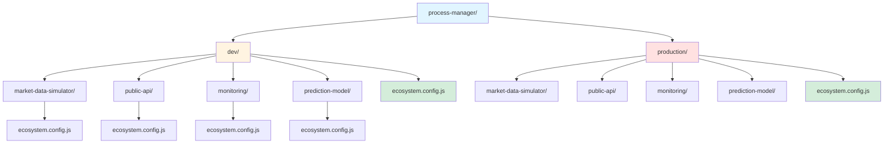

# Process Management with PM2

https://pm2.keymetrics.io/

## Introduction to PM2

PM2 (Process Manager 2) is a production-grade process manager for Node.js applications that provides daemon process management, load balancing, and monitoring capabilities. While originally designed for Node.js, PM2 supports managing processes for various runtime environments, including Python applications through its interpreter configuration option.

The primary advantages of PM2 include automatic application restart on failure, cluster mode for load balancing, zero-downtime reloads, and centralized logging. PM2 maintains process state persistence, ensuring that applications automatically restart after system reboots. These features make PM2particularly suitable for managing multiple microservices in a distributed trading system architecture.

PM2 utilizes ecosystem configuration files (typically in JSON or JavaScript format) that define application parameters such as name, script path, environment variables, and execution mode. This declarative approach enables version control of process configurations and facilitates environment-specific deployments.

## Directory Architecture

The process management infrastructure employs a hierarchical directory structure that separates concerns by environment and application scope. The architecture facilitates independent configuration management while enabling orchestration of multiple services through composition.



The root `process-manager/` directory contains environment-specific subdirectories (`dev/` and `production/`), each housing application-specific folders. Each application folder contains its own PM2 ecosystem configuration file that may define multiple related services. For instance, the market-data-simulator folder includes configurations for webhook handlers, REST API services, and data fetchers as separate processes. The environment-level `ecosystem.config.js` serves as a composition layer, aggregating individual application configurations to enable collective process management operations.

This architectural pattern supports several key requirements:
- **Environment isolation**: Development and production configurations remain separate, preventing cross-environment contamination
- **Service modularity**: Each application maintains independent configuration while participating in the larger ecosystem
- **Configuration composition**: The main ecosystem file enables orchestration of multiple services through a single entry point
- **Scalability**: New services can be added by creating additional application folders without modifying existing configurations

## Configuration Examples

PM2 configurations differ based on the runtime environment of the target application. The following examples demonstrate the structural differences between Node.js and Python process configurations.

### Node.js Application Configuration

In development environments, Node.js applications utilize `tsx` (TypeScript Execute) to run TypeScript source files directly without compilation. This approach eliminates the build step and accelerates the development iteration cycle.

Applications may expose multiple services, each configured as a separate PM2 process. For example, the market-data-simulator application encompasses distinct services for different data sources and functions:

```javascript
module.exports = {
  apps: [
    {
      name: 'mds-webhooks-kraken',
      script: '../../apps/market-data-simulator/src/services/webhooks/webhooks_kraken.ts',
      interpreter: 'tsx',
      instances: 1,
      exec_mode: 'fork',
      watch: false,
      env: {
        NODE_ENV: 'development',
        PORT: 3001
      }
    },
    {
      name: 'mds-rest-binance',
      script: '../../apps/market-data-simulator/src/services/rest/rest_binance.ts',
      interpreter: 'tsx',
      instances: 1,
      exec_mode: 'fork',
      watch: false,
      env: {
        NODE_ENV: 'development',
        PORT: 3002
      }
    },
    {
      name: 'mds-fetcher',
      script: '../../apps/market-data-simulator/src/services/fetcher/fetcher.ts',
      interpreter: 'tsx',
      instances: 1,
      exec_mode: 'fork',
      watch: false,
      env: {
        NODE_ENV: 'development'
      }
    }
  ]
};
```

The `interpreter` field specifies `tsx`, directing PM2 to execute TypeScript files through the tsx runtime. Each service receives a distinct name and may have service-specific environment variables such as port assignments. This granular process separation enables independent scaling, monitoring, and lifecycle management of individual services.

### Python Application Configuration

Python applications require explicit interpreter specification and employ file watching in development mode to automatically restart upon source code changes:

```javascript
module.exports = {
  apps: [{
    name: 'prediction-model',
    script: '../../apps/prediction-model/src/main.py',
    interpreter: 'python3',
    instances: 1,
    exec_mode: 'fork',
    watch: true,
    watch_delay: 1000,
    ignore_watch: ['node_modules', '__pycache__', '*.pyc', '.pytest_cache'],
    env: {
      PYTHONUNBUFFERED: '1',
      ENV: 'development'
    }
  }]
};
```

The `interpreter` field directs PM2 to execute the script through the Python interpreter. The `watch` option enables automatic process restart when file changes are detected within the application directory. The `watch_delay` parameter introduces a debounce period to prevent multiple restarts from rapid successive changes. The `PYTHONUNBUFFERED` environment variable ensures immediate output streaming, facilitating real-time log monitoring.

### Composed Ecosystem Configuration

The environment-level ecosystem file aggregates individual application configurations:

```javascript
const marketDataSimulator = require('./market-data-simulator/ecosystem.config');
const publicApi = require('./public-api/ecosystem.config');
const monitoring = require('./monitoring/ecosystem.config');
const predictionModel = require('./prediction-model/ecosystem.config');

module.exports = {
  apps: [
    ...marketDataSimulator.apps,
    ...publicApi.apps,
    ...monitoring.apps,
    ...predictionModel.apps
  ]
};
```

This composition pattern enables unified management of all services within an environment while maintaining the ability to manage individual services independently.

## Running Processes in Development

PM2 provides multiple operational modes for development environments. The following commands demonstrate common usage patterns for the development ecosystem.

### Starting All Services

To initiate all services defined in the development ecosystem:

```bash
cd process-manager/dev
pm2 start ecosystem.config.js
```

This command launches all applications specified in the composed configuration file, applying development-specific environment variables and parameters.

### Starting Individual Services

For isolated service development, individual application configurations can be started directly:

```bash
cd process-manager/dev/market-data-simulator
pm2 start ecosystem.config.js
```

This command launches all services defined within the market-data-simulator configuration (webhooks, REST API, fetcher). To start a specific service within an application:

```bash
pm2 start ecosystem.config.js --only mds-fetcher
```

The `--only` flag restricts execution to the named process, enabling developers to run only the services required for their current development context, reducing resource consumption.

Alternatively, PM2 supports namespace-based operations using pattern matching. To manage all services within the market-data-simulator namespace:

```bash
pm2 start "mds-*"
pm2 restart "mds-*"
pm2 stop "mds-*"
pm2 delete "mds-*"
```

The wildcard pattern `mds-*` matches all process names beginning with the `mds-` prefix, enabling collective operations on logically related services without affecting other processes in the PM2 daemon.

### Monitoring and Management

PM2 provides real-time process monitoring through its dashboard interface:

```bash
pm2 monit
```

The monitoring interface displays CPU and memory utilization, uptime, and log streams for all managed processes. Additional useful commands include:

```bash
pm2 list           # Display process status summary
pm2 logs           # Stream logs from all processes
pm2 logs [name]    # Stream logs from specific process
pm2 restart [name] # Restart specific process
pm2 stop [name]    # Stop specific process
pm2 delete [name]  # Remove process from PM2
```

### Development Workflow

The typical development workflow involves starting required services, monitoring their output, and making changes with automatic or manual restarts. The approach differs between Node.js and Python applications:

**Node.js with tsx**: TypeScript services run directly through the `tsx` interpreter, which handles module resolution and execution without requiring a separate build step. Manual restarts can be triggered using `pm2 restart [name]` when needed, or the `watch` option can be enabled for automatic restarts on file changes.

**Python with watch mode**: Python services employ PM2's file watching capability, automatically restarting when source file modifications are detected. The watch configuration includes ignore patterns for non-source files (e.g., `__pycache__`, `*.pyc`) to prevent unnecessary restarts.

This dual approach optimizes the development experience for each runtime environment while maintaining consistent process management through PM2's unified interface.

