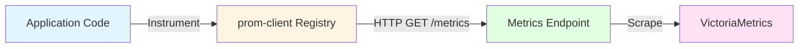
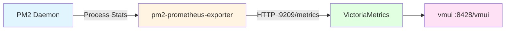
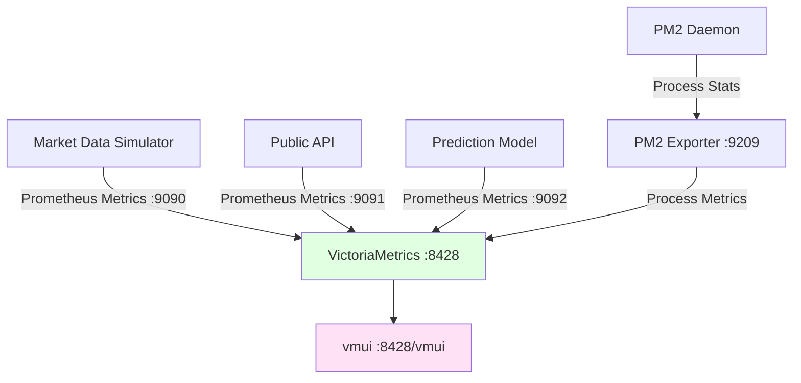

# Monitoring with VictoriaMetrics

Picked because it supports a single binary deployment.. simply run the executable. VictoriaMetrics includes vmui, a built-in web interface for querying and visualizing metrics, eliminating the need for external visualization tools.

* https://github.com/VictoriaMetrics/VictoriaMetrics
* https://prometheus.io/

## Exposing Custom Metrics from Services

Applications expose custom metrics through HTTP endpoints that VictoriaMetrics periodically scrapes. The Prometheus client libraries provide standardized metric types and exposition formats across multiple programming languages, ensuring compatibility with VictoriaMetrics ingestion mechanisms.

### Prometheus Metric Types

Prometheus defines four fundamental metric types that serve different measurement purposes:

**Counter**: Monotonically increasing value that resets only on process restart. Suitable for counting events such as requests processed, messages received, or errors encountered. Counters support rate calculation to derive per-second metrics.

**Gauge**: Point-in-time measurement that can increase or decrease. Appropriate for representing current state such as memory usage, queue depth, or concurrent connections. Gauges reflect instantaneous values rather than cumulative totals.

**Histogram**: Distribution of observations across predefined buckets, enabling percentile calculations. Histograms capture latency distributions, request sizes, or response times. Each histogram comprises multiple time series: bucket counters, sum of observations, and total count.

**Summary**: Similar to histograms but calculates percentiles on the client side. Summaries provide pre-computed quantiles at the expense of reduced aggregation flexibility across multiple instances.

### Implementation in Node.js

Node.js applications utilize the `prom-client` library to instrument code and expose metrics through HTTP endpoints:



The metrics endpoint exposes all registered metrics in Prometheus text format. Applications increment counters, set gauges, observe histogram values, and the registry maintains current state. VictoriaMetrics periodically queries the endpoint and persists the time-series data.

Example implementation demonstrating metric definition and exposition:

```typescript
import { Counter, Histogram, register } from 'prom-client';
import express from 'express';

const messagesProcessed = new Counter({
  name: 'market_data_messages_total',
  help: 'Total number of market data messages processed',
  labelNames: ['source', 'symbol', 'type']
});

const processingDuration = new Histogram({
  name: 'market_data_processing_duration_seconds',
  help: 'Time spent processing market data messages',
  labelNames: ['source'],
  buckets: [0.001, 0.005, 0.01, 0.05, 0.1, 0.5, 1]
});

async function processMarketData(message) {
  const endTimer = processingDuration.startTimer({ source: message.source });
  
  await handleMessage(message);
  
  messagesProcessed.inc({ 
    source: message.source, 
    symbol: message.symbol, 
    type: message.type 
  });
  
  endTimer();
}

const metricsServer = express();
metricsServer.get('/metrics', async (req, res) => {
  res.set('Content-Type', register.contentType);
  res.end(await register.metrics());
});
metricsServer.listen(9090);
```

The counter increments with each processed message, tracking dimensions through labels. The histogram records processing duration, automatically creating bucket distributions. The `/metrics` endpoint returns current metric values in Prometheus format for VictoriaMetrics scraping.

### Implementation in Python

Python applications employ the `prometheus_client` library following similar patterns. The library provides metric primitives and HTTP server functionality for exposing metrics. Integration requires minimal modifications to existing application code, with metrics instrumentation added at critical observation points such as request handlers, data processing functions, and error boundaries.

## Application Metrics from PM2

PM2 exposes process-level metrics through its programmatic API and monitoring endpoints. These metrics capture resource utilization, process health, and operational stability indicators for managed applications. Integration with VictoriaMetrics requires an exporter that periodically queries PM2 metrics and translates them into Prometheus format.

### PM2 Metric Exposition

The pm2-prometheus-exporter module bridges PM2 process metrics to Prometheus-compatible endpoints. This exporter queries PM2's internal state and exposes metrics at a configurable HTTP endpoint (typically `:9209/metrics`):



### Setting Up PM2 Prometheus Exporter

The exporter operates as a standalone Node.js application that connects to the PM2 daemon and exposes process statistics through an HTTP endpoint. Installation and deployment follow standard Node.js package management patterns:

```bash
npm install -g pm2-prometheus-exporter
```

The exporter configuration specifies the metrics endpoint port and PM2 connection parameters:

```javascript
module.exports = {
  apps: [{
    name: 'pm2-exporter',
    script: 'pm2-prometheus-exporter',
    env: {
      PM2_PROMETHEUS_PORT: 9209,
      PM2_PROMETHEUS_METRICS_PREFIX: 'pm2'
    }
  }]
};
```

After starting the exporter through PM2, metrics become available at the configured endpoint. VictoriaMetrics scrapes this endpoint alongside application-specific metrics endpoints, consolidating process-level and business-level metrics into unified time-series storage.

The exporter automatically discovers all processes managed by the PM2 daemon and creates corresponding metric series. When new processes start or existing processes terminate, the exporter updates the exposed metrics accordingly without requiring configuration changes or restarts.

PM2 metrics encompass multiple dimensions of process health:

**Process resource utilization:**
```prometheus
# HELP pm2_cpu CPU usage percentage
# TYPE pm2_cpu gauge
pm2_cpu{app="mds-fetcher",instance="0"} 12.5
pm2_cpu{app="mds-webhooks-kraken",instance="0"} 8.3

# HELP pm2_memory Memory usage in bytes
# TYPE pm2_memory gauge
pm2_memory{app="mds-fetcher",instance="0"} 89456640
pm2_memory{app="mds-webhooks-kraken",instance="0"} 67108864
```

**Process uptime and restart counts:**
```prometheus
# HELP pm2_uptime Process uptime in seconds
# TYPE pm2_uptime gauge
pm2_uptime{app="mds-fetcher",instance="0"} 86400

# HELP pm2_restart_count Number of process restarts
# TYPE pm2_restart_count counter
pm2_restart_count{app="mds-fetcher",instance="0"} 3
```

**Process status indicators:**
```prometheus
# HELP pm2_status Process status (1=online, 0=stopped, -1=error)
# TYPE pm2_status gauge
pm2_status{app="mds-fetcher",instance="0"} 1
pm2_status{app="prediction-model",instance="0"} 1
```

The `app` label identifies the PM2 process name as defined in ecosystem configuration files, while the `instance` label distinguishes between multiple instances when cluster mode is employed.

## Running VictoriaMetrics

VictoriaMetrics operates as a single-binary time-series database that implements the Prometheus storage model with performance optimizations for high-cardinality metrics and long-term retention. The architecture supports both single-node and cluster deployments, with the single-node configuration sufficient for development and small-scale production environments.

### Single-Node Deployment

VictoriaMetrics single-node deployment requires minimal configuration and provides all core functionality through a single executable:

```bash
victoria-metrics-prod \
  -storageDataPath=/var/lib/victoria-metrics-data \
  -retentionPeriod=12 \
  -httpListenAddr=:8428
```

Key configuration parameters:
- `storageDataPath`: Directory for time-series data persistence
- `retentionPeriod`: Duration to retain metrics (months notation: `1`, `3`, `12`)
- `httpListenAddr`: HTTP endpoint for metric ingestion and querying

The service exposes several endpoints:
- `/api/v1/write`: Prometheus remote_write protocol for metric ingestion
- `/api/v1/query`: PromQL query execution
- `/api/v1/query_range`: Time-range PromQL queries
- `/metrics`: VictoriaMetrics self-monitoring metrics

### Integration with Prometheus Remote Write

Applications using Prometheus client libraries configure remote_write to forward metrics to VictoriaMetrics:

```yaml
# prometheus.yml
remote_write:
  - url: http://localhost:8428/api/v1/write
    queue_config:
      max_samples_per_send: 10000
      batch_send_deadline: 5s
```

This configuration enables Prometheus scrape endpoints to persist metrics in VictoriaMetrics for long-term storage and analysis, while Prometheus retains recent data for local querying.

### PM2 Integration for VictoriaMetrics

When deploying VictoriaMetrics as a managed process alongside other system components, PM2 provides process lifecycle management:

```javascript
module.exports = {
  apps: [{
    name: 'victoriametrics',
    script: 'victoria-metrics-prod',
    args: [
      '-storageDataPath=/var/lib/victoria-metrics-data',
      '-retentionPeriod=12',
      '-httpListenAddr=:8428'
    ],
    instances: 1,
    exec_mode: 'fork',
    restart_delay: 5000,
    max_restarts: 10,
    env: {
      GOMAXPROCS: '2'
    }
  }]
};
```

This configuration integrates VictoriaMetrics into the PM2-managed process ecosystem, enabling unified monitoring and management through PM2's interface while VictoriaMetrics handles time-series data storage.

### Data Flow Architecture

The complete monitoring pipeline integrates application metrics, PM2 process metrics, and VictoriaMetrics storage:



Each application exposes a Prometheus metrics endpoint that VictoriaMetrics scrapes at regular intervals (typically 15-30 seconds). The PM2 exporter queries PM2's daemon for process statistics and exposes them through a Prometheus-compatible endpoint. VictoriaMetrics aggregates all metric streams into a unified time-series database, enabling cross-service analysis and correlation.

This architecture provides comprehensive visibility into both business-level operational metrics and infrastructure-level process health indicators, supporting data-driven operational decisions.

## Visualizing Metrics with vmui

VictoriaMetrics includes vmui, a built-in web interface that provides metric visualization and query capabilities without requiring additional software installation. The interface becomes available immediately upon starting VictoriaMetrics at `http://localhost:8428/vmui`.

### Core Functionality

vmui provides essential metric exploration and visualization capabilities through a browser-based interface:

**PromQL Query Execution**: The query editor supports full PromQL syntax with autocomplete functionality for metric names and label values. Query results display in both tabular and graphical formats, enabling rapid metric inspection during development and troubleshooting.

**Time-Series Visualization**: Graph rendering displays multiple time series simultaneously with automatic y-axis scaling and interactive zoom capabilities. Time range selection supports both relative periods (last hour, last day) and absolute timestamp ranges.

**Metric Discovery**: The metric explorer lists all available metrics with their label dimensions, facilitating discovery of instrumented application metrics and infrastructure measurements. Label filtering enables narrowing large metric catalogs to relevant subsets.

### Limitations and Alternatives

vmui focuses on query execution and single-graph visualization rather than comprehensive dashboard creation. The interface lacks:
- Persistent dashboard definitions
- Multi-panel dashboard layouts
- Alerting rule configuration
- User authentication and access control

For production environments requiring sophisticated dashboard capabilities, external visualization platforms such as Grafana provide extended functionality. However, vmui's zero-configuration deployment aligns with the minimal-dependency architecture philosophy established through VictoriaMetrics selection, making it suitable for development environments and straightforward operational monitoring scenarios.

