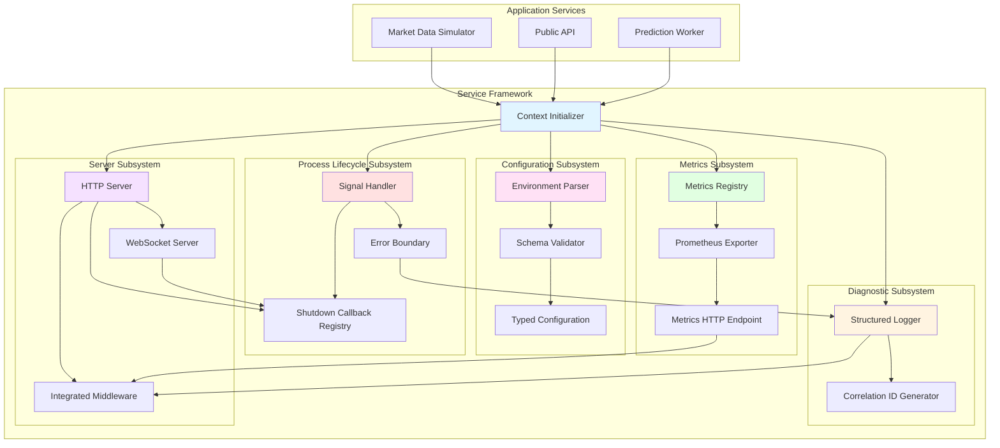

# Service Framework

## Introduction

The service framework establishes a standardized foundation for Node.js process implementation across the distributed trading system architecture. This framework addresses common operational requirements including structured logging with correlation identifiers, metrics exposition for monitoring systems, type-safe environment configuration validation, HTTP/WebSocket server lifecycle management, and coordinated process shutdown handling. By providing a consistent interface for these cross-cutting concerns, the framework reduces implementation complexity and ensures operational consistency across heterogeneous services such as the market data simulator, public API, and prediction model workers.

The framework design prioritizes five fundamental capabilities:

**Observability**: Structured diagnostic logging with distributed tracing support through scoped correlation identifiers enables request flow tracking across service boundaries.

**Metrics Exposition**: Standardized integration with Prometheus client libraries facilitates consistent metric instrumentation and exposition for VictoriaMetrics ingestion.

**Configuration Management**: Type-safe environment variable parsing with validation ensures services receive correctly configured runtime parameters or fail fast during initialization.

**Process Lifecycle Management**: Centralized signal handling, graceful shutdown coordination, and unhandled error boundary management with component callback registration.

**Server Management**: Unified HTTP and WebSocket server creation with integrated middleware support for metrics exposition, request logging, and error handling.

## Architecture Overview

The service framework comprises five primary subsystems that address distinct operational concerns while maintaining cohesive integration through a modular context-based initialization pattern:



**Figure 1:** Service framework architecture illustrating the five primary subsystems and their integration with application services through the modular context initializer.

## Diagnostic Interface

The diagnostic subsystem provides structured logging capabilities with hierarchical correlation identifier support for distributed request tracing. This subsystem addresses the challenge of correlating log entries across asynchronous operations and multiple service boundaries.

For comprehensive documentation of structured logging, correlation identifier generation, severity levels, field conventions, and integration patterns, refer to [006_sf_diagnostics](./006_sf_diagnostics.md).

## Metrics Interface

The metrics subsystem integrates Prometheus client libraries to provide standardized metric instrumentation and exposition. This subsystem addresses the requirement for consistent operational telemetry across all services in the distributed system.

For comprehensive documentation of Prometheus metric types, registry management, HTTP endpoint integration, default metrics collection, naming conventions, label cardinality considerations, and performance characteristics, refer to [006_sf_metrics](./006_sf_metrics.md).

## Environment Configuration

The configuration subsystem addresses the challenge of type-safe environment variable parsing with comprehensive validation. This subsystem ensures that services receive correctly configured runtime parameters or fail immediately during initialization with actionable error messages.

For comprehensive documentation of schema definition, environment variable parsing, validation patterns, multi-environment configuration, security considerations, and integration with external secret management, refer to [006_sf_env](./006_sf_env.md).

## Process Lifecycle Management

The process lifecycle subsystem provides centralized signal handling, graceful shutdown coordination, and error boundary management for unhandled promise rejections. This subsystem addresses the challenge of coordinating shutdown sequences across multiple components that maintain stateful resources such as HTTP servers and database connection pools.

For comprehensive documentation of signal handling, shutdown callback registration, unhandled error handling, shutdown sequence orchestration, timeout enforcement, error recovery strategies, health check integration, and testing patterns, refer to [006_sf_process](./006_sf_process.md).

## HTTP Server Management

The server subsystem provides preconfigured Fastify server instances with integrated middleware support for diagnostics, metrics, and graceful shutdown. The framework returns ready-to-use Fastify servers that automatically handle correlation identifiers, request logging, and metrics exposition.

For comprehensive documentation of server creation, route handling, middleware configuration, metrics endpoint, health checks, and graceful shutdown integration, refer to [006_sf_server](./006_sf_server.md).

## Service Initialization

The framework employs a modular context creation pattern that separates subsystem initialization from server lifecycle management. This pattern enables explicit dependency composition and facilitates testing through dependency injection:

```typescript
function createServiceContext(schema: ValidationSchema) {
  const envContext = parseEnv(schema);
  const diagnosticContext = createDiagnosticContext();
  const metricsContext = createMetricsRegistry({
    diagnosticContext
  });
  const processContext = createProcessLifecycle({
    diagnosticContext
  });

  return {
    envContext,
    diagnosticContext,
    metricsContext,
    processContext
  };
}

type ServiceContext = ReturnType<typeof createServiceContext>;

async function startService(context: ServiceContext) {
  const fastify = createHttpServer(context);
  
  fastify.get('/api/status', async (request, reply) => {
    return { status: 'operational' };
  });
  
  fastify.post('/api/orders', async (request, reply) => {
    request.logger.info('Processing order', { body: request.body });
    const order = await processOrder(request.body);
    return { order };
  });
  
  context.processContext.start();
  
  await fastify.startServer();
}
```

The context creation function initializes each subsystem independently, passing dependencies explicitly where required. The metrics context receives the diagnostic context to enable correlation of metric events with log entries. The process context receives the diagnostic context for coordinated logging during shutdown sequences. The resulting service context object contains fully configured subsystems that can be passed to the server creation function.

The server creation function (`createHttpServer`) returns a preconfigured Fastify instance with integrated middleware for diagnostic context attachment, request logging, metrics exposition, and graceful shutdown coordination. The returned Fastify instance includes a `startServer()` method that uses environment configuration automatically, eliminating the need for explicit port and host specification during startup.

This pattern provides several architectural advantages:

**Testability**: Individual contexts can be mocked or stubbed during testing, enabling isolated unit tests for business logic without requiring full framework initialization.

**Flexibility**: Services select which contexts to initialize based on their requirements. Worker processes may omit server creation, while monitoring services may initialize only metrics and diagnostic contexts.

**Type Safety**: TypeScript's type inference derives the `ServiceContext` type from the initialization function's return type, ensuring compile-time type safety without manual type definitions.

**Separation of Concerns**: Context creation remains independent of server lifecycle, enabling context reuse across multiple server instances or non-server components such as background workers.

## Framework Implementation Considerations

### Dependency Management

The framework packages common dependencies including Prometheus client libraries, logging implementations, and validation libraries. Application services declare the framework as a dependency rather than directly depending on these underlying libraries, ensuring version consistency and reducing dependency management complexity.

### Performance Characteristics

Structured logging introduces computational overhead compared to string-based logging. The framework employs lazy evaluation patterns to defer structured field serialization until log entries pass severity filtering. Metrics collection overhead depends on metric types: counters and gauges impose minimal overhead, while histograms require bucket calculations. The framework documentation provides performance guidance for metric selection based on measurement requirements.

### Extensibility Patterns

The framework exposes extension points for integrating additional observability backends, alternative logging destinations, and custom configuration sources. Services can register custom metric collectors, log formatters, and configuration validators without modifying framework core functionality.

## Conclusion

The service framework establishes a standardized operational foundation for Node.js processes within the distributed trading system architecture. By providing consistent interfaces for diagnostic logging, metrics exposition, configuration management, process lifecycle coordination, and HTTP server management, the framework reduces implementation complexity and ensures operational uniformity across heterogeneous services. The modular context creation pattern enables flexible composition strategies while maintaining type safety and testability. The process lifecycle component's callback registration system enables coordinated shutdown across components including HTTP servers and database pools, ensuring graceful resource cleanup under all termination scenarios. The framework's integration with PM2 process management and VictoriaMetrics monitoring infrastructure creates a cohesive operational environment supporting both development workflows and production deployments.

