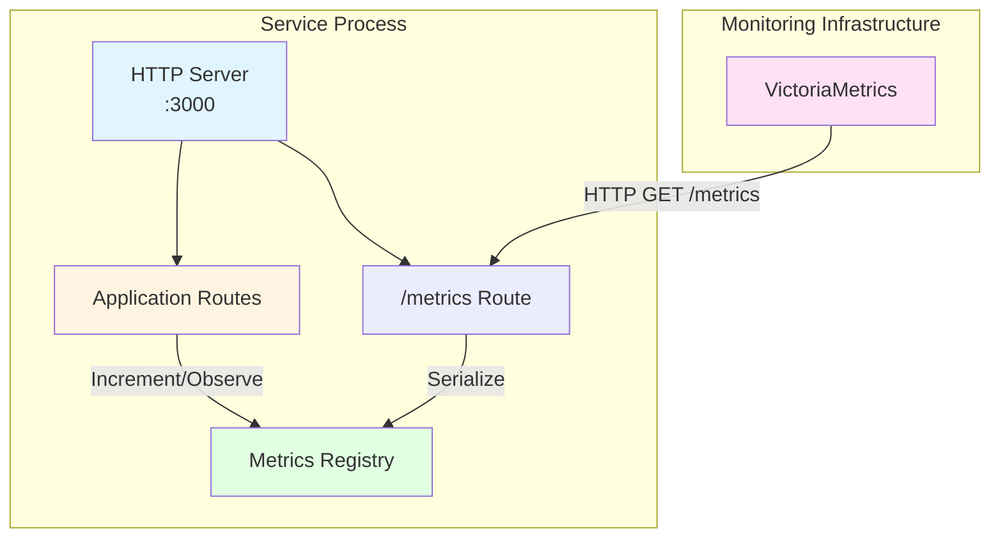

# Service Framework: Metrics Interface

## Introduction

The metrics interface provides standardized instrumentation and exposition capabilities for operational telemetry within the distributed trading system architecture. This subsystem integrates Prometheus client libraries to enable consistent metric collection across heterogeneous services, facilitating performance monitoring, capacity planning, and anomaly detection through the VictoriaMetrics monitoring infrastructure.

Modern distributed systems require comprehensive observability to maintain operational reliability and performance objectives. Metrics provide quantitative measurements of system behavior including request rates, error frequencies, resource utilization, and latency distributions. The metrics interface standardizes these measurements across services while integrating seamlessly with the diagnostic subsystem for correlated analysis of system behavior.

## Prometheus Metric Types

The framework implements the four fundamental Prometheus metric types, each serving distinct measurement purposes:

**Counter**: Monotonically increasing value that resets only on process restart. Counters measure cumulative totals such as requests processed, messages received, or errors encountered. Prometheus query language (PromQL) derives rate calculations from counters to produce per-second metrics.

**Gauge**: Point-in-time measurement that can increase or decrease. Gauges represent current state such as memory usage, queue depth, concurrent connections, or temperature readings. Unlike counters, gauges reflect instantaneous values rather than cumulative totals.

**Histogram**: Distribution of observations across predefined buckets, enabling percentile calculations and quantile estimation. Histograms capture latency distributions, request sizes, or response times. Each histogram comprises multiple time series: counters for each bucket boundary, sum of all observations, and total observation count. The bucket structure enables server-side percentile calculation during query execution.

**Summary**: Similar to histograms but calculates percentiles on the client side during observation. Summaries provide pre-computed quantiles (e.g., 50th, 95th, 99th percentiles) at the expense of reduced aggregation flexibility across multiple service instances. Summaries cannot be meaningfully aggregated across instances, limiting their utility in distributed deployments.

### Metric Type Selection Guidelines

The framework documentation provides guidance for metric type selection based on measurement characteristics:

**Use Counters for**: Event counts, request totals, error occurrences, bytes transferred, or any monotonically increasing value. Counters enable rate calculations and derivative metrics through PromQL.

**Use Gauges for**: Current state measurements, resource utilization levels, queue depths, concurrent operation counts, or temperature readings. Gauges support average, minimum, and maximum calculations across time windows.

**Use Histograms for**: Latency measurements, request sizes, response sizes, or any value requiring percentile analysis. Histograms enable flexible percentile calculation at query time across multiple service instances.

**Use Summaries for**: Pre-computed percentiles where aggregation across instances is not required. Summaries reduce query-time computation at the expense of deployment-time flexibility.

## Metrics Registry Management

The Prometheus client library employs a registry pattern to maintain metric definitions and current values. The framework exposes the metrics registry to enable application-specific metric creation while handling lifecycle management and exposition:

```typescript
interface MetricsManager {
  getRegistry(): Registry;
  
  createCounter(config: CounterConfiguration): Counter;
  createGauge(config: GaugeConfiguration): Gauge;
  createHistogram(config: HistogramConfiguration): Histogram;
  createSummary(config: SummaryConfiguration): Summary;
  
  startMetricsServer(port: number): Promise<MetricsServer>;
}
```

The registry maintains references to all created metrics and serializes their current values into Prometheus text format for scraping by VictoriaMetrics. Services create metrics through the manager interface rather than directly instantiating Prometheus metric objects, ensuring proper registration and lifecycle management.

### Metric Configuration

Each metric type requires configuration specifying name, help text, and optional label dimensions:

```typescript
interface CounterConfiguration {
  name: string;
  help: string;
  labelNames?: string[];
}

interface GaugeConfiguration {
  name: string;
  help: string;
  labelNames?: string[];
}

interface HistogramConfiguration {
  name: string;
  help: string;
  labelNames?: string[];
  buckets?: number[];
}

interface SummaryConfiguration {
  name: string;
  help: string;
  labelNames?: string[];
  percentiles?: number[];
  maxAgeSeconds?: number;
  ageBuckets?: number;
}
```

**Name**: Metric identifier following Prometheus naming conventions. Names employ snake_case with appropriate unit suffixes (e.g., `_seconds`, `_bytes`, `_total`). The framework validates metric names against Prometheus conventions during registration.

**Help**: Human-readable description of the metric's purpose and semantics. Help text appears in Prometheus query interfaces and documentation systems, facilitating metric discovery and interpretation.

**Label Names**: Dimensional attributes enabling metric segmentation. Labels create separate time series for each unique label value combination. Common label dimensions include method, path, status code, source, and destination.

**Buckets** (histograms only): Bucket boundaries defining distribution granularity. The framework provides sensible defaults for common measurement types (latency, size) while enabling custom bucket specifications for domain-specific requirements.

**Percentiles** (summaries only): Quantiles to calculate (e.g., [0.5, 0.95, 0.99]). Summary percentiles are computed at observation time rather than query time.

### Label Cardinality Considerations

Label dimensions create separate time series for each unique label value combination, producing cardinality equal to the product of all label value counts. High cardinality metrics impose storage and query performance costs on the monitoring infrastructure.

The framework enforces label cardinality limits to prevent pathological metric explosions:

**Bounded Label Values**: Labels with unbounded value spaces (user IDs, request IDs, email addresses) must be avoided. Use bounded categorical values (user tier, request type, error code) instead.

**Label Value Limits**: The framework warns when label value counts exceed configurable thresholds (default: 1000 unique values per label). Services generating excessive label values may be throttled or rejected.

**Dynamic Label Management**: The registry tracks label value cardinality and exposes metrics describing metric cardinality itself, enabling operators to identify problematic metrics before they impact monitoring infrastructure.

## Metrics HTTP Endpoint

The framework integrates Prometheus metrics exposition into the HTTP server through a dedicated route handler. This integrated approach simplifies deployment architecture by eliminating the need for separate metrics server processes while maintaining isolation between monitoring and business logic concerns:



**Figure 1:** Metrics exposition architecture showing integration of metrics endpoint within the HTTP server, sharing access to the centralized metrics registry with application routes.

The metrics endpoint implementation handles concurrent scrape requests, implements appropriate timeout configurations, and provides standardized Prometheus text format responses. This integration enables unified port management while maintaining the separation of concerns between operational telemetry and application business logic.

### Scrape Performance Optimization

The metrics endpoint implements several optimizations to minimize scrape latency and resource consumption:

**Lazy Serialization**: Metric values are serialized to Prometheus text format only upon scrape requests, avoiding continuous serialization overhead.

**Concurrent Scrape Handling**: Multiple scrape requests can execute concurrently without blocking, ensuring monitoring infrastructure can scale independently of service request handling.

**Timeout Configuration**: Scrape requests implement configurable timeouts to prevent indefinite blocking on slow metric serialization operations.

**Caching**: The framework optionally caches serialized metric output with configurable cache durations, reducing serialization overhead for high-frequency scraping scenarios.

## Default Metrics Collection

The framework automatically registers default metrics that capture Node.js runtime behavior, providing infrastructure-level visibility without requiring explicit instrumentation:

### Process Metrics

**CPU Usage** (`process_cpu_usage_percent`): Gauge measuring process CPU utilization as a percentage of available CPU resources. This metric enables correlation of request processing performance with CPU availability.

**Memory Usage** (`process_memory_bytes`): Gauge set measuring heap memory, non-heap memory, and total memory utilization. Separate gauges track used, available, and total memory for each category.

**Event Loop Lag** (`nodejs_eventloop_lag_seconds`): Histogram capturing event loop delay measurements. Elevated event loop lag indicates blocked event loop execution, suggesting CPU-bound operations or excessive synchronous processing.

**Active Handles** (`nodejs_active_handles_total`): Gauge measuring count of active handles (timers, network connections, file descriptors). Increasing handle counts may indicate resource leaks.

**Active Requests** (`nodejs_active_requests_total`): Gauge measuring count of active asynchronous requests. This metric provides visibility into pending I/O operations.

### HTTP Metrics

When HTTP server integration is enabled, the framework automatically instruments all HTTP endpoints:

**Request Count** (`http_requests_total`): Counter measuring total HTTP requests by method, path, and status code. This metric enables calculation of request rates, success rates, and error rates.

**Request Duration** (`http_request_duration_seconds`): Histogram capturing request processing time by method and path. Bucket boundaries default to `[0.001, 0.005, 0.01, 0.05, 0.1, 0.5, 1, 5, 10]` seconds, enabling percentile calculation for typical web request latencies.

**Request Size** (`http_request_size_bytes`): Histogram measuring incoming request body sizes. This metric identifies large requests that may impact processing performance.

**Response Size** (`http_response_size_bytes`): Histogram measuring outgoing response body sizes. This metric supports bandwidth analysis and capacity planning.

All HTTP metrics employ label dimensions for method and path, enabling per-endpoint analysis. The framework normalizes parameterized paths (e.g., `/users/:id` rather than `/users/12345`) to prevent unbounded cardinality.

### WebSocket Metrics

WebSocket server integration automatically instruments connection lifecycle and message processing:

**Active Connections** (`websocket_connections_active`): Gauge measuring current WebSocket connection count. This metric provides visibility into concurrent connection utilization.

**Connection Total** (`websocket_connections_total`): Counter measuring total WebSocket connections by connection result (success, error, timeout). This metric enables connection success rate calculation.

**Messages Sent** (`websocket_messages_sent_total`): Counter measuring outbound messages by message type and destination.

**Messages Received** (`websocket_messages_received_total`): Counter measuring inbound messages by message type and source.

**Message Size** (`websocket_message_size_bytes`): Histogram measuring message payload sizes for both sent and received messages.

## Metric Naming Conventions

The framework enforces Prometheus metric naming conventions to ensure consistency across services:

**Base Name**: Describes what is being measured using snake_case (e.g., `http_requests`, `database_queries`, `cache_hits`).

**Unit Suffix**: Specifies measurement unit as a suffix (e.g., `_seconds`, `_bytes`, `_total`, `_percent`). Counters typically employ `_total` suffix to indicate cumulative values.

**Subsystem Prefix**: Services prefix metrics with subsystem identifiers to enable filtering (e.g., `api_http_requests_total`, `fetcher_database_queries_total`).

**Full Example**: `market_data_simulator_messages_processed_total{source="binance",symbol="BTCUSDT",type="trade"}`

## Integration with Application Code

Services receive the metrics manager during initialization and create application-specific metrics:

```typescript
function initializeMetrics(context: ServiceContext) {
  const messagesProcessed = context.metricsContext.createCounter({
    name: 'market_data_messages_processed_total',
    help: 'Total market data messages processed',
    labelNames: ['source', 'symbol', 'type']
  });
  
  const processingDuration = context.metricsContext.createHistogram({
    name: 'market_data_processing_duration_seconds',
    help: 'Message processing duration',
    labelNames: ['source'],
    buckets: [0.001, 0.005, 0.01, 0.05, 0.1, 0.5, 1]
  });
  
  return { messagesProcessed, processingDuration };
}

async function processMessage(
  message: MarketDataMessage,
  metrics: ApplicationMetrics
) {
  const endTimer = metrics.processingDuration.startTimer({
    source: message.source
  });
  
  await handleMessage(message);
  
  metrics.messagesProcessed.inc({
    source: message.source,
    symbol: message.symbol,
    type: message.type
  });
  
  endTimer();
}
```

This integration pattern ensures metrics are properly registered and accessible throughout the application lifecycle.

### Metric Observation Patterns

Different metric types employ distinct observation patterns:

**Counter Incrementation**: Counters provide `inc(labels, value)` method to increment by specified amounts. Omitting value increments by 1.

**Gauge Manipulation**: Gauges provide `set(labels, value)`, `inc(labels, value)`, and `dec(labels, value)` methods for absolute setting, incrementation, and decrementation.

**Histogram Observation**: Histograms provide `observe(labels, value)` method to record observations. The `startTimer(labels)` utility returns a function that records elapsed time when invoked.

**Summary Observation**: Summaries employ the same observation interface as histograms but calculate percentiles at observation time rather than query time.

## Integration with Diagnostic Context

Metrics collection integrates with the diagnostic subsystem to enable correlated analysis of performance metrics and log data. When metrics exhibit anomalous behavior, operators use correlation identifiers from metric labels to retrieve detailed log traces:

```typescript
async function handleRequest(request: Request, context: ServiceContext) {
  const requestId = context.diagnosticContext.generateRootId();
  const requestLogger = context.diagnosticContext.createLogger(requestId);
  
  const endTimer = context.metricsContext.requestDuration.startTimer({
    method: request.method,
    path: request.path
  });
  
  try {
    requestLogger.info('Request received');
    
    const result = await processRequest(request, requestLogger);
    
    context.metricsContext.requestCount.inc({
      method: request.method,
      path: request.path,
      status: 200
    });
    
    requestLogger.info('Request completed', {
      duration_ms: endTimer() * 1000
    });
    
    return result;
  } catch (error) {
    context.metricsContext.requestCount.inc({
      method: request.method,
      path: request.path,
      status: 500
    });
    
    context.metricsContext.errorCount.inc({
      method: request.method,
      error_type: error.constructor.name
    });
    
    requestLogger.error('Request failed', {
      errorMessage: error.message,
      duration_ms: endTimer() * 1000
    });
    
    throw error;
  }
}
```

This pattern ensures operators can transition seamlessly from high-level metric dashboards to detailed log traces when investigating operational issues.

## Metrics Export Format

The metrics endpoint exports data in Prometheus text format, a line-oriented format comprising metric metadata and observations:

```prometheus
# HELP market_data_messages_processed_total Total market data messages processed
# TYPE market_data_messages_processed_total counter
market_data_messages_processed_total{source="binance",symbol="BTCUSDT",type="trade"} 142567
market_data_messages_processed_total{source="binance",symbol="ETHUSDT",type="trade"} 98234
market_data_messages_processed_total{source="kraken",symbol="BTCUSD",type="trade"} 76543

# HELP market_data_processing_duration_seconds Message processing duration
# TYPE market_data_processing_duration_seconds histogram
market_data_processing_duration_seconds_bucket{source="binance",le="0.001"} 45123
market_data_processing_duration_seconds_bucket{source="binance",le="0.005"} 98765
market_data_processing_duration_seconds_bucket{source="binance",le="0.01"} 135678
market_data_processing_duration_seconds_bucket{source="binance",le="+Inf"} 142567
market_data_processing_duration_seconds_sum{source="binance"} 428.34
market_data_processing_duration_seconds_count{source="binance"} 142567
```

The format includes `HELP` lines describing metric semantics, `TYPE` lines specifying metric types, and observation lines containing label sets and measured values. Histogram metrics expand to multiple time series representing bucket counts, observation sums, and total counts.

## Performance Considerations

Metrics collection introduces computational overhead that must be balanced against observability requirements:

**Counter and Gauge Overhead**: Minimal overhead consisting of atomic increment operations and map lookups. Counter and gauge operations typically consume nanoseconds of CPU time.

**Histogram Overhead**: Moderate overhead requiring bucket boundary comparisons and multiple counter increments. Histogram observations consume microseconds of CPU time, with overhead proportional to bucket count.

**Summary Overhead**: High overhead requiring percentile calculation and sliding window maintenance. Summary observations may consume milliseconds of CPU time depending on configuration.

**Label Lookup Overhead**: Label-based metric access requires map lookups with overhead proportional to label cardinality. The framework employs efficient hash-based lookups to minimize this overhead.

The framework provides performance guidance recommending histograms over summaries for most use cases due to their superior aggregation properties and lower overhead characteristics.

## Conclusion

The metrics interface provides comprehensive instrumentation capabilities for operational telemetry within the service framework. By standardizing metric types, naming conventions, and exposition mechanisms, the framework ensures consistent observability across heterogeneous services. The integration with VictoriaMetrics monitoring infrastructure and the diagnostic subsystem creates a cohesive observability environment supporting both real-time monitoring and historical performance analysis. Default metric collection provides immediate visibility into infrastructure behavior while enabling services to augment with domain-specific business metrics.

