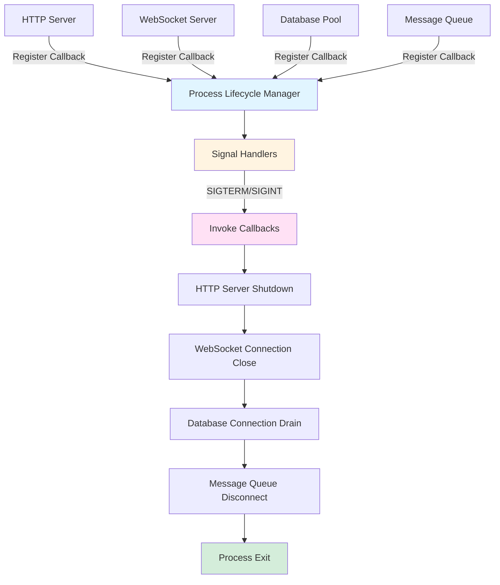
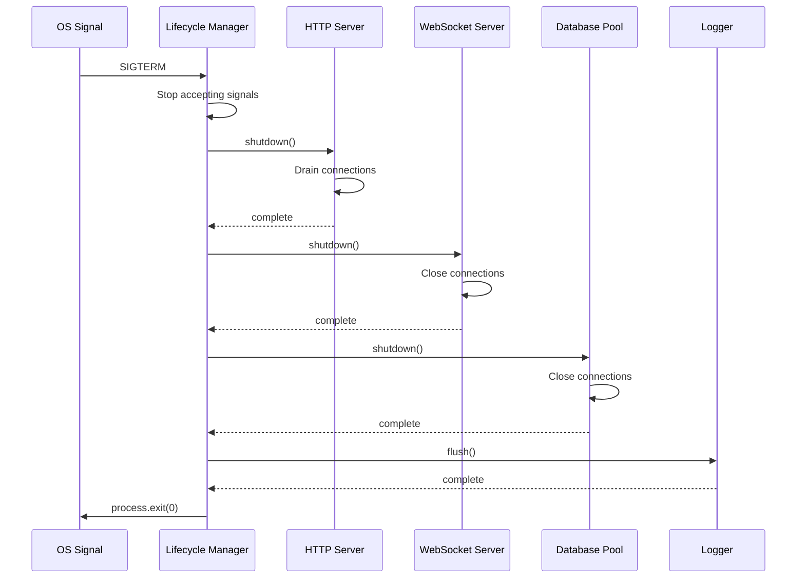

# Service Framework: Process Lifecycle Management

## Introduction

The process lifecycle subsystem provides centralized signal handling, graceful shutdown coordination, and error boundary management for unhandled promise rejections. This subsystem addresses the challenge of coordinating shutdown sequences across multiple components that maintain stateful resources such as HTTP servers, WebSocket connections, and database connection pools.

Modern distributed systems comprise multiple interdependent components that maintain stateful resources requiring proper cleanup during shutdown. Without coordinated shutdown mechanisms, processes may terminate abruptly, causing connection leaks, incomplete transactions, or lost in-flight requests. The process lifecycle manager solves this problem through callback registration patterns that enable components to participate in graceful shutdown sequences while remaining decoupled from other system components.

## Signal Handling and Shutdown Coordination

Node.js processes receive termination signals from process managers (PM2) or operating system kill commands. The framework intercepts these signals and coordinates graceful shutdown across all registered components:

```typescript
interface ProcessLifecycleManager {
  onShutdown(callback: ShutdownCallback): void;
  start(): void;
  shutdown(): Promise<void>;
}

type ShutdownCallback = () => Promise<void> | void;
```

The lifecycle manager maintains a registry of shutdown callbacks that components register during initialization. When termination signals are received, the manager invokes callbacks in registration order, awaiting asynchronous operations before proceeding to the next component.

### Signal Types and Handling

The framework registers handlers for multiple termination signals:

**SIGTERM**: Graceful termination signal sent by process managers and orchestration systems. The framework interprets SIGTERM as a request for graceful shutdown, executing all registered callbacks before process exit.

**SIGINT**: Interrupt signal generated by keyboard input (Ctrl+C) or programmatic interruption. The framework treats SIGINT identically to SIGTERM, enabling graceful shutdown during interactive development.

**SIGUSR2**: User-defined signal sometimes used for application-specific purposes. The framework supports custom signal handlers while maintaining default graceful shutdown behavior.

The signal handler implementation prevents concurrent shutdown execution by tracking shutdown state:

```typescript
class ProcessLifecycleManager {
  private shuttingDown = false;
  private callbacks: ShutdownCallback[] = [];
  
  start(): void {
    process.on('SIGTERM', () => this.initiateShutdown('SIGTERM'));
    process.on('SIGINT', () => this.initiateShutdown('SIGINT'));
  }
  
  private async initiateShutdown(signal: string): Promise<void> {
    if (this.shuttingDown) {
      return;
    }
    
    this.shuttingDown = true;
    await this.executeCallbacks();
    process.exit(0);
  }
}
```

The `shuttingDown` flag prevents duplicate shutdown execution when multiple signals are received simultaneously.

## Shutdown Callback Registration

Components that maintain stateful resources register shutdown callbacks with the lifecycle manager. The HTTP server, WebSocket server, database connection pools, and message queue subscribers all register cleanup operations:



**Figure 1:** Process lifecycle manager coordinating shutdown across multiple component types through registered callback execution.

This registration pattern enables components to remain decoupled while ensuring coordinated shutdown behavior. Components register their cleanup logic without knowledge of other system components, and the lifecycle manager orchestrates the complete shutdown sequence.

### Callback Registration Order

The order of callback registration determines execution order during shutdown. Components should register callbacks in dependency order, with dependent components registering before their dependencies:

1. **HTTP Server**: Stops accepting new connections first
2. **WebSocket Server**: Closes active WebSocket connections
3. **Database Connection Pool**: Closes database connections after request handlers complete
4. **Message Queue Subscribers**: Disconnects from message queues after message processing completes
5. **Diagnostic Logger**: Flushes buffered log entries last

This ordering ensures that active requests can complete database operations and message publishing before those resources are closed.

### Callback Execution Semantics

Shutdown callbacks support both synchronous and asynchronous execution:

```typescript
// Synchronous callback
processContext.onShutdown(() => {
  cleanupCache();
  closeFileHandles();
});

// Asynchronous callback
processContext.onShutdown(async () => {
  await httpServer.stop();
  await database.close();
});
```

The lifecycle manager awaits asynchronous callbacks, ensuring complete resource cleanup before process termination. Callbacks that throw exceptions are logged but do not prevent subsequent callback execution, ensuring maximal cleanup even in error scenarios.

## Unhandled Promise Rejection Handling

Asynchronous error handling in Node.js requires explicit promise rejection handling to prevent silent failures. The framework registers global handlers for unhandled promise rejections and uncaught exceptions:

```typescript
interface ProcessErrorHandlers {
  onUnhandledRejection(handler: RejectionHandler): void;
  onUncaughtException(handler: ExceptionHandler): void;
}

type RejectionHandler = (reason: unknown, promise: Promise<unknown>) => void;
type ExceptionHandler = (error: Error) => void;
```

The error handlers log detailed diagnostic information including stack traces, correlation context, and runtime state before initiating graceful shutdown. This approach prevents processes from continuing execution in undefined states while ensuring observability of failure conditions.

### Unhandled Rejection Handler

Node.js emits `unhandledRejection` events when promises are rejected without catch handlers:

```typescript
process.on('unhandledRejection', (reason: unknown, promise: Promise<unknown>) => {
  logger.fatal('Unhandled promise rejection detected', {
    reason: String(reason),
    stack: reason instanceof Error ? reason.stack : undefined,
    promise: promise.toString()
  });
  
  metrics.errorCount.inc({ error_type: 'unhandled_rejection' });
  
  // Initiate graceful shutdown
  processLifecycle.shutdown();
});
```

The handler logs comprehensive diagnostic information before initiating shutdown, enabling post-mortem analysis of failure causes.

### Uncaught Exception Handler

Uncaught exceptions represent synchronous errors that escape application error handling:

```typescript
process.on('uncaughtException', (error: Error) => {
  logger.fatal('Uncaught exception detected', {
    message: error.message,
    stack: error.stack,
    name: error.name
  });
  
  metrics.errorCount.inc({ error_type: 'uncaught_exception' });
  
  // Initiate graceful shutdown
  processLifecycle.shutdown();
});
```

Uncaught exceptions typically indicate programming errors requiring immediate attention. The framework treats them as unrecoverable and initiates shutdown to prevent continued execution in corrupted state.

### Warning Events

Node.js also emits warning events for various runtime conditions:

```typescript
process.on('warning', (warning: Error) => {
  logger.warn('Process warning emitted', {
    name: warning.name,
    message: warning.message,
    stack: warning.stack
  });
});
```

Warnings do not trigger shutdown but provide visibility into potential issues such as memory leaks, deprecated API usage, or excessive event listener attachment.

## Shutdown Sequence Orchestration

The lifecycle manager implements a sequenced shutdown pattern that ensures proper resource cleanup order. Database connections are closed after HTTP servers stop accepting requests, preventing transaction failures from active requests:



**Figure 2:** Sequenced shutdown orchestration showing ordered component cleanup execution coordinated by the lifecycle manager.

The shutdown sequence includes timeout enforcement to prevent indefinite blocking on misbehaving components. If a component's shutdown callback exceeds the configured timeout, the lifecycle manager proceeds to the next component, ensuring eventual process termination.

### Timeout Configuration

Each shutdown callback operates under a configurable timeout constraint:

```typescript
interface ShutdownConfiguration {
  callbackTimeout: number;  // Milliseconds per callback
  totalTimeout: number;     // Maximum total shutdown duration
}

const defaultConfig: ShutdownConfiguration = {
  callbackTimeout: 10000,   // 10 seconds per callback
  totalTimeout: 30000       // 30 seconds total
};
```

When a callback exceeds its timeout, the lifecycle manager logs a warning and proceeds to the next callback:

```typescript
async function executeCallback(
  callback: ShutdownCallback,
  timeout: number
): Promise<void> {
  try {
    await Promise.race([
      callback(),
      new Promise((_, reject) => 
        setTimeout(() => reject(new Error('Callback timeout')), timeout)
      )
    ]);
  } catch (error) {
    logger.error(error, 'Shutdown callback failed or timed out', {
      error: error.message,
      timeout
    });
  }
}
```

This timeout mechanism ensures eventual process termination even when components fail to shut down cleanly.

### Forced Termination

If the total shutdown timeout is exceeded, the lifecycle manager forces process termination:

```typescript
async function initiateShutdown(): Promise<void> {
  const forceTimeout = setTimeout(() => {
    logger.fatal('Shutdown timeout exceeded, forcing exit');
    process.exit(1);
  }, config.totalTimeout);
  
  await executeAllCallbacks();
  
  clearTimeout(forceTimeout);
  process.exit(0);
}
```

The forced termination ensures that hung processes do not persist indefinitely, enabling process managers to restart services promptly.

## Integration with Service Context

The process lifecycle manager integrates into the service context initialization pattern, enabling component registration during startup:

```typescript
function createServiceContext(schema: ValidationSchema) {
  const envContext = parseEnv(schema);
  const diagnosticContext = createDiagnosticContext();
  const metricsContext = createMetricsRegistry({
    diagnosticContext
  });
  const processContext = startProcessLifecycle({
    diagnosticContext
  });

  return {
    envContext,
    diagnosticContext,
    metricsContext,
    processContext
  };
}

type ServiceContext = ReturnType<typeof createServiceContext>;
```

Components receive the service context and register their shutdown callbacks with the process lifecycle manager:

```typescript
async function startService(context: ServiceContext) {
  const httpServer = createHttpServer(context);
  
  context.processContext.onShutdown(async () => {
    await httpServer.stop();
  });
  
  const wsServer = createWebSocketServer(context, httpServer);
  
  context.processContext.onShutdown(async () => {
    await wsServer.stop();
  });
  
  context.processContext.start();
  
  await httpServer.start();
}
```

The `processContext.start()` method activates signal handlers and error boundaries. Subsequent shutdown callback registrations are accepted but may not execute if shutdown has already initiated.

### Component Initialization Order

Services should initialize components in the following order:

1. **Environment Configuration**: Parse and validate environment variables
2. **Diagnostic Context**: Initialize logging infrastructure
3. **Metrics Context**: Initialize metrics registry
4. **Process Context**: Initialize lifecycle manager
5. **Application Components**: Create HTTP servers, database pools, etc.
6. **Callback Registration**: Register component shutdown callbacks
7. **Process Start**: Activate signal handlers
8. **Component Start**: Start HTTP servers and other active components

This ordering ensures that diagnostic and metrics subsystems are available when components initialize and register shutdown callbacks.

## Error Recovery Strategies

The framework implements different recovery strategies based on error severity and context:

### Recoverable Errors

Request-scoped errors are logged and returned to clients without affecting other concurrent requests. The process continues normal operation:

```typescript
app.use((err, req, res, next) => {
  logger.error(error, 'Request handler error', {
    path: req.path,
    method: req.method,
    error: err.message,
    correlationId: req.correlationId
  });
  
  metrics.requestErrorCount.inc({
    path: req.path,
    method: req.method,
    error_type: err.constructor.name
  });
  
  res.status(500).json({ error: 'Internal server error' });
});
```

Request-scoped errors do not trigger process shutdown, maintaining availability for other concurrent requests.

### Unrecoverable Errors

System-level errors such as unhandled promise rejections trigger graceful shutdown. The process attempts to complete in-flight requests before termination, and PM2 automatically restarts the process:

```typescript
process.on('unhandledRejection', (reason) => {
  logger.fatal('Unhandled rejection, initiating shutdown', {
    reason: String(reason)
  });
  
  processLifecycle.shutdown();
});
```

The graceful shutdown gives active requests time to complete before process termination.

### Shutdown Timeout

If graceful shutdown exceeds the configured timeout, the process forcibly terminates to prevent indefinite hanging. This ensures eventual process restart under PM2 management:

```typescript
setTimeout(() => {
  logger.fatal('Graceful shutdown timeout, forcing exit');
  process.exit(1);
}, config.shutdownTimeout);
```

The forced exit code (1) signals abnormal termination, distinguishing it from clean shutdown (exit code 0).

## Performance Considerations

The process lifecycle manager introduces minimal runtime overhead:

**Signal Handler Registration**: One-time registration during process initialization with negligible cost.

**Callback Registration**: Array append operation with constant time complexity.

**Shutdown Execution**: Sequential callback execution with configurable timeouts. Shutdown duration equals the sum of callback execution times up to the configured total timeout.

The framework recommends keeping individual callbacks under 10 seconds to ensure responsive shutdown behavior.

## Conclusion

The process lifecycle management subsystem provides coordinated shutdown orchestration and error boundary handling for Node.js services. By implementing callback registration patterns and signal handling, the framework ensures graceful resource cleanup across multiple interdependent components. The integration with unhandled promise rejection handlers and uncaught exception handlers ensures observable failures while preventing continued execution in corrupted states. Timeout enforcement mechanisms guarantee eventual process termination even when components fail to shut down cleanly, maintaining operational reliability under all failure scenarios. The health check integration enables monitoring systems to detect shutdown initiation and prevent new traffic routing to terminating instances.

