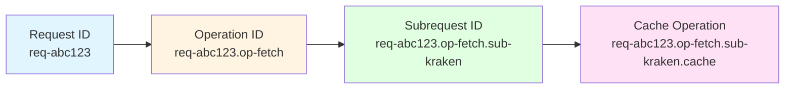
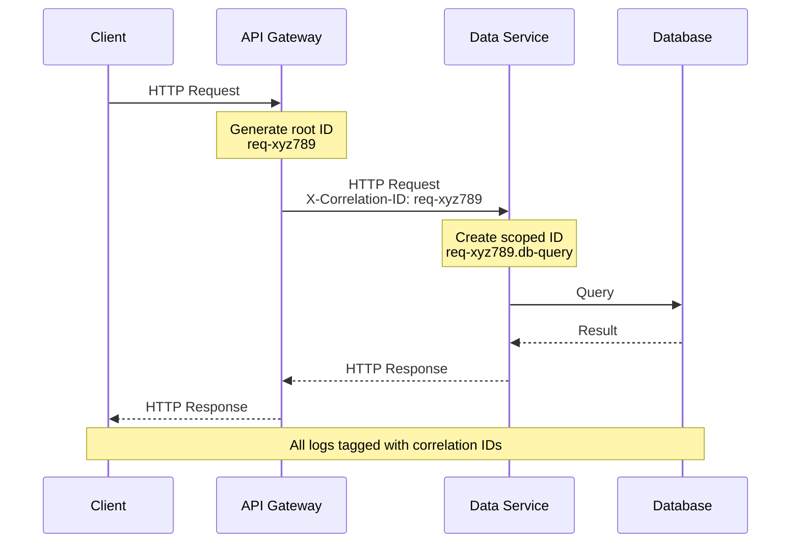

# Service Framework: Diagnostic Interface

## Introduction

The diagnostic interface represents a critical component of the service framework, providing structured logging capabilities with hierarchical correlation identifier support for distributed request tracing. This subsystem addresses the challenge of correlating log entries across asynchronous operations and multiple service boundaries within the distributed trading system architecture.

Modern distributed systems generate vast quantities of log data from multiple concurrent processes. Without proper correlation mechanisms, reconstructing the complete flow of individual requests across service boundaries becomes computationally expensive and operationally impractical. The diagnostic interface solves this problem through hierarchical correlation identifiers that enable efficient log filtering and request trace reconstruction.

## Structured Logging

Structured logging replaces traditional string-based log messages with structured data representations that facilitate automated parsing, filtering, and analysis. Each log entry comprises:

- **Timestamp**: ISO 8601 formatted timestamp with millisecond precision
- **Severity Level**: Hierarchical severity classification (debug, info, warn, error, fatal)
- **Message**: Human-readable description of the logged event
- **Correlation Context**: Diagnostic identifier chain linking related operations
- **Structured Fields**: Key-value pairs providing event-specific metadata

The logger interface exposes methods corresponding to severity levels, accepting message strings and optional structured field objects:

```typescript
interface Logger {
  debug(message: string, fields?: Record<string, unknown>): void;
  info(message: string, fields?: Record<string, unknown>): void;
  warn(message: string, fields?: Record<string, unknown>): void;
  error(message: string, fields?: Record<string, unknown>): void;
  fatal(message: string, fields?: Record<string, unknown>): void;
  
  createChild(correlationId: string): Logger;
}
```

The `createChild` method produces a new logger instance that inherits the parent's correlation context and appends the provided identifier, enabling hierarchical tracing of operation flows.

### Severity Level Hierarchy

Log severity levels enable filtering based on operational requirements and environmental contexts:

**Debug**: Detailed diagnostic information useful during development and troubleshooting. Debug logs typically contain variable values, execution paths, and detailed state information. Production environments typically filter debug messages to reduce storage costs and improve log processing performance.

**Info**: Informational messages that highlight the progress of the application at a coarse-grained level. Info messages capture significant business events such as request initiation, completion of major operations, and successful external service interactions.

**Warn**: Potentially harmful situations that do not prevent operation continuation but warrant attention. Warning messages capture degraded performance, fallback behavior activation, and approaching resource limits.

**Error**: Error events that might still allow the application to continue running. Error messages capture failed external service calls, invalid input data, and recoverable exceptions that can be handled without process termination.

**Fatal**: Severe error events that will presumably lead to application abort. Fatal messages capture unrecoverable errors such as missing required configuration, unavailable critical dependencies, and corrupted internal state requiring process restart.

### Structured Field Conventions

The framework establishes conventions for structured field naming and typing to ensure consistency across services:

**Temporal Fields**: Duration measurements employ millisecond precision numeric values with `_ms` suffix (e.g., `duration_ms`, `timeout_ms`).

**Identity Fields**: Resource identifiers use descriptive names with `_id` suffix (e.g., `user_id`, `order_id`, `correlation_id`).

**Classification Fields**: Categorical values employ string types with enumerated value sets (e.g., `source: 'binance' | 'kraken'`, `status: 'success' | 'failure'`).

**Quantitative Fields**: Measurement values include unit suffixes where ambiguity exists (e.g., `price_usd`, `volume_btc`, `memory_bytes`).

These conventions enable automated log analysis tools to correctly interpret field semantics without service-specific configuration.

## Correlation Identifier Generation

Distributed systems require correlation mechanisms to trace request flows across service boundaries. The framework provides scoped correlation identifier generation that creates hierarchical identifier chains representing execution context:



**Figure 1:** Hierarchical correlation identifier chain representing nested operation contexts within a single request flow.

The correlation identifier generator provides methods for creating root identifiers and deriving scoped identifiers:

```typescript
interface CorrelationIdGenerator {
  generateRootId(): string;
  createScopedId(parentId: string, scope: string): string;
  extractRootId(scopedId: string): string;
}
```

Root identifiers employ collision-resistant generation strategies such as UUID v4 or timestamp-based schemes with random suffixes. Scoped identifiers concatenate parent identifiers with scope descriptors using delimiter characters, enabling reconstruction of operation hierarchies from log data.

### Identifier Generation Strategies

The framework supports multiple identifier generation strategies with different trade-offs:

**UUID v4**: Cryptographically random 128-bit identifiers providing collision resistance across distributed systems without coordination. UUID v4 identifiers consume 36 characters in string representation, making them verbose in log output.

**Timestamp-based**: Millisecond-precision timestamps combined with random suffixes provide chronologically sortable identifiers with collision resistance within single processes. Timestamp-based identifiers enable temporal analysis of log data while maintaining compact representation.

**Sequential**: Monotonically increasing integers provide minimal storage overhead and enable efficient database indexing. Sequential identifiers require coordination mechanisms in distributed deployments to prevent collisions across multiple process instances.

The framework defaults to UUID v4 for root identifier generation due to its distribution-friendly properties and zero-configuration deployment model.

### Correlation Propagation Across Services

Distributed request tracing requires propagating correlation identifiers across service boundaries through HTTP headers and message queue metadata:



**Figure 2:** Correlation identifier propagation through HTTP headers across service boundaries, enabling end-to-end request tracing.

The API gateway generates root correlation identifiers for incoming requests and includes them in the `X-Correlation-ID` HTTP header when invoking downstream services. Each service creates scoped identifiers for internal operations while preserving the root identifier for cross-service correlation.

## Integration with Application Code

Services receive logger instances during initialization and propagate them through operation call chains. Asynchronous operations create child loggers with operation-specific scopes:

```typescript
async function processMarketData(message: MarketDataMessage, logger: Logger) {
  const operationLogger = logger.createChild('process-market-data');
  
  operationLogger.info('Processing market data message', {
    source: message.source,
    symbol: message.symbol,
    messageType: message.type
  });
  
  const validationResult = await validateMessage(message, operationLogger);
  const persistenceResult = await persistMessage(message, operationLogger);
  
  operationLogger.info('Market data processing complete', {
    duration: validationResult.duration + persistenceResult.duration
  });
}
```

Each nested operation receives a child logger, automatically inheriting the correlation context. Log aggregation systems can filter entries by correlation identifiers to reconstruct complete request traces across service boundaries and asynchronous operations.

### Diagnostic Context in Error Handling

Error handling logic benefits from diagnostic context propagation, enabling detailed error reports with full operational context:

```typescript
async function fetchMarketData(symbol: string, logger: Logger) {
  const fetchLogger = logger.createChild('fetch-market-data');
  
  try {
    fetchLogger.info('Initiating market data fetch', { symbol });
    
    const response = await externalAPI.fetch(symbol);
    
    fetchLogger.info('Market data fetch successful', { 
      symbol, 
      recordCount: response.data.length 
    });
    
    return response.data;
  } catch (error) {
    fetchLogger.error('Market data fetch failed', {
      symbol,
      errorMessage: error.message,
      errorCode: error.code,
      retryable: isRetryableError(error)
    });
    
    throw error;
  }
}
```

Error logs include both the correlation identifier chain and structured error information, enabling rapid diagnosis of failure scenarios by filtering logs to the specific failed operation.

### Diagnostic Integration with Metrics

The diagnostic context integrates with the metrics subsystem to correlate metric observations with log entries. When metrics exhibit anomalous behavior, operators can identify the correlation identifiers associated with affected requests and retrieve detailed log traces:

```typescript
async function handleRequest(request: Request, context: ServiceContext) {
  const requestId = context.diagnosticContext.generateRootId();
  const requestLogger = context.diagnosticContext.createLogger(requestId);
  
  const requestTimer = context.metricsContext.requestDuration.startTimer();
  
  try {
    requestLogger.info('Request received', {
      method: request.method,
      path: request.path
    });
    
    const result = await processRequest(request, requestLogger);
    
    context.metricsContext.requestCount.inc({ 
      method: request.method, 
      status: 200 
    });
    
    requestLogger.info('Request completed', { 
      status: 200,
      duration_ms: requestTimer()
    });
    
    return result;
  } catch (error) {
    context.metricsContext.requestCount.inc({ 
      method: request.method, 
      status: 500 
    });
    
    requestLogger.error('Request failed', {
      errorMessage: error.message,
      duration_ms: requestTimer()
    });
    
    throw error;
  }
}
```

This integration pattern ensures that operators can transition seamlessly from high-level metric dashboards to detailed log traces when investigating operational issues.

## Log Output Formats

The diagnostic subsystem supports multiple output formats to accommodate different operational requirements:

**JSON Format**: Structured JSON objects with fields for timestamp, severity, message, correlation ID, and additional structured fields. JSON format facilitates automated parsing by log aggregation systems and enables efficient filtering and analysis.

**Human-Readable Format**: Formatted text output optimized for direct console reading during development. Human-readable format includes color-coded severity indicators and aligned field columns for improved readability.

**Structured Text Format**: Key-value pair representation compatible with traditional log parsing tools while maintaining structured field semantics. Structured text format balances human readability with machine parseability.

The framework selects output format based on execution environment detection (interactive terminal vs. containerized deployment) or explicit configuration.

## Performance Considerations

Structured logging introduces computational overhead compared to simple string concatenation. The diagnostic subsystem employs several optimization strategies:

**Lazy Field Evaluation**: Structured field serialization is deferred until log entries pass severity filtering. Debug messages with expensive field calculations are not serialized in production environments where debug logging is disabled.

**Buffered Output**: Log entries are batched and written asynchronously to prevent I/O operations from blocking request handling. Buffer flush occurs at configurable intervals or when buffer capacity thresholds are reached.

**Sampling**: High-frequency operations can employ sampling strategies to reduce log volume while maintaining statistical representativeness. The framework supports configurable sampling rates based on operation type and severity level.

These optimizations ensure that comprehensive diagnostic instrumentation does not significantly impact application performance under production workloads.

## Conclusion

The diagnostic interface provides essential observability capabilities for distributed service architectures through structured logging and hierarchical correlation identifiers. By standardizing logging interfaces and correlation mechanisms across services, the framework enables efficient troubleshooting and operational analysis of complex distributed request flows. The integration between diagnostic context and metrics systems creates a comprehensive observability foundation supporting both real-time monitoring and historical analysis of system behavior.

