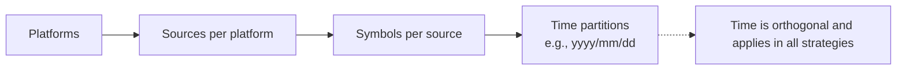
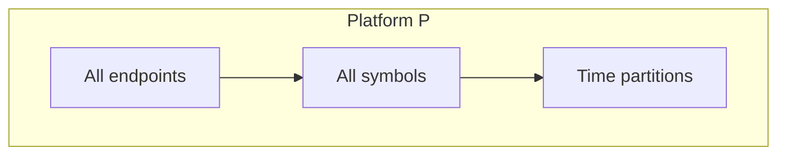
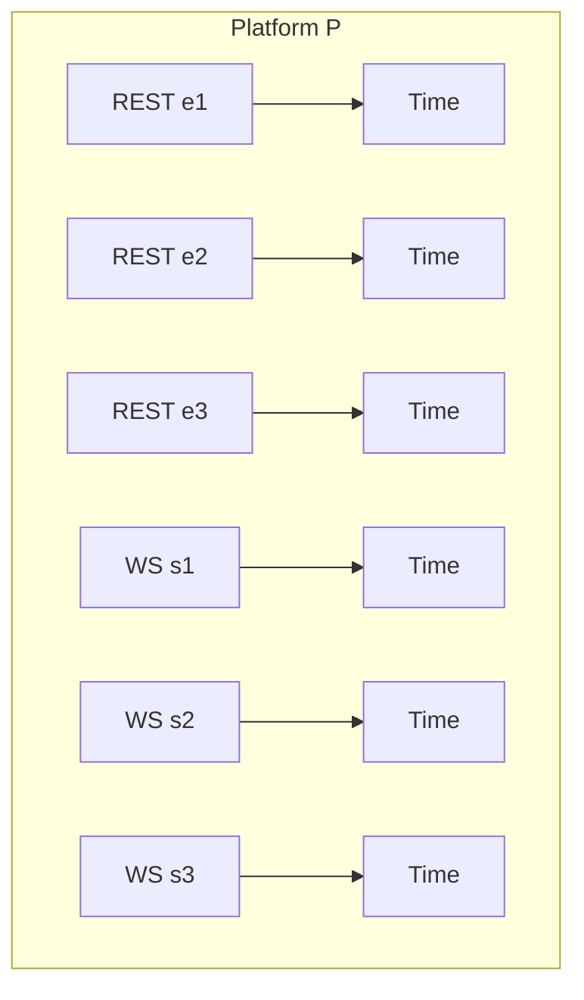
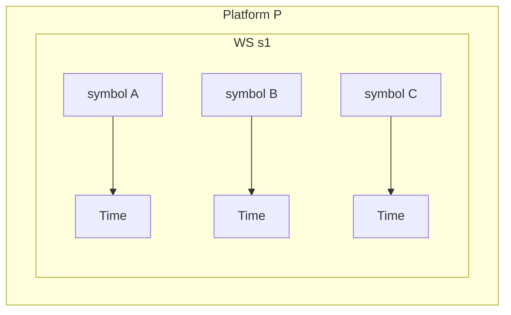

## External Bridge: Partitioning of Raw Data

This section compares partitioning strategies for the raw, exchange-native datasets described in `001_introduction.md`. The goal is to balance fidelity, replay determinism, operational scalability, and storage/retention costs.

### Expected Scale (Assumptions)

- 5 platforms
- ~1000 symbols per platform
- ~3 REST endpoints and ~3 WebSocket sources per platform (≈ 6 total sources per platform)

These figures inform the approximate partition cardinalities and operational considerations below.

### Strategy A: Per Platform

Partitioning key: `platform/` with time-based subpartitions.

- Cardinality: ≈ 5 partitions (plus time)
- Contents: all endpoints and symbols co-located per platform

Advantages:
- Cohesive platform-level lineage and simple retention at platform granularity.
- Minimal directory/object proliferation; efficient bulk backup.

Trade-offs:
- High write/read contention; large file/object counts per partition.
- Expensive selective replays (per endpoint/symbol filtering required at read).
- Exactly-once and in-order delivery must manage interleaved sources and symbols.

### Strategy B: Per Platform + Endpoint/WebSocket

Partitioning key: `platform/source` where source ∈ {REST endpoints, WS feeds}, with time-based subpartitions.

- Cardinality: ≈ 5 × 6 = 30 partitions (plus time)
- Contents: all symbols for a given source grouped together

Advantages:
- Reduces contention across heterogeneous sources; targeted retention per source.
- Simplifies replay/backfill for a single feed (e.g., diff-depth vs partial-depth).
- Smaller per-partition indices improve ordered, exactly-once delivery within a source.

Trade-offs:
- Still aggregates ~1000 symbols per partition; selective per-symbol replays require filtering.
- Object count remains moderate; listing overhead manageable but non-trivial.

### Strategy C: Per Platform + Endpoint/WebSocket + Symbol

Partitioning key: `platform/source/symbol` with time-based subpartitions.

- Cardinality: ≈ 5 × 6 × 1000 = 30,000 partitions (plus time)
- Contents: single symbol per source per platform

Advantages:
- Fine-grained replay/backfill and retention at symbol-level.
- Minimal interleaving: in-order and exactly-once semantics are simpler per stream.
- Hotspot isolation; parallelism scales with symbol cardinality.

Trade-offs:
- High partition/object proliferation; listing and small-file overhead significant.
- Backup and lifecycle policies become complex without additional bucketing.
- Requires compaction/rollup or batching to amortize per-file latency.

### Operational Comparison (Summary)

- Per platform: lowest complexity, poorest selectivity; best for coarse analytics and bulk archival, weakest for symbol-targeted replay.
- Per platform + endpoint/websocket: balanced; good source-level isolation and manageable object counts; symbol-level replays require filtering or indexing.
- Per platform + endpoint + symbol: best selectivity and replay control; highest operational overhead; demands careful batching, prefix-bucketing, and lifecycle tuning.

### Practical Guidance

- Treat time as an orthogonal subpartition in all strategies (e.g., `yyyy/mm/dd/HH`).
- Default to Per platform + endpoint/websocket, adding light symbol bucketing when necessary (e.g., prefix buckets `sy=bt|et|xr/...`) to cap directory fan-out.
- For ultra-high-throughput symbols, selectively promote to full per-symbol partitions.
- Employ compaction to reduce small-file proliferation and improve sequential replays.

