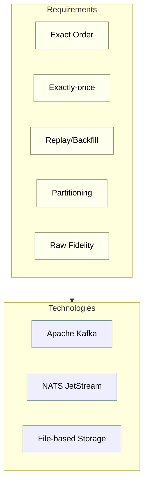
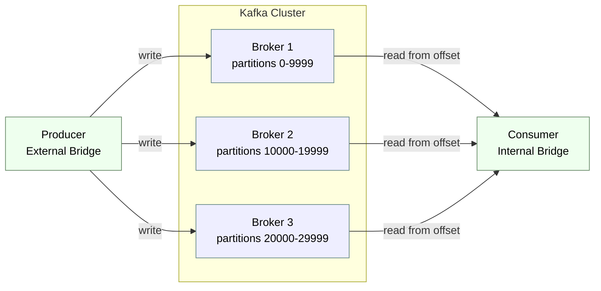
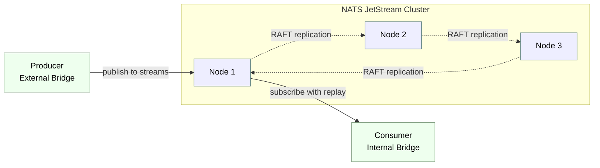
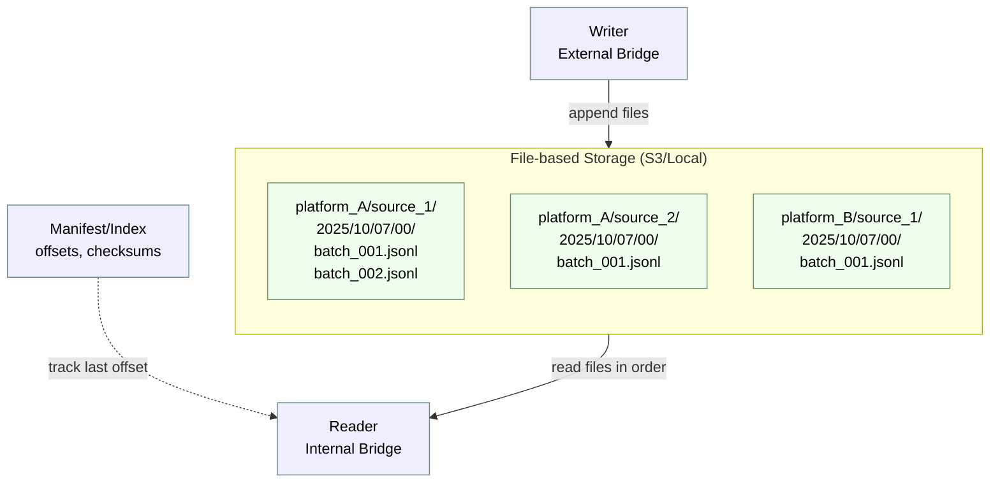
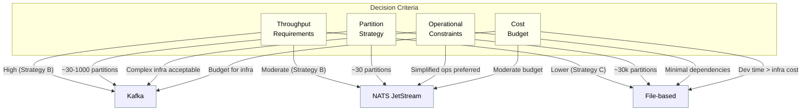

## External Bridge: Technology Comparison

This section evaluates three distinct approaches for implementing the external bridge storage and delivery layer described in `001_introduction.md`, considering the partitioning strategies outlined in `002_partition.md`. Each technology is assessed against the core requirements: exact ordering, exactly-once delivery, deterministic replay, and operational fit for the expected scale (5 platforms, ~1000 symbols each, multiple sources per platform).

### Requirements Recap

From `001_introduction.md`, the external bridge must provide:

1. **Exact order**: messages delivered in canonical, source-defined sequence
2. **Exactly-once semantics**: deduplication within consumer sessions
3. **Reread/backfill capability**: deterministic replay from time ranges or offsets
4. **Raw fidelity**: preservation of exchange-native formats
5. **Partitioning support**: efficient isolation per platform, source, or symbol

From `002_partition.md`, the system must accommodate:

- Moderate partition cardinality (5–30,000 depending on strategy)
- Time-based subpartitioning (e.g., `yyyy/mm/dd`)
- Selective replay at various granularities
- Retention policies per partition or partition group

### Technology A: Apache Kafka

Apache Kafka is a distributed streaming platform designed for high-throughput, durable, ordered message delivery. It organizes data into topics partitioned across brokers, with consumer groups managing offset tracking.

#### Alignment with Requirements

**Exact order**: Kafka guarantees message order within a partition. To preserve source ordering, each logical stream (e.g., per platform+source+symbol) maps to a dedicated partition or sub-partition key. For Strategy C (per symbol), this yields ~30,000 Kafka partitions; for Strategy B, ~30 partitions suffice.

**Exactly-once**: Kafka supports exactly-once semantics (EOS) through idempotent producers and transactional reads, ensuring deduplication and atomic commits. The internal bridge consumes with `isolation.level=read_committed` and tracks offsets transactionally.

**Reread/backfill**: Kafka consumers can seek to arbitrary offsets or timestamps. Log compaction and retention policies enable bounded or indefinite retention per topic. Time-based indexing allows efficient backfill queries.

**Partitioning**: Kafka's native partition model aligns well with Strategy B (per platform+source). For Strategy C (per symbol), the high partition count approaches operational limits (default broker configurations handle thousands of partitions, but metadata overhead grows).

**Raw fidelity**: Kafka treats messages as opaque byte arrays; exchange-native formats are preserved without transformation.

#### Operational Considerations

- **Scalability**: Proven at scale; handles millions of messages/second. Multi-broker clusters provide fault tolerance and load distribution.
- **Retention management**: Per-topic retention policies (time-based or size-based). Log segments support efficient purging and compaction.
- **Operational complexity**: Requires ZooKeeper (or KRaft mode in newer versions), broker tuning, rebalancing coordination, and monitoring. Partition proliferation (Strategy C) increases metadata overhead and rebalance latency.
- **Ecosystem maturity**: Extensive tooling (Kafka Connect, Schema Registry, monitoring integrations) and broad adoption in financial/market-data domains.

#### Fit Assessment

- **Best for**: Strategy B (per platform+source); moderate partition counts with high throughput per partition.
- **Viable for**: Strategy C if partition count is managed (e.g., bucketing symbols into sub-topics).
- **Trade-offs**: Operational overhead and infrastructure cost; overkill for low-throughput scenarios or local/single-node deployments.

---

### Technology B: NATS JetStream

NATS JetStream extends the lightweight NATS messaging system with persistent streams, message replay, and consumer acknowledgment semantics. It is designed for cloud-native, distributed systems with simpler operational models than Kafka.

#### Alignment with Requirements

**Exact order**: JetStream streams guarantee message order within a stream. Each logical source (platform+source or platform+source+symbol) maps to a distinct stream. Unlike Kafka, JetStream does not impose partition-level ordering constraints; ordering is stream-global, simplifying single-stream replay.

**Exactly-once**: JetStream provides at-least-once delivery by default. Exactly-once semantics require application-level deduplication using message identifiers and idempotent processing. Consumer acknowledgments (with redelivery limits and ack-wait policies) mitigate duplicates but do not guarantee EOS natively.

**Reread/backfill**: Consumers can replay streams from arbitrary sequence numbers or timestamps. Retention policies (limits, interest-based, or work-queue modes) control stream lifecycle. Snapshot-based recovery supports fast consumer initialization.

**Partitioning**: JetStream streams are the natural partition boundary. For Strategy B, ~30 streams suffice. For Strategy C, ~30,000 streams are feasible but approach practical limits (stream metadata overhead, connection pooling, and monitoring complexity increase).

**Raw fidelity**: Messages are stored as opaque payloads; exchange-native formats are preserved.

#### Operational Considerations

- **Scalability**: JetStream handles moderate-to-high throughput with lower resource footprint than Kafka. Clustering (RAFT-based) supports multi-node fault tolerance, but maximum streams/cluster and per-stream throughput are lower than Kafka's partition throughput.
- **Retention management**: Per-stream policies (message count, byte limits, or age-based). Discard policies (old/new) and explicit purging support bounded retention.
- **Operational complexity**: Simpler than Kafka; no external dependencies (no ZooKeeper). Configuration and monitoring are streamlined, but tooling maturity lags Kafka's ecosystem.
- **Ecosystem maturity**: Growing adoption in microservices and edge use cases; fewer integrations than Kafka, but sufficient for bespoke market-data pipelines.

#### Fit Assessment

- **Best for**: Strategy B (per platform+source); low-to-moderate partition counts with simplified operations.
- **Viable for**: Strategy C if stream count is acceptable and application-level deduplication is implemented.
- **Trade-offs**: Weaker exactly-once guarantees; requires custom deduplication logic. Lower maximum throughput per stream compared to Kafka partitions.

---

### Technology C: File-based Storage with Indexed Metadata

A file-based approach stores raw messages as structured files (e.g., JSON Lines, Parquet, or binary blobs) organized by partition hierarchy (`platform/source/symbol/yyyy/mm/dd/`), with separate index files or embedded metadata enabling offset-based replay and ordering guarantees.

#### Alignment with Requirements

**Exact order**: Files are written in append-only fashion with monotonic sequence numbers or timestamps. Ordering is enforced by file naming (lexicographic sort) and intra-file line/record ordering. Readers replay files in canonical order, using index metadata to resume from offsets.

**Exactly-once**: Application-controlled; the external bridge maintains an offset ledger (e.g., in a lightweight database or manifest file) tracking the last delivered offset per consumer session. Deduplication relies on stable message identifiers embedded in payloads.

**Reread/backfill**: Direct file access enables efficient range queries. Time partitioning (`yyyy/mm/dd/HH`) supports coarse-grained backfills, while offset indexes enable fine-grained resumption. Manifest files (listing files, offsets, and checksums) facilitate deterministic replay.

**Partitioning**: File hierarchy naturally implements any partitioning strategy. Strategy B yields moderate directory counts; Strategy C yields high file/directory proliferation but isolates symbols cleanly. Compaction and rollup mechanisms mitigate small-file overhead.

**Raw fidelity**: Files store exchange-native payloads without transformation; metadata (source, timestamp, offset) is co-located in envelope fields or sidecar files.

#### Operational Considerations

- **Scalability**: Horizontal scaling via sharding (distribute partitions across storage nodes). Throughput bounded by filesystem I/O and object store API limits. Read-heavy workloads benefit from caching and parallel reads.
- **Retention management**: Lifecycle policies (e.g., S3 lifecycle rules, cron-based purges) applied at partition/time granularity. Compaction (merge small files, prune old data) reduces storage cost and improves scan efficiency.
- **Operational complexity**: Minimal infrastructure dependencies; no broker cluster or coordination layer. Complexity shifts to application logic (offset tracking, ordering, deduplication). Monitoring and alerting require custom instrumentation.
- **Ecosystem maturity**: Generic; integrates with any storage backend (local disk, NFS, S3, GCS). Lacks purpose-built tooling but benefits from standard file/object-store ecosystems (compression, encryption, replication).

#### Fit Assessment

- **Best for**: Strategy C (per symbol); fine-grained partitioning with minimal infrastructure. Also suitable for archival/cold-storage workloads with infrequent replay.
- **Viable for**: Strategy B if file counts remain manageable. Strategy A if simplicity and auditability outweigh replay performance.
- **Trade-offs**: Requires custom offset tracking and ordering logic. Higher development effort; fewer off-the-shelf guarantees. Performance sensitive to filesystem/object-store characteristics.

---

### Comparative Summary

| Criterion | Kafka | NATS JetStream | File-based |
|-----------|-------|----------------|------------|
| **Exact Order** | Native per partition | Native per stream | Application-enforced via file order |
| **Exactly-once** | Native (transactional) | Application-level deduplication | Application-level deduplication |
| **Replay/Backfill** | Offset/timestamp seek | Sequence/timestamp seek | File range queries + offset ledger |
| **Partitioning** | Native; optimal for Strategy B | Native; suitable for Strategy B | Filesystem hierarchy; flexible |
| **Max Partitions** | Thousands (metadata overhead) | Hundreds-to-thousands | Unlimited (limited by FS/object store) |
| **Throughput** | Very high (millions msg/s) | Moderate-to-high | Moderate (bounded by I/O) |
| **Operational Complexity** | High (brokers, ZK/KRaft, tuning) | Medium (RAFT cluster, simpler config) | Low (no cluster; custom logic required) |
| **Infrastructure** | Multi-broker cluster | NATS cluster | Storage backend (local/S3/GCS) |
| **Ecosystem Maturity** | Mature; extensive tooling | Growing; fewer integrations | Generic; relies on storage ecosystem |
| **Cost** | Infrastructure + operational overhead | Lower infrastructure; simpler ops | Storage cost only; dev effort higher |

### Practical Recommendation

- **Kafka**: preferred for high-throughput, production-grade deployments with Strategy B (per platform+source) or managed Strategy C (bucketed symbols). Suitable when operational expertise and infrastructure budget are available, and ecosystem integrations (monitoring, connectors) provide value.

- **NATS JetStream**: preferred for moderate-throughput scenarios with simplified operational requirements. Best for Strategy B; requires application-level exactly-once logic. Attractive for cloud-native architectures with lower infrastructure overhead.

- **File-based**: preferred for fine-grained partitioning (Strategy C) with minimal infrastructure dependencies, or for archival/research workloads where deterministic replay and auditability outweigh real-time throughput. Shifts complexity from infrastructure to application logic, suitable when development resources exceed operational budget.

For a research-oriented system (e.g., thesis prototype or backtesting platform), the file-based approach offers maximal control, transparency, and cost efficiency, at the expense of implementing custom ordering and offset semantics. For production market-data ingestion at scale, Kafka provides battle-tested guarantees and tooling. NATS JetStream occupies the middle ground, balancing operational simplicity with moderate performance and nascent but growing ecosystem support.

