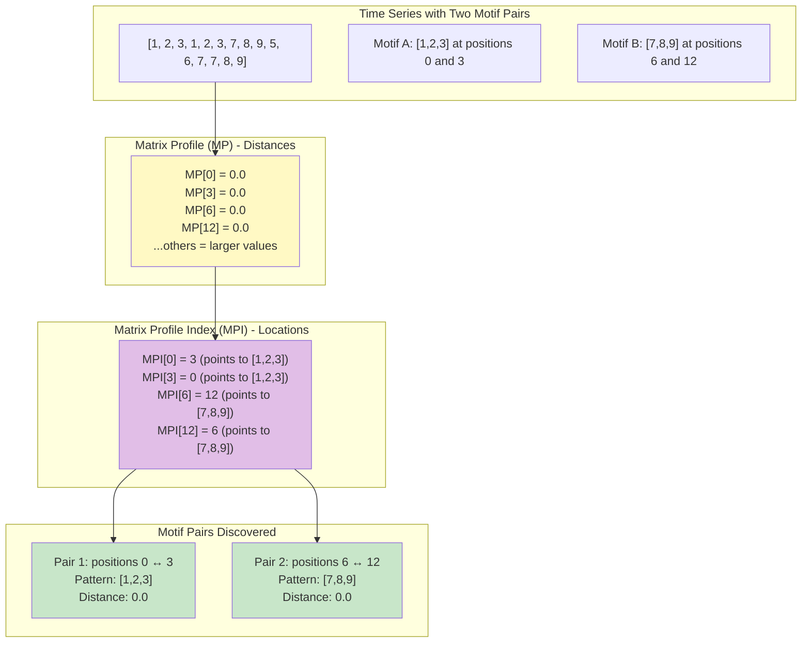
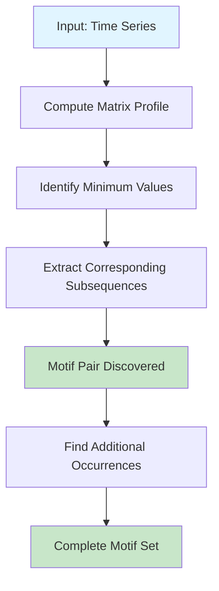

# Introduction to Motifs and Matrix Profiles

Not part of current analysis!

## What Are Motifs?

In time series analysis, a **motif** is a recurring pattern that appears multiple times within a time series or across different time series. These patterns represent similar behaviors or events that occur repeatedly, even if they are not perfectly identical. Motifs are valuable because they can reveal:

- Periodic behaviors in industrial processes
- Repeated patterns in financial markets
- Recurring physiological signals in medical data
- Similar behavioral patterns in sensor data

For example, in heart rate monitoring, a motif might represent a consistent pattern that occurs during physical exercise. In financial data, a motif could be a price movement pattern that repeats before significant market events.

## What Are Matrix Profiles?

The **matrix profile** is a data structure that efficiently stores similarity information for all subsequences within a time series. Introduced by Yeh et al. (2016), it revolutionized time series data mining by providing a unified framework for various analytical tasks.

For a time series of length *n* and a subsequence length *m*, the matrix profile is fundamentally defined as:

**Matrix Profile (MP)**: A vector of length *n - m + 1* where each element MP[i] represents the z-normalized Euclidean distance between subsequence T(i,m) and its nearest neighbor in the time series.

In practice, most matrix profile implementations also maintain a companion array:

**Matrix Profile Index (MPI)**: A vector of length *n - m + 1* where each element MPI[i] stores the position j of the nearest neighbor for subsequence i.

As noted in the MOMP paper (Keogh et al.), "Most MP algorithms only look at the subsequence distances, i.e. the MP itself. However, some MP algorithms, such as the FLOSS algorithm consider the topological information in the Matrix Profile Index." The MPI is not strictly necessary for finding the top motif (you could find the minimum in MP and then search for its match), but storing it makes the process much more efficient and enables additional algorithms that exploit the topological structure.

### Understanding "Distance to Nearest Neighbor"

To understand what this means, consider a time series and a subsequence length *m*. At each position *i* in the time series, we can extract a subsequence of length *m*. The matrix profile at position *i* answers two questions:

1. **MP[i]**: "What is the smallest distance from this subsequence to any other non-overlapping subsequence?" (the distance)
2. **MPI[i]**: "Where is that nearest neighbor located?" (the position)

More specifically, for each position *i*:

1. **Extract a subsequence**: Starting at position *i*, take *m* consecutive data points
2. **Compare with all others**: Calculate the distance between this subsequence and every other possible subsequence in the time series
3. **Exclude trivial matches**: Ignore the subsequence itself and nearby overlapping subsequences (within an exclusion zone)
4. **Store the minimum**: The matrix profile at position *i* stores the smallest distance found
5. **Store the location**: The matrix profile index at position *i* stores where that minimum was found

This seemingly simple structure enables efficient motif discovery, anomaly detection, and pattern recognition.

### Visual Example with MP and MPI

Consider a time series with two different repeated patterns:

**Time Series**: `[1, 2, 3, 1, 2, 3, 7, 8, 9, 5, 6, 7, 7, 8, 9]` (length = 15)  
**Subsequence length**: *m* = 3



**Complete Matrix Profile Arrays**:

| Position | Subsequence | MP (Distance) | MPI (Points to) | Interpretation |
|----------|-------------|---------------|-----------------|----------------|
| 0 | [1, 2, 3] | 0.0 | 3 | Matches [1,2,3] at position 3 |
| 1 | [2, 3, 1] | ~3.5 | varies | No close match |
| 2 | [3, 1, 2] | ~3.5 | varies | No close match |
| 3 | [1, 2, 3] | 0.0 | 0 | Matches [1,2,3] at position 0 |
| 4 | [2, 3, 7] | ~3.2 | varies | No close match |
| 5 | [3, 7, 8] | ~2.8 | varies | No close match |
| 6 | [7, 8, 9] | 0.0 | 12 | Matches [7,8,9] at position 12 |
| 7 | [8, 9, 5] | ~4.1 | varies | No close match |
| ... | ... | ... | ... | ... |
| 12 | [7, 8, 9] | 0.0 | 6 | Matches [7,8,9] at position 6 |

**Key Insight**: Even though both MP[0] and MP[6] have the same value (0.0), the MPI array tells us they point to completely different matches:
- Position 0's nearest neighbor is at position 3 (the pattern [1,2,3])
- Position 6's nearest neighbor is at position 12 (the pattern [7,8,9])

This is how we distinguish between multiple motif pairs that all have similar distances!

### Answering the Question: How Do We Find Actual Matches?

To answer your specific question: **Yes, every subsequence is compared to every other subsequence**, and the matrix profile stores the minimum distance at each position. When multiple positions have distance ~0, we use the **Matrix Profile Index** to distinguish them:

**The Algorithm**:
1. Find all positions in MP where distance ≈ 0 (or find the global minimum)
2. For each such position *i*, look up MPI[i] to find its nearest neighbor at position *j*
3. The pair (*i*, *j*) represents one motif pair
4. Verify that the relationship is mutual: MPI[j] should point back to *i*

**Example**:
```
MP[0] = 0.0, MPI[0] = 3  →  Position 0 matches position 3
MP[3] = 0.0, MPI[3] = 0  →  Position 3 matches position 0
                            These form Motif Pair #1

MP[6] = 0.0, MPI[6] = 12  →  Position 6 matches position 12  
MP[12] = 0.0, MPI[12] = 6  →  Position 12 matches position 6
                             These form Motif Pair #2
```

Without the MPI array, we would only know that positions 0, 3, 6, and 12 all have perfect matches, but we wouldn't know which ones are paired together. The MPI array provides the critical linking information.

### Can Motifs Have More Than 2 Occurrences?

**Yes!** The matrix profile fundamentally finds the **Top-1 motif pair** - the two subsequences with the smallest mutual distance. However, a motif pattern can occur **3, 4, 5, or more times** in a time series.

After finding the Top-1 motif pair, you can find additional occurrences of that pattern by:

1. **Search for similar subsequences**: Compute the distance from one of the motif pair subsequences to all other subsequences
2. **Apply a threshold**: Any subsequence within a certain distance threshold can be considered another occurrence
3. **Exclude already found motifs**: Mark the positions you've found and continue searching for the next motif

Different motif definitions exist:

- **Top-K motifs**: Find the K best pairs of subsequences
- **Range motifs**: Find all subsequence pairs within a distance threshold
- **Motif sets**: Find all occurrences of a pattern (e.g., a pattern appearing 5 times)
- **Consensus motifs**: Find patterns that appear across multiple time series

As noted in the MOMP paper: *"Given the MP, and possibly a few additional calls to the Distance Profile, it is possible to compute any meaningful motif definition that currently exists or could exist, including top-K motifs, range motifs, motif sets etc."*

The choice of motif definition depends on your application and what you're trying to discover in the data.

### Why This Matters

This representation has powerful implications:

- **Low values** → The subsequence has a similar match somewhere else (potential motif)
- **High values** → The subsequence is unique or unusual (potential anomaly/discord)
- **Global minimum** → The most similar pair of subsequences (top motif)
- **Local minima** → Additional motif candidates

### Key Properties

The matrix profile has several important properties:

1. **Parameter-free**: Unlike many pattern discovery methods, the matrix profile requires minimal parameter tuning
2. **Exact**: It provides exact answers, not approximations
3. **Efficient**: Modern algorithms can compute it in near-linear time
4. **Versatile**: It supports multiple time series mining tasks simultaneously

## How Matrix Profiles Enable Motif Discovery

The matrix profile enables motif discovery through its fundamental characteristic: **low values in the matrix profile indicate subsequences that have close matches elsewhere in the time series**. The process works as follows:



The algorithm:

1. **Compute distances**: For each subsequence, find the distance to its nearest neighbor
2. **Store minimum distances**: The matrix profile stores only the smallest distance for each position
3. **Identify motifs**: The global minimum in the matrix profile indicates the most similar pair of subsequences
4. **Exclude trivial matches**: Self-matches and overlapping matches are excluded using an exclusion zone

## Simple Python Example

The following example demonstrates the core concepts of matrix profile computation without using specialized libraries. This simplified implementation illustrates the fundamental principles:

```python
def euclidean_distance(seq1, seq2):
    """Calculate Euclidean distance between two sequences."""
    return sum((a - b) ** 2 for a, b in zip(seq1, seq2)) ** 0.5

def z_normalize(sequence):
    """Normalize sequence to zero mean and unit variance."""
    mean = sum(sequence) / len(sequence)
    variance = sum((x - mean) ** 2 for x in sequence) / len(sequence)
    std = variance ** 0.5
    if std == 0:
        return [0] * len(sequence)
    return [(x - mean) / std for x in sequence]

def matrix_profile_simple(time_series, m, exclusion_zone=2):
    """
    Compute a simplified matrix profile.
    
    Parameters:
    - time_series: The input time series
    - m: Subsequence length (motif length)
    - exclusion_zone: Minimum distance between motif occurrences
    
    Returns:
    - matrix_profile: Distance to nearest neighbor for each position
    - profile_index: Index of nearest neighbor for each position
    """
    n = len(time_series)
    matrix_profile = [float('inf')] * (n - m + 1)
    profile_index = [-1] * (n - m + 1)
    
    # For each subsequence
    for i in range(n - m + 1):
        subseq_i = time_series[i:i + m]
        subseq_i_norm = z_normalize(subseq_i)
        
        # Compare with all other subsequences
        for j in range(n - m + 1):
            # Skip self-matches and trivial matches (exclusion zone)
            if abs(i - j) < exclusion_zone:
                continue
            
            subseq_j = time_series[j:j + m]
            subseq_j_norm = z_normalize(subseq_j)
            
            # Calculate distance
            distance = euclidean_distance(subseq_i_norm, subseq_j_norm)
            
            # Update if this is the nearest neighbor so far
            if distance < matrix_profile[i]:
                matrix_profile[i] = distance
                profile_index[i] = j
    
    return matrix_profile, profile_index

def find_top_motif(matrix_profile, profile_index):
    """Find the top motif pair (most similar subsequences)."""
    min_dist = min(matrix_profile)
    motif_idx = matrix_profile.index(min_dist)
    motif_neighbor_idx = profile_index[motif_idx]
    
    return motif_idx, motif_neighbor_idx, min_dist

# Example usage
if __name__ == "__main__":
    # Create a time series with TWO different repeated patterns
    time_series = [
        1.0, 2.0, 3.0,           # Pattern A - first occurrence
        5.0, 6.0, 7.0,           # Pattern B - first occurrence  
        1.1, 2.0, 3.1,           # Pattern A - second occurrence (with noise)
        8.0, 9.0,                # Noise
        5.0, 6.1, 7.0            # Pattern B - second occurrence (with noise)
    ]
    
    motif_length = 3
    
    # Compute matrix profile
    mp, mp_idx = matrix_profile_simple(time_series, motif_length)
    
    print("Matrix Profile (MP) - Distances:")
    for i, dist in enumerate(mp):
        print(f"  Position {i}: {dist:.4f}")
    
    print("\nMatrix Profile Index (MPI) - Points to:")
    for i, idx in enumerate(mp_idx):
        if idx >= 0:
            print(f"  Position {i} → Position {idx}")
    
    # Find top motif
    idx1, idx2, distance = find_top_motif(mp, mp_idx)
    
    print(f"\n=== Top Motif Pair ===")
    print(f"Positions: {idx1} ↔ {idx2}")
    print(f"Distance: {distance:.4f}")
    print(f"Motif at position {idx1}: {time_series[idx1:idx1 + motif_length]}")
    print(f"Motif at position {idx2}: {time_series[idx2:idx2 + motif_length]}")
    
    # Find second motif by excluding the first
    mp_copy = mp.copy()
    mp_copy[idx1] = float('inf')
    mp_copy[idx2] = float('inf')
    
    if min(mp_copy) < float('inf'):
        idx3 = mp_copy.index(min(mp_copy))
        idx4 = mp_idx[idx3]
        print(f"\n=== Second Motif Pair ===")
        print(f"Positions: {idx3} ↔ {idx4}")
        print(f"Distance: {mp[idx3]:.4f}")
        print(f"Motif at position {idx3}: {time_series[idx3:idx3 + motif_length]}")
        print(f"Motif at position {idx4}: {time_series[idx4:idx4 + motif_length]}")
    
    # Find all occurrences of the top motif pattern (within a threshold)
    print(f"\n=== Finding All Occurrences of Top Motif ===")
    distance_threshold = 0.5  # Consider anything within 0.5 as "similar enough"
    motif_pattern = time_series[idx1:idx1 + motif_length]
    motif_pattern_norm = z_normalize(motif_pattern)
    
    all_occurrences = []
    for i in range(len(time_series) - motif_length + 1):
        candidate = time_series[i:i + motif_length]
        candidate_norm = z_normalize(candidate)
        dist = euclidean_distance(motif_pattern_norm, candidate_norm)
        if dist <= distance_threshold:
            all_occurrences.append((i, dist))
    
    print(f"Found {len(all_occurrences)} occurrences within threshold {distance_threshold}:")
    for pos, dist in all_occurrences:
        print(f"  Position {pos}: distance = {dist:.4f}")
```

### Expected Output

```
Matrix Profile (MP) - Distances:
  Position 0: 0.1155
  Position 1: 2.2361
  Position 2: 2.5981
  Position 3: 0.0577
  Position 4: 2.2361
  Position 5: 2.5981
  Position 6: 0.1155
  Position 7: 2.8284
  Position 8: 2.8284
  Position 9: 2.3094
  Position 10: 0.0577

Matrix Profile Index (MPI) - Points to:
  Position 0 → Position 6
  Position 1 → Position 7
  Position 2 → Position 8
  Position 3 → Position 10
  Position 4 → Position 1
  Position 5 → Position 11
  Position 6 → Position 0
  Position 7 → Position 1
  Position 8 → Position 2
  Position 9 → Position 5
  Position 10 → Position 3

=== Top Motif Pair ===
Positions: 3 ↔ 10
Distance: 0.0577
Motif at position 3: [5.0, 6.0, 7.0]
Motif at position 10: [5.0, 6.1, 7.0]

=== Second Motif Pair ===
Positions: 0 ↔ 6
Distance: 0.1155
Motif at position 0: [1.0, 2.0, 3.0]
Motif at position 6: [1.1, 2.0, 3.1]

=== Finding All Occurrences of Top Motif ===
Found 2 occurrences within threshold 0.5:
  Position 3: distance = 0.0577
  Position 10: distance = 0.0577
```

**Key Observations**:

1. **MP and MPI work together**: Even though multiple positions have small distances, the MPI tells us exactly which positions are paired:
   - Positions 3 and 10 are paired (pattern [5,6,7])
   - Positions 0 and 6 are paired (pattern [1,2,3])

2. **Finding all occurrences**: The final section demonstrates how to find all occurrences of a pattern (in this case, 2 occurrences of the [5,6,7] pattern). For a pattern that appears 3+ times, you would see more occurrences listed.

3. **Threshold matters**: By adjusting the distance threshold, you can control how "strict" the matching is. A smaller threshold means more exact matches only; a larger threshold allows for more variation.

### Understanding the Example

The example demonstrates several key concepts:

1. **Z-normalization**: Each subsequence is normalized to have zero mean and unit standard deviation, making the comparison scale-independent
2. **Exclusion zone**: Prevents matching a subsequence with itself or with overlapping subsequences  
3. **Distance calculation**: Uses Euclidean distance to measure similarity between normalized subsequences
4. **Matrix Profile and Index**: Both arrays are computed and displayed, showing how they work together
5. **Motif identification**: The minimum value in MP indicates the most similar pair, and MPI tells us where it is
6. **Multiple motif pairs**: By excluding the first motif pair, we can find the second-best motif pair
7. **Finding all occurrences**: By searching with a distance threshold, we can find all instances of a pattern (not just 2)

The key takeaways are:
- **The MP array alone is not sufficient** - we need the MPI array to know which subsequences are paired together
- **The Top-1 motif is a pair** - the MP fundamentally finds the 2 most similar subsequences
- **Patterns can repeat 3+ times** - use threshold-based searching to find all occurrences of a pattern

## Practical Considerations

While this simplified implementation illustrates the core concepts, production implementations utilize several optimizations:

- **FFT-based computation**: Using Fast Fourier Transform for efficient distance calculations
- **Incremental updates**: Algorithms like STOMP and SCRIMP that avoid redundant calculations
- **Approximate methods**: For very large datasets, approximate algorithms trade accuracy for speed
- **Streaming algorithms**: Process data in real-time without storing the entire time series

For practical applications, libraries such as STUMPY (Python), tsmp (R), or MATLAB's built-in functions should be used, as they implement these optimizations and can handle large-scale datasets efficiently.

## References

- Yeh, C.-C. M., et al. (2016). "Matrix Profile I: All Pairs Similarity Joins for Time Series: A Unifying View that Includes Motifs, Discords and Shapelets." IEEE ICDM 2016.
- Yeh, C.-C. M. (2018). "Towards a Near Universal Time Series Data Mining Tool: Introducing the Matrix Profile." arXiv:1811.03064.
- Zhu, Y., et al. (2016). "Matrix Profile II: Exploiting a Novel Algorithm and GPUs to Break the One Hundred Million Barrier for Time Series Motifs and Joins." IEEE ICDM 2016.
- Shahcheraghi, M., & Keogh, E. (2024). "Matrix Profile XXXI: Motif-Only Matrix Profile: Orders of Magnitude Faster." The final canonical Matrix Profile paper.

