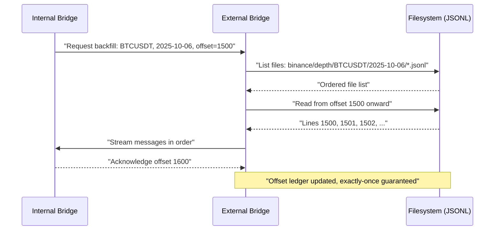

## External Bridge: Selected Technology

Following the comparative analysis in `003_technologies.md`, a **file-based storage approach using JSONL format** was selected for the external bridge implementation. This decision prioritizes operational simplicity and deterministic replay semantics over distributed infrastructure complexity.

### Rationale

The primary driver for selecting file-based storage over Apache Kafka or NATS JetStream is the **avoidance of broker maintenance overhead**. While Kafka provides mature exactly-once guarantees and high throughput, it introduces substantial operational complexity:

- Multi-broker cluster coordination and monitoring
- ZooKeeper (or KRaft) dependency management
- Partition rebalancing and broker tuning
- Infrastructure cost and resource allocation

For the scope of this implementation, these operational requirements represent an outsized investment relative to the throughput and concurrency demands. File-based storage eliminates cluster orchestration while retaining the essential guarantees required by the internal bridge.

### Implementation Approach

Messages are persisted as newline-delimited JSON (JSONL) files organized hierarchically by platform, source, and symbol partition:

```
storage/
  └── {platform}/
      └── {source}/
          └── {symbol}/
                └── {batch}.jsonl
```

This structure naturally implements **Strategy C** (per platform + source + symbol) from `002_partition.md`, providing fine-grained isolation and selective replay at the symbol level.

### Delivery Guarantees

**Exact order per symbol**: Each JSONL file contains messages for a single symbol in append-only order. The internal bridge reads files sequentially, line by line, preserving the canonical order established during ingestion.

**Exactly-once delivery**: The internal bridge maintains a cursor (offset ledger) tracking the last processed line per symbol stream. On replay or backfill, reading resumes from the recorded offset. Each line in a JSONL file represents a discrete message; line numbers serve as stable offsets, ensuring that a given message is delivered exactly once within a consumer session.

**Reread and backfill**: Time-partitioned directories enable efficient range queries. For backfill scenarios, the internal bridge specifies a time range (e.g., `2025-10-06` through `2025-10-07`) and symbol filter; the external bridge enumerates matching JSONL files in lexicographic order and streams lines from the requested starting offset.



### Operational Benefits

- **Transparency**: Raw JSONL files are human-readable and inspectable with standard tools (`cat`, `jq`, `grep`), facilitating debugging and auditing.
- **Simplicity**: No external services, cluster coordination, or network-dependent availability; storage backend (local disk or object store) is the sole dependency.
- **Determinism**: File-based ordering and line-based offsets provide unambiguous replay semantics, critical for reproducible research and backtesting.
- **Retention flexibility**: Lifecycle policies (e.g., delete files older than N days) are straightforward to implement via cron jobs or storage-tier rules (S3 lifecycle), applied at the time-partition level.

### Trade-offs

The selected approach incurs development effort to implement offset tracking and ordering logic that Kafka provides natively. However, for a research-oriented system or prototype environment, this trade-off favors operational autonomy and cost containment over infrastructure investment. The file-based model remains viable for moderate ingestion rates and symbol counts, scaling horizontally by distributing partition directories across storage nodes if throughput demands increase.
