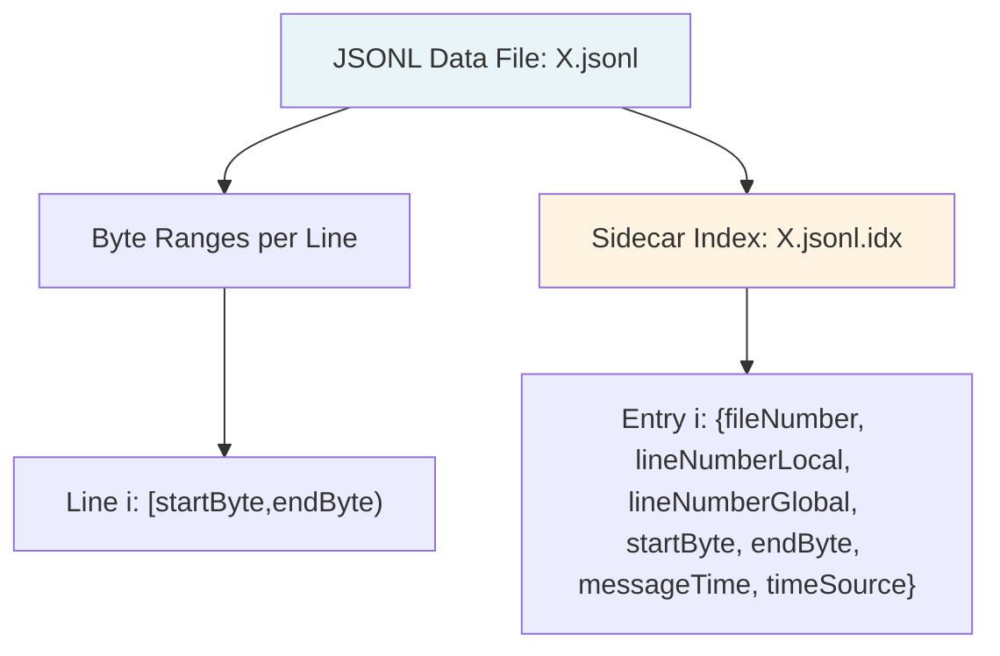
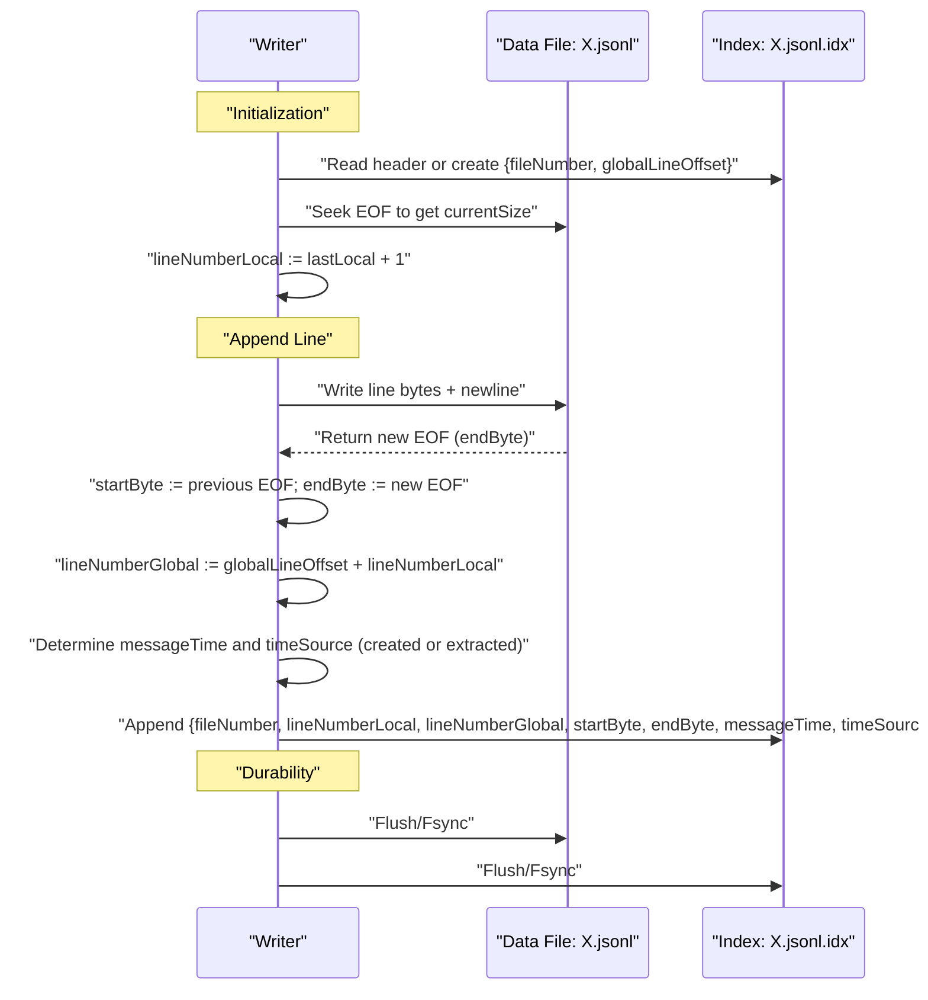
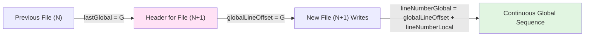
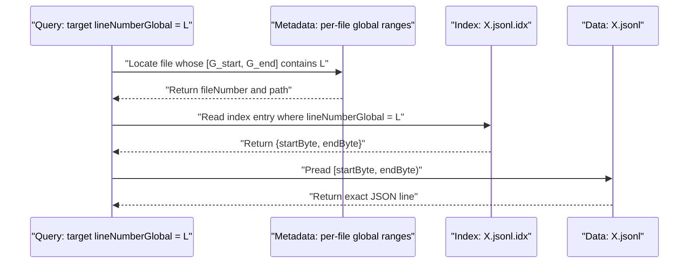
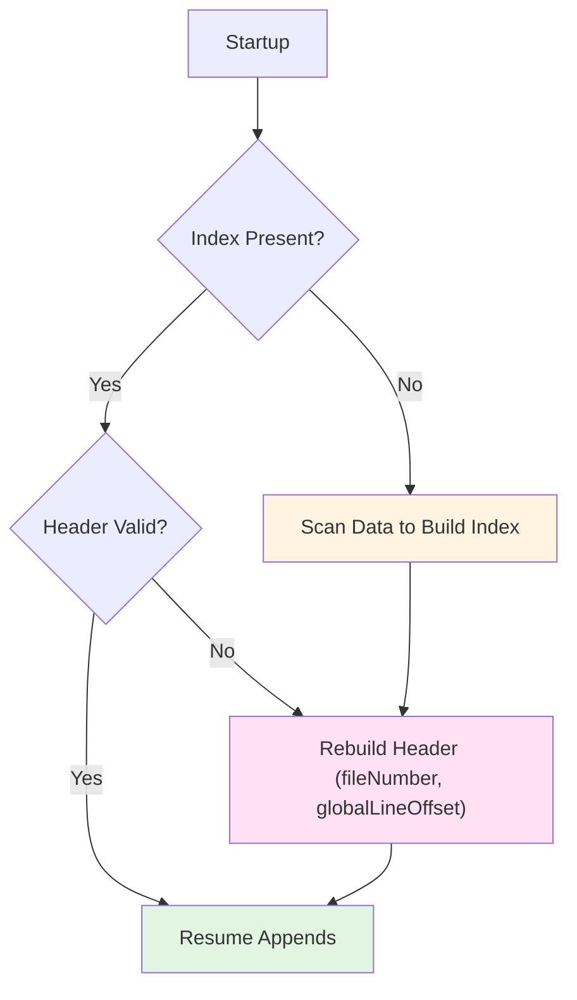

# Line-Based Byte Index for JSONL Files

## Purpose and Scope

This document defines a sidecar, line-oriented byte index maintained adjacent to each `.jsonl` data file. The index enables O(1) random access to any logical line by mapping each record to its exact byte range within the corresponding `.jsonl` file. The approach preserves deterministic replay and efficient scanning while supporting an incremental, cross-file global line counter and an explicit file sequence number. The design aligns with the persistent storage principles described in `@003_market_data_simulator_storage.md` and complements the architectural considerations in `@external_bridge/`.

## Placement and Naming

For every data file `X.jsonl`, an index file `X.jsonl.idx` resides in the same directory. The index is append-only and mirrors the lifecycle of its paired data file.

- "Co-location": Index and data share the same directory to simplify atomicity and recovery.
- "One-to-one": Exactly one `.idx` file per `.jsonl` file.
- "Append-only writes": Each new data line produces exactly one new index entry.

## Index Entry Semantics

Each index entry describes a single JSONL record using byte offsets and normalized identifiers:

- `fileNumber`: Monotonically increasing integer identifying the current file within a symbol/endpoint partition.
- `lineNumberLocal`: 1-based line number within the current `.jsonl` file.
- `lineNumberGlobal`: 1-based line number across the entire partition, incremented from the last line of the previous file.
- `startByte`: 0-based byte offset of the first byte of the line in the `.jsonl` file.
- `endByte`: Byte offset immediately after the final byte of the line (exclusive upper bound).
- `messageTime`: Unix epoch milliseconds associated with the record. By default, this is the creation time when the line is persisted; optionally, custom logic can extract a domain timestamp from the message payload.
- `timeSource`: String enumerator indicating the origin of `messageTime` — either `"created"` (default) or `"extracted"` (message-derived).

The index file begins with a compact header line that stabilizes numbering between files:

- `type: "header"`, `fileNumber`, `globalLineOffset` (the value such that `lineNumberGlobal = globalLineOffset + lineNumberLocal`).

Header presence enables constant-time initialization at start-up without scanning prior files.

## Structural Overview

## Write-Time Lifecycle

The writer maintains two counters: `fileNumber` for the active file and `lineNumberLocal` for per-file line sequencing. A derived `lineNumberGlobal` is computed via the header `globalLineOffset`.

## File Rotation and Global Line Continuity

When rotating to a new `.jsonl` file (e.g., size/time thresholds), the system creates a new pair with `fileNumber := previous.fileNumber + 1`. The index header for the new file records `globalLineOffset := previous.lastLineNumberGlobal` to ensure global numbering remains continuous without scanning prior files.

## Random Access by Line Number

Random access to an arbitrary logical line proceeds by consulting index metadata, then performing an exact byte-range read from the data file.

## Recovery and Reconciliation

The index admits deterministic reconstruction:

- "Index missing": Scan the `.jsonl` file once, computing `startByte`/`endByte` for each newline-terminated record; emit a fresh header and entries. Determine `fileNumber` from directory policy and recover `globalLineOffset` from the preceding file’s last global line or a lightweight partition manifest.
- "Index truncated": Resume from the last complete entry; recompute for remaining data bytes.
- "Data ahead of index": Advance the index to match the current data EOF; never delete data based solely on index divergence.

## Partitioning and Consistency

The indexing scheme is applied per partition described in `@external_bridge/` and is co-extensive with the storage hierarchy in `@003_market_data_simulator_storage.md`:

- "Per-endpoint, per-symbol": Each endpoint/symbol directory maintains its own rolling sequence of `fileNumber`s and global line space.
- "Monotonicity": `fileNumber` and `lineNumberGlobal` are strictly increasing within a partition.
- "Atomicity": Write of data and index is performed in the same critical section; failures yield at-most-one incomplete tail record that recovery reconciles.

## Operational Considerations

- "Time/size rotation": Rotation policy determines when `fileNumber` increments; the index is agnostic to the policy.
- "Offsets definition": `startByte` is 0-based; `endByte` is exclusive.
- "Integrity": Optional per-entry checksum or per-file digest can be added without changing lookup semantics.
- "Observability": Index population counters and latencies can be exported alongside storage metrics defined in `@003_market_data_simulator_storage.md`.

## Timestamp Semantics

The timestamp associated with each indexed record adheres to the following policy:

- "Default (created)": If no domain-specific time can be derived from the payload, `messageTime` equals the local wall-clock time at the moment the line is committed to storage, and `timeSource = "created"`.
- "Extracted (message-derived)": If the payload contains a canonical timestamp (e.g., exchange event time), the writer may apply validated extraction and normalization rules; in this case, `messageTime` is set to the extracted epoch milliseconds and `timeSource = "extracted"`.
- "Validation": Extraction logic must be deterministic and, when applicable, subject to monotonicity checks per partition to avoid regressions; on validation failure, fall back to the default `"created"` source.

## Related Documents

- `@external_bridge/`
- `@003_market_data_simulator_storage.md`

