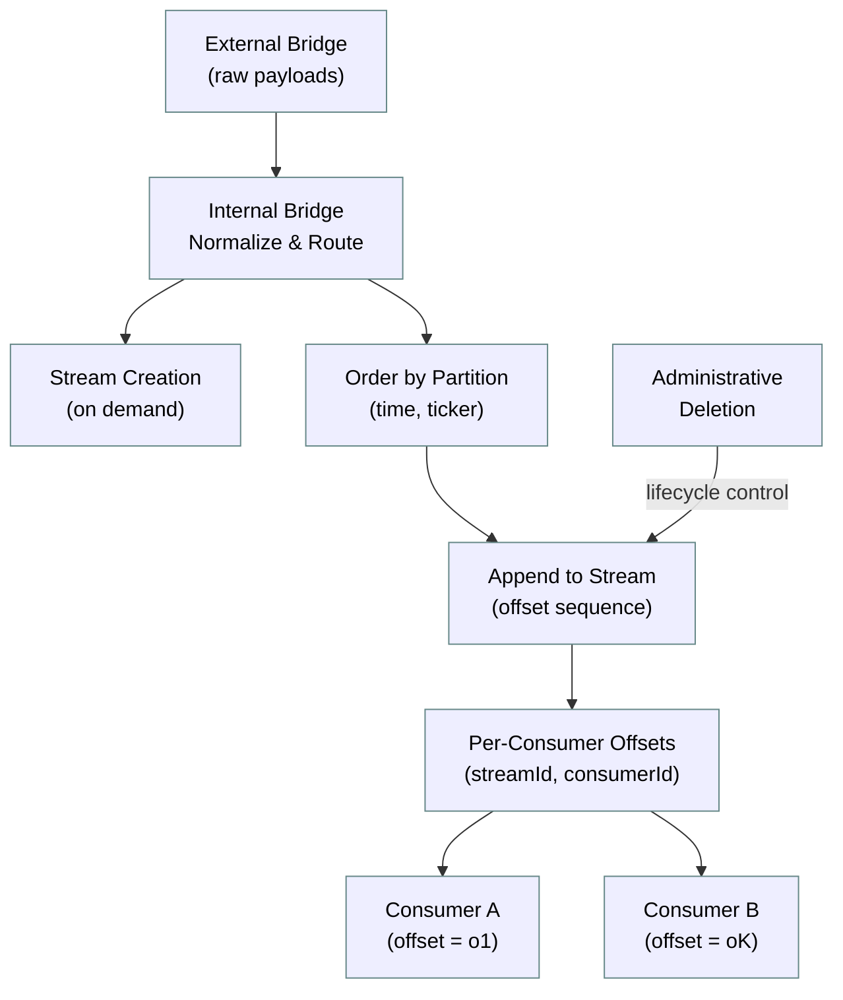
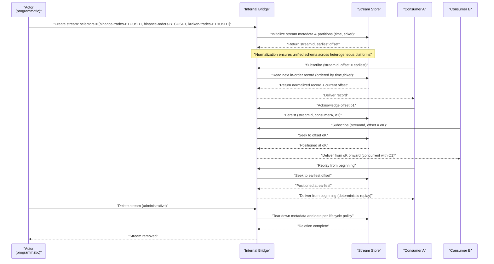
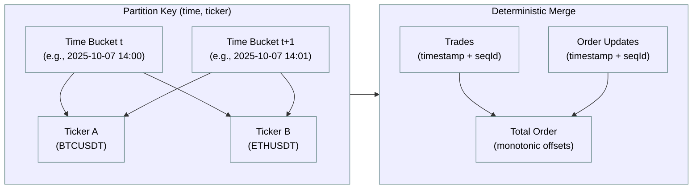
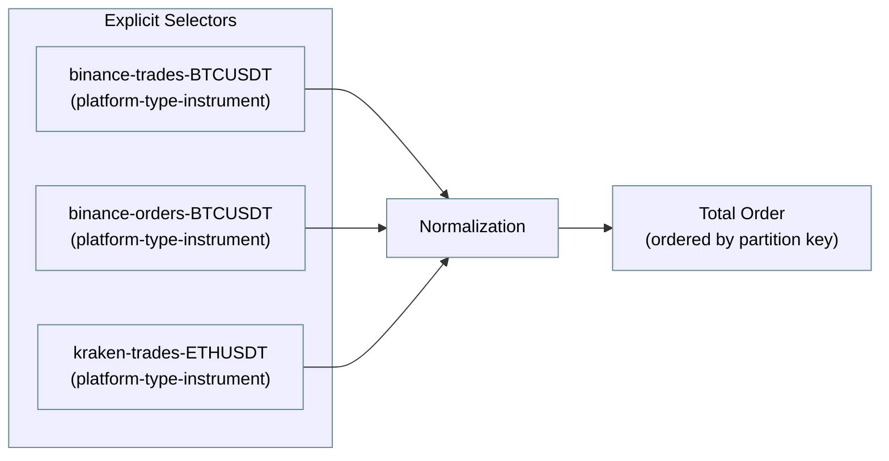
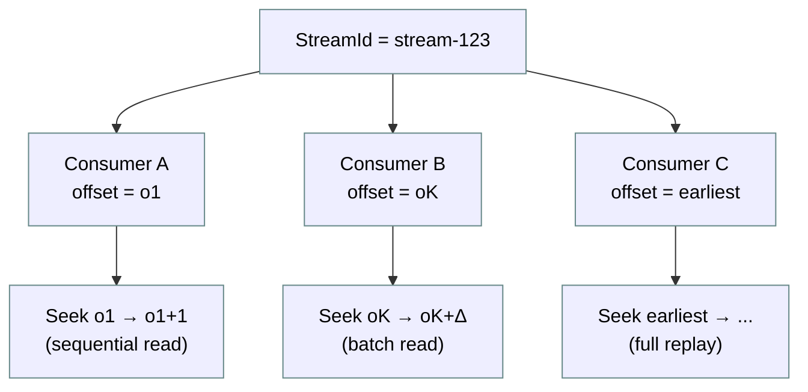
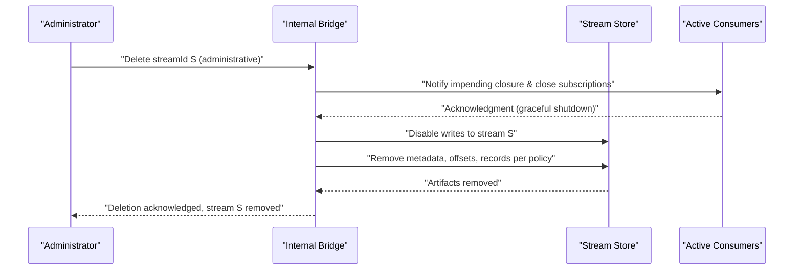
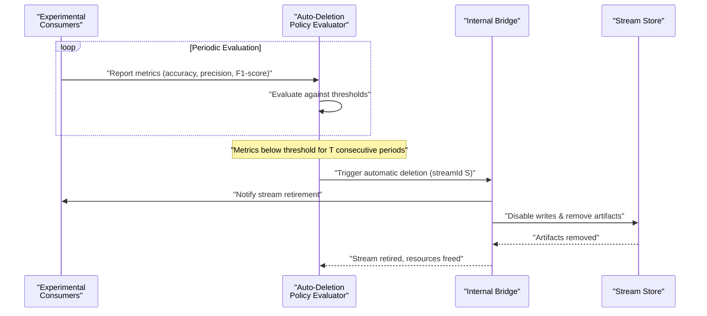

## Internal Bridge: Introduction and Scope

The internal bridge transforms heterogeneous, platform-specific market data into a unified schema and delivers it to consumers under deterministic, replayable semantics. This component addresses the fundamental challenge of consuming exchange-native data formats that vary in structure, field naming conventions, precision, and temporal granularity. By performing schema normalization on raw payloads from the external bridge, the internal bridge materializes logically coherent consumer streams with strict ordering guarantees, offset-based replay capabilities, multi-consumer concurrency, and lifecycle management through administrative deletion.

### Role within the Ingestion Pipeline

- **Upstream dependency**: The external bridge acquires and persists exchange-native payloads with minimal modification (see: [External Bridge — Introduction and Scope](../external_bridge/001_introduction.md)). The internal bridge consumes these time-partitioned artifacts as input.
- **Core function**: Schema normalization transforms platform-specific message structures into a unified data model. Normalized records are routed into consumer streams where they are materialized as append-only sequences with deterministic ordering.
- **Downstream contract**: The internal bridge guarantees in-order delivery within each stream, maintains independent per-consumer offsets, enables programmatic creation of new streams on demand, supports multiple concurrent consumers per stream, provides replay from the earliest available offset, and allows explicit deletion of streams through administrative operations.

### Consumer Streams (Concept)

Consumer streams are logical, append-only sequences of normalized records that provide the abstraction layer between raw, platform-specific data and downstream analytical workloads. A stream is defined by an explicit set of flattened selectors, where each selector follows the structure `<platform>-<type>-<instrument>` (e.g., `binance-trades-BTCUSDT`, `kraken-orders-ETHUSDT`). This flattened notation eliminates ambiguity: the internal bridge does not compute cross-product permutations from separate platform, type, and instrument lists, but rather accepts a pre-enumerated set of concrete selectors. Within a stream, records are ordered by a composite partitioning key derived from event time and ticker symbol, ensuring deterministic iteration across heterogeneous message sources.

#### Stream Properties

- **On-demand creation**: Streams are instantiated programmatically by providing an explicit set of flattened selectors at creation time. No predefined schema registry or stream catalog is required.
- **Total ordering**: Records within a stream are exposed as a single, monotonically increasing sequence ordered by partition key `(time, ticker)`, with stable tiebreaking for events sharing identical keys.
- **Independent offsets**: Each consumer maintains a distinct offset position within the stream, tracked as `(streamId, consumerId, offset)` tuples in persistent storage.
- **Multi-consumer concurrency**: Multiple consumers may read the same stream concurrently at independent offset positions without coordination or mutual exclusion.
- **Replay capability**: Any consumer can seek to the earliest available offset to replay the entire stream from its inception, enabling deterministic reprocessing.
- **Administrative deletion**: Streams may be explicitly deleted through administrative operations, removing both metadata and materialized records according to lifecycle policy.
- **Automatic retirement**: Streams associated with experimental model evaluation may be automatically retired when performance metrics fall below configured thresholds, enabling self-managing lifecycle for exploratory workloads.

### High-Level Flow

The following diagram illustrates the transformation pipeline from raw exchange data through normalization, ordering, and materialization into consumer-accessible streams.

### Stream Lifecycle (Create → Consume → Replay → Delete)

The following sequence diagram illustrates the complete lifecycle of a consumer stream, from programmatic creation through concurrent consumption, replay, and eventual deletion. Key interactions include stream initialization, offset management, concurrent multi-consumer access, and lifecycle termination.

### Partitioning and Ordering Semantics

Ordering guarantees are fundamental to enabling deterministic replay and ensuring that consumers observe a consistent, reproducible sequence of events regardless of when or how many times they read the stream.

- **Partition key construction**: The composite key `(time, ticker)` establishes a deterministic, canonical ordering within each stream. The time component may be discretized into buckets (e.g., minute-level or second-level granularity) to balance operational efficiency with temporal precision. The ticker component identifies the instrument (e.g., `BTCUSDT`, `ETHUSDT`), enabling parallel processing within time buckets while maintaining cross-instrument ordering.

- **Deterministic merge algorithm**: When a stream includes multiple message types (e.g., trades and order book updates) from heterogeneous sources, normalized records are merged into a single total order using their event timestamps as the primary key and stable tiebreakers (e.g., platform-provided sequence identifiers, message type priority, or lexicographic source ordering) as secondary keys. This ensures that records with identical timestamps are consistently ordered across all replay operations, eliminating nondeterminism in downstream processing.

- **Monotonic offset progression**: Consumers observe a strictly monotonically increasing sequence of offsets, where each offset uniquely identifies a position in the stream. Offset assignment is independent of the number of underlying data sources, ensuring that stream consumption semantics remain invariant under changes to the set of contributing platforms or message types.

- **Explicit selector enumeration**: Streams are defined by an explicit, pre-enumerated set of flattened selectors of the form `<platform>-<type>-<instrument>`. The internal bridge does not compute cross-product permutations from separate lists of platforms, types, and instruments, thereby avoiding ambiguity in stream definition and enabling precise control over which data sources contribute to each stream.

#### Partition Key Structure

#### Flattened Selector Model

### Offset Management

Offset management enables independent consumption positions across multiple concurrent consumers while ensuring deterministic replay and preventing message loss or duplication within consumer sessions.

- **Per-consumer ledger**: Offsets are tracked as persistent triples `(streamId, consumerId, offset)`, where `streamId` identifies the stream, `consumerId` uniquely identifies the consumer instance, and `offset` represents the consumer's current position in the monotonically increasing sequence. This ledger enables concurrent readers to maintain independent positions within the same stream without coordination.

- **At-least-once delivery semantics**: Offset advancement occurs only after successful processing acknowledgments from the consumer. In the presence of consumer failures or session interruptions, the same record may be delivered multiple times, placing the burden of idempotency on the consumer implementation. This design prioritizes fault tolerance and simplifies offset tracking at the cost of requiring consumer-side deduplication logic.

- **Explicit seek operations**: Consumers may issue explicit seek operations to reposition their offset to the earliest available offset (enabling full replay), to a specific known offset (enabling resumption from a checkpoint), or to the latest offset (enabling catch-up after prolonged inactivity). Seek operations are synchronous and deterministic, ensuring that subsequent reads begin from the requested position.

#### Offset Tracking Structure

### Stream Deletion (Administrative and Automatic)

Stream deletion is the terminal operation in the stream lifecycle, removing both metadata and materialized records according to defined policies. Deletion may be initiated through explicit administrative commands or triggered automatically based on evaluation metrics from experimental consumer workloads.

#### Administrative Deletion

Administrative deletion is an explicit, operator-initiated action that removes a stream when it is no longer required. The deletion protocol ensures graceful termination: active consumers are notified of impending closure, write operations are disabled to prevent new records from entering the stream, and stored artifacts (metadata, offset ledgers, and materialized records) are removed according to the configured lifecycle policy. The operation is coordinated to prevent partial visibility, ensuring that consumers either observe the complete stream or receive an explicit termination signal.

#### Automatic Deletion (Policy-Driven)

Automatic deletion is driven by evaluation metrics reported by experimental consumers. These consumers assess stream utility using configurable criteria (e.g., prediction accuracy, statistical significance, model performance) and report metrics to a policy evaluator. When metrics fall below predefined thresholds for a sustained period, the policy evaluator triggers stream deletion without manual intervention. This mechanism enables self-managing lifecycle for exploratory workloads, automatically retiring streams that fail to meet quality standards.

### Consumer Workloads: Experimental Models

A primary use case for consumer streams is the evaluation of experimental predictive models across different combinations of market data sources. Each experiment consumes a distinct stream defined by a specific set of flattened selectors (e.g., `binance-trades-BTCUSDT`, `binance-orders-BTCUSDT`, `kraken-trades-ETHUSDT`), enabling systematic exploration of how data source selection affects model performance.

#### Characteristics of Experimental Workloads

- **Independent evaluation**: Each experiment maintains its own offset within the stream, enabling asynchronous processing at different rates without coordination among concurrent experiments.

- **Deterministic replay**: By seeking to the earliest offset, experiments can replay the complete stream to re-evaluate models under different hyperparameters or algorithmic variants, ensuring that performance comparisons are conducted over identical input sequences.

- **Concurrent execution**: Multiple experimental consumers may read the same stream simultaneously, each at a distinct offset, enabling parallel evaluation of competing model architectures or feature engineering strategies.

- **Metric-driven lifecycle**: Experiments continuously report evaluation metrics (e.g., prediction accuracy, precision-recall curves, mean squared error) to the auto-deletion policy evaluator. Streams associated with underperforming experiments are automatically retired, freeing computational and storage resources for more promising configurations.

- **Data permutation exploration**: By creating streams with different selector combinations, researchers can systematically evaluate the impact of including or excluding specific platforms, message types, or instruments on downstream model quality.

### Relationship to the External Bridge

The internal bridge operates as a downstream consumer of the external bridge, transforming its outputs into a unified, stream-oriented abstraction suitable for analytical workloads.

#### Division of Responsibilities

- **External bridge**: Responsible for acquiring and persisting exchange-native payloads with minimal transformation, organizing data by time partitions to enable efficient temporal access (see: [External Bridge — Partitioning of Raw Data](../external_bridge/002_partition.md)). The external bridge prioritizes fidelity to source data formats and optimizes for write throughput and time-based retrieval.

- **Internal bridge**: Responsible for schema normalization, deterministic ordering, and stream materialization. The internal bridge reads time-partitioned artifacts from the external bridge, transforms them into a unified schema, merges heterogeneous message types into total order, and exposes the result as append-only consumer streams with offset-based replay semantics.

#### Abstraction Boundary

The internal bridge deliberately abstracts away the implementation details of the underlying storage or queuing technology used by the external bridge. Consumer streams are defined solely in terms of their semantic properties (ordering guarantees, offset semantics, replay capabilities) without exposing whether data is stored in a relational database, a distributed log, a columnar store, or a combination thereof. This abstraction enables the external bridge implementation to evolve independently—migrating storage backends, adjusting partition strategies, or introducing compression schemes—without requiring changes to consumer code or internal bridge logic, so long as the time-partitioned read interface remains stable.

