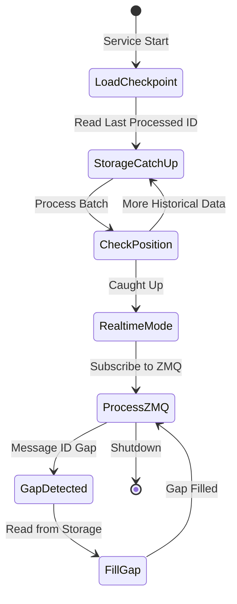
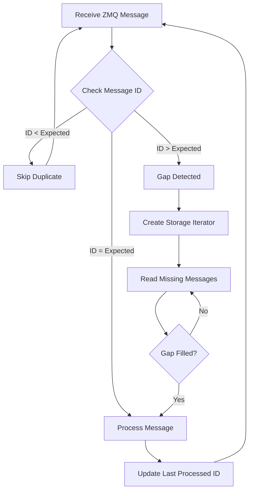
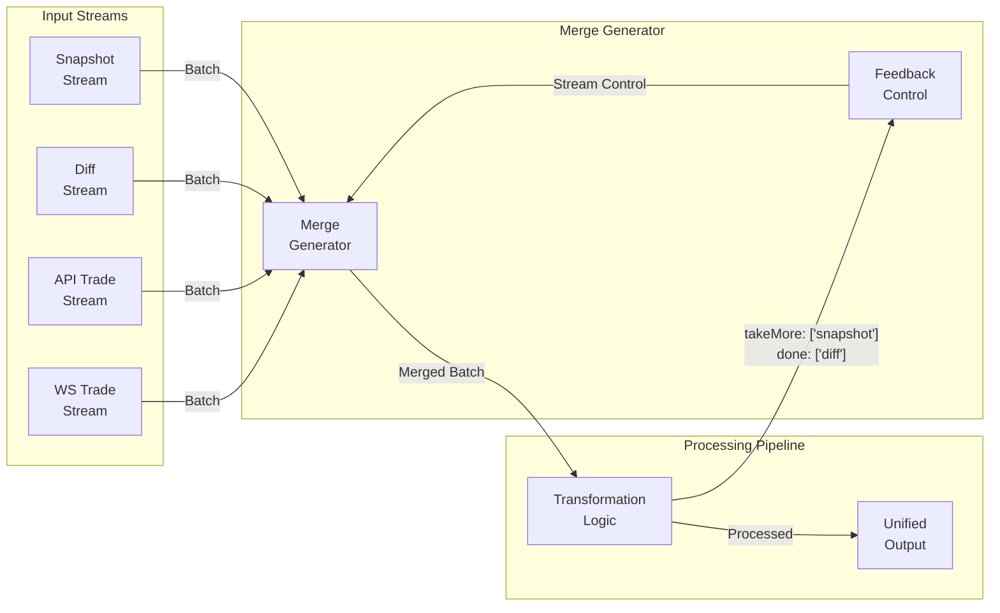
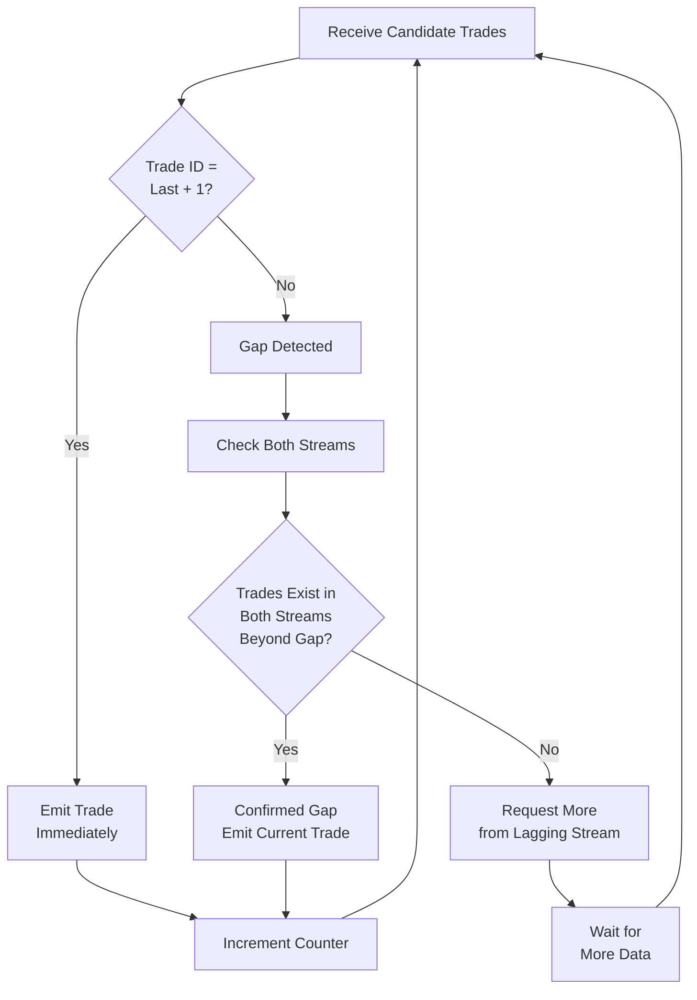
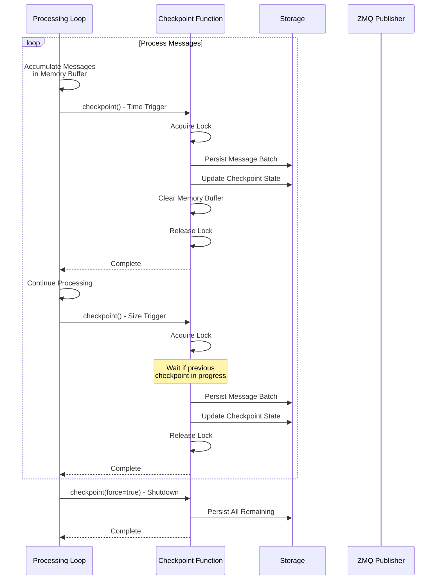
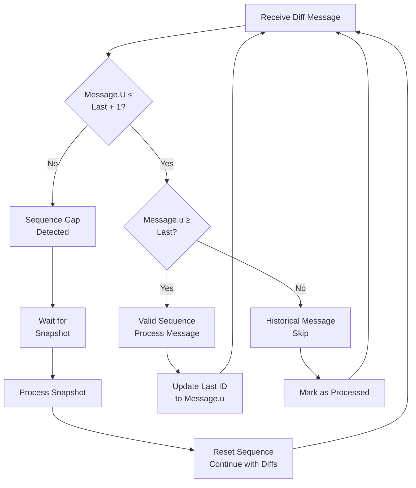
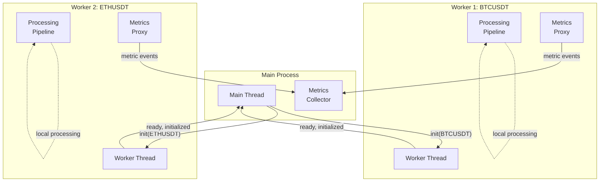
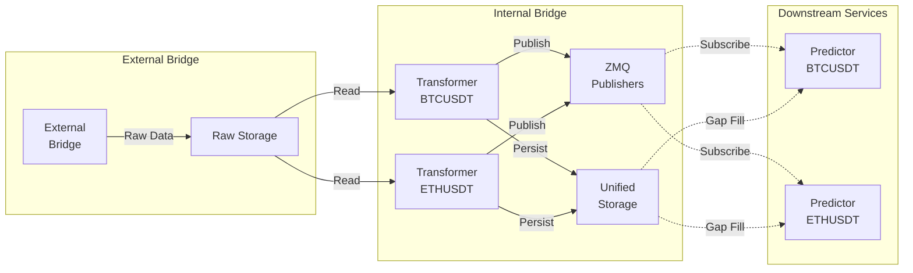

# Internal Bridge: Data Transformation Layer

The internal-bridge service implements the data transformation layer between raw exchange-specific market data and unified format suitable for machine learning model consumption. This component addresses the challenge of merging heterogeneous data sources (REST API snapshots and WebSocket differential streams) from multiple exchanges while maintaining strict ordering guarantees, handling message delivery gaps, and ensuring fault-tolerant processing with checkpoint-based recovery mechanisms.

## Architectural Overview

The internal-bridge operates as a stateful transformation pipeline consuming raw market data from external-bridge storage and ZeroMQ publishers, transforming platform-specific formats into unified schemas, and republishing the normalized data for downstream prediction services. The architecture implements a transform-and-forward pattern: messages flow through multiple processing stages including gap detection, stream merging, sequence validation, deduplication, and finally republication via ZeroMQ for real-time distribution.

The service architecture distinguishes between four platform-specific transformer types, each optimized for the unique characteristics of exchange data protocols:

**Binance Order Book Transformer** reconstructs complete order book state from periodic REST API snapshots and high-frequency WebSocket differential updates. The transformer validates sequence continuity using Binance-specific update identifiers (firstUpdateId `U` and lastUpdateId `u`), ensuring that differential updates form a contiguous sequence without gaps or duplicates.

**Binance Trade Transformer** merges historical trade data from REST API responses with real-time WebSocket trade execution messages. The deduplication logic uses monotonically increasing trade identifiers to filter already-processed trades, preventing duplicate records when API historical data overlaps with WebSocket streams during catch-up operations.

**Kraken Order Book Transformer** processes WebSocket-only order book updates from Kraken's snapshot-plus-diff protocol, reconstructing order book state without requiring periodic REST API polling. This transformer handles Kraken's specific message format where initial snapshots establish baseline state and subsequent differential messages modify the state incrementally.

**Kraken Trade Transformer** implements similar deduplication logic to Binance trades but adapts to Kraken's trade identifier scheme and message structure, ensuring platform-agnostic unified output despite different input formats.

Each transformer type operates as an independent process with isolated state management, enabling selective deployment of specific exchange-symbol combinations without affecting other transformers. This process isolation provides fault boundaries preventing cascading failures across different exchange integrations.

## Dual-Mode Consumption Strategy

The internal-bridge implements a sophisticated dual-mode consumption strategy addressing the challenge of maintaining consistent processing state across service restarts while minimizing latency during normal operation. This approach combines persistent storage replay with real-time ZeroMQ message delivery, providing both catchup capability and low-latency real-time processing.

### Storage Catch-Up Phase

Upon initialization, each transformer loads checkpoint state from persistent storage, identifying the last successfully processed message identifier for each input stream (e.g., REST API snapshots, WebSocket differential streams). The transformer then initiates sequential reads from RocksDB storage using iterator-based consumption, processing accumulated messages that arrived while the service was offline or during previous processing sessions.

The storage reader creates batches of configurable size (typically 10-100 records per batch) to optimize read throughput while maintaining manageable memory footprint. Batch processing enables efficient sequential disk reads leveraging RocksDB's LSM tree architecture, where sequential scans benefit from bloom filter optimizations and block cache utilization.

During the catch-up phase, the system processes messages at maximum throughput without concern for message arrival timing, as all data exists persistently in storage. The sequential processing enables deterministic replay: identical input sequences produce identical output sequences across multiple executions, a critical property for validating transformation logic changes or debugging data quality issues.

The catch-up phase continues until the transformer's read position reaches the current write position in storage, indicated by the storage iterator returning empty batches. At this point, the transformer has processed all accumulated historical data and transitions to real-time mode.

### Real-Time ZMQ Processing

Once caught up with storage, the transformer switches to consuming messages from ZeroMQ publishers, receiving newly arrived market data with minimal latency (typically single-digit milliseconds from exchange arrival to transformation completion). The ZeroMQ pub/sub pattern provides low-overhead message delivery without the coordination overhead of broker-based messaging systems.

However, ZeroMQ's pub/sub semantics do not guarantee 100% message delivery reliability—messages can be lost during brief disconnections, subscriber buffer overflows, or publisher send buffer saturation. To address this limitation, the internal-bridge implements gap detection logic comparing expected and received message identifiers.

### Gap Detection and Storage Fallback

During real-time ZMQ processing, the transformer maintains a counter tracking the last processed message identifier. When receiving the next message, the transformer compares the incoming message ID with the expected value (lastProcessedId + 1). Three scenarios exist:

**Continuous sequence**: If the incoming message ID matches the expected value, the message is processed normally and the counter increments. This is the common case during stable operation, representing the optimal path with minimal latency.

**Already processed**: If the incoming message ID is less than or equal to the last processed ID, the message is classified as a duplicate (potentially caused by ZMQ message redelivery or overlapping stream subscription) and is skipped without processing. The transformer logs this occurrence for diagnostic purposes but treats it as a normal condition.

**Gap detected**: If the incoming message ID exceeds the expected value, a gap is detected indicating missing messages. The transformer immediately falls back to storage, creating an iterator positioned at the expected message ID and reading sequential records until the gap is filled.

The gap-filling operation proceeds synchronously: real-time ZMQ message processing pauses while the transformer reads missing messages from storage. This ensures that output maintains strict sequential ordering—no message is processed until all preceding messages have been processed, regardless of arrival order.

Storage-based gap filling provides reliable recovery because the external-bridge persists all messages to RocksDB before publishing to ZeroMQ. Even if ZeroMQ drops messages, those messages exist in persistent storage and can be retrieved during gap-filling operations. The dual-mode strategy thus provides ZeroMQ's low-latency characteristics during normal operation while maintaining Kafka-like reliability guarantees through storage fallback.

### State Synchronization Monitoring

A background monitoring task runs periodically (every 10 seconds) comparing the transformer's last processed ID with the storage's current maximum ID. Under normal operation, these values remain approximately equal—the transformer processes messages shortly after they are written to storage.

However, if storage's maximum ID significantly exceeds the transformer's processed ID (indicating the transformer is falling behind), and this condition persists for more than one second, the monitoring task triggers an automatic service restart. This restart forces the transformer to re-enter storage catch-up mode, processing accumulated messages at maximum throughput rather than attempting to catch up while simultaneously processing incoming real-time messages.

This failsafe mechanism prevents pathological scenarios where a slow transformer accumulates unbounded lag, potentially leading to memory exhaustion as ZMQ subscriber buffers fill with unprocessed messages. The restart-based recovery trades temporary service unavailability (during restart and catch-up) for guaranteed eventual consistency and bounded resource consumption.

## Stream Merging and Message Ordering

The internal-bridge implements sophisticated stream merging logic to combine multiple heterogeneous data sources (REST API responses and WebSocket messages) into unified chronologically ordered output streams. This merging operation must handle asynchronous message arrival, differing message rates between sources, and platform-specific sequencing semantics.

### Merge Generator Pattern

The stream merger employs an async generator pattern consuming from multiple input iterators (each representing one data source) and yielding merged output batches. The generator maintains separate iterators for each input stream, advancing them independently based on processing feedback from downstream consumers.

The merger accepts a feedback object from downstream consumers indicating which input streams should provide more messages and which streams have been fully processed. This adaptive control mechanism implements selective backpressure: if the transformer has processed all available snapshot messages and is waiting for the next snapshot to arrive, the merger requests more messages only from the snapshot stream, pausing the differential stream until the snapshot is available.

This selective stream control enables implementation of platform-specific sequencing requirements. For Binance order book reconstruction, the transformer must not process differential updates until it has received the corresponding snapshot establishing the baseline state. The merger pauses the differential stream until the snapshot arrives, preventing premature processing of differential updates that reference non-existent baseline state.

### Platform-Specific Ordering Logic

Each transformer type implements specialized ordering logic reflecting the sequencing semantics of its data sources:

**Binance Order Book Ordering**: Messages are sorted by update identifier with snapshots prioritized before differential updates at the same identifier. This ordering ensures that when a snapshot and differential update reference the same order book state version, the snapshot (establishing complete state) processes before the differential (modifying that state).

**Trade Stream Ordering**: Trade messages from both API historical data and WebSocket streams are sorted by platform trade identifier. When multiple trades have identical identifiers (possible with batch API responses), secondary sorting by message arrival timestamp ensures deterministic ordering.

The sorting operations occur on message batches (typically 10-100 messages) rather than individual messages, providing reasonable latency while ensuring local ordering correctness within each batch. Messages across batch boundaries maintain global ordering because input streams provide monotonically increasing identifiers, and the merger maintains separate read positions for each stream.

## Multi-Source Deduplication Logic

The trade transformation pipeline implements sophisticated deduplication logic handling the overlap between historical API data and real-time WebSocket streams. During initial startup or after extended downtime, the transformer retrieves historical trades via REST API to establish a complete trade history. Simultaneously, the WebSocket connection delivers real-time trades as they execute. These streams necessarily overlap—the most recent historical API trades overlap with the earliest WebSocket trades, requiring deduplication to prevent duplicate records in the unified output.

### Trade Identifier-Based Deduplication

The deduplication logic leverages platform trade identifiers assigned by exchanges. These identifiers are monotonically increasing integers uniquely identifying each trade execution. The transformer maintains a `lastEmittedTradeId` counter tracking the highest trade identifier already processed and emitted to the output stream.

When processing incoming messages, the transformer filters messages based on their trade identifiers:

**Historical messages**: If all trades in a message have identifiers less than or equal to `lastEmittedTradeId`, the entire message is classified as historical (already processed) and marked as completed without transformation. This early filtering prevents unnecessary transformation operations on known-duplicate data.

**Candidate trades**: Messages containing trades with identifiers greater than `lastEmittedTradeId` are considered candidate trades requiring further processing. These messages undergo transformation to unified format and enter the gap-detection logic.

### Gap-Aware Emission Strategy

Trade emission employs a conservative gap-detection strategy to handle the scenario where trades from one source (e.g., API historical data) have not yet arrived, creating apparent gaps in the trade sequence. Emitting trades immediately upon receiving them could create gaps in the output stream if earlier trades arrive later from a different source.

The emission logic implements a "look-ahead" strategy examining upcoming trades in the candidate queue:

**Continuous sequence**: If the next candidate trade's identifier equals `lastEmittedTradeId + 1`, the trade is emitted immediately and the counter increments. This represents the common case during stable operation when trades arrive in perfect sequence.

**Gap with confirmation**: If the next candidate trade identifier exceeds `lastEmittedTradeId + 1` (indicating a gap), the transformer examines future trades in both streams. If trades exist in both API and WebSocket streams beyond the current gap, the gap is confirmed as a genuine missing trade (potentially skipped by the exchange or filtered by the external-bridge). The transformer then emits the candidate trade despite the gap, accepting that the missing trade will never arrive.

**Gap without confirmation**: If only one stream has future trades beyond the gap, the transformer pauses emission and requests more messages from the stream lacking future trades. This prevents false-positive gap detection when one stream is temporarily behind the other. The transformer waits until both streams have progressed beyond the gap position before deciding whether to emit trades or continue waiting.

This strategy balances two competing concerns: minimizing latency by emitting trades as soon as safely possible, while avoiding false gaps caused by asynchronous stream arrival. The look-ahead mechanism provides evidence-based gap detection: gaps are only accepted when multiple streams independently confirm the gap's existence.

### Restart-Based Recovery

If the transformer accumulates excessive failed emission attempts (typically 100 consecutive cycles without successfully emitting trades), indicating a persistent gap that cannot be resolved through normal gap-filling mechanisms, the transformer triggers an automatic service restart. This restart forces re-entry into storage catch-up mode, reprocessing recent data with the benefit of complete historical context potentially revealing the source of the persistent gap.

This restart-based recovery provides a coarse-grained but reliable mechanism for recovering from pathological states that cannot be resolved through normal processing logic, such as storage corruption, missing data ranges, or bugs in the gap-detection logic itself.

## Checkpoint-Based Recovery Mechanisms

The internal-bridge implements multi-level checkpoint tracking enabling fine-grained recovery positioning across multiple input streams. Unlike coarse-grained checkpointing systems that track a single global offset, the internal-bridge maintains independent checkpoint state for each input stream, allowing transformers to resume from different positions in different streams without reprocessing data unnecessarily.

### Multi-Level Checkpoint State

Each transformer maintains checkpoint state for every input stream it consumes. For example, the Binance order book transformer tracks:

- `binanceOrderBook.lastProcessedId`: The highest processed REST API snapshot message identifier
- `binanceOrderBook.lastProcessedTimestamp`: The timestamp of that snapshot
- `binanceDiffDepth.lastProcessedId`: The highest processed WebSocket differential update identifier  
- `binanceDiffDepth.lastProcessedTimestamp`: The timestamp of that differential update

This granular checkpoint state enables precise recovery positioning. After a service restart, the transformer can resume consuming REST API snapshots from position 15,000 while simultaneously resuming WebSocket differential updates from position 50,000, reflecting the different processing rates of these streams during previous execution.

The checkpoint state persists in dedicated RocksDB storage instances separate from input and output data storage. This separation ensures that checkpoint writes do not contend with high-throughput data ingestion operations, and enables efficient point-reads and point-updates of checkpoint records without requiring full table scans.

### Checkpoint Triggers

Checkpoint persistence occurs based on two triggering conditions implemented through the generic checkpoint function abstraction:

**Time-based checkpointing**: Checkpoints persist automatically every 5 seconds (configurable) regardless of processing volume. This time-based trigger ensures that checkpoint state remains reasonably current even during low message volumes, limiting the amount of reprocessing required after unexpected service termination.

**Size-based checkpointing**: Checkpoints persist after processing 1,000 messages (configurable) regardless of elapsed time. This volume-based trigger ensures bounded memory consumption—processed messages accumulate in memory buffers until checkpointed and persisted, and size-based triggering prevents unbounded memory growth during high message volumes.

**Shutdown checkpointing**: During graceful shutdown, the transformer performs a forced checkpoint operation ensuring all accumulated messages and checkpoint state persist before process termination. This shutdown checkpoint minimizes reprocessing after planned service restarts.

The checkpoint function employs promise-based locking to prevent concurrent checkpoint operations. If a checkpoint is already in progress when a new checkpoint trigger fires, the new checkpoint operation blocks until the previous checkpoint completes. This locking mechanism prevents race conditions and ensures that checkpoint state remains consistent without requiring complex transactional semantics.

### Checkpoint Failure Handling

If checkpoint persistence fails due to storage errors, disk full conditions, or other infrastructure failures, the checkpoint function logs the fatal error and triggers a service restart. This fail-fast behavior prevents the transformer from continuing to process messages when checkpoint state cannot be persisted, as continued processing would create unbounded reprocessing requirements after the next restart.

The restart-on-checkpoint-failure strategy accepts temporary service unavailability in exchange for guaranteed bounded reprocessing. The alternative—continuing to process messages despite checkpoint failures—would accumulate arbitrarily large reprocessing requirements, potentially exceeding available memory or creating unacceptable restart latency.

## Platform-Specific Sequence Validation

Each transformer implements validation logic specific to the sequencing semantics of its target exchange, detecting protocol violations, missing messages, or unexpected message ordering that could indicate data quality issues or exchange API anomalies.

### Binance Order Book Sequence Validation

Binance's order book protocol uses two update identifiers for sequence validation:

- `U` (firstUpdateId): The first order book update ID represented in the differential message
- `u` (lastUpdateId): The last order book update ID represented in the differential message

A valid message sequence satisfies the invariant: the next message's `U` must equal the previous message's `u + 1`. This strict sequencing ensures that differential updates form a contiguous sequence without gaps.

The transformer validates this invariant when processing differential updates:

**Valid sequence**: If `message.U <= lastOrderBookId + 1 && message.u >= lastOrderBookId`, the message is accepted and processed. This condition allows for some overlap (when `U < lastOrderBookId + 1`) to handle redelivered messages but ensures the message extends the sequence (when `u >= lastOrderBookId`).

**Sequence gap**: If `message.U > lastOrderBookId + 1`, a gap is detected. The transformer logs a warning and enters a waiting state, requesting more snapshot messages rather than differential updates. This behavior reflects the protocol requirement that gaps in differential sequences must be resolved by obtaining a new snapshot establishing fresh baseline state.

**Historical message**: If `message.u < lastOrderBookId`, the message is entirely historical (all updates in the message have been processed previously). The transformer logs this condition and marks the message as processed without transformation.

### Trade Sequence Monotonicity

Trade transformers validate that trade identifiers form a monotonically increasing sequence. While small gaps in trade sequences may occur (when exchanges skip identifiers or when filtering removes specific trade types), trade identifiers must never decrease—a decreasing identifier indicates message reordering, timestamp-based sorting errors, or data corruption.

The transformer validates monotonicity during candidate trade processing. If a candidate trade's identifier is less than or equal to the previous emitted trade identifier, the transformer either skips the trade (if it represents a duplicate) or logs an error (if the identifier represents a genuine out-of-order trade). The strict monotonicity requirement enables efficient deduplication using simple identifier comparison rather than requiring complex set-based tracking of all seen identifiers.

## Worker Thread-Based Parallel Processing

The Binance trade transformer implements worker thread-based parallelization to process multiple trading symbols concurrently within a single service instance. This parallelization strategy addresses the challenge of maximizing CPU utilization when processing many low-volume symbols, while maintaining process isolation for fault tolerance.

### Worker Thread Architecture

The main process initializes one worker thread per configured symbol (e.g., BTCUSDT, ETHUSDT, BNBUSDT). Each worker executes the complete transformation pipeline for its assigned symbol in an isolated V8 isolate with dedicated event loop and garbage collector. This isolation provides memory separation: memory leaks or excessive memory consumption in one worker do not affect other workers or the main process.

The main process creates a MessageChannel for each worker, providing a bidirectional communication channel using the structured clone algorithm for message passing. The channel enables typed message exchange between main and worker threads without shared memory, eliminating the data races and synchronization complexity inherent in shared-memory parallelism.

### Typed Message Channels

Communication between main and worker threads uses a typed message channel abstraction defining strongly-typed message schemas for both directions:

**Main-to-worker messages**:
- `init`: Initialization message providing symbol identifier and configuration
- `shutdown`: Graceful shutdown request triggering worker cleanup and termination

**Worker-to-main messages**:  
- `ready`: Worker has initialized and is ready to accept work
- `initialized`: Worker has completed initialization and begun processing
- `metric`: Metrics data forwarded from worker to main process for aggregation
- `closed`: Worker has completed shutdown and is terminating

The typed channel abstraction provides compile-time type checking of message structure, preventing runtime errors from malformed messages. TypeScript's type inference ensures that message handlers receive correctly typed message objects without requiring manual type assertions or runtime type checking beyond the initial message discrimination.

### Metrics Forwarding Pattern

Workers cannot directly access the main process's metrics collection infrastructure (Prometheus registry, metric instances) due to memory isolation. To enable metrics collection from workers, the system implements a metrics forwarding pattern: workers intercept all metrics method calls (counter increments, histogram observations, gauge sets) and forward them as messages to the main thread.

During worker initialization, the worker's metrics context undergoes "monkey-patching": all metric instance methods are replaced with proxy functions that serialize method invocations into messages. When a worker calls `metrics.throughput.inc({symbol: 'BTCUSDT', type: 'trade'}, 100)`, the proxy function captures the method name, metric name, and arguments, sending a `metric` message to the main thread.

The main thread's message handler reconstructs the method invocation on the real metrics instance: upon receiving a `metric` message with `metricKey='throughput'`, `methodKey='inc'`, and `args=[{symbol: 'BTCUSDT', type: 'trade'}, 100]`, the handler invokes `metrics.throughput.inc({symbol: 'BTCUSDT', type: 'trade'}, 100)` on the main thread's metrics instance.

This forwarding pattern centralizes metrics collection in the main process, enabling unified metrics exposition through a single HTTP endpoint and consistent metrics aggregation across all workers without requiring complex distributed metrics collection infrastructure.

### Lifecycle Coordination

Worker lifecycle follows a coordinated initialization and shutdown protocol ensuring that all workers reach ready state before the service reports healthy, and all workers complete shutdown before the main process terminates.

During initialization, the main process creates all workers simultaneously and waits for each worker to send a `ready` message indicating successful initialization. The main process then sends `init` messages to all workers, triggering parallel processing pipeline initialization. Workers respond with `initialized` messages upon completing initialization. Only after all workers send `initialized` messages does the main process's HTTP health check endpoint report healthy status.

During shutdown, the main process sends `shutdown` messages to all workers and awaits graceful shutdown completion. Workers perform forced checkpointing, close storage and messaging connections, and send `closed` messages before terminating. The main process waits for all `closed` messages before completing its own shutdown sequence, ensuring that all data is persisted and resources are properly released.

This coordination ensures that the service presents a consistent operational state: either all workers are operational (healthy state), or the service is unavailable (during initialization or shutdown). Partial operational states (some workers running, others failed) trigger service-level health check failures, prompting infrastructure-level restart mechanisms.

## Transform-and-Forward Pattern

The internal-bridge implements a transform-and-forward architecture where transformed data is not only persisted locally but also republished via ZeroMQ for real-time distribution to downstream services. This pattern enables multiple consumers to process unified data streams without requiring each consumer to implement complex transformation logic or access raw storage.

### ZeroMQ Publisher Configuration

Each transformer creates ZeroMQ publisher registries for its output streams using socket templates that generate IPC socket paths based on platform and symbol identifiers. For example, the Binance order book transformer creates a publisher registry with socket template `zmqSocketTemplatesUnifiedData.orderBook(platformAndSymbol)`, generating socket paths like `ipc:///tmp/unified-orderbook-binance-BTCUSDT.sock`.

Publishers are configured with:

**Send buffering**: Messages accumulate in application-level buffers when the socket's send queue is full, preventing message loss during brief subscriber disconnections or processing delays. Buffer size limits prevent unbounded memory growth if subscribers permanently disconnect.

**Batch publishing**: Multiple transformed messages are published in batches up to 100 messages per operation, reducing system call overhead and improving throughput during high message volumes.

**Fire-and-forget semantics**: Publishing occurs asynchronously without waiting for subscriber acknowledgments. This semantic provides low latency and high throughput but does not guarantee message delivery, which is acceptable because downstream consumers implement the same storage-fallback pattern used by internal-bridge itself.

### Unified Data Distribution

After transformation and persistence, each message is published to the appropriate ZeroMQ socket with an augmented identifier. The published message includes all unified format fields plus a monotonically increasing local ID assigned by the publisher. This local ID enables downstream consumers to implement gap detection logic identical to internal-bridge's own gap detection.

For example, after transforming a Binance order book snapshot, the transformer:

1. Transforms the raw Binance response to unified format with standardized bid/ask structures
2. Persists the unified order book to local RocksDB storage  
3. Assigns a sequential local ID to the record
4. Publishes the record with ID to the `unified-orderbook-binance-BTCUSDT` ZeroMQ socket

Downstream prediction services subscribe to relevant sockets and consume unified data streams. If the prediction service detects a gap in received IDs, it falls back to reading from the internal-bridge's output storage, implementing the same dual-mode consumption pattern employed by internal-bridge itself.

This transform-and-forward pattern creates a multi-tier data pipeline where each stage adds value through transformation while maintaining storage fallback capability at every tier. The architecture distributes processing load across multiple services (external-bridge for ingestion, internal-bridge for transformation, py-predictor for inference) while ensuring end-to-end reliability through persistent storage at each stage.

## Performance Characteristics and Throughput

The internal-bridge achieves high throughput while maintaining strict ordering guarantees through several architectural optimizations:

**Batch-oriented processing**: All stages process messages in batches rather than individual messages, amortizing function call overhead and enabling vectorized operations where applicable. Typical batch sizes range from 10 messages (for low-latency order book updates) to 100 messages (for high-volume trade streams).

**Checkpoint-based batching**: Transformed messages accumulate in memory buffers until checkpoint conditions trigger persistence. This batching reduces storage write amplification—instead of persisting each message individually, batches of 1,000 messages are written in single operations.

**Event loop yielding**: Between processing batches, transformers explicitly yield control to the Node.js event loop using `yieldToEventLoop()` utility. This yielding prevents event loop starvation, ensuring that HTTP health checks, metrics exposition, and ZeroMQ socket maintenance operations execute promptly even during high processing load.

**Zero-copy transformation**: Transformation functions construct new unified format objects referencing fields from raw format objects where possible, minimizing object allocation and garbage collector pressure. This optimization is particularly effective for trade transformations where most fields (timestamp, price, quantity) transfer directly from raw to unified format.

**Selective compression**: Output storage employs LZ4 compression providing 2-3x compression ratios with minimal CPU overhead. The LSM tree architecture's sequential write pattern aligns well with compression, as complete blocks are compressed before writing to storage.

These optimizations enable the internal-bridge to sustain transformation rates exceeding 10,000 messages per second per transformer instance on commodity hardware (8-core CPU, NVMe SSD) while maintaining sub-10ms latency from input message arrival to output publication. The service's single-threaded Node.js architecture proves sufficient for this workload because transformation operations are CPU-bound rather than I/O-bound, and the async iterator pattern enables efficient pipelining of disk I/O and transformation operations.

## Operational Characteristics

The internal-bridge demonstrates several operational characteristics that enhance reliability and maintainability in production environments:

**Automatic recovery**: The combination of checkpoint-based state tracking, gap detection with storage fallback, and automatic restart on persistent failures provides comprehensive automatic recovery from transient failures, network partitions, and resource exhaustion conditions without requiring manual intervention.

**Deterministic replay**: The storage-based architecture enables deterministic replay of historical data for debugging, validation, and testing purposes. Developers can replay specific time ranges through transformers with modified transformation logic, comparing outputs to identify regressions or validate improvements.

**Observable state**: All transformers expose detailed metrics including processed message counts per stream, checkpoint lag (time since last checkpoint), gap-filling events, and transformation throughput. These metrics enable fine-grained observability of transformation pipeline health and performance characteristics.

**Bounded resource consumption**: Size-based checkpoint triggers and restart-based recovery from persistent gaps ensure bounded memory consumption and disk utilization. The service cannot accumulate unbounded state or require manual intervention to prevent resource exhaustion.

**Graceful degradation**: When one transformer fails or restarts, other transformers continue operating independently due to process isolation. Partial system functionality remains available during maintenance operations or infrastructure failures affecting specific symbols or exchanges.

These operational characteristics align with the system's design philosophy prioritizing operational simplicity and deterministic behavior over distributed scalability. The architecture acknowledges that a single-machine deployment model provides adequate capacity for the target workload (dozens of symbols across multiple exchanges) while significantly reducing operational complexity compared to distributed streaming systems.

