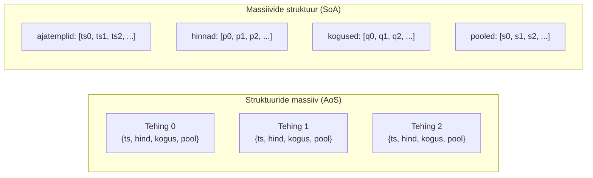
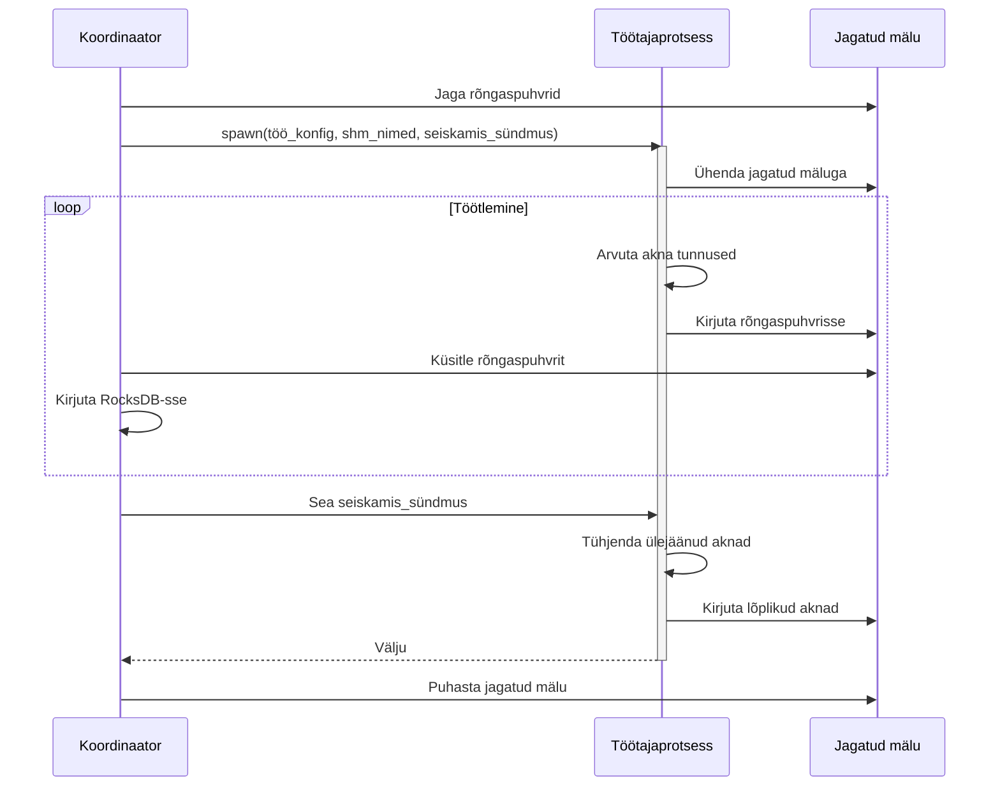

# Tunnuste genereerimine turuandmetest: paralleelne aknastatud lähenemine

Käesolev peatükk esitleb terviklikku tunnuste genereerimise konveierit kõrgsagedusliku krüptovaluutade turuandmete jaoks, käsitledes reaalajas agregeerimise arvutuslikke väljakutseid mitme kauplemispaari ja börsi lõikes. Süsteem rakendab ajaaknapõhist tunnuste eraldamist tehingusündmustest ja orderiraamatu hetkeseisudest (_order book snapshots_), kasutades massiivide-struktuuride (_Structure-of-Arrays_) andmepaigutusi efektiivseks vektoriseeritud arvutuseks ning kohandatud lukuvabasid rõngaspuhvreid (_lock-free ring buffers_) protsessidevaheliseks suhtluseks. Arhitektuur saavutab paralleeltöötluse kauplemissümbolite lõikes, säilitades samas deterministlikud aknapiirid ning toetades nii ajalooliste andmete taasesitust kui reaalajas voogedastusrežiime.

## 1. Sissejuhatus

Tunnuste genereerimine (_feature engineering_) moodustab kriitilise komponendi finantsmasinõppe konveierites, teisendades tooreid turusündmusi tähendusrikasteks statistilisteks agregaatideks, mis sobivad ennustusmudelite jaoks. Krüptovaluutaturgudel, mida iseloomustab pidev 24/7 kauplemine ja alla-millisekundilised sündmuste sagedused, nõuavad tunnuste eraldamise arvutuslikud nõudmised hoolikat tähelepanu mälu efektiivsusele, paralleliseerimisstrateegiatele ja andmete sünkroniseerimismehhanismidele.

Käesolev peatükk kirjeldab Pythonil põhinevat tunnuste genereerimise süsteemi, mis on loodud kahe peamise andmevoo töötlemiseks: tehingute täitmise sündmused ja orderiraamatu hetkeseisud. Süsteem arvutab fikseeritud intervalliga akna-agregaate vahemikus 30 sekundist mitme minutini, eraldades statistilisi tunnuseid, mis hõlmavad hinnadünaamikat, mahumustreid, likviidsusomadusi ja mikrostruktuuri signaale.

### 1.1 Disaini eesmärgid

Rakendus seab prioriteediks mitu võtmeeesmärki:

1. **Arvutuslik efektiivsus**: NumPy vektoriseeritud operatsioonide kasutamine matemaatiliste arvutuste delegeerimiseks optimeeritud C/Fortrani [BLAS](https://numpy.org/doc/stable/reference/routines.linalg.html) rutiinidele, vältides Pythoni interpretaatori üldkulu numbriliste operatsioonide puhul
2. **Paralleelne skaleeritavus**: tunnuste arvutuse jaotamine mitme protsessi vahel, et kasutada mitmetuumalisi CPU arhitektuure, vältides samas globaalse interpretaatori luku (_[Global Interpreter Lock](https://docs.python.org/3/glossary.html#term-global-interpreter-lock)_, GIL) konflikte
3. **Mälu efektiivsus**: massiivide-struktuuride paigutuste ja null-koopia andmejuurdepääsumustrite rakendamine mälujaotuste ja vahemälu puudujääkide minimeerimiseks
4. **Deterministlik taasesitus**: järjekindla tunnuste arvutuse toetamine ajalooliste andmete taasesituste lõikes kontrollpunktipõhise taastamise ja joondatud aknapiiride kaudu
5. **Reaalajas töötlemine**: sujuva ülemineku võimaldamine ajalooliste andmete töötlemisest reaalajas voo tarbimisele ilma teenuse katkestuseta

### 1.2 Pythoni rakenduse põhjendus

Kuigi Pythoni dünaamiline tüüpimine ja interpreteeritud täitmismudel kehtestavad jõudluskaristusi skalaaroperatsioonide jaoks, pakub keel võrdlematut juurdepääsu küpsetele numbrilise arvutuse ökosüsteemidele. NumPy ndarray (_n-dimensional array_ ehk mitmemõõtmeline massiiv) rakendus delegeerib massiivi operatsioone kõrgelt optimeeritud lineaaralgebra teekidele (BLAS/LAPACK), saavutades vektoriseeritud arvutuste puhul jõudluse, mis on võrreldav natiivsete C rakendustega. See omadus teeb Pythoni eriti sobivaks pakett-orienteeritud statistiliste agregatsioonide jaoks, kus andmeid saab korraldada järjestikustesse massiividesse ja töödelda vektoriseeritud primitiivide kaudu.

Tunnuste genereerimise konveier kasutab seda paradigmat, kogudes turusündmusi tüübitud mälupuhvritesse (`array.array`), seejärel teisendades need NumPy vaadeteks vektoriseeritud tunnuste arvutuseks, minimeerides seeläbi Pythoni-taseme iteratsiooni ja maksimeerides optimeeritud numbriliste tuumade kasutamist.

## 2. Aknastamise arhitektuur

Süsteem kasutab fikseeritud intervalliga ajaaknaid ajaliseks agregeerimiseks, arvutades sõltumatuid tunnuste komplekte iga diskreetse ajaperioodi jaoks.

### 2.1 Akna joondamine ja piiri määramine

Aknapiirid määratakse Unix-i epohhi millisekundite ajatemplite täisarvulise jagamise kaudu konfigureeritud akna suurusega:

```
window_start = (event_timestamp_ms // window_size_ms) * window_size_ms
window_end = window_start + window_size_ms
```

See joondusstrateegia tagab deterministlikud aknapiirid sõltumatult protsessi käivitusaegadest või teenuse taaskäivitustest, võimaldades järjekindlat tunnuste arvutust hajutatud töötajate ja ajalooliste taasesitusseansside lõikes.

### 2.2 Akna käsitleja olekumasin

Iga aknatöötaja hoiab kahepuhvrilist olekumasinat, et käsitleda piiride üleminekuid ilma andmekadudeta. Kuna andmed saabuvad ajaliselt järjestikustena, piisab kahest puhvrist: praegusesse aknasse jäävad sündmused kogutakse primaarsesse puhvrisse ja järgmisse järjestikusesse aknasse jäävad sündmused sekundaarsesse puhvrisse. Sündmused, mis jäävad järgmisest aknast kaugemale, käivitavad praeguse akna väljastamise, millele järgneb puhvrite rotatsioon.

See lähenemine garanteerib, et akna üleminekute ajal ei hüljata ühtegi sündmust, säilitades samas O(1) sündmuse sisestamise keerukuse.

### 2.3 Kontrollpunktipõhine taastamine

Ajalooliste andmete töötlemiseks rakendab süsteem kontrollpunkti taastamist, et vältida liiast arvutust. Töötajad skaneerivad väljundsalvestuse (RocksDB) viimased kirjed, et määrata viimane edukalt arvutatud akna ajatempel iga (platvorm, sümbol, akna_suurus, liik) kombinatsiooni jaoks. Skaneerimisel rakendatakse binaarotsingut, mis kasutab RocksDB sorteeritud võtmete omadusi, et efektiivselt leida alguspositsioon potentsiaalselt mitmemiljonilistes andmekogumites, vältides täielikke tabeli skaneerimisi töötaja taaskäivitustel.

### 2.4 Kaherežiimiline töö

Töötajad töötavad kahes järjestikuses režiimis:

1. **Ajalooline järelejõudmise režiim**: itereerimine läbi RocksDB-s salvestatud sündmuste määratud kontrollpunktist, töötlemine maksimaalse läbilaskevõimega, mida piirab ainult I/O ja arvutusvõimsus
2. **Reaalajas voogesitusrežiim**: sündmuste tarbimine ülesvoolu sillateenustest ZeroMQ avaldamis-tellimis pesade (_publish-subscribe sockets_) kaudu

Režiimide vaheline üleminek on sujuv, kusjuures deduplikatsiooni loogika võrdleb sündmuste ajatempleid kontrollpunkti lävega, et hüljata kattuvad sündmused, mis esinevad nii ajaloolises salvestuses kui reaalajas voo puhvris.

## 3. Tehingutunnuste eraldamine

Tehingusündmused esindavad täidetud turutehinguid, mida iseloomustavad ajatempel, hind, kogus, pool (_side_ - ost/müük) ja orderi tüüp (turu/limiit). Süsteem agregeerib need üksikud sündmused statistilisteks tunnusteks, mis hõlmavad hinnadünaamikat ja mahuomadusi.

### 3.1 Massiivide-struktuuride andmepaigutus

Selle asemel, et salvestada tehingusündmusi struktuuride massiivina (_Array of Structures_, AoS), kasutab süsteem massiivide-struktuuride (_Structure-of-Arrays_, SoA) paigutust:



See paigutus pakub mitmeid jõudluseeliseid:

1. **Vektoriseerimine**: NumPy operatsioonid saavad töödelda terveid massiive ilma Pythoni-taseme iteratsioonita
2. **Vahemälu lokaalsus**: ühe välja operatsioonid (nt kõik hinnad) pääsevad ligi järjestikusele mälule
3. **Mälu efektiivsus**: puudub Pythoni objekti üldkulu või täitebaidid väljade vahel
4. **Null-koopia vaated**: otsene puhvri juurdepääs läbi `memoryview` ilma andmete kopeerimiseta

### 3.2 Tüübitud puhvri rakendus

SoA rakendus kasutab Pythoni `array.array` moodulit tüübitud homogeensete puhvrite jaoks:

- `timestamps`: `array('q')` - märgiga 64-bitised täisarvud
- `prices`: `array('d')` - topelttäpsusega ujukomaarvud
- `quantities`: `array('d')` - topelttäpsusega ujukomaarvud
- `sides`: `array('B')` - märgita 8-bitised täisarvud
- `order_types`: `array('B')` - märgita 8-bitised täisarvud

Puhvrid initsialiseeritakse 2048 elemendi mahutavusega, kasvades täitumisel 2x. See eksponentsiaalne kasvustrateegia amortiseerib ümberjaotuse kulud O(1)-le sisestuse kohta akna eluea jooksul.

### 3.3 Null-koopia NumPy teisendus

Akna väljastamise ajal teisendatakse tüübitud massiivid NumPy vaadeteks ilma andmete kopeerimiseta:

```python
n = self.i  # kogutud sündmuste arv
ts = np.frombuffer(memoryview(self.ts), dtype=np.int64, count=n)
prices = np.frombuffer(memoryview(self.price_u), dtype=np.float64, count=n)
quantities = np.frombuffer(memoryview(self.qty_u), dtype=np.float64, count=n)
sides = np.frombuffer(memoryview(self.side), dtype=np.uint8, count=n)
```

`memoryview` protokoll pakub puhvri liidese juurdepääsu, samas kui `np.frombuffer` loob NumPy massiivid, mis viitavad aluseks olevale mälule ilma jaotuse või kopeerimiseta.

### 3.4 Arvutatud tehingutunnused

Süsteem eraldab tehingu akendest mitu tunnuste kategooriat:

#### 3.4.1 OHLCV tunnused

Klassikalised küünlajala (_candlestick_) andmed, mis esindavad hinnatoimingut akna sees:

| Tunnus            | Kirjeldus               | Arvutus          |
| ----------------- | ----------------------- | ---------------- |
| Open (avamine)    | Esimese tehingu hind    | `price[0]`       |
| High (kõrgeim)    | Maksimaalne tehinguhind | `price.max()`    |
| Low (madalaim)    | Minimaalne tehinguhind  | `price.min()`    |
| Close (sulgemine) | Viimase tehingu hind    | `price[-1]`      |
| Volume (maht)     | Kogu kauplemiskogus     | `quantity.sum()` |

#### 3.4.2 Mahukaalutud mõõdikud

Tunnused, mis hõlmavad nii hinna kui koguse informatsiooni:

| Tunnus              | Kirjeldus                                                                             | Arvutus                        |
| ------------------- | ------------------------------------------------------------------------------------- | ------------------------------ |
| Hinna-mahu korrutis | VWAP (_Volume-Weighted Average Price_ ehk mahukaalutud keskmine hind) arvutuse lugeja | `sum_pv = Σ(price * quantity)` |
| Ostude maht         | Ostude poole tehingute kogu kogus                                                     | `side == 0`                    |
| Müükide maht        | Müükide poole tehingute kogu kogus                                                    | `side == 1`                    |

#### 3.4.3 Log-tootluse agregaadid

Selle asemel, et salvestada täielikke tootluse jadasid, arvutab süsteem ühendatavaid momendi agregaate:

| Tunnus                   | Kirjeldus                                      | Arvutus                                           |
| ------------------------ | ---------------------------------------------- | ------------------------------------------------- |
| Log-tootluste summa      | Võimaldab keskmise tootluse arvutamist         | `sum_logret = Σ(log(price[i+1]) - log(price[i]))` |
| Ruut-log-tootluste summa | Võimaldab realiseeritud dispersiooni hindamist | `sum_logret2 = Σ(log-return²)`                    |
| Kuup-log-tootluste summa | Hõlmab asümmeetriakomponenti (_skewness_)      | `sum_logret3 = Σ(log-return³)`                    |

Rakendus käsitleb null- või negatiivseid hindu (potentsiaalsed andmevead), määrates kehtetud kirjed NaN-iks ja kasutades robustse agregeerimise jaoks `np.nansum`-i:

```python
mask_pos = price > 0.0
np.log(price, out=logp, where=mask_pos)
logp[~mask_pos] = np.nan
lr = np.diff(logp)
sum_logret = np.nansum(lr)
```

#### 3.4.4 Ajatunnused

Ajalised omadused, mis hõlmavad kauplemisaktiivsuse mustreid:

| Tunnus                                | Kirjeldus                                     | Arvutus                       |
| ------------------------------------- | --------------------------------------------- | ----------------------------- |
| Esimene ajatempel                     | Aknas esimese tehingu ajatempel               | `ts[0]`                       |
| Viimane ajatempel                     | Aknas viimase tehingu ajatempel               | `ts[-1]`                      |
| Tehingutevaheliste intervallide summa | Võimaldab keskmise saabumismäära arvutamist   | `sum_dt = Σ(ts[i+1] - ts[i])` |
| Maksimaalne lõhe                      | Pikim intervall järjestikuste tehingute vahel | `max(ts[i+1] - ts[i])`        |

Need tunnused võimaldavad tehingute saabumismäärade hindamist ja tegevusetusperioodide tuvastamist.

#### 3.4.5 Suuruse jaotuse tunnused

Äärmuslike väärtuste statistika, mis hõlmab tehingu suuruse omadusi:

| Tunnus                     | Kirjeldus                                           | Arvutus          |
| -------------------------- | --------------------------------------------------- | ---------------- |
| Minimaalne tehingu suurus  | Peegeldab jaeklientide aktiivsuse taset             | `quantity.min()` |
| Maksimaalne tehingu suurus | Võib viidata institutsionaalsetele plokktehingutele | `quantity.max()` |

### 3.5 Tunnuste püsivusvorming

Arvutatud tunnused serialiseeritakse MessagePack-i abil `TradeWindowAggregate` struktuuri, mis sisaldab kõiki eraldatud mõõdikuid. Binaarne kodeering minimeerib salvestuse üldkulu, säilitades samas kiire serialiseerimis-/deserialiseerimise jõudluse järgnevaks ML konveieri tarbimiseks.

## 4. Orderiraamatu tunnuste eraldamine

Orderiraamatu hetkeseisud esindavad ootelolevate limiitorderite hetkeseisu erinevatel hinnatasemetel, pakkudes ülevaadet turu likviidsusest ja hinnasurvest.

### 4.1 Orderiraamatu oleku haldamine

Süsteem hoiab ülal reaalajas orderiraamatu rekonstruktsiooni börsipoolsetest hetkeseisudest ja järkjärgulistest uuendustest.

#### 4.1.1 Sorteeritud orderiraamatu struktuur

Kumbagi poolt (pakkumine/küsimine ehk _bid/ask_) esindab `_SideBook` struktuur, mis hoiab:

- `prices`: sorteeritud hinnatasemete loend (kasvavas järjekorras)
- `volumes`: sõnastik, mis seob hinna → koguse sellel tasemel
- `total_qty`: kõigi koguste jooksev summa (O(1) sügavuse päring)
- `total_notional`: hinna × koguse jooksev summa (O(1) nominaalväärtus)

Sorteeritud hindade loend võimaldab O(1) parima hinna juurdepääsu:

- Pakkumiste pool: `best_bid = prices[-1]` (kõrgeim hind)
- Küsimiste pool: `best_ask = prices[0]` (madalaim hind)

#### 4.1.2 Järkjärguline uuendusalgoritm

Orderiraamatu uuendused modifitseerivad üksikuid hinnatasemeid kolme operatsiooni kaudu:

1. **Taseme lisamine**: uus hinnatase sisestatakse binaarotsingu kaudu (`bisect.insort`), kiirtee optimeerimistega lisamiseks parimatesse/halvematesse hindadesse
2. **Taseme uuendamine**: olemasolevat taset modifitseeritakse `volumes` sõnastikus, jooksvaid agregaate kohandatakse delta võrra
3. **Taseme eemaldamine**: tase kustutatakse, kui kogus jõuab nullini, jooksvaid agregaate vähendatakse

Jooksvate agregaatide hooldus elimineerib vajaduse täieliku orderiraamatu läbimise järele totaalse sügavuse või VWAP arvutamisel:

```python
# Taseme lisamisel
self.total_qty += volume
self.total_notional += price * volume

# Taseme uuendamisel
delta = new_volume - old_volume
self.total_qty += delta
self.total_notional += price * delta

# Taseme eemaldamisel
self.total_qty -= volume
self.total_notional -= price * volume
```

### 4.2 Ajakaalutud tunnuste akumulatsioon

Erinevalt tehingusündmustest, mis toimuvad diskreetsetel hetkedel, püsib orderiraamatu olek uuenduste vahel. Süsteem rakendab ajakaalutud keskmiseid, et korrektselt arvestada iga oleku jälgitavuse kestust.

#### 4.2.1 Ajakaalu arvutamine

Iga orderiraamatu uuenduse jaoks ajatempliga `t_curr` on _eelmisele_ olekule määratud kaal:

```
w = t_curr - t_prev
```

See kestuspõhine kaalumine tagab, et pikaajalised olekud panustavad akna agregaatidesse proportsionaalselt rohkem kui mööduvad olekud.

#### 4.2.2 Akumuleeritud tunnused

`OrderBookAccumulator` struktuur hoiab kaalutud tunnuste jooksvaid summasid:

**Keskhind ja mikrohind**:

| Tunnus     | Kirjeldus                     | Arvutus                          |
| ---------- | ----------------------------- | -------------------------------- |
| `sw_mid`   | Keskhindade ajakaalutud summa | `Σ(w * (ba + bb)/2)`             |
| `sw_micro` | Mikrohinna ajakaalutud summa  | `Σ(w * (ba*bq + bb*aq)/(bq+aq))` |

Mikrohind hõlmab parima taseme suuruse informatsiooni, pakkudes peenemat hinnasignaali kui lihtne keskhind, kui orderivoog ei ole tasakaalus.

**Hinnavahe mõõdikud**:

| Tunnus       | Kirjeldus                                           | Arvutus            |
| ------------ | --------------------------------------------------- | ------------------ |
| `sw_spread`  | Hinnavahe ajakaalutud summa                         | `Σ(w * (ba - bb))` |
| `spread_min` | Minimaalne jälgitud hinnavahe (tihedaim likviidsus) | `min(ba - bb)`     |
| `spread_max` | Maksimaalne jälgitud hinnavahe (laiem likviidsus)   | `max(ba - bb)`     |

**Sügavus ja tasakaalustamatus**:

| Tunnus   | Kirjeldus                            | Arvutus                      |
| -------- | ------------------------------------ | ---------------------------- |
| `sw_bid` | Kogu pakkumismahu ajakaalutud summa  | `Σ(w * total_bid_volume)`    |
| `sw_ask` | Kogu küsimismahu ajakaalutud summa   | `Σ(w * total_ask_volume)`    |
| `sw_imb` | Tasakaalustamatuse ajakaalutud summa | `Σ(w * (bid-ask)/(bid+ask))` |

**Parima taseme suurused**:

| Tunnus           | Kirjeldus                                    | Arvutus                |
| ---------------- | -------------------------------------------- | ---------------------- |
| `sw_bid_best_sz` | Parima pakkumise suuruse ajakaalutud väärtus | `Σ(w * best_bid_size)` |
| `sw_ask_best_sz` | Parima küsimise suuruse ajakaalutud väärtus  | `Σ(w * best_ask_size)` |

Need tunnused hõlmavad likviidsuse kontsentratsiooni raamatu tipus.

#### 4.2.3 Võrgus dispersiooni arvutamine

Keskhinna volatiilsuse hindamiseks ilma täieliku hinnajaloo salvestamiseta rakendab süsteem [Welfordi paralleelset algoritmi](https://en.wikipedia.org/wiki/Algorithms_for_calculating_variance#Welford's_online_algorithm) ajakaalutud dispersiooni jaoks:

```python
w_old, mean_old = acc.n_w, acc.mean_mid
w_new = w_old + w
delta = mid - mean_old
mean_new = mean_old + (w * delta) / w_new
acc.M2_mid += w * (mid - mean_new) * (mid - mean_old)
acc.n_w = w_new
acc.mean_mid = mean_new
```

Dispersiooni saab arvutada kui `M2_mid / n_w`, võimaldades volatiilsuse hindamist ühe läbimisega ilma üksikute vaatluste salvestamiseta.

#### 4.2.4 Sündmuste loendamine

Lisaks pidevate agregaatidele jälgib süsteem diskreetseid mikrostruktuuri sündmusi:

| Tunnus             | Kirjeldus                             |
| ------------------ | ------------------------------------- |
| `n_mid_up`         | Keskhinna tõusude arv                 |
| `n_mid_down`       | Keskhinna languste arv                |
| `n_spread_widen`   | Hinnavahe laienemiste arv             |
| `n_spread_tighten` | Hinnavahe ahenemiste arv              |
| `n_updates`        | Orderiraamatu uuenduste koguarv aknas |

Need loendured pakuvad täiendavat informatsiooni turu dünaamikast lisaks ajakaalutud keskmistele.

#### 4.2.5 Sulgemise tunnused

Akna piiril jäädvustab süsteem lõpliku raamatu oleku hetkeseisu:

| Tunnus           | Kirjeldus                              | Arvutus                   |
| ---------------- | -------------------------------------- | ------------------------- |
| `close_mid`      | Lõplik keskhind                        | `(ba + bb)/2`             |
| `close_spread`   | Lõplik hinnavahe                       | `ba - bb`                 |
| `close_bb`       | Lõplik parim pakkumise hind            | `best_bid`                |
| `close_ba`       | Lõplik parim küsimise hind             | `best_ask`                |
| `close_bq0`      | Lõplik parim pakkumise suurus          | `best_bid_size`           |
| `close_aq0`      | Lõplik parim küsimise suurus           | `best_ask_size`           |
| `close_best_imb` | Lõplik parima taseme tasakaalustamatus | `(bq0 - aq0)/(bq0 + aq0)` |

Need tunnused säilitavad akna lõpu oleku akendetevaheliseks analüüsiks ja momentumindikaatoriteks.

### 4.3 Tunnuste serialiseerimine

Orderiraamatu tunnused serialiseeritakse MessagePack-i kaudu `OrderBookAccumulator` struktuuri. Ajakaalutud summad nõuavad järeltöötlust tegelike ajakaalutud keskmiste arvutamiseks:

```
TWAP_mid = sw_mid / sw
TWAP_spread = sw_spread / sw
variance = M2_mid / n_w
```

See jagamine teostatakse ML konveieris, mitte tunnustöötajas, võimaldades aknaid ühendada pikemate ajahorisonntide lõikes akumulaatorite summeerimise teel.

## 5. Mitmeprotsessiline paralleliseerimine

Mitmetuumaliste CPU arhitektuuride ärakasutamiseks ja Pythoni globaalse interpretaatori luku vältimiseks jaotab süsteem tunnuste arvutuse sõltumatute töötajaprotsesside vahel.

### 5.1 Töö jaotamise strateegia

Süsteem partitsioneerib töö mitmes dimensioonis: platvorm, sümbol, akna suurus ja andmete liik (tehing või orderiraamat). Nelja dimensiooni Descartes'i korrutis genereerib tööühikud, näiteks (binance, BTC_USDT, 30s, tehing). Seejärel ühendatakse tööühikuid seni, kuni töötajate arv vastab CPU tuumade arvule. Ühendamisalgoritm grupeerib tööühikud platvormi ja liigi järgi, eelistades kombineerida sümboleid, mis jagavad neid atribuute, et maksimeerida andmete lokaalsust RocksDB lugemistel.

### 5.2 Protsessi isolatsiooni eelised

Iga töötajaprotsess toimib täielikus isolatsioonis:

1. **GIL-i vältimine**: NumPy operatsioonid eraldi protsessides käivituvad tõeliselt paralleelselt
2. **Mälu isolatsioon**: jagatud kuhi puudub, elimineerides vale jagamise ja vahemälu rea põrkumise
3. **Vea isolatsioon**: töötaja kokkujooksmised ei mõjuta koordinaatorit ega õdeprotsesse
4. **Sõltumatu kontrollpunktimine**: iga töötaja hoiab eraldi kontrollpunkti olekut

### 5.3 Töötaja elutsükli haldamine

Koordinaatorprotsess haldab töötajate elutsükleid mitme mehhanismi kaudu:



**Graatsiline seiskamine**: jagatud `multiprocessing.Event` signaliseerib töötajatele, et lõpetada praegused aknad ja väljuda puhtalt.

**Aegumisel lõpetamine**: töötajad, kes ei vasta 5 sekundi jooksul, lõpetatakse sunniviisiliselt läbi `process.terminate()`.

**Ressursside puhastamine**: jagatud mälu segmendid suletakse ja eemaldatakse selgesõnaliselt, et vältida ressursside lekkeid.

## 6. Kohandatud muutuva laiusega rõngaspuhver

Protsessidevaheline kommunikatsioon tunnustöötajate ja salvestuskoordinaatori vahel kasutab kohandatud lukuvaba rõngaspuhvri (_lock-free ring buffer_) rakendust, mis on optimeeritud muutuva suurusega sõnumite jaoks.

### 6.1 Arhitektuuri põhjendus

Pythoni standard `multiprocessing.Queue` kasutab pickle serialiseerimist ja sisemisi lukke, tekitades üldkulu, mis ei sobi kõrgsageduslikuks sõnumite edastamiseks. Kohandatud rõngaspuhver elimineerib need kulud läbi:

1. **Null-serialiseerimine**: sõnumid on eelserializeeritud (MessagePack) enne rõngaspuhvrisse sisestamist
2. **Lukuvaba toiming**: üksik-tootja üksik-tarbija muster ei nõua mutex-operatsioone
3. **Null-koopia lugemised**: otsene mälu vaate juurdepääs ilma vahepuhverdamiseta

### 6.2 Sõnumi vorming

Iga sõnum rõngaspuhvris järgib muutuva laiusega vormingut:

```
┌──────────────┬──────────────┬──────────────┬──────────────┐
│  võtme_pikkus│väärtuse_pikks│  võtme_baidid│väärtuse_baidid│
│   (4 baiti)  │   (4 baiti)  │  (muutuv)    │  (muutuv)    │
└──────────────┴──────────────┴──────────────┴──────────────┘
```

Pikkuse väljad on märgita 32-bitised täisarvud little-endian vormingus. Võti sisaldab tavaliselt akna metaandmeid (platvorm, sümbol, akna_lõpp, akna_suurus, liik), samas kui väärtus sisaldab serialiseeritud tunnuste agregaati.

### 6.3 Rõngaspuhvri struktuur

Rakendus kasutab kahte jagatud mälu segmenti:

#### 6.3.1 Andmepuhver

4MB ringpuhver, mis salvestab sõnumite kasuliku koormuse:

```
Suurus: 2²² baiti (4 194 304 baiti)
Mask: 0x3FFFFF (efektiivseks ümberkeerdumiseks bitipõhise JA kaudu)
```

Kahe astme suurus võimaldab efektiivset mooduloperatsiooni bitipõhise JA kaudu:

```python
next_offset = (current_offset + message_length) & mask
```

#### 6.3.2 Indekspuhver

24-baidine metaandmete puhver, mis salvestab lugemis-/kirjutamispositsioone:

```
┌─────────────────────────────────────────┐
│ r_from (4B) │ w_end_marker (4B) │ w_to (4B) │  Primaarne koopia (12B)
├─────────────────────────────────────────┤
│ r_from (4B) │ w_end_marker (4B) │ w_to (4B) │  Redundantne koopia (12B)
└─────────────────────────────────────────┘
```

**Väljad**:

- `r_from_offset`: järgmine positsioon, kust lugeda
- `w_end_marker`: ümberkeerdumise positsiooni marker (vt §6.4)
- `w_to_offset`: järgmine positsioon, kuhu kirjutada

### 6.4 Ümberkeerdumise tuvastamine

Kui kirjutamispositsioon jõuab puhvri lõppu ja keerdub tagasi algusesse, ei tohi lugeja tarbida andmeid, mida pole veel praeguses ringis kirjutatud. Lõpu marker jälgib seda olekut:

**Markeri semantika**:

- `-1`: lugeja on ümber keerdunud (lähtestatud 0-le)
- `0`: kirjutaja pole alates initsialiseerimisest veel ümber keerdunud
- `>0`: absoluutne baitide nihe, kus kirjutaja keerdus ümber (enne maskeerimist)

**Kirjutaja loogika**:

```python
new_offset = current_offset + message_length
new_offset_masked = new_offset & mask

if new_offset > new_offset_masked:  # Ümberkeerdumine toimus
    end_marker = new_offset  # Salvesta eelmaskeerimise positsioon
```

**Lugeja loogika**:

```python
if end_marker > 0:  # Kirjutaja on ümber keerdunud
    if read_offset >= write_offset:  # Ei saa kirjutajast mööduda
        return None  # Puhver täis
```

### 6.5 Rebenenud lugemise kaitse

Aatomiliste 24-baidiste kirjutuste puudumisel võidakse indekspuhvrit lugeda osalise uuenduse ajal, andes ebajärjekindla oleku. Süsteem kasutab redundantset topeltkirjutuse valideerimist:

**Kirjutaja**: uuendab nii primaarset (baidid 0-11) kui redundantset (baidid 12-23) koopiat järjestikku

**Lugeja**: pöörleb, kuni mõlemad koopiad ühtivad:

```python
while True:
    r1, m1, w1, r2, m2, w2 = struct.unpack(INDEX_FMT, index_buf)
    if r1 == r2 and m1 == m2 and w1 == w2:
        return (r1, m1, w1)  # Järjekindel lugemine
```

See tagab, et lugeja ei jälgi kunagi osalisi uuendusi, pakkudes lineariseeritavat semantikat ilma lukkudeta.

### 6.6 Vasturõhu käsitlemine

Kui puhver on täis (kirjutamispositsioon möödaks lugemispositsioonist), tagastab kirjutaja `False`:

```python
if write_offset >= read_offset:  # Kirjutaja on lugejast ees
    return False  # Ei saa kirjutada ilma loetamata andmeid üle kirjutamata
```

Kutsuv töötaja rakendab kiirootamist eksponentsiaalse taandumisega:

```python
while not ring_buffer.write(data_buf, index_buf, mask, key, value):
    time.sleep(0.01)  # 10ms vasturõhu viivitus
```

See voolu juhtimise mehhanism hoiab ära andmekao, signaliseerides samas koordinaatori küllastumist.

### 6.7 Jõudluse analüüs

Empiiriline võrdlusuurimine 337-baidiste MessagePack-kodeeritud `TradeWindowAggregate` sõnumitega erinevate sõnumimahtude lõikes demonstreerib kohandatud rõngaspuhvri rakenduse järjepidevaid jõudluseeliseid (mõõdetud Apple M3 Pro peal 36GB RAM-iga):

| Sõnumite arv | Rõngaspuhver                  | Queue + baidid                | Queue + objektid              | Kiirenemine vs Queue+baidid | Kiirenemine vs Queue+objektid |
| ------------ | ----------------------------- | ----------------------------- | ----------------------------- | --------------------------- | ----------------------------- |
| 100 000      | 2,15 μs/sõn<br/>464 576 sõn/s | 6,39 μs/sõn<br/>156 510 sõn/s | 8,90 μs/sõn<br/>112 399 sõn/s | 3,0×                        | 4,1×                          |
| 1 000 000    | 1,67 μs/sõn<br/>597 054 sõn/s | 5,95 μs/sõn<br/>168 200 sõn/s | 8,43 μs/sõn<br/>118 679 sõn/s | 3,5×                        | 5,0×                          |
| 10 000 000   | 1,64 μs/sõn<br/>611 310 sõn/s | 5,96 μs/sõn<br/>167 678 sõn/s | 8,71 μs/sõn<br/>114 828 sõn/s | 3,6×                        | 5,3×                          |

Lukuvaba rõngaspuhver saavutab **3,6× kiirema jõudluse** kui `multiprocessing.Queue` eelserializeeritud baitidega ja **5,3× kiirema** kui Queue pickle-serialiseeritud objektidega skaalal (10M sõnumit). Jõudlusomadused paranevad sõnumimahu kasvades, kuna protsessi käivitamise üldkulu amortiseerub ja CPU vahemälu soojenemine stabiliseerub, püsiseisundi latentsus koondub 1,64 μs/sõnumile. Queue-põhiste lähenemiste järjekindel ~6 μs/sõnumi üldkulu peegeldab mutex-sünkroniseerimise fundamentaalseid kulusid, mida ei saa ära optimeerida, samas kui rõngaspuhvri lukuvaba disain elimineerib need süsteemikutsete kitsaskohad täielikult.

Puhvri mahutavus: 4 194 304 baiti, toetades ~7 000–10 000 sõnumit töötaja kohta, pakkudes ~10 sekundit puhverdamist tüüpiliste 30-sekundiliste akna sageduste juures enne, kui vasturõhk signaliseerib koordinaatori küllastumist.

### 6.8 Koordinaatori küsitlusstrateegia

Koordinaator küsitleb perioodiliselt kõigi töötajate rõngaspuhvreid, lugedes saadavalolevad sõnumid ja kirjutades need RocksDB-sse. Kui ühelgi töötajal pole uusi sõnumeid, ootab koordinaator veidi enne järgmist küsitlustsüklit, vältides seeläbi CPU poomist.

## 7. Jõudluse kaalutlused

Süsteemi jõudlusomadused on optimeeritud kolmes dimensioonis. Mälu efektiivsus on tagatud SoA andmestruktuuridega: üks töötajaprotsess kasutab ~2,2 MB mälu 10 sümboli ja kahe andmeliigi töötlemiseks, jäädes 8-tuumalise süsteemi puhul kokku ~20 MB piiresse, mis mahub täielikult CPU L3 vahemällu. Arvutuslik keerukus on lineaarne: tehingutunnuste eraldamine toimub \(O(n)\) keerukusega vektoriseeritud NumPy operatsioonide kaudu, orderiraamatu tunnuste eraldamine \(O(k \log m)\) keerukusega, kus \(k\) on uuenduste arv ja \(m\) hinnatasemete arv (~100). Paralleliseerimine saavutab peaaegu lineaarse kiirenduse 0,85C kuni 0,95C, kus \(C\) on CPU tuumade arv; efektiivsuse kaotus tuleneb koordinaatori üldkulust (~5% CPU), ebaühtlasest töö jaotusest ja [NUMA](https://en.wikipedia.org/wiki/Non-uniform_memory_access) (_Non-Uniform Memory Access_) efektidest mitme CPU pesa puhul.

## 8. Integratsioon ML konveieriga

### 8.1 Tunnuste püsivus

Arvutatud tunnused salvestatakse RocksDB-sse binaar komposiit-võtmetega:

```
key = pack(window_end_ms, symbol, kind, window_size_ms, platform)
```

See kodeering on järjestatud iga võtmeosa alusel ning võimaldab efektiivseid vahemikupäringuid:

- Ajaline vahemik: `start_ms <= key <= end_ms`
- Sümbolispetsiifiline: prefiksi vastavus sümboli baitidel
- Platvormi isolatsioon: filtreerimine platvormi baidi järgi

### 8.2 Parquet eksport

Eraldi eksporditöötaja skaneerib perioodiliselt RocksDB-d ja materialiseerib tunnused Parquet vormingusse:

```
output/
  date=2025-01-15/
    part-0001.parquet
    part-0002.parquet
  date=2025-01-16/
    part-0001.parquet
```

Kuupäevapõhine partitsioneerimine võimaldab efektiivset [Polars](https://pola.rs/) paralleelset laadimist hajutatud treenimistöödeks.

### 8.3 Tunnuste dekodeerimine

ML konveier dekodeerib binaarseid tunnuseid nõudmisel:

```python
trade_agg = msgpack.decode(value_bytes, TradeWindowAggregate)
features = compute_derived_features(trade_agg)
```

Agregaatidest arvutatud tuletatud tunnused sisaldavad:

- VWAP: `sum_pv / sum_vol`
- Tootluse volatiilsus: `sqrt(sum_logret2 / trade_count)`
- Mahu tasakaalustamatus: `(buy_vol - sell_vol) / sum_vol`
- Keskmine hinnavahe: `sw_spread / sw`

See kaheastmeline lähenemine (agregaatide eraldamine → tuletatud arvutus) võimaldab tunnuste inseneerimise eksperimenteerimist ilma baasagregaatide ümberarvutamiseta.

## 9. Deterministlik taasesitus ja testimine

Kontrollpunktipõhine arhitektuur võimaldab deterministlikku taasesitust mitme kriitilise kasutusjuhu jaoks. Masinõppe mudeleid saab hinnata identsete tunnuste jadade peal, taasesitades töötluse samast kontrollpunktist, tagades biti-täpse võrdsuse isegi nädalate või kuude hiljem teostatud arvutustel. Tunnuste eraldamise loogika modifitseerimisel saavad arendajad töödelda ajaloolisi andmeid määratud kontrollpunktidest, kusjuures binaarotsingu optimeerimine teeb selle protsessi efektiivseks isegi mitmekuuliste taasesituste puhul. Lisaks võimaldab arhitektuur A/B testimist, kus alternatiivseid tunnuste definitsioone hinnatakse paralleelsete töötajate abil, tootes eraldi tunnuste komplekte võrdlevaks mudeli treenimiseks.

## 10. Kokkuvõte

Käesolev peatükk on esitlenud terviklikku tunnuste genereerimise süsteemi kõrgsagedusliku krüptovaluutade turuandmete jaoks, käsitledes arvutusliku efektiivsuse ja operatiivse skaleeritavuse kaksikuid väljakutseid. Rakendus demonstreerib mitmeid võtme-arhitektuurimustreid:

1. **Massiivide-struktuuride paigutused** võimaldavad efektiivset vektoriseeritud arvutust läbi NumPy optimeeritud numbriliste tuumade
2. **Mitmeprotsessiline paralleliseerimine** kasutab CPU tuumade arvu ära, vältides samas GIL-i konflikte läbi isoleeritud töötajaprotsesside
3. **Kohandatud lukuvaba protsessidevaheline kommunikatsioon** saavutab madala latentsusega sõnumite edastamise ilma serialiseerimise või sünkroniseerimise üldkuluta
4. **Ajakaalutud akumulatsioon** arvestab korrektselt oleku püsivust pidevates orderiraamatu voogudes
5. **Kontrollpunktipõhine taastamine** võimaldab deterministlikku taasesitust ja järkjärgulist ümbertöötlemist

Süsteem saavutab läbilaskevõime, mis on piisav mitme kauplemispaari reaalajas töötlemiseks börside lõikes, säilitades samas deterministliku tunnuste arvutuse reprodutseeritavate masinõppe eksperimentide jaoks. Tulevane töö võib uurida adaptiivset akna suuruse määramist turuaktiivsuse põhjal, järkjärgulisi tunnuste uuendusi madalama latentsusega ennustamiseks ja kõrgema järgu mikrostruktuuri tunnuste integreerimist nagu orderivoo toksilisus ja turutegija varude signaalid.

Pythoni numbrilise arvutuse ökosüsteemi kombinatsioon hoolikalt arhitekteeritud paralleliseerimise ja mälu haldamisega demonstreerib, et interpreteeritud keeled saavutavad andmeparalleelsete töökoormuste puhul natiivse rakendustega võrreldava jõudluse, eeldusel et arvutus on struktureeritud kasutama vektoriseeritud operatsioone ja minimeerima interpretaatori-taseme iteratsiooni üldkulu.
