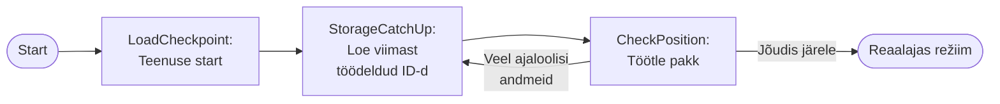
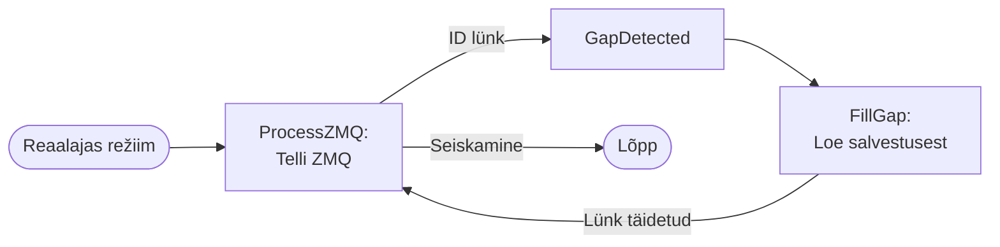
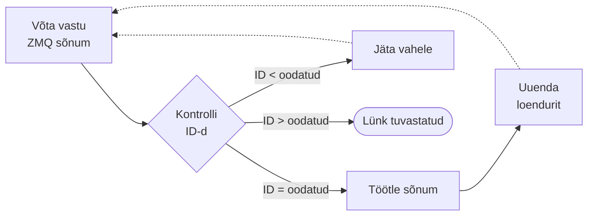
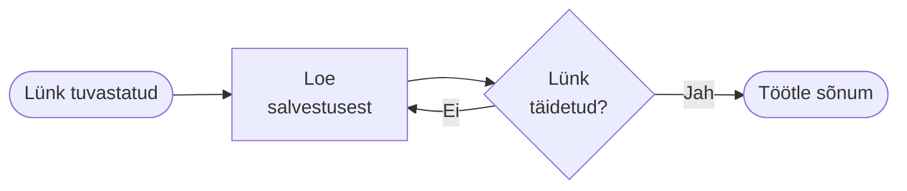
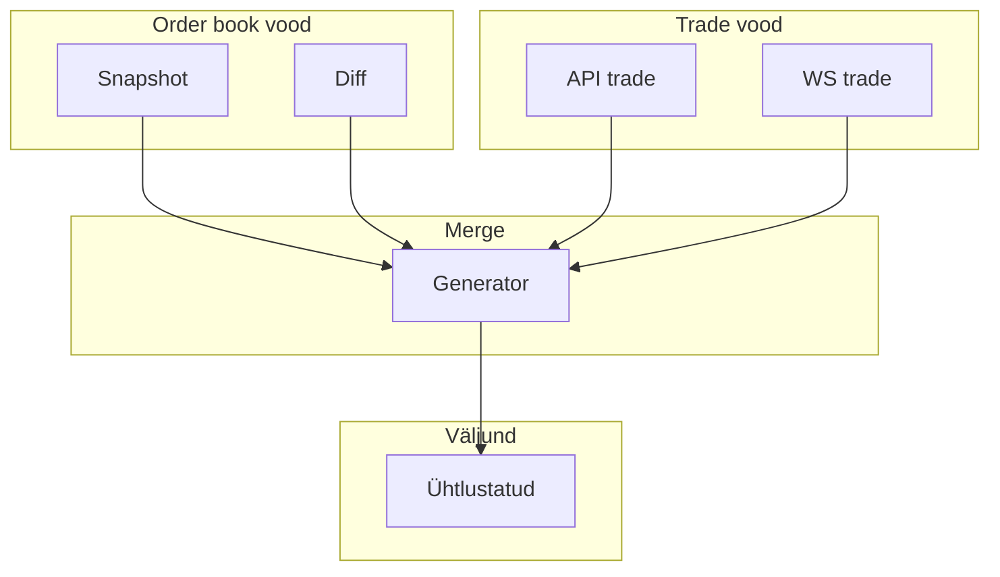
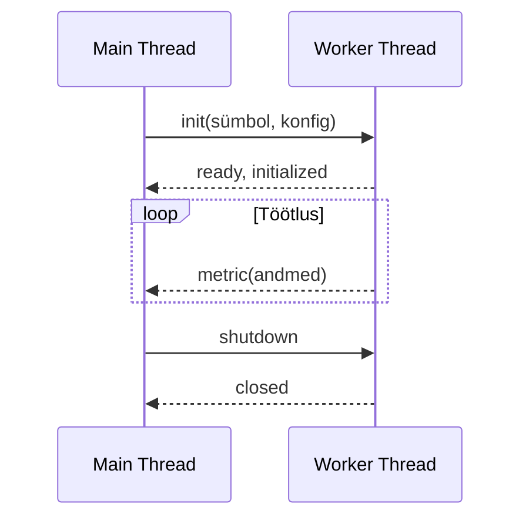
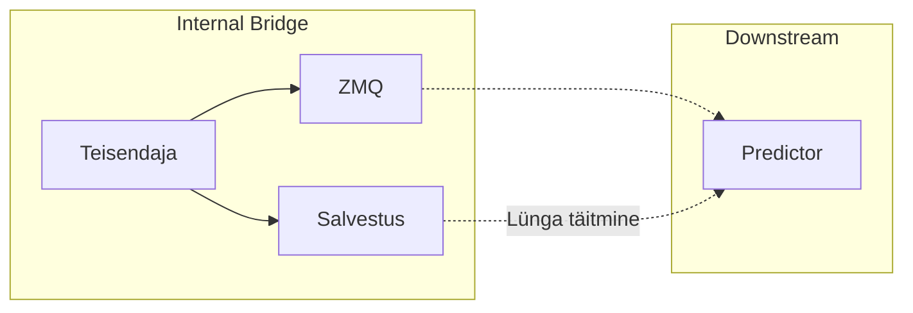

# Internal Bridge: Andmete teisendamise kiht

**internal-bridge** teenus realiseerib andmete teisendamise kihi toore börsipõhise turuinfo ja ühtlustatud formaadi vahel. Komponent lahendab probleemi, kuidas ühendada REST API snapshot'id ja WebSocketi diferentsiaalvood mitmelt börsilt, säilitades järjestusgarantii ja tagades veataluvuse kontrollpunktidel põhinevate taastemehhanismidega.

## Arhitektuuriline ülevaade

internal-bridge töötab olekuga teisendustoruna, mis tarbib toorandmeid external-bridge'ist ja ZeroMQ avaldajatelt, teisendab platvormispetsiifilised vormingud ühtseteks skeemideks ning avaldab normaliseeritud andmed downstream teenustele.

Teenus eristab nelja teisendajatüüpi:

- **Binance'i order book'i teisendaja**: rekonstrueerib järjestuse REST snapshot'idest ja WS diferentsiaaluuendustest
- **Binance'i tehingute teisendaja**: ühendab REST ajaloolised tehingud ja WS tehinguvoo
- **Kraken'i order book'i teisendaja**: töötleb ainult WebSocketi snapshot+diff protokolli
- **Kraken'i tehingute teisendaja**: Binance'iga sarnane deduplitseerimisloogika

Iga teisendaja töötab **iseseisva protsessina**, luues veapiirid ühe börsiintegratsiooni piires.

## Kahe-režiimiline tarbimisstrateegia

: Joonis 3.1 Kahe-režiimiline tarbimisstrateegia olekudiagramm

**Salvestusest järelejõudmise faas**: Käivitumisel laeb teisendaja kontrollpunktist viimase töödeldud sõnumi ID. Salvestuslugeja moodustab konfigureeritava suurusega pakke (10–100 kirjet) RocksDB LSM-puu arhitektuurile sobivaks järjestikuseks skaneerimiseks. Catch-up kestab kuni salvestuse kirjutuspunktile järele jõudmiseni.

**Reaalaja ZMQ töötlus**: Pärast järelejõudmist tarbib teisendaja ZeroMQ avaldajatelt minimaalse latentsusega. Lüngatuvastus võrdleb oodatud ja saadud ID-sid:

- Järjepidev jada: töötle sõnum
- Juba töödeldud: jäta duplikaat vahele
- Lünk: pöördu salvestusse, loe puuduvad sõnumid

: Joonis 3.2 Lüngatuvastuse ja täitmise vooskeem

**Mahajäämuse monitooring**: Reaalaja režiimis jälgitakse perioodiliselt (iga 10 sekundit), kas ZeroMQ-põhine tarbimine hoiab sammu salvestusse kirjutatud andmetega. Võrdlus toimub teisendaja viimati töödeldud sõnumi ID ja salvestuse viimase kirje ID vahel. Kui salvestus on ees (st. external-bridge kirjutab kiiremini kui internal-bridge jõuab töödelda), jääb teenus maha reaalaja voost. Sellisel juhul oodatakse 1 sekund ja kontrollitakse uuesti. Kui mahajäämus püsib, käivitub automaatne restart. Taaskäivitumisel läheb teenus salvestuspõhisesse catch-up režiimi, mis töötleb andmeid pakettidena kiiremini kui sõnum-sõnumilt ZeroMQ-st. Pärast järelejõudmist lülitub teenus automaatselt tagasi reaalaja ZMQ režiimi.

**Märkus**: Kafka puhul ei oleks selline kahe-režiimiline loogika vajalik, kuna Kafka haldab offsette ja salvestust tsentraalselt, võimaldades consumeril jätkata alati õigest positsioonist ilma eraldi catch-up mehhanismideta.

## Voogude liitmine

Liitja kasutab asünkroonset generaatorit mitme sisenditeraatori tarbimiseks ja liidetud väljundpakkide yield'imiseks. Tagasiside-objekt määrab, millistest voogudest on vaja juurde sõnumeid.

: Joonis 3.3 Voogude liitmise arhitektuur

**Sorteerimisstrateegia**: Order book'id sorteeritakse uuendus-ID järgi (snapshot'id eelistatakse); tehinguvood sorteeritakse börsi tehingu-ID järgi.

## Mitme allika deduplitseerimine

Tehingute deduplitseerimine kasutab monotoonselt kasvavaid tehingu-ID-sid. Teisendaja hoiab loendurit `lastEmittedTradeId`. Ajaloolised sõnumid (ID ≤ lastEmitted) jäetakse vahele; kandidaattehingud läbivad teisenduse.

Deduplitseerimisloogika kontrollib iga kandidaatehingu ID-d: kui ID võrdub viimase väljastatud ID pluss üks, väljastatakse tehing kohe; vastasel juhul tuvastatakse lünk ja kontrollitakse, kas tehing esineb mõlemas voos – kui jah, väljastatakse tehing, kui ei, jäädakse ootama lisandmeid.

Püsiva lünga korral (100 tsüklit ilma eduta) käivitub automaatne restart.

## Kontrollpunktidel põhinevad taastemehhanismid

Iga teisendaja hoiab kontrollpunkti olekut iga tarbitava voo kohta (viimane töödeldud ID ja ajatempel). Checkpoint'id salvestatakse eraldi RocksDB instantsides.

**Checkpoint'i käivitid**: Ajapõhine (iga 5 s), mahupõhine (iga 1000 sõnumit), seiskamise checkpoint (graceful shutdown).

Kontrollpunkti salvestamine toimub järgmises järjestuses: teisendatud andmed avaldatakse kohe ZeroMQ kaudu predictorile (asünkroonne fire-and-forget operatsioon minimaalsete latentsusega) ja kogutakse paralleelselt mälupuhvrisse. Perioodiliselt kutsutakse välja `checkpoint()` meetod, mis kirjutab kõigepealt kõik puhverdatud andmepaketid RocksDB-sse ning seejärel uuendab olekufaili viimaseks töödeldud ID-ks. Kui mõlemad operatsioonid on edukalt lõpetatud, naaseb kontroll töötlussilmusele. See arhitektuur tagab, et downstream teenused (predictor) saavad andmed minimaalse latentsusega, samas kui salvestamine toimub optimeeritud pakkidena ilma reaalajavoo blokeerimiseta.

**Kompromiss**: Selline lahendus võimaldab minimaalset latentsust, kuid toob kaasa oleku mittevastavuse riski teisendaja krahhimise korral. Kui teenus kukub enne kontrollpunkti salvestamist, on predictor juba töödelnud ZeroMQ kaudu edastatud sõnumid, kuid need pole salvestuses ega kontrollpunktis. Taaskäivitumisel laeb teisendaja vana kontrollpunkti ja proovib samad sõnumid uuesti saata, põhjustades kas duplikaate või andmekadu, kui sõnumeid ei ole enam ZMQ puhvris. See on pragmaatiline valik latentsuse ja järjepidevuse vahel – reaalajas ennustussüsteemis on mõningate duplikaatide risk aktsepteeritav võrreldes checkpoint'ide sünkroonse salvestamisega kaasnevate latentsuskuludega.

Checkpoint'i rike käivitab teenuse restart'i "fail-fast" käitumisena.

## Järjestuse valideerimine

**Binance'i order book**: Kontrollitakse invarianti `message.U <= lastOrderBookId + 1 && message.u >= lastOrderBookId`. Lünga korral oodatakse uut snapshot'i.

Binance'i order book järjestuse valideerimine toimub järgmiselt: iga diff-sõnumi puhul kontrollitakse kõigepealt, kas sõnumi ülemine järjekorranumber `U` on väiksem või võrdne kui viimane töödeldud number pluss üks (`Last + 1`). Kui see tingimus on täidetud, kontrollitakse teiseks, kas alumine järjekorranumber `u` on suurem või võrdne kui viimane töödeldud number. Kui mõlemad tingimused kehtivad, on tegemist kehtiva jadaga ja sõnum töödeldakse. Kui teine tingimus ei kehti, on tegemist ajaloolise sõnumiga, mida ei töödelda. Kui esimene tingimus ei kehti (st `U > Last + 1`), on tuvastatud jada lünk ja süsteem peab ootama järgmist snapshot'i, et taastada order book järjepidevus.

**Tehingu-ID monotoonsus**: ID ei tohi kunagi väheneda; vähenev ID viitab andmekahjustusele.

## Worker-thread põhine paralleeltöötlus

Binance'i tehingute teisendaja kasutab worker-thread paralleelsust mitme sümboli töötlemiseks.

: Joonis 3.7 Worker-thread suhtluse järjestusdiagramm

Worker'id ei saa kasutada peaprotsessi meetrikainfrastruktuuri. Meetodikutsed pakitakse sõnumiteks ja saadetakse main thread'ile.

## Transform-and-forward muster

internal-bridge salvestab ja avaldab ühtlustatud andmed ZeroMQ kaudu:

: Joonis 3.8 Transform-and-forward andmevoo arhitektuur

## Jõudlus ja operatiivsed omadused

**Jõudlusoptimeeringud**: Pakiorienteeritud töötlus, checkpoint-põhine pakkimine (1000 sõnumit ühe operatsioonina), event loop yield, zero-copy teisendus, LZ4 kompressioon.

Läbilase: ~33 000 sõnumit sekundis per teisendaja (üksik voog, mõõdetud btc_usdt sümbolil) [3], <10 ms latentsus sisendsõnumist väljundi avaldamiseni.

**Operatiivsed omadused**: Automaatne taastumine (checkpoint + lünkatuvastus + storage fallback), deterministlik replay, jälgitav olek (meetrikad), piiritletud ressursikulu, graceful degradation (ühe teisendaja rike ei halvata teisi).
