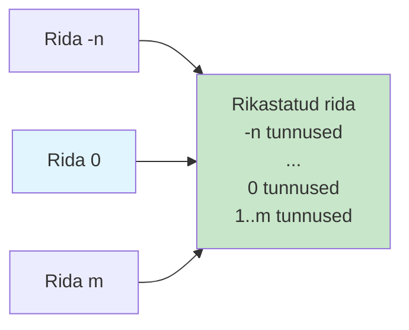
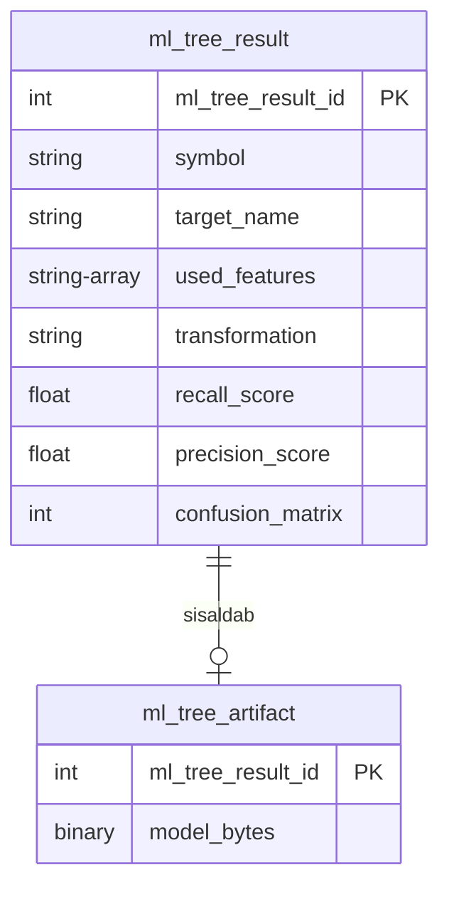

# Masinõppe töövoog: ahne tunnuste valik hinnamuutuste ennustamiseks

Käesolev peatükk esitab masinõppe töövoo krüptovaluutade hinnamuutuste ennustamiseks mitme ajahorisondi ja läve lõikes. Süsteem lahendab finantsaegridade ennustamise väljakutseid ahne iteratiivse tunnuste valiku metoodika abil. Töövoog rakendab ajalist joondamist k-nihke liitmiste kaudu, Fibonacci-viitega transformatsioonistrateegiaid momentumimustrite tabamiseks ning kronoloogilist treening-testi jaotust tulevikku vaatamise nihke vältimiseks.

## Disainifilosoofia ja ennustussihtmärgid

Töövoog järgib põhimõtteid:

1. **Ajaline terviklikkus**: Range kronoloogiline järjestus kõigis operatsioonides
2. **Tunnuste säästlikkus**: Ahne iteratiivne valik minimaalsete tunnuste kogumite tuvastamiseks
3. **Transformatsiooni mitmekesisus**: Mitme teisendusstrateegia süstemaatiline hindamine
4. **Hindamise realistlikkus**: Kohandatud skoorimismõõdikud tasakaalustamata klassifikatsiooni jaoks

Süsteem genereerib binaarse klassifitseerimise sihtmärgid: **kõrge-üles/alla** ja **madal-üles/alla** sihtmärgid lävevahemikus 0,02%–0,29%, kodeerides kas hinnaläved ületatakse järgnevate akende jooksul. Lävevahemikud on tuletatud iga sümboli ajalooliste hinnamuutuste kvartiilide jaotusest eraldi, tagades, et klassid on piisavalt tasakaalustatud mudeli treenimiseks. Erinevatel valuutapaaridel on erinevad läved vastavalt nende volatiilsusele. Antud lävevahemik 0,02%–0,29% on konkreetselt Kraken ETH_USDT paari jaoks perioodil oktoober-november 2024.

## Andmete töövoog

### Parquet-salvestus ja ajaline joondamine

Tunnused on partitsioonitud kuupäeva järgi. K-nihke liitmised loovad veerud `{k}_trade_features` tagasivaateks (-n kuni -1) ja ettevaateks (sihtmärgi konstrueerimiseks):

: Joonis 5.1 K-nihke liitmiste visualiseerimine

### Puuduvate väärtuste käsitlemine

| Tunnuse tüüp        | Vaikeväärtus  | Põhjendus                  |
| ------------------- | ------------- | -------------------------- |
| Loendused           | 0             | Tegevus puudub             |
| Mahud               | 0.0           | Kaubeldud maht puudub      |
| Hinnad              | Edasitäitmine | Viimane teadaolev hind     |
| Volatiilsusmõõdikud | 0.0           | Varieeruvust ei täheldatud |

: Tabel 5.1 Puuduvate väärtuste käsitlemise strateegiad

### Tunnuste grupeerimine

| Grupp     | Näidistunnused                              |
| --------- | ------------------------------------------- |
| `sum_vol` | `-5_trade_sum_vol`, ..., `-1_trade_sum_vol` |
| `sw_mid`  | `-5_order_sw_mid`, ..., `-1_order_sw_mid`   |
| `sw_imb`  | `-5_order_sw_imb`, ..., `-1_order_sw_imb`   |

: Tabel 5.2 Tunnuste grupeerimise näited

Grupeerimine võimaldab tunnuste valikul opereerida semantiliste üksuste peal.

## Ahne iteratiivne tunnuste algoritm

Tunnuste valiku keskne väljakutse on otsinguruumi eksponentsiaalne kasv: F tunnuse hulgast d tunnuse valimiseks on binoomkordaja C(F,d) kombinatsiooni. F=50 ja d=7 korral tähendab see ~99 miljoni kombinatsiooni hindamist, mis on arvutuslikult ebareaalne. Ahne iteratiivne lähenemine lahendab selle süstemaatilise kärpimise kaudu, säilitades ainult kõige paljutõotavamad kandidaadid igal sammul.

Algoritm toimib järgmiselt:

1. **Hinda kõiki tunnuste gruppe individuaalselt** - alustades dimensioonist 1, hinnatakse iga tunnuste gruppi (nt `sum_vol`, `sw_mid`) eraldiseisvalt, treenides mudeli ainult selle grupi tunnustega
2. **Vali top-K sooritajad** mudeli hinde põhjal (tavaliselt K=5), mis on kirjeldatud peatükis 5.6 - ainult parimad kombinatsioonid pääsevad edasi järgmisele dimensioonile
3. **Dimensiooni 2 jaoks laienda** igat top-K tunnuste kombinatsiooni, lisades ühe täiendava tunnuse gruppi - näiteks kui `sum_vol` oli parim üksik tunnuste grupp, siis kombineeritakse seda kõigi teiste gruppidega (`sum_vol` + `sw_mid`, `sum_vol` + `close`, jne)
4. **Korda laiendamist**, kärpides igal dimensioonil ainult top-K parimatele - see tagab, et otsinguruumi suurus jääb kontrolli alla
5. **Lõpeta** maksimaalse dimensiooni juures (tavaliselt D=7) või kui skoori paranemine lakkab

See ahne lähenemine vähendab keerukust O(K × F × D)-ks: K=5, F=50, D=7 korral ~1750 hindamist, mis on 50000× vähem kui naiivne ammendav otsing. Kuigi ahne strateegia ei garanteeri globaalse optimumi leidmist, praktilised tulemused näitavad, et leitud kombinatsioonid ületavad oluliselt täistunnuste kogumeid.

## Aegreale turvaline treenimisstrateegia

Finantsaegridade õppimisel on kriitilise tähtsusega vältida infolekkeid tulevikust minevikku, mis tekitaks kunstlikult optimistlikke hindeid. Süsteem kasutab range **kronoloogilist jaotust**: viimased 10% näidistest reserveeritakse hindamiseks, tagades, et mudel ei näe kunagi tuleviku andmeid treenimise ajal. See erineb juhuslikust train-test split'ist, kus tuleviku näited võivad sattuda treeningkogumisse. Lisaks peab **transformatsiooni ajastus** olema hoolikalt kontrollitud: kõik normaliseerimisparameetrid arvutatakse rangelt ainult treeningkogumi põhjal. See põhimõte kehtib kõigi transformatsioonide jaoks - z-skoori normaliseerimine, Fibonacci-põhised momentumi tunnused ja muud teisendustega seotud statistikud. Iga transformatsioon peab garanteerima, et mudelil puudub juurdepääs tuleviku informatsioonile mis tahes kujul.

## Tunnuste transformatsiooni strateegiad

Süsteem toetab mitut transformatsioonistrateegiat, mis kombineerivad normaliseerimist ja Fibonacci-põhiseid momentumi indikaatoreid. **Z-skoori normaliseerimine** standardiseerib tunnused, lahutades treeningkogumi keskmise ja jagades treeningkogumi standardhälbega. Testkogumi jaoks kasutatakse libiseva akna statistikat, tagades, et normaliseerimisparameetrid ei leki tulevikust.

**Fibonacci-viitega momentumi tunnused** genereerivad indikaatoreid, võrreldes praeguseid väärtusi mineviku väärtustega Fibonacci-järjestuse viidete põhjal (2, 3, 5, 8, 13 aknaid tagasi). Süsteem toetab kolme tüüpi momentumi tunnuseid: (1) **stepper** - binaarned indikaatorid (kas praegune > viidatud), (2) **diff** - suunatunnused sign(viidatud - praegune), (3) **doubled** - kiirenduse indikaatorid, mis võrdlevad viidatud väärtusi omavahel. Iga tunnuse ja 5 Fibonacci viite kombinatsioon loob 5F täiendavat tunnust. Strateegiad märkega `_incl` säilitavad ka originaalsed z-score normaliseeritud tunnused, laiendades tunnuste ruumi 6F-ks.

| Strateegia                         | Kirjeldus                                | Tunnuste arv |
| ---------------------------------- | ---------------------------------------- | ------------ |
| `none`                             | Toored tunnused                          | F            |
| `zscore`                           | Z-skoori normaliseerimine                | F            |
| `zscore_stepper_fibo`              | Z-skoor + stepper momentum               | 5F           |
| `zscore_diff_fibo`                 | Z-skoor + diff momentum                  | 5F           |
| `zscore_doubled_stepper_fibo`      | Z-skoor + doubled stepper                | 5F           |
| `zscore_doubled_diff_fibo`         | Z-skoor + doubled diff                   | 5F           |
| `zscore_stepper_fibo_incl`         | Z-skoor + stepper + originaalsed         | 6F           |
| `zscore_diff_fibo_incl`            | Z-skoor + diff + originaalsed            | 6F           |
| `zscore_doubled_stepper_fibo_incl` | Z-skoor + doubled stepper + originaalsed | 6F           |
| `zscore_doubled_diff_fibo_incl`    | Z-skoor + doubled diff + originaalsed    | 6F           |

: Tabel 5.3 Tunnuste transformatsiooni strateegiad

## Mudeli hindamine

Tasakaalustamata klassifikatsiooni puhul on üldine täpsus (accuracy) eksitav mõõdik: mudel, mis ennustab ainult enamusklassi, saavutab kõrge täpsuse, kuid on praktikas kasutu. Näiteks kui 95% juhtudest ei tõuse hind üle läve (klass 0) ja mudel ennustab alati klassi 0, saab see 95% täpsuse, kuid ei tuvasta ühtegi huvipakkuvat sündmust.

Süsteem kasutab klassispetsiifilisi mõõdikuid, mis arvutatakse segadusmaatriksi põhjal. Segadusmaatriks sisaldab nelja väärtust: TN (true negatives, õigesti ennustatud negatiivsed), FP (false positives, valesti ennustatud positiivsed), FN (false negatives, vahele jäetud positiivsed) ja TP (true positives, õigesti ennustatud positiivsed). Nende põhjal arvutatakse **saagis** (recall) kui TP/(TP+FN) ehk positiivsete näidete tuvastamise osakaal, ja **täpsus** (precision) kui TP/(TP+FP) ehk positiivsete ennustuste õigsuse osakaal. Mõlemad mõõdikud arvutatakse eraldi mõlema klassi jaoks.

Skoorimismõõdik on defineeritud valemiga (5.1):

$$
\text{skoor} = \text{recall}_{\text{neg}} \times \text{recall}_{\text{pos}} \times \text{precision}_{\text{neg}} \times \text{precision}_{\text{pos}}
$$

See nelja teguri korrutis karistab mudeleid, mis saavutavad kõrge skoori ainult ühe klassi peal. Kui mudel ennustab alati enamusklassi, on positiivse klassi saagis null, mis annab koguks 0. Samuti, kui mudel ennustab liiga sageli positiivset klassi, kannatab positiivse klassi täpsus. Ainult tasakaalustatud mudel, mis ennustab mõlemat klassi tähendusrikkalt, saavutab kõrge skoori. See mõõdik sobib ideaalselt haruldaste sündmuste tuvastamiseks finantsandmetes, kus enamusklassi ennustamine on triviaalne, kuid väärtusetu.

## Mudeli salvestamine

: Joonis 5.2 Mudeli salvestamise andmebaasiskeem

Mudeli binaarvorming (`model_bytes`) on eraldi tabelis `ml_tree_artifact`, et parandada päringute jõudlust. Tulemuste päringud (`SELECT` järgi täpsuse, sihtmärgi või tunnuste filtreerimisega) ei pea lugema suurt binaarset mudeli hunnikut (tavaliselt 50-500 KB), vaid ainult metaandmeid. Mudel laaditakse mällu ainult siis, kui see on valitud ennustamiseks.

Süsteem säilitab ainult top-K sooritajad sihtmärgi kohta.

## Eksperimentaalsed tulemused

Tulemuste võrdlemiseks kasutatakse kolme metoodikat: **Iteratiivne** (ahne iteratiivne tunnuste valik optimaalse tunnuste arvu ja valiku leidmiseks), **dt_all** (otsustuspuu kõigi 50+ tunnusega ilma tunnuste valikuta) ja **rf_all** (juhuslik mets kõigi 50+ tunnusega ilma tunnuste valikuta).

| Metoodika | Sihtmärk      | Skoor      | Tunnused                           | Segadusmaatriks  |
| --------- | ------------- | ---------- | ---------------------------------- | ---------------- |
| iter      | high_up_0.09p | **0.0933** | t_high, t_open, t_sum_dt, t_sum_pv | (158, 68, 6, 16) |
| dt_all    | high_up_0.09p | 0.0261     | kõik                               | (161, 65, 14, 8) |
| rf_all    | high_up_0.09p | 0.0000     | kõik                               | (226, 0, 22, 0)  |
| iter      | high_up_0.29p | **0.6640** | o_close_ba, o_n_updates            | (245, 0, 1, 2)   |
| dt_all    | high_up_0.29p | 0.0000     | kõik                               | (245, 0, 3, 0)   |
| rf_all    | high_up_0.29p | 0.0000     | kõik                               | (245, 0, 3, 0)   |

: Tabel 5.4 Eksperimentaalsed tulemused ETH_USDT sümbolil (Kraken, oktoober-november 2024)

Tulemused näitavad **tunnuste säästlikkuse** eelist: 2-4 tunnust ületavad täistunnuste ansambleid. 4 tunnust saavutab 9,33% skoori target_high_up_0.09p jaoks, 2 tunnust saavutab 66,40% skoori target_high_up_0.29p jaoks. **Baasmeetodid ebaõnnestuvad**: dt_all ja rf_all ennustavad sageli ainult enamusklassi (0,0 skoor). **Iteratiivne lähenemine toimib**: target_high_up_0.09p korral 3,6× parem kui dt_all; target_high_up_0.29p korral baasmeetodid ebaõnnestuvad täielikult, iteratiivne meetod aga saavutab 66,40% skoori. See tõestab ahne iteratiivse tunnuste valiku metoodika efektiivsust väheste näidetega finantsandmete klassifitseerimisel, mis oli peatüki hüpoteesiks. **Eriti tähelepanuväärne** on target_high_up_0.29p mudeli segadusmaatriks (245, 0, 1, 2): mudel ennustab positiivset klassi ainult 2 korral testikogumis, kuid mõlemal korral on ennustus õige (0 valepositiivset). See tähendab, et tunnused `o_close_ba` ja `o_n_updates` on tihedalt seotud hinna tõusu haruldase "edge case'iga" ja võimaldavad 100% täpsusega tuvastada spetsiifilisi turuolukordi, kus hind tõuseb üle 0,29%. **Dimensiooni optimaalpunkt** varieerub sihtmärkide lõikes (2-4), viidates erinevatele infokogumi vajadustele.

## Järeldus

Peatükk esitas masinõppe töövoo krüptovaluutade hinnamuutuste ennustamiseks, lahendades finantsaegridade õppimise väljakutseid ahne iteratiivse tunnuste valiku ja range ajalise terviklikkuse kaudu.

Töövoo peamised tehnilised panused hõlmavad: (1) ahne otsingualgoritm, mis vähendab otsinguruumi eksponentsiaalsest binoomkordaja C(F,D) järku lineaarseks K×F×D järku; (2) k-nihke liitmiste raamistik ajalise joondamise tagamiseks; (3) Fibonacci-viitega transformatsioonid mitmeskaalaliste momentumimustrite tabamiseks; (4) versioneeritud salvestus PostgreSQLis deterministliku upsert-semantikaga; (5) klassispetsiifilised mõõdikud tasakaalustamata klassifikatsiooni hindamiseks.

ETH_USDT sümbolil (Kraken, oktoober-november 2024) läbi viidud eksperimendid kinnitavad põhihüpoteesi: **ahne iteratiivne tunnuste valik ületab oluliselt baasmeetodeid**. Minimaalsete tunnuste kogumid (2-4 tunnust) saavutavad kõrgemaid skoore kui 50+ tunnusega otsustuspuud ja juhuslikud metsad, mis sageli ebaõnnestuvad täielikult (0,0 skoor), ennustades ainult enamusklassi. See valideerib keskset väidet: väheste näidetega finantsprognoosimisel domineerivad tunnuste säästlikkus ja hoolikas valik mudeli keerukuse üle. Töövoog demonstreerib, et õigete tunnuste süstemaatiline otsimine võimaldab tuvastada haruldasi turuolukordi. Kuigi väikese valimi juures võib täpne tuvastamine olla ka õnnelik juhus, jääb faktiks, et 50+ tunnusega otsustuspuud ja juhuslikud metsad ei suutnud neid juhtumeid üldse ära tunda.
