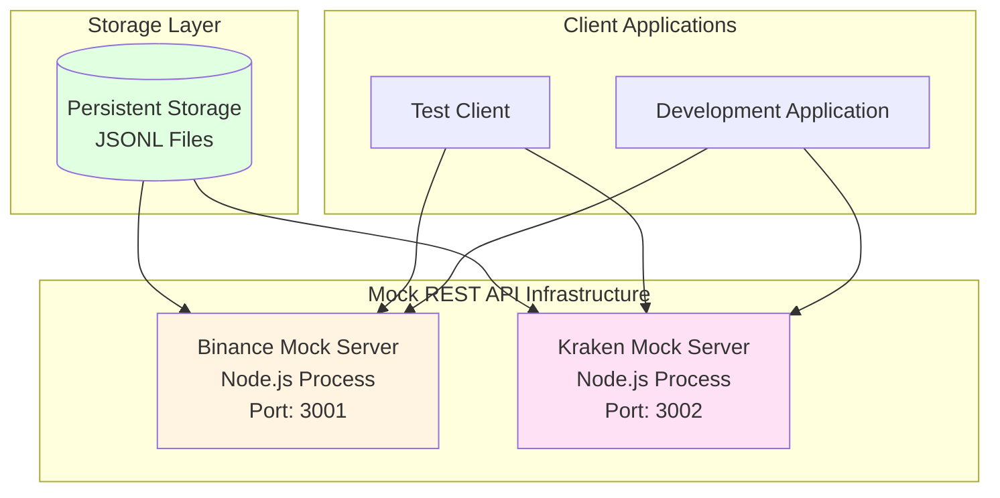
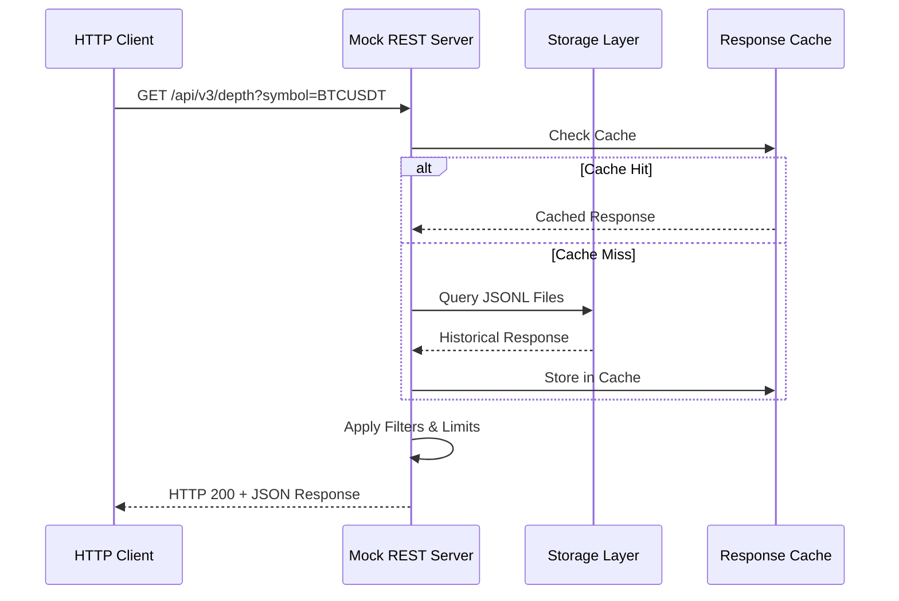
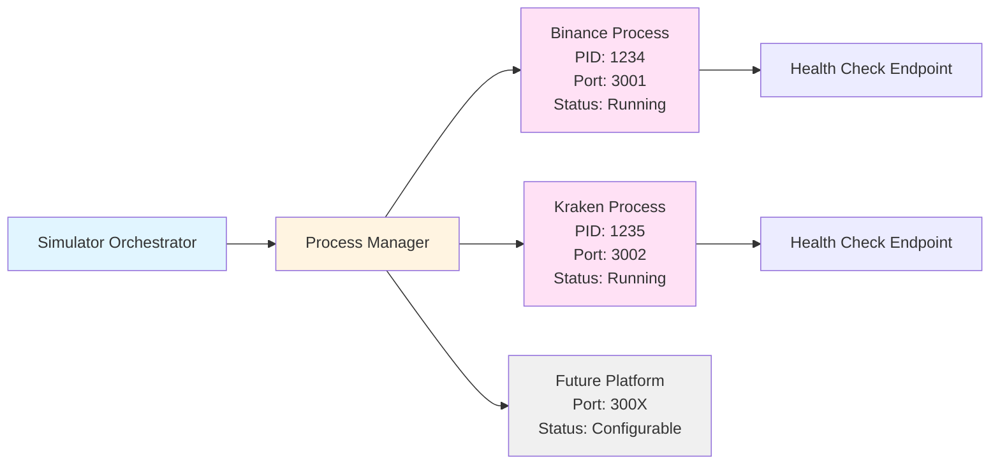
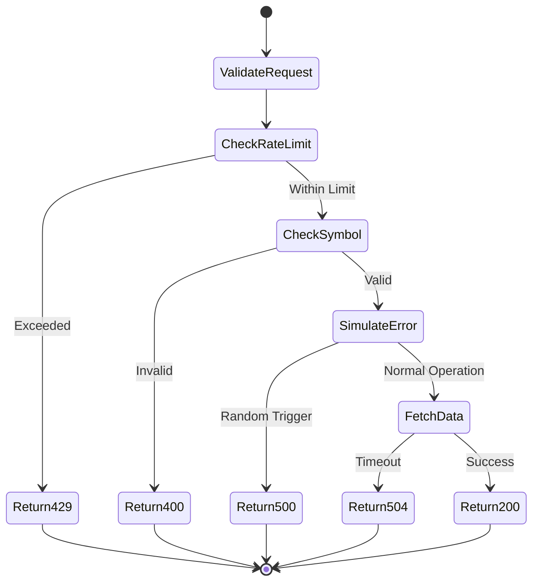

# Market Data Simulator - Mock REST API

## Overview

The market data simulator extends beyond WebSocket stream generation to provide mock REST API endpoints that replicate the interface and behavior of cryptocurrency exchange platforms. This capability enables comprehensive testing of systems that interact with both REST and WebSocket APIs without requiring connections to live exchanges.

## Architecture

The mock REST API subsystem operates as a collection of platform-specific HTTP servers, each running in isolated Node.js processes and bound to distinct network ports. This architectural approach provides several advantages: (1) process-level isolation prevents cross-contamination between platform implementations, (2) independent port allocation enables simultaneous operation of multiple mock exchanges, and (3) separate processes facilitate independent lifecycle management and resource monitoring.

**Figure 1:** Mock REST API architecture showing platform-specific server processes and their interactions with storage and client applications.

## Endpoint Replication

Each mock server replicates the REST endpoint structure of its corresponding exchange platform, maintaining identical URL paths, query parameters, and response schemas.

### Binance Mock Endpoints

The Binance mock server exposes endpoints conforming to the Binance REST API specification:

**Table 1:** Binance Mock REST Endpoints

| Endpoint | Method | Parameters | Response Type |
|----------|--------|------------|---------------|
| `/api/v3/depth` | GET | symbol, limit | Order book snapshot |
| `/api/v3/historicalTrades` | GET | symbol, limit, fromId | Historical trades array |
| `/api/v3/ticker/bookTicker` | GET | symbol, symbols | Best bid/ask quotes |

### Kraken Mock Endpoints

The Kraken mock server implements endpoints matching the Kraken REST API specification:

**Table 2:** Kraken Mock REST Endpoints

| Endpoint | Method | Parameters | Response Type |
|----------|--------|------------|---------------|
| `/public/Trades` | GET | pair, since, count | Recent trades with last cursor |
| `/public/Depth` | GET | pair, count | Order book with timestamps |

## Data Source Integration

The mock REST API servers retrieve response data from the persistent storage layer, utilizing the same JSONL files created during recording mode operations. This integration ensures consistency between stored historical data and mock API responses.

**Figure 2:** Sequence diagram illustrating the request-response cycle for mock REST API endpoints with caching layer.

## Process Management

The simulator manages multiple Node.js processes, each hosting a platform-specific mock REST server.

**Figure 3:** Process management architecture showing orchestration of platform-specific mock servers.

### Port Allocation Strategy

Platform-specific mock servers are assigned dedicated ports according to a deterministic allocation scheme:

- **Binance Mock Server:** Port 3001
- **Kraken Mock Server:** Port 3002
- **Future Platforms:** Ports 3003-3099 (reserved for expansion)

This allocation strategy prevents port conflicts while maintaining predictable endpoint URLs for client configuration.

## Response Generation

Mock servers generate responses through a multi-stage process that combines stored historical data with request parameter evaluation.

### Data Selection

Response generation begins with data selection from persistent storage:

1. **Endpoint Matching:** Identification of relevant JSONL file based on endpoint path and platform
2. **Temporal Filtering:** Selection of responses within specified time ranges (if applicable)
3. **Symbol Filtering:** Restriction to requested trading pair or asset
4. **Limit Application:** Truncation of response arrays to match client-specified limits

### Response Transformation

Selected data undergoes transformation to ensure compliance with request parameters:

- **Pagination Support:** Implementation of cursor-based pagination for historical trade endpoints
- **Depth Limiting:** Truncation of order book levels to match requested depth
- **Format Validation:** Verification that response structure matches platform specification

### Caching Strategy

The mock servers implement a caching layer to optimize response latency for frequently requested data:

- **Cache Key Generation:** Composite keys based on endpoint, symbol, and parameters
- **TTL Configuration:** Configurable time-to-live values for different endpoint types
- **Cache Invalidation:** Automatic invalidation when underlying storage files are updated

## Error Simulation

Mock servers replicate error conditions observed in production exchange APIs to facilitate robust error handling development:

**Table 3:** Simulated Error Conditions

| Error Type | HTTP Status | Trigger Condition | Purpose |
|------------|-------------|-------------------|---------|
| Rate Limit Exceeded | 429 | Configurable request threshold | Test rate limiting logic |
| Invalid Symbol | 400 | Unknown trading pair | Test input validation |
| Server Error | 500 | Configurable random probability | Test retry mechanisms |
| Timeout | 504 | Configurable delay threshold | Test timeout handling |

**Figure 4:** State diagram showing error simulation decision flow in mock REST API servers.

## Configuration

Mock REST servers utilize declarative configuration to specify operational parameters:

**Platform Configuration:**
- Server port binding
- Request rate limits
- Cache TTL settings
- Error simulation probabilities

**Data Configuration:**
- Storage directory paths
- Default response sizes
- Temporal filtering rules
- Symbol mappings

**Logging Configuration:**
- Request/response logging levels
- Performance metrics collection
- Error tracking and reporting

## Integration with WebSocket Simulator

The mock REST API subsystem operates in coordination with the WebSocket stream simulator to provide a comprehensive development environment. Client applications can:

1. Query initial state via REST endpoints (e.g., order book snapshot)
2. Subscribe to WebSocket streams for real-time updates
3. Validate consistency between REST snapshots and WebSocket deltas

This integration pattern mirrors production exchange behavior and enables testing of order book synchronization logic and other stateful operations.

## Use Cases

The mock REST API infrastructure supports several development and testing scenarios:

**Unit Testing:** Deterministic API responses enable isolated testing of individual components without network dependencies.

**Integration Testing:** Multi-component testing with consistent data across REST and WebSocket interfaces validates system-level behavior.

**Load Testing:** Controlled environment for performance testing without impacting production exchange infrastructure or incurring rate limit penalties.

**Development Workflow:** Elimination of external dependencies accelerates development iteration cycles and enables offline development.

**Protocol Compliance:** Validation of request formatting and response parsing logic against platform-specific API specifications.

