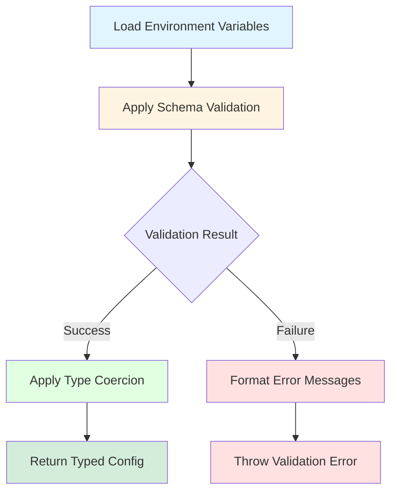

# Service Framework: Environment Configuration

## Introduction

The environment configuration subsystem addresses the challenge of type-safe environment variable parsing with comprehensive validation. This subsystem ensures that services receive correctly configured runtime parameters or fail immediately during initialization with actionable error messages. By validating configuration at startup rather than during operation, the framework prevents runtime failures caused by misconfiguration while providing detailed diagnostic information for rapid remediation.

Modern distributed systems typically employ environment variables for runtime configuration, enabling deployment-specific parameterization without code modifications. However, Node.js exposes environment variables through the untyped `process.env` object, eliminating compile-time type safety and deferring error detection until runtime access. The configuration subsystem solves this problem through schema-based validation and TypeScript type inference, providing both compile-time type safety and runtime validation.

## Configuration Schema Definition

Services define configuration schemas using declarative validation libraries such as Zod or Joi. These schemas specify expected environment variables, their types, validation constraints, and optional default values:

```typescript
interface EnvironmentConfiguration {
  NODE_ENV: 'development' | 'production' | 'test';
  PORT: number;
  LOG_LEVEL: 'debug' | 'info' | 'warn' | 'error';
  METRICS_PORT: number;
  
  DATABASE_URL: string;
  REDIS_URL: string;
  
  BINANCE_API_KEY?: string;
  KRAKEN_API_KEY?: string;
  
  MAX_CONNECTIONS: number;
  REQUEST_TIMEOUT_MS: number;
}
```

The schema definition approach enables compile-time type safety through TypeScript's type inference capabilities. Application code receives fully typed configuration objects rather than untyped `process.env` access, eliminating runtime type errors and enabling IDE autocomplete support.

### Schema Definition with Zod

Zod provides a TypeScript-first schema validation library with excellent type inference capabilities. Services define schemas using Zod's declarative API:

```typescript
import { z } from 'zod';

const environmentSchema = z.object({
  NODE_ENV: z.enum(['development', 'production', 'test']),
  PORT: z.coerce.number().int().positive(),
  LOG_LEVEL: z.enum(['debug', 'info', 'warn', 'error']),
  METRICS_PORT: z.coerce.number().int().positive(),
  
  DATABASE_URL: z.string().url(),
  REDIS_URL: z.string().url(),
  
  BINANCE_API_KEY: z.string().optional(),
  KRAKEN_API_KEY: z.string().optional(),
  
  MAX_CONNECTIONS: z.coerce.number().int().positive().max(1000),
  REQUEST_TIMEOUT_MS: z.coerce.number().int().positive().max(60000)
});

type EnvironmentConfiguration = z.infer<typeof environmentSchema>;
```

Zod's `z.infer` utility extracts the TypeScript type from the schema definition, ensuring complete consistency between runtime validation and compile-time types. The `z.coerce` transformer automatically converts string environment variable values to numeric types.

### Schema Definition with Joi

Joi provides an alternative validation library with similar capabilities but different API design:

```typescript
import Joi from 'joi';

const environmentSchema = Joi.object({
  NODE_ENV: Joi.string().valid('development', 'production', 'test').required(),
  PORT: Joi.number().integer().positive().required(),
  LOG_LEVEL: Joi.string().valid('debug', 'info', 'warn', 'error').required(),
  METRICS_PORT: Joi.number().integer().positive().required(),
  
  DATABASE_URL: Joi.string().uri().required(),
  REDIS_URL: Joi.string().uri().required(),
  
  BINANCE_API_KEY: Joi.string().optional(),
  KRAKEN_API_KEY: Joi.string().optional(),
  
  MAX_CONNECTIONS: Joi.number().integer().positive().max(1000).required(),
  REQUEST_TIMEOUT_MS: Joi.number().integer().positive().max(60000).required()
}).unknown(false);
```

Joi emphasizes explicit requirement specification and provides rich error messages. The `.unknown(false)` option rejects unrecognized environment variables, preventing configuration drift.

## Environment Variable Parsing

The framework provides a configuration parser that loads environment variables, applies schema validation, and produces typed configuration objects:

```typescript
interface ConfigurationParser<T> {
  parseEnvironment(schema: ValidationSchema<T>): T;
  parseFile(filePath: string, schema: ValidationSchema<T>): T;
  parseWithDefaults(
    schema: ValidationSchema<T>, 
    defaults: Partial<T>
  ): T;
}
```

The parser execution flow includes multiple stages:



**Figure 1:** Environment configuration parsing flow showing validation, type coercion, and error handling stages.

Type coercion handles string-to-number conversions, boolean parsing from string representations, and JSON deserialization for complex configuration values. Validation failures produce detailed error messages identifying missing required variables, type mismatches, and constraint violations.

### Loading Environment Variables

The parser loads environment variables from multiple sources with defined precedence:

1. **Process Environment**: Variables set through shell exports or container orchestration systems
2. **Environment Files**: Variables loaded from `.env` files using libraries like `dotenv`
3. **Default Values**: Schema-defined defaults applied when variables are not specified

The precedence order ensures that explicit runtime configuration overrides file-based configuration, which in turn overrides defaults.

### Type Coercion Strategies

Environment variables are inherently string-typed, requiring conversion to appropriate types:

**Numeric Coercion**: String values are parsed to numbers using `Number()` or `parseInt()`. Invalid numeric strings produce validation errors rather than `NaN` values.

**Boolean Coercion**: String values are mapped to boolean according to common conventions: `'true'`, `'1'`, `'yes'` map to `true`; `'false'`, `'0'`, `'no'` map to `false`. Other values produce validation errors.

**JSON Coercion**: Complex configuration values can be provided as JSON-encoded strings and parsed to objects or arrays. Parse failures produce validation errors with diagnostic information.

**URL Validation**: URL strings are validated for correct scheme, host, and path structure. Invalid URLs produce detailed error messages identifying the malformed component.

### Error Message Formatting

Validation failures generate detailed error messages suitable for operational troubleshooting:

```
Configuration validation failed:
  - PORT: Expected positive integer, received "invalid"
  - DATABASE_URL: Required variable missing
  - MAX_CONNECTIONS: Value 2000 exceeds maximum 1000
  - BINANCE_API_KEY: Dependent variable required in production environment
```

Error messages identify the variable name, expected constraints, and actual values (excluding sensitive values like passwords or API keys). This information enables rapid configuration remediation without requiring code inspection.

## Configuration Validation Patterns

The configuration subsystem supports several validation patterns that address common configuration requirements:

### Required Variables

Variables that must be present with non-empty values. Services fail to start if required variables are missing:

```typescript
const schema = z.object({
  DATABASE_URL: z.string().min(1),
  API_KEY: z.string().min(1)
});
```

Required variables enforce deployment readiness, preventing service startup in misconfigured states.

### Optional Variables with Defaults

Variables that may be omitted, with the system providing sensible default values when not specified:

```typescript
const schema = z.object({
  PORT: z.coerce.number().default(3000),
  LOG_LEVEL: z.enum(['debug', 'info', 'warn', 'error']).default('info'),
  MAX_RETRIES: z.coerce.number().default(3)
});
```

Default values reduce configuration burden for operators while maintaining flexibility for customization.

### Constrained Values

Variables that must satisfy specific constraints such as numeric ranges, string format patterns, or enumerated value sets:

```typescript
const schema = z.object({
  PORT: z.coerce.number().int().min(1024).max(65535),
  LOG_LEVEL: z.enum(['debug', 'info', 'warn', 'error']),
  DATABASE_URL: z.string().url(),
  MAX_CONNECTIONS: z.coerce.number().int().positive().max(1000)
});
```

Constraints prevent invalid configuration values that would cause runtime failures or degraded performance.

### Dependent Variables

Variables whose requirements depend on other configuration values. For example, API keys may be required in production but optional in development:

```typescript
const schema = z.object({
  NODE_ENV: z.enum(['development', 'production', 'test']),
  BINANCE_API_KEY: z.string().optional(),
  KRAKEN_API_KEY: z.string().optional()
}).refine(
  (config) => {
    if (config.NODE_ENV === 'production') {
      return config.BINANCE_API_KEY && config.KRAKEN_API_KEY;
    }
    return true;
  },
  {
    message: 'API keys required in production environment'
  }
);
```

Dependent validation enables environment-specific requirements without duplicating schema definitions.

### Derived Configuration Values

Some configuration values are computed from multiple environment variables:

```typescript
const schema = z.object({
  DATABASE_HOST: z.string(),
  DATABASE_PORT: z.coerce.number(),
  DATABASE_NAME: z.string(),
  DATABASE_USER: z.string(),
  DATABASE_PASSWORD: z.string()
}).transform((config) => ({
  ...config,
  DATABASE_URL: `postgres://${config.DATABASE_USER}:${config.DATABASE_PASSWORD}@${config.DATABASE_HOST}:${config.DATABASE_PORT}/${config.DATABASE_NAME}`
}));
```

Transformations enable flexible configuration input while providing convenient derived values for application code.

## Multi-Environment Configuration

Services often require different configuration profiles for development, testing, and production environments. The framework supports environment-specific configuration through multiple mechanisms:

### Environment-Specific Files

Loading configuration from environment-specific files (`.env.development`, `.env.production`) that override base configuration:

```
project/
  .env                    # Base configuration
  .env.development        # Development overrides
  .env.production         # Production overrides
  .env.test               # Test overrides
```

The framework loads the base `.env` file followed by the environment-specific file corresponding to the `NODE_ENV` variable value. Later files override earlier values, enabling incremental customization.

### Configuration Composition

Merging multiple configuration sources with precedence rules:

1. **Command-line Arguments**: Highest precedence for one-off overrides
2. **Process Environment Variables**: Container orchestration and shell configuration
3. **Environment-Specific Files**: Development/production/test profiles
4. **Base Configuration File**: Shared defaults
5. **Schema Defaults**: Fallback values

This precedence hierarchy enables flexible configuration management across deployment environments while maintaining consistency.

### Environment Detection

Automatic environment detection through `NODE_ENV` variable with corresponding configuration profile selection:

```typescript
function loadConfiguration<T>(schema: ValidationSchema<T>): T {
  const environment = process.env.NODE_ENV || 'development';
  
  const baseConfig = dotenv.config({ path: '.env' });
  const envConfig = dotenv.config({ path: `.env.${environment}` });
  
  const merged = {
    ...baseConfig.parsed,
    ...envConfig.parsed,
    ...process.env
  };
  
  return parseConfiguration(merged, schema);
}
```

Environment detection enables zero-configuration deployment when standard environment files are present.

## Configuration Security

Sensitive configuration values such as API keys, database passwords, and encryption keys require special handling:

### Sensitive Value Redaction

The framework automatically redacts sensitive values from error messages and logs:

```typescript
const sensitivePatterns = [
  /password/i,
  /secret/i,
  /key/i,
  /token/i,
  /credential/i
];

function redactSensitiveValue(key: string, value: unknown): unknown {
  if (sensitivePatterns.some(pattern => pattern.test(key))) {
    return '[REDACTED]';
  }
  return value;
}
```

Redaction prevents credential leakage through error messages, logs, and monitoring systems.

### External Secret Management

Production deployments should source sensitive values from external secret management systems rather than environment files:

```typescript
const schema = z.object({
  DATABASE_PASSWORD: z.string(),
  API_KEY: z.string()
});

async function loadConfiguration() {
  const secrets = await secretsManager.getSecrets([
    'database-password',
    'api-key'
  ]);
  
  const config = parseEnvironment(schema, {
    DATABASE_PASSWORD: secrets['database-password'],
    API_KEY: secrets['api-key']
  });
  
  return config;
}
```

External secret management provides audit logging, rotation capabilities, and access control for sensitive configuration.

## Integration with Service Context

The environment configuration parser integrates into the service context initialization pattern:

```typescript
function createServiceContext() {
  const envContext = parseEnv(environmentSchema);
  const diagnosticContext = createDiagnosticContext();
  const metricsContext = createMetricsRegistry({
    diagnosticContext
  });
  const processContext = startProcessLifecycle({
    diagnosticContext
  });

  return {
    envContext,
    diagnosticContext,
    metricsContext,
    processContext
  };
}
```

The environment context is typically created first, as other subsystems may require configuration values for initialization (e.g., log levels, metric port numbers).

### Accessing Configuration Values

Application code accesses configuration through the typed context object:

```typescript
async function startServer(context: ServiceContext) {
  const httpServer = createHttpServer({
    port: context.envContext.PORT,
    timeout: context.envContext.REQUEST_TIMEOUT_MS
  });
  
  context.diagnosticContext.logger.setLevel(context.envContext.LOG_LEVEL);
  
  await httpServer.start();
  
  context.diagnosticContext.logger.info('Server started', {
    port: context.envContext.PORT,
    environment: context.envContext.NODE_ENV
  });
}
```

TypeScript's autocomplete and type checking ensure configuration access is correct at compile time, eliminating runtime errors from typos or incorrect assumptions about configuration structure.

## Configuration Documentation

The framework encourages documenting configuration requirements alongside schema definitions:

```typescript
/**
 * Service Configuration Schema
 * 
 * Required Variables:
 * - NODE_ENV: Deployment environment (development|production|test)
 * - DATABASE_URL: PostgreSQL connection string
 * - REDIS_URL: Redis connection string
 * 
 * Optional Variables:
 * - PORT: HTTP server port (default: 3000)
 * - LOG_LEVEL: Logging severity threshold (default: info)
 * - MAX_CONNECTIONS: Database connection pool size (default: 10)
 * 
 * Environment-Specific Requirements:
 * - Production: BINANCE_API_KEY and KRAKEN_API_KEY required
 * - Development: API keys optional, mock data sources used
 * - Test: Isolated test databases required
 */
const environmentSchema = z.object({
  // Schema definition
});
```

Documentation ensures operators understand configuration requirements without reading implementation code.

## Testing Configuration Logic

The configuration subsystem facilitates testing through dependency injection:

```typescript
function createTestContext(overrides: Partial<EnvironmentConfiguration> = {}) {
  const testConfig: EnvironmentConfiguration = {
    NODE_ENV: 'test',
    PORT: 3001,
    LOG_LEVEL: 'error',
    DATABASE_URL: 'postgres://localhost/test',
    ...overrides
  };
  
  return createServiceContext(testConfig);
}

describe('Server Initialization', () => {
  it('starts with custom port', async () => {
    const context = createTestContext({ PORT: 4000 });
    const server = await startServer(context);
    
    expect(server.port).toBe(4000);
  });
});
```

Test contexts provide known configuration values without requiring environment variable manipulation.

## Performance Considerations

Configuration parsing occurs once during service initialization, imposing negligible runtime overhead. However, schema complexity affects startup time:

**Simple Schemas**: String and numeric validations complete in microseconds, contributing negligible startup latency.

**Complex Schemas**: Deep object nesting, dependent validation, and transformation functions may require milliseconds per configuration object. The framework recommends flat schema structures for optimal performance.

**Validation Caching**: The framework caches parsed configuration objects, avoiding repeated validation during test execution or development hot-reload scenarios.

## Conclusion

The environment configuration subsystem provides type-safe, validated access to runtime configuration through schema-based validation and TypeScript type inference. By validating configuration at startup rather than during operation, the framework prevents runtime failures while providing detailed diagnostic information for rapid remediation. The integration with external secret management systems and multi-environment configuration files enables secure, flexible deployment across development, testing, and production environments. Type inference ensures compile-time correctness while runtime validation ensures deployment correctness, creating comprehensive configuration safety.

