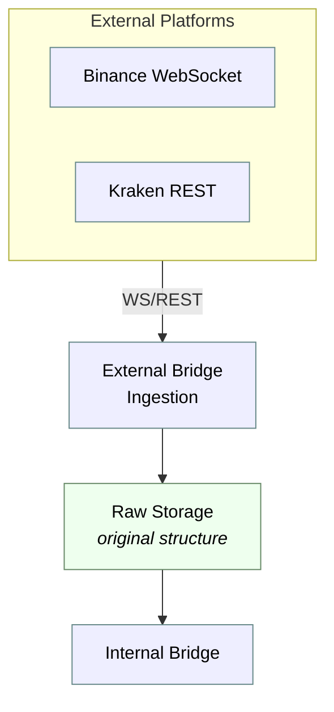
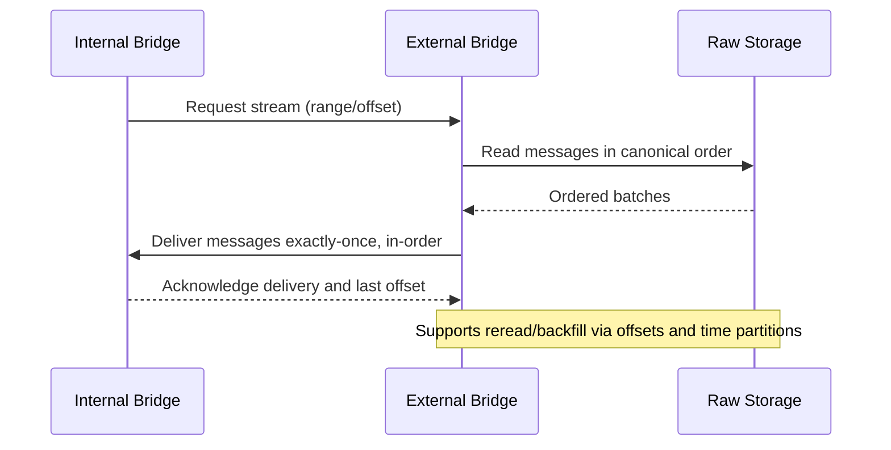

## External Bridge: Introduction and Scope

The external bridge is responsible for acquiring heterogeneous market data from multiple platforms, persisting the original payloads with minimal transformation, and making these records available to the internal bridge under strict delivery guarantees. This section delineates data ingress modalities, storage strategy, and the interface contract toward the internal bridge.

### Heterogeneous Market Data Ingestion

Market data is ingested from different platforms, data sources, and protocols. The system supports both streaming and request/response paradigms:

- Streaming over WebSockets (e.g., Binance trade and order book streams). See: [Binance Websockets](../002_data_source_binance_websockets.md).
- Periodic and on-demand REST polling (e.g., Kraken trades and order books). See: [Kraken REST API](../002_data_source_kraken_rest.md).

The external bridge does not normalize payloads beyond envelope metadata required for routing and storage. Instead, it preserves the exchange-native message formats to retain full fidelity for downstream consumers and audits.

### Storage Model and Retention

Downloaded/ingested data is written to durable storage in its original structure (per exchange, resource, and time-partitioned layout). This approach enables faithful replay, exchange-specific debugging, and provenance tracking.

- Original structure is preserved permanently when feasible.
- When data volume is high, a bounded retention window is applied. Retention is configured per dataset and can be tuned to balance storage cost, compliance, and backfill needs.
- Metadata (e.g., source, capture time, partitions, and offsets) supports efficient lookup and deterministic ordering at read time.

### Contract toward the Internal Bridge

While the internal bridge is out of scope for elaboration, its requirements drive the guarantees of the external bridge. Specifically, when serving stored messages to the internal bridge, the external bridge must provide:

- Exact order: messages are emitted in the canonical, source-defined order.
- Exactly-once: each message is delivered once to the consumer within a session, with deduplication safeguards based on stable identifiers and offsets.
- Reread/backfill capability: deterministic replay from a specified time range and/or offset to support recovery, reprocessing, and historical enrichment.

Collectively, these design choices ensure fidelity of raw market data, scalable storage under diverse volume profiles, and robust downstream delivery semantics suitable for deterministic analytics and reproducible research.

