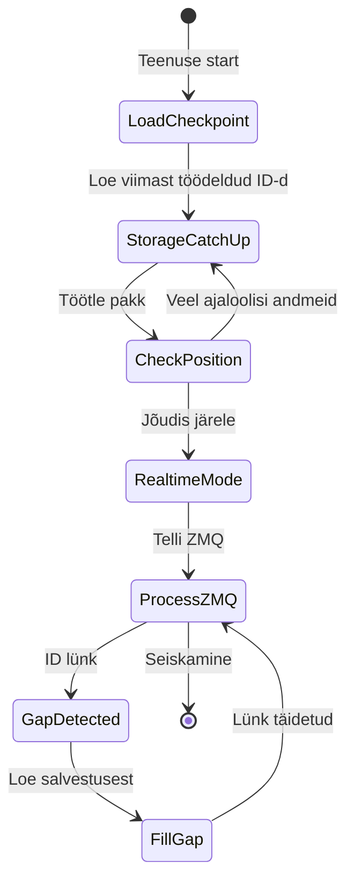
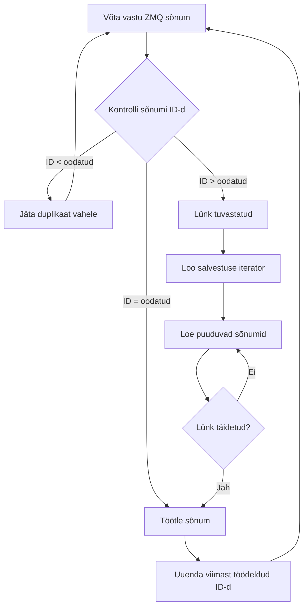
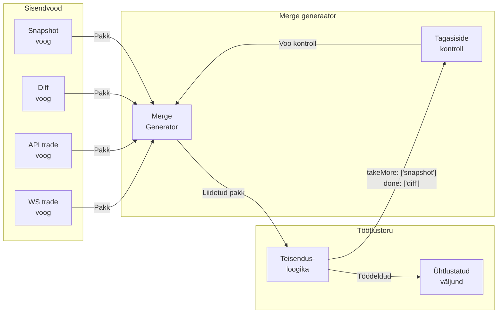
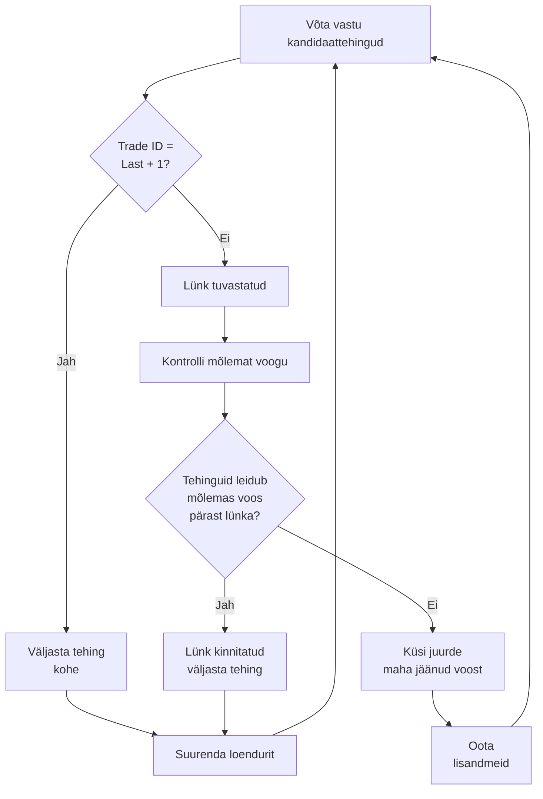
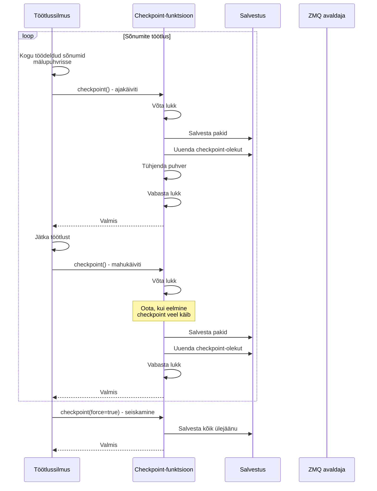
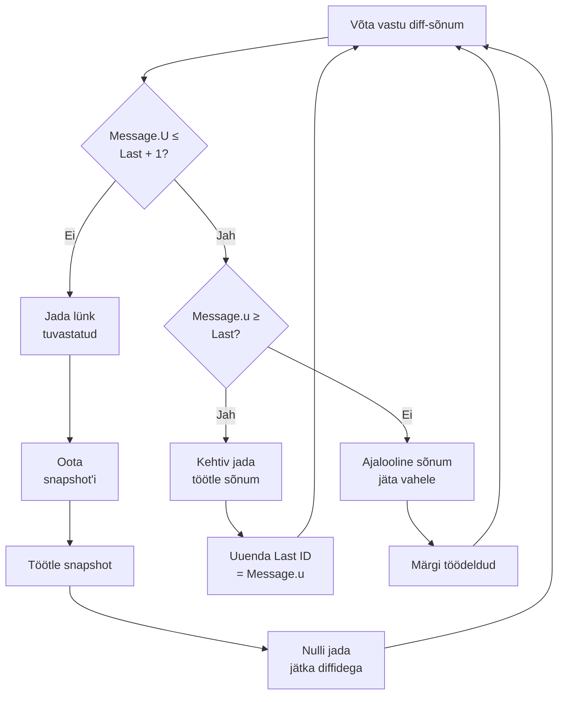
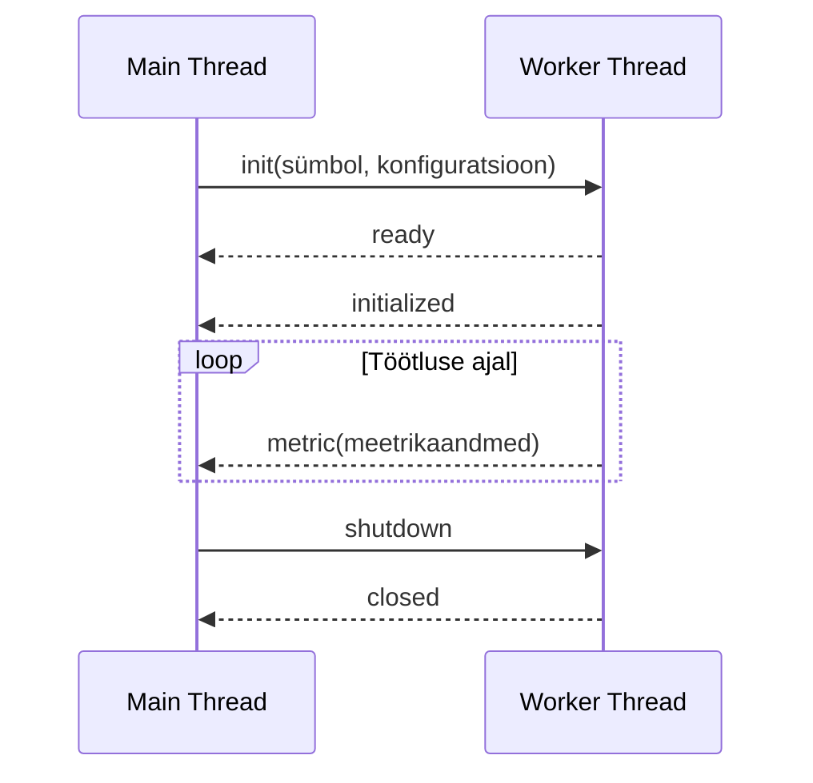
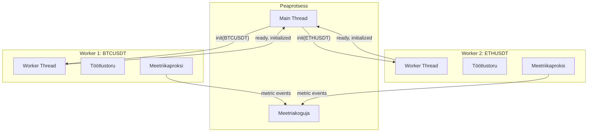
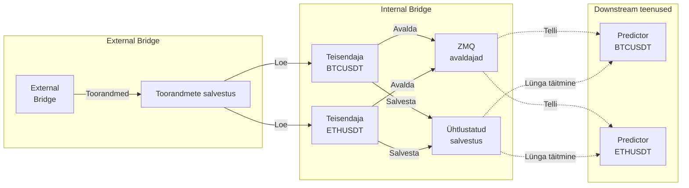

# Internal Bridge: Andmete teisendamise kiht

**internal-bridge** teenus realiseerib andmete teisendamise (transformatsiooni) kihi, mis paikneb vahetult *toore*, börsipõhise turuinfo ja *ühtlustatud* (unified) formaadi vahel, mida masinõppe mudelid saavad otse tarbida. Komponent lahendab probleemi, kuidas ühendada mitmekesised (heterogeensed) andmeallikad—nt **REST API hetkeseisud** (*snapshot'id*) ja **WebSocketi diferentsiaalvood** (*diff/delta streams*)—mitmelt börsilt, säilitades samal ajal **järjestusgarantii** (ordering guarantees), käsitledes **sõnumite kohaletoimetamise lünki** (delivery gaps) ning tagades **veataluvuse** (fault tolerance) **kontrollpunktidel** (checkpoints) põhinevate taastemehhanismidega.

## Arhitektuuriline ülevaade

internal-bridge töötab **olekuga** (stateful) teisendustoruna (pipeline), mis tarbib toorandmeid external-bridge'i salvestusest ja **ZeroMQ** (ZMQ) avaldajatelt (publishers), teisendab platvormispetsiifilised vormingud **ühtseteks skeemideks** (unified schemas) ning avaldab normaliseeritud (normalized) andmed uuesti downstream ennustusteenustele. Arhitektuur kasutab mustrit **transform-and-forward**: sõnumid läbivad mitu töötlusetappi, sh **lüngatuvastus** (gap detection), **voogude liitmine** (stream merging), **järjekorra valideerimine** (sequence validation), **deduplitseerimine** (deduplication) ning lõpuks **taasavaldamine** (republication) ZeroMQ kaudu reaalajaliseks jaotuseks.

Teenuse arhitektuur eristab nelja platvormispetsiifilist teisendajatüüpi, millest igaüks on optimeeritud konkreetse börsi protokolli eripäradele:

**Binance'i order book'i teisendaja** rekonstrueerib korrektse järjestuse order book'i perioodilistest REST API snapshot'idest ja kõrgsageduslikest WebSocketi diferentsiaaluuendustest. Teisendaja kontrollib järjestuse pidevust Binance'i spetsiifiliste uuendusidentifikaatorite abil (firstUpdateId `U` ja lastUpdateId `u`), filtreerides välja diferentsiaalid, mis ei sobi kahe järjestikuse snapshoti vahemikku—see **meelega tekitab lünki** sõnumivoos, säilitades samas ühtlustatud väljundi järjestuse korrektsust.

**Binance'i tehingute (trade) teisendaja** ühendab REST API ajaloolised tehingud reaalaja WebSocketi tehingusõnumitega. Deduplitseerimine tugineb monotoonselt kasvavatele tehingu-IDdele, et filtreerida juba töödeldud tehingud ning vältida topeltkirjeid olukorras, kus RESTi "catch-up" kattub WebSocketi vooga.

**Kraken'i order book'i teisendaja** töötleb Kraken'i snapshot+diff protokolli alusel *ainult WebSocketi* order book'i uuendusi, rekonstrueerides oleku ilma perioodilise REST pollimiseta. Teisendaja arvestab Kraken'i sõnumiformaadiga, kus esimene sõnuom on algne snapshot, mis loob baasoleku ja järgnevad diferentsiaalid muudavad seda inkrementaalselt.

**Kraken'i tehingute (trade) teisendaja** rakendab Binance'iga sarnast deduplitseerimisloogikat, kuid kohandub Kraken'i tehinguidentifikaatorite skeemi ja sõnumistruktuuriga, et tagada platvormiülene (platform-agnostic) ühtlustatud väljund erinevate sisendvormide kiuste.

Iga teisendajatüüp töötab **iseseisva protsessina** eraldatud olekuhaldusega, võimaldades selektiivselt juurutada konkreetseid börs–sümbol kombinatsioone teisi teisendajaid mõjutamata. Selline protsessieraldus loob **veapiirid** (fault boundaries), mis isoleerivad rikked ühe börsiintegratsiooni piires ning takistavad nende levimist teistele komponentidele.

## Kahe-režiimiline tarbimisstrateegia

internal-bridge rakendab keerukat **dual-mode** tarbimisstrateegiat, mis lahendab vastuolu: kuidas säilitada järjepidev töötlusolek teenuse taaskäivitustel, kuid hoida normaaltöös minimaalne latentsus. Lähenemine kombineerib **püsisalvestuse taasesituse** (persistent storage replay) ja **reaalaja ZeroMQ** sõnumiedastuse, pakkudes korraga nii "catch-up" võimekust kui ka madalat latentsust.

### Salvestusest järelejõudmise faas

Käivitumisel laeb iga teisendaja püsisalvestusest kontrollpunkti oleku, tuvastades iga sisendvoo jaoks viimase edukalt töödeldud sõnumi identifikaatori (nt REST snapshot'id, WS diferentsiaalvood). Seejärel alustab teisendaja RocksDB-st järjestikust lugemist iterator'i (iteraatori) abil, töödeldes akumuleerunud sõnumeid, mis saabusid teenuse offline-oleku ajal või eelnevates töötlussessioonides.

Salvestuslugeja moodustab konfigureeritava suurusega pakke (tavaliselt 10–100 kirjet pakis), et optimeerida lugemisläbilaset ja hoida mälukulu kontrolli all. Pakktöötlus võimaldab efektiivseid järjestikuseid ketta-lugemisi, mis sobituvad RocksDB **LSM-puu** (Log-Structured Merge Tree) arhitektuuriga: järjestikused skaneerimised ei vaja bloom-filtri kontrolle ning kasutavad tõhusalt plokivahemälu (block cache).

Catch-up faasis töödeldakse sõnumeid maksimaalse läbilaskega, sest kõik andmed on juba püsivalt olemas. Järjestikune töötlus annab **deterministliku taasesituse** (deterministic replay): identne sisendjada tekitab identse väljundjada ka mitmekordsel käivitamisel—see omadus on kriitiline transformatsiooniloogika muutuste valideerimiseks ja andmekvaliteedi probleemide silumiseks.

Catch-up kestab kuni lugemispunkt jõuab salvestuse "kirjutuspunktilt" järele, mida indikeerib iterator'i tühjade pakkide tagastus. Seejärel minnakse reaalajarežiimi.

### Reaalaja ZMQ töötlus

Kui salvestusest on järele jõutud, lülitub teisendaja ZeroMQ avaldajatelt tarbimisele, saades uued turuandmed minimaalse latentsusega (tüüpiliselt millisekundite suurusjärgus alates börsilt saabumisest kuni transformatsiooni lõpuni). ZeroMQ pub/sub muster pakub madala overhead'iga edastust, vältides broker-põhiste sõnumisüsteemide koordineerimiskulu.

Samas ZeroMQ pub/sub semantika ei garanteeri 100% kohaletoimetust—sõnumid võivad kaduda lühikeste katkestuste, tellija puhvri ületäitumise või avaldaja saatmepuhvri küllastumise tõttu. Selle piirangu kompenseerimiseks kasutab internal-bridge lünkatvastust, võrreldes oodatud ja saadud sõnumi-IDsid.

### Lünkatvastus ja tagasipööre salvestusse

Reaalajarežiimis hoiab teisendaja loendurit viimase töödeldud sõnumi-ID jaoks. Järgmise sõnumi saabumisel võrreldakse saabunud ID-d oodatuga (lastProcessedId + 1). Eristatakse kolme stsenaariumi:

Järjepidev jada (continuous sequence): kui saabunud ID võrdub oodatuga, töödeldakse sõnum ning loendur suureneb. See on levinud normaaltöö optimistlik tee minimaalse latentsusega.

Juba töödeldud (already processed): kui saabunud ID on väiksem või võrdne viimase töödeldud ID-ga, klassifitseeritakse sõnum duplikaadiks (nt ZMQ kordusedastuse või kattuva tellimuse tõttu) ja jäetakse vahele. Seda logitakse diagnostikaks, kuid käsitletakse normaalse nähtusena.

Lünk (gap detected): kui saabunud ID on suurem kui oodatud, tähendab see puuduvaid sõnumeid. Teisendaja pöördub kohe salvestusse, seab iterator'i oodatud ID positsioonile ning loeb järjest kirjeid, kuni lünk on täidetud.

Lünga täitmine toimub sünkroonselt: ZMQ reaalaja töötlus peatub, kuni puuduvad sõnumid on salvestusest loetud ja töödeldud. Nii säilitatakse range globaalne järjestus—ühtegi sõnumit ei töödelda enne, kui kõik eelnevad on töödeldud, sõltumata saabumisjärjekorrast.

Salvestuspõhine lünga täitmine on usaldusväärne, sest external-bridge kirjutab kõik sõnumid RocksDB-sse enne ZMQ-s avaldamist. Seega isegi kui ZMQ "kaotab" sõnumeid, on need püsisalvestuses olemas ja taastatavad. Dual-mode strateegia annab seega ZMQ madala latentsuse normaaltöös, kuid hoiab Kafka-laadse töökindluse (reliability guarantees) salvestuse tagavarateega.

### Mahajäämuse monitooring

Taustamonitooring käivitub perioodiliselt (iga 10 s), võrreldes teisendaja viimast töödeldud ID-d salvestuse hetke maksimaalse ID-ga. Normaaltöös on need ligikaudu võrdsed, sest töötlus toimub vahetult pärast salvestusse kirjutamist.

Kui aga salvestuse maksimum-ID ületab oluliselt teisendaja töödeldud ID-d (teisendaja jääb maha) ja see püsib üle ühe sekundi, käivitab monitooring automaatse teenuse restart'i. Restart sunnib teisendajat naasma catch-up režiimi, kus järelejõudmine toimub maksimaalse läbilaskega, mitte paralleelselt reaalaja sõnumeid vastu võttes.

See kaitsemehhanism väldib patoloogilisi olukordi, kus aeglane teisendaja kogub piiramatu "lag'i", mis võib viia mälupuuduseni ZMQ tellija puhvrite täitumise tõttu. Restart-põhine taastumine vahetab ajutise kättesaamatuse (restart + catch-up) garanteeritud lõpliku kooskõla (eventual consistency) ja piiritletud ressursikulu vastu.

## Voogude liitmine ja sõnumite järjestus

internal-bridge rakendab mitme sisendvoo liitmise loogikat, et kombineerida REST API vastuseid ja WebSocketi sõnumeid ühtseks kronoloogiliselt järjestatud väljundvooks. Liitmine peab arvestama asünkroonse saabumisega, erinevate saabumissagedustega ning platvormipõhiste järjestussemantikatega.

### Merge generator'i muster

Voogude liitja kasutab asünkroonset generaatorit (async generator), mis tarbib mitmest sisenditeraatorist (igaüks üks andmeallikas) ja yield'ib liidetud väljundpakke. Generaator hoiab iga voo jaoks eraldi iteraatorit ning liigub neis sõltumatult, lähtudes downstream tarbijate tagasisidest.

Liitja võtab vastu tagasiside-objekti, mis ütleb, millistest voogudest on vaja juurde sõnumeid ja millised vood on lõpuni töödeldud. See realiseerib selektiivse backpressure'i: kui snapshot-voog on ajutiselt tühi ja ootab järgmist snapshot'i, siis liitja küsib rohkem vaid snapshot-voost, peatades diferentsiaalvoo kuni snapshot on saadaval.

See selektiivne kontroll on vajalik platvormispetsiifiliste nõuete jaoks. Näiteks Binance'i order book'i rekonstrueerimisel ei tohi diferentsiaaluuendusi töödelda enne, kui baasoleku snapshot on käes. Liitja "pauusib" diff-voo, et vältida diferentsiaalide enneaegset rakendamist olekule, mida pole veel loodud.

### Sorteerimisstrateegia

Iga teisendaja rakendab oma allikate järjestussemantikast tulenevat spetsialiseeritud loogikat:

Binance'i order book'i järjestus: sõnumid sorteeritakse uuendus-ID järgi, kus snapshot'id eelistatakse samal ID-l diferentsiaalide ees. Nii tagatakse, et kui snapshot ja diff viitavad samale versioonile, siis "täielik olek" (snapshot) töödeldakse enne "muudatust" (diff).

Tehinguvoogude järjestus: nii API ajaloolised tehingud kui WS tehingud sorteeritakse börsi tehingu-ID järgi. Kui mitu tehingut jagavad sama ID-d (nt API batch-vastustes), kasutatakse determinismi tagamiseks teisest sorteerimisvõtit: sõnumi saabumise ajatempel.

Sorteerimine toimub pakkide kaupa (10–100 sõnumit), mitte üksiksõnumite kaupa—see hoiab latentsuse mõistlikuna, säilitades lokaalse korrektsuse. Pakipiiride üleselt säilib globaalne järjestus, sest sisendvood annavad monotoonselt kasvavaid identifikaatoreid ning liitja hoiab eraldi lugemispunkte.

## Mitme allika deduplitseerimine

Tehingute teisendustoru peab deduplitseerima REST API ajaloolise voo ja reaalaja WebSocketi voo kattuvuse. Eriti käivitumisel või pikema downtime'i järel tuuakse RESTist ajaloolised tehingud, samal ajal kui WS saadab värskeid tehinguid. Need vood kattuvad paratamatult ja ilma deduplitseerimiseta tekiksid topeltkirjed.

### Tehingu-ID põhine deduplitseerimine

Deduplitseerimine kasutab börside poolt määratud tehinguidentifikaatoreid, mis on monotoonselt kasvavad täisarvud. Teisendaja hoiab loendurit lastEmittedTradeId, mis tähistab suurimat juba töödeldud ja väljundisse väljastatud tehingu-ID-d.

Sisendsõnumeid filtreeritakse tehingu-ID põhjal:

Ajaloolised sõnumid: kui kõik tehingud sõnumis on ID-ga ≤ lastEmittedTradeId, loetakse kogu sõnum juba töödeldud ajalooks ning märgitakse lõpetatuks ilma teisenduseta. See väldib tarbetut arvutust duplikaatandmetel.

Kandidaattehingud: sõnumid, mis sisaldavad tehinguid ID-ga > lastEmittedTradeId, loetakse kandidaatideks ja läbivad teisenduse ning lünkatvastuse loogika.

### Lünga-teadlik väljastusstrateegia

Tehingute väljastus kasutab konservatiivset lünkatvastust, sest eri allikatest (API vs WS) saabuvad tehingud ei pruugi olla sünkroonis. Kui väljastada tehing kohe saabumisel, võib väljundisse tekkida näiline lünk, kuigi "puuduv" tehing pole lihtsalt teise allika kaudu veel kohale jõudnud.

Seetõttu rakendatakse "look-ahead" strateegiat, mis vaatab kandidaatide järjekorras ettepoole:

Järjepidev jada: kui järgmise kandidaadi ID = lastEmittedTradeId + 1, väljastatakse kohe ja loendur suureneb.

Lünk kinnitatud: kui järgmise kandidaadi ID > lastEmittedTradeId + 1, uuritakse, kas mõlemas voos (API ja WS) leidub tehinguid ka pärast seda lünka. Kui jah, on lünk tõenäoliselt päriselt "kadunud" tehing (börs jättis ID vahele või external-bridge filtreeris) ning tehing väljastatakse lüngast hoolimata.

Lünk kinnitamata: kui ainult ühes voos on pärast lünka "tulevikutehinguid", peatab teisendaja väljastuse ning küsib juurde sõnumeid voost, mis on maha jäänud. Nii välditakse valepositiivset lünka asünkroonsuse tõttu.

See meetod tasakaalustab latentsuse ja korrektsuse: tehinguid väljastatakse esimesel ohutul hetkel, kuid lünki aktsepteeritakse ainult siis, kui mitu allikat annavad sõltumatu tõendi, et tehing ei saabu.

### Püsiva lünga käsitlemine

Kui teisendaja kogub liiga palju ebaõnnestunud väljastuskatseid (tavaliselt 100 järjestikust tsüklit ilma eduka väljastuseta), mis viitab püsivale lüngale, mida ei suudeta tavalise lünkatäitmisega lahendada, käivitab ta automaatse restart'i. See sunnib salvestuspõhisesse catch-up'i, kus "täielikum" ajalooline kontekst võib paljastada lünga põhjuse (nt salvestuskahjustus, puuduva vahemiku probleem või viga lünkatvastusloogikas).

## Kontrollpunktidel põhinevad taastemehhanismid

internal-bridge kasutab mitmetasandilist checkpoint'i jälgimist, et taastuda täpselt mitme sisendvoo lõikes. Erinevalt jämedast (coarse-grained) "ühe offset'i" lähenemisest hoitakse igale sisendvoole eraldi kontrollpunkti, võimaldades pärast restart'i jätkata eri voogudes erinevatest positsioonidest ilma tarbetu ületöötluseta.

### Mitmetasandiline checkpoint-olek

Iga teisendaja hoiab kontrollpunkti olekut iga tarbitava voo kohta. Näiteks Binance'i order book'i teisendaja jälgib:

binanceOrderBook.lastProcessedId: suurim töödeldud REST snapshot'i sõnumi-ID

binanceOrderBook.lastProcessedTimestamp: selle snapshot'i ajatempel

binanceDiffDepth.lastProcessedId: suurim töödeldud WS diferentsiaali-ID

binanceDiffDepth.lastProcessedTimestamp: selle diferentsiaali ajatempel

Selline granulaarsus võimaldab täpset taastumist: pärast restart'i võib snapshot-voog jätkuda nt positsioonilt 15 000 ja diff-voog positsioonilt 50 000, peegeldades nende erinevaid töötluskiirusi eelnevas sessioonis.

Checkpoint'id salvestatakse eraldi RocksDB instantsides, mis on lahutatud sisend- ja väljundandmete salvestusest. See vähendab konflikti (contention) suure läbilaskega ingest'i operatsioonidega ning võimaldab kiireid punktlugemisi ja -uuendusi ilma täisskaneerimiseta.

### Checkpoint'i käivitid

Checkpoint'i säilitamine toimub kolme tingimuse alusel, realiseerituna üldise checkpoint-funktsiooni abstraktsioonina:

Ajapõhine checkpoint: iga 5 sekundi järel (konfigureeritav) sõltumata mahust. Tagab, et isegi väikese liiklusega püsib checkpoint "värske" ning ootamatu seiskamise järel on reprocess'i maht piiratud.

Mahupõhine checkpoint: pärast 1000 sõnumi töötlust (konfigureeritav) sõltumata ajast. Tagab, et mälupuhvrisse kogunev töödeldud andmete hulk ei kasva piiramatult suurte mahtudeni.

Seiskamise checkpoint: graceful shutdown'i ajal sunnitakse checkpoint, et kõik puhvrites olevad andmed ja checkpoint-olek kirjutataks enne protsessi lõppu.

Checkpoint-funktsioon kasutab promise-põhist lukku, et vältida paralleelseid checkpoint-operatsioone. Kui uus käiviti aktiveerub ajal, mil checkpoint juba käib, ootab uus operatsioon eelmise lõppu, vältides race condition'e ja hoides oleku kooskõlas ilma keerukate transaktsioonisemantikateta.

### Checkpoint'i riketega toimetulek

Kui checkpoint'i salvestus ebaõnnestub (nt salvestusviga, ketas täis, infrastruktuuriprobleem), logib süsteem fataalse vea ja käivitab teenuse restart'i. See "fail-fast" käitumine väldib olukorda, kus teisendaja jätkaks töötlust ilma checkpoint'ita, mis muudaks järgmise restart'i järel reprocess'i mahu piiramatuks.

Restart põhjustab lühikese katkestuse, kuid tagab piiritletud taastöötluse mahu. Alternatiiv—töötluse jätkamine ilma checkpoint'ita—tooks kaasa olukorra, kus järgmisel restart'il tuleks taasesitada potentsiaalselt hiiglasuures mahus andmeid, mis tekitaks mäluprobleeme ja lubamatult pikka taastumisaja.

## Järjestuse valideerimine

Iga teisendaja kontrollib oma börsi protokollireegleid, tuvastades rikkumisi, puuduvaid sõnumeid või ootamatut järjestust, mis võib viidata andmekvaliteedi probleemidele või börsi API anomaaliatele.

### Binance'i order book'i järjestuse valideerimine

Binance'i order book'i diferentsiaalid kasutavad kahte identifikaatorit:

U (firstUpdateId): diferentsiaalsõnumi esimese uuenduse ID

u (lastUpdateId): diferentsiaalsõnumi viimase uuenduse ID

Kehtiv järjestus peab rahuldama invariandi: järgmise sõnumi U = eelmise sõnumi u + 1. See garanteerib katkematu jada.

Teisendaja kontrollib seda nii:

Kehtiv järjestus: kui message.U <= lastOrderBookId + 1 && message.u >= lastOrderBookId, aktsepteeritakse sõnum. Tingimus lubab väikest kattuvust (redelivery) kuid nõuab, et sõnum pikendaks jada.

Järjestuslünk: kui message.U > lastOrderBookId + 1, tuvastatakse lünk. Teisendaja logib hoiatuse ja läheb ooterežiimi, küsides rohkem snapshot'e, mitte diffe. See vastab protokollile: lüngad diffs tuleb lahendada uue snapshot'iga.

Ajalooline sõnum: kui message.u < lastOrderBookId, on sõnum täielikult ajalooline ja jäetakse vahele.

### Tehingu-ID monotoonsus

Tehingute teisendajad kontrollivad, et tehingu-ID'd moodustaksid monotoonselt kasvava jada. Väikesed lüngad võivad esineda (börs jätab ID vahele või filtreerimine eemaldab osa tehinguid), kuid ID ei tohi kunagi väheneda. Vähenev ID viitab sõnumite ümberjärjestusele, sortimisvigadele või andmekahjustusele.

Kui kandidaat-tehingu ID ≤ eelmine väljastatud ID, jäetakse see kas duplikaadina vahele või logitakse viga (kui tegu on ehtsa "out-of-order" juhtumiga). Rangelt monotoonne nõue võimaldab kiiret deduplitseerimist lihtsa võrdlusega, mitte kuluka "kõigi nähtud ID'de hulga" (set) haldamisega.

## Worker-thread põhine paralleeltöötlus

Binance'i tehingute teisendaja kasutab worker-thread paralleelsust, et töödelda mitut sümbolit sama teenuseinstantsi sees. See maksimeerib CPU kasutust, kui on palju madala mahuga sümboleid, säilitades samas protsessi/isolatsiooni eelised.

### Worker`i arhitektuur

Põhiprotsess käivitab ühe worker-thread'i iga sümboli kohta (nt BTCUSDT, ETHUSDT). Iga worker töötab eraldatud V8 isolaadis oma event loop'i ja prügikoristajaga (GC). See annab mälueralduse: ühe worker'i mäluleke või liigne mälutarve ei mõjuta teisi workereid ega peaprotsessi.

Kommunikatsiooniks luuakse igale worker'ile MessageChannel, mis pakub kahesuunalist kanalit struktureeritud kloonimise algoritmil põhinevaks sõnumivahetuseks (structured clone). See väldib jagatud mälu ning sellega kaasnevaid andmerahesid ja lukustuse keerukust.

### Tüübitud sõnumikanalid

Sõnumivahetus on tugevalt tüübitud (strongly-typed) skeemidega:

Tüübitud kanal annab kompileerimisajal kontrolli, vältides vigase sõnumistruktuuri runtime vigu. TypeScripti inferents tähendab, et handler'id saavad korrektselt tüübitud objekte ilma käsitsi type assertion'iteta.

### Meetrikate edastamine

Worker'id ei saa otse kasutada peaprotsessi meetrikainfrastruktuuri (Prometheuse register, metric instance'id) mäluisolatsiooni tõttu. Seetõttu kasutatakse metrics forwarding mustrit: worker "püüab kinni" meetrika meetodikutsed (counter inc, histogram observe, gauge set) ja saadab need sõnumitena main thread'ile.

Worker'i init'is tehakse meetrikakontekstis "monkey-patching": meetodid asendatakse proksifunktsioonidega, mis serialiseerivad kutsed sõnumiteks. Kui worker kutsub metrics.throughput.inc({symbol: 'BTCUSDT', type: 'trade'}, 100), pakib proksi meetodi nime, meetrika võtme ja argumendid metric sõnumisse ja saadab main thread'ile.

Main thread rekonstrueerib kutse: saab metricKey='throughput', methodKey='inc', args=[{symbol:'BTCUSDT', type:'trade'}, 100] ja kutsub sama meetodit päris metric instantsil. Nii koondub meetrika ühte kohta ja on eksponeeritav ühe HTTP endpointi kaudu.

### Elutsükli koordineerimine

Worker'ite init ja shutdown on koordineeritud, et teenuse tervis (health) peegeldaks konsistentset olekut:

Init'is luuakse worker'id ja oodatakse ready sõnumeid.

Seejärel saadetakse init ning oodatakse initialized.

Alles kui kõik worker'id on initialized, raporteerib health endpoint "healthy".

Shutdown'is saadetakse kõigile shutdown, oodatakse closed, seejärel sulgub peaprotsess. Nii tagatakse, et checkpoint'id, salvestus ja sõnumiühendused suletakse korrektselt ning andmed on püsivad.

Osaline olek (mõni worker töötab, mõni on maas) loetakse teenusetasemel ebatervislikuks ja suunab infrastruktuuri restart'ile.

## Transform-and-forward muster

internal-bridge mitte ainult ei teisenda, vaid ka salvestab ja avaldab uuesti ühtlustatud andmed ZeroMQ kaudu. Nii saavad mitmed tarbijad kasutada ühist normaliseeritud voogu ilma, et iga tarbija peaks ise toorandmetega ja keeruka transformatsiooniloogikaga tegelema.

### ZeroMQ avaldajate seadistus

Iga teisendaja loob oma väljundvoogudele ZMQ publisher registry, kasutades socket template'e, mis genereerivad IPC socketi teed platvormi ja sümboli järgi. Näiteks Binance'i order book'i sokkel võib olla ipc:///tmp/unified-orderbook-binance-BTCUSDT.sock.

Publishereid seadistatakse:

Saatmepuhver: kui socketi send queue on täis, kogutakse sõnumid rakendusepuhvrisse, vältides kadusid lühiajaliste tellijakatkestuste ajal. Puhvri limiidid takistavad lõputut mälukasvu.

Pakina avaldamine: kuni 100 sõnumit korraga, et vähendada syscali overhead'i ja tõsta throughput'i.

Fire-and-forget semantika: avaldatakse asünkroonselt ilma ack'ideta. Kohaletoimetus pole garanteeritud, kuid see on aksepteeritav, sest downstream tarbijad rakendavad sama storage fallback mustrit.

### Ühtlustatud andmete jaotus

Pärast teisendust ja salvestust avaldatakse sõnum ZMQ-sse koos täiendatud identifikaatoriga: lisatakse lokaalne monotoonselt kasvav ID, mis lubab downstream tarbijatel rakendada sama lünkatvastust.

Näiteks Binance'i order book snapshot'i korral:

teisendatakse ühtlustatud bid/ask struktuuriks

salvestatakse internal-bridge'i RocksDB-sse

omistatakse lokaalne järjestikune ID

avaldatakse vastavasse ZMQ socket'isse

Downstream ennustusteenus tellib soketi, tarbib ühtlustatud voogu ja lünga korral loeb puuduva osa internal-bridge'i väljundsalvestusest (dual-mode tarbimine).

Selline transform-and-forward torustik loob mitmekihilise andepipeline'i, kus iga aste lisab väärtust (ingest → transform → inference), kuid säilitab iga taseme juures salvestuspõhise taastamisvõime. See jaotab töökoormuse teenuste vahel, hoides lõpust lõpuni töökindluse püsisalvestuse abil igas kihis.

## Jõudlus ja läbilase

internal-bridge saavutab suure läbilaske ja range järjestuse tänu mitmele optimeeringule:

Pakiorienteeritud töötlus: kõik etapid töötlevad pakke, amortiseerides funktsioonikutsete overhead'i ja võimaldades vektoriseerimist. Tüüpilised paketisuurused 10 (madal latentsus order book) kuni 100 (suur maht trade).

Checkpoint-põhine pakkimine: teisendatud sõnumid kogutakse mälupuhvritesse kuni checkpoint'i tingimuseni, vähendades kirjutusamplifikatsiooni—1000 sõnumit kirjutatakse ühe operatsioonina.

Event loop'i "yield": pärast pakktöötlust loovutatakse kontroll Node.js event loop'ile yieldToEventLoop() abil, et vältida näljutamist (starvation) ning hoida health check'id, metrics endpoint ja ZMQ hooldus responsiivsena.

Zero-copy teisendus: ühtlustatud objektid viitavad võimalusel toorobjektide väljadele, vähendades allokatsioone ja GC survet—eriti tehingutes, kus timestamp/price/qty kanduvad otse.

Valikuline kompressioon: väljundsalvestus kasutab LZ4 kompressiooni (2–3×), väikese CPU kuluga. LSM-puu järjestikused kirjutused sobituvad hästi plokkide kaupa kompressiooniga.

Need valikud võimaldavad sisuliselt ületada 10 000 sõnumit sekundis per teisendaja instants tavalisel riistvaral (8 tuuma, NVMe), säilitades alla 10 ms latentsuse sisendsõnumist kuni väljundi avaldamiseni. Ühe-thread'ine Node.js arhitektuur on piisav, sest töö on pigem CPU-keskne kui I/O-keskne ning async iterator'i muster võimaldab efektiivselt "pipeline'ida" ketta I/O-d ja teisendust.

## Operatiivsed omadused

internal-bridge'il on tootmiskeskkonnas usaldusväärsust ja hooldatavust toetavad omadused:

Automaatne taastumine: checkpoint + lünkatvastus + storage fallback + restart püsivate rikete korral katab transient vead, võrgukatkestused ja ressursiprobleemid ilma käsitsi sekkumiseta.

Deterministlik replay: salvestuspõhine arhitektuur võimaldab ajalooliste vahemike deterministlikku taasesitust silumiseks, valideerimiseks ja testimiseks.

Jälgitav (observable) olek: detailne meetrika—töödeldud sõnumid voogude kaupa, checkpoint lag, lünkatäitmised, throughput—annab hea nähtavuse toru tervisele.

Piiritletud ressursikulu: mahupõhised checkpoint'id ja restart püsivate lünkade korral hoiavad mälu ja ketta kasutuse kontrolli all.

Graceful degradation: ühe teisendaja rike ei halvata teisi, sest protsessieraldus hoiab integratsioonid isoleerituna. Süsteem jääb osaliselt funktsionaalseks hoolduse või konkreetse sümboli/börsi probleemide korral.

Need omadused järgivad disainifilosoofiat, mis eelistab operatiivset lihtsust ja determinismi hajusskaaleeritavusele. Arhitektuur tunnistab, et ühe masina deploy-mudel on sihtkoormuse jaoks piisav (kümmekonnad sümbolid mitmelt börsilt), vähendades oluliselt keerukust võrreldes jaotatud streaming-süsteemidega.
