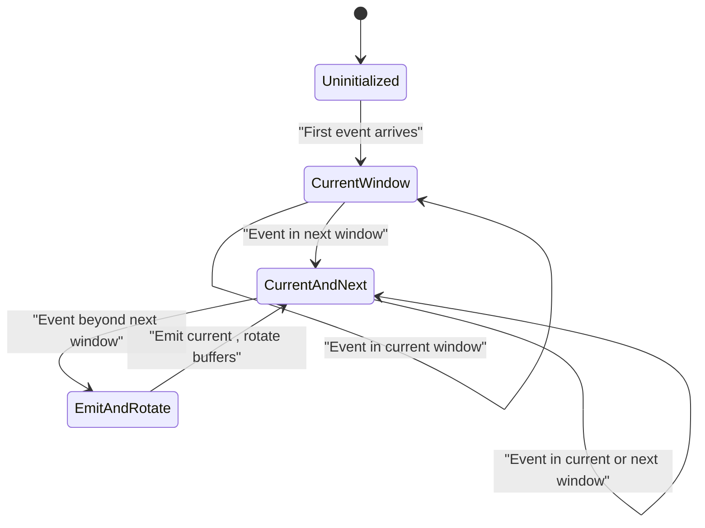
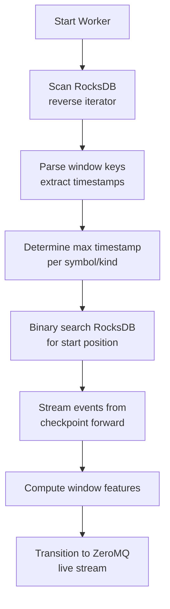
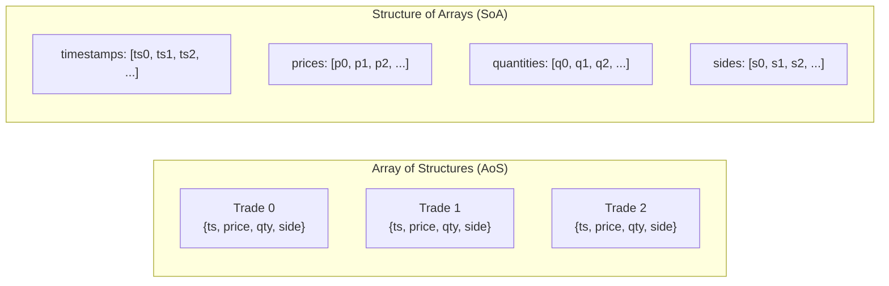
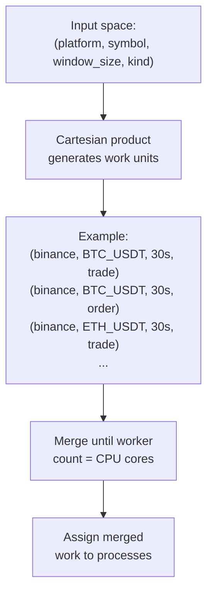
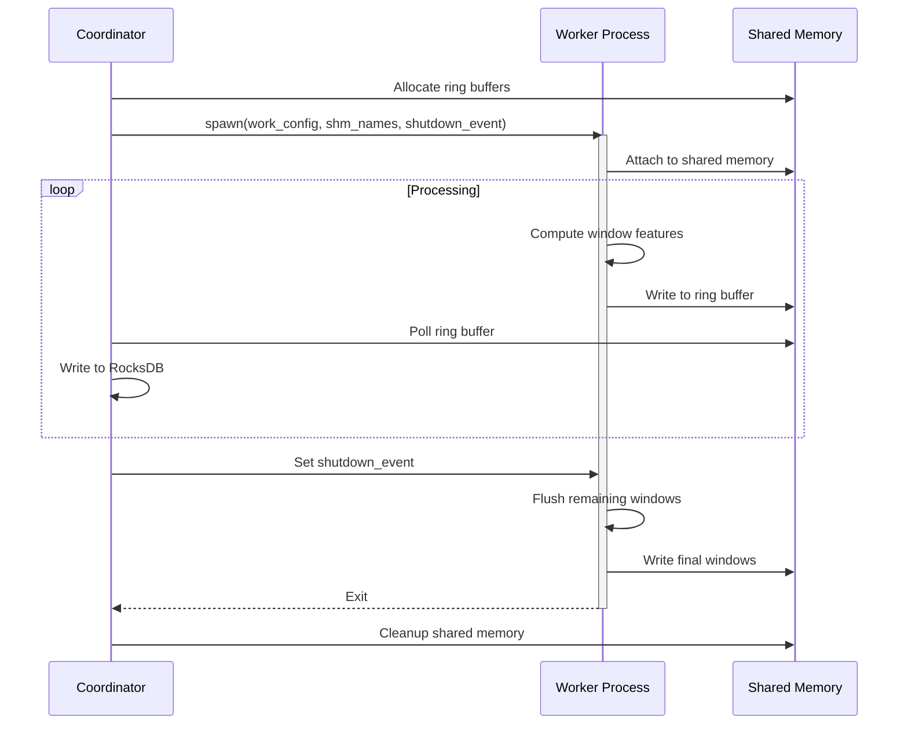

# Feature Engineering for Market Data: A Parallel Window-Based Approach

## Abstract

This chapter presents a comprehensive feature engineering pipeline for high-frequency cryptocurrency market data, addressing the computational challenges of real-time aggregation across multiple trading pairs and exchanges. The system implements time-windowed feature extraction from trade events and order book snapshots, employing Structure-of-Arrays data layouts for efficient vectorized computation and custom lock-free ring buffers for inter-process communication. The architecture achieves parallel processing across trading symbols while maintaining deterministic window boundaries and supporting both historical replay and real-time streaming modes.

## 1. Introduction

Feature engineering constitutes a critical component in financial machine learning pipelines, transforming raw market events into meaningful statistical aggregates suitable for predictive modeling. In cryptocurrency markets characterized by continuous 24/7 trading and sub-millisecond event frequencies, the computational demands of feature extraction necessitate careful architectural considerations regarding memory efficiency, parallelization strategies, and data synchronization mechanisms.

This chapter describes a Python-based feature engineering system designed to process two primary data streams: trade execution events and order book snapshots. The system computes fixed-interval window aggregates ranging from 30 seconds to multiple minutes, extracting statistical features that capture price dynamics, volume patterns, liquidity characteristics, and microstructure signals.

### 1.1 Design Objectives

The implementation prioritizes several key objectives:

1. **Computational Efficiency**: Leveraging NumPy's vectorized operations to delegate mathematical computations to optimized C/Fortran BLAS routines, avoiding Python interpreter overhead for numerical operations
2. **Parallel Scalability**: Distributing feature computation across multiple processes to exploit multi-core CPU architectures while avoiding Global Interpreter Lock (GIL) contention
3. **Memory Efficiency**: Employing Structure-of-Arrays layouts and zero-copy data access patterns to minimize memory allocations and cache misses
4. **Deterministic Replay**: Supporting consistent feature computation across historical data replays through checkpoint-based recovery and aligned window boundaries
5. **Real-Time Processing**: Enabling seamless transition from historical data processing to live stream consumption without service interruption

### 1.2 Python Implementation Rationale

While Python's dynamic typing and interpreted execution model impose performance penalties for scalar operations, the language provides unparalleled access to mature numerical computing ecosystems. NumPy's ndarray implementation delegates array operations to highly optimized linear algebra libraries (BLAS/LAPACK), achieving performance comparable to native C implementations for vectorized computations. This characteristic makes Python particularly suitable for batch-oriented statistical aggregations where data can be organized into contiguous arrays and processed via vectorized primitives.

The feature engineering pipeline exploits this paradigm by accumulating market events in typed memory buffers (`array.array`), then converting to NumPy views for vectorized feature computation, thereby minimizing Python-level iteration while maximizing utilization of optimized numerical kernels.

## 2. Windowing Architecture

The system employs fixed-interval time windows for temporal aggregation, computing independent feature sets for each discrete time period.

### 2.1 Window Alignment and Boundary Determination

Window boundaries are determined through integer division of Unix epoch millisecond timestamps by the configured window size:

```
window_start = (event_timestamp_ms // window_size_ms) * window_size_ms
window_end = window_start + window_size_ms
```

This alignment strategy ensures deterministic window boundaries independent of process start times or service restarts, enabling consistent feature computation across distributed workers and historical replay sessions.

### 2.2 Window Handler State Machine

Each window worker maintains a dual-buffer state machine to handle boundary transitions without data loss:



The state machine transitions are triggered by comparing incoming event timestamps against current and next window boundaries:

- Events falling within the current window are accumulated in the primary buffer
- Events falling within the next consecutive window are accumulated in the secondary buffer
- Events falling beyond the next window trigger emission of the current window, followed by buffer rotation

This dual-buffer approach guarantees that no events are discarded during window transitions, while maintaining O(1) event insertion complexity.

### 2.3 Checkpoint-Based Recovery

For historical data processing, the system implements checkpoint recovery to avoid redundant computation. Workers scan the most recent entries in the output storage (RocksDB) to determine the latest successfully computed window for each (platform, symbol, window_size, kind) combination.



The binary search optimization leverages RocksDB's sorted key properties to efficiently locate the starting position within potentially multi-million entry datasets, avoiding full table scans on worker restarts.

### 2.4 Dual-Mode Operation

Workers operate in two sequential modes:

1. **Historical Catch-Up Mode**: Iterating through RocksDB-persisted events from the determined checkpoint, processing at maximum throughput limited only by I/O bandwidth and computation capacity
2. **Live Streaming Mode**: Consuming events from ZeroMQ publish-subscribe sockets as they arrive from upstream bridge services

The transition between modes is seamless, with deduplication logic comparing event timestamps against the checkpoint threshold to discard any overlap events present in both historical storage and the live stream buffer.

## 3. Trade Feature Extraction

Trade events represent executed market transactions, characterized by timestamp, price, quantity, side (buy/sell), and order type (market/limit). The system aggregates these atomic events into statistical features capturing price dynamics and volume characteristics.

### 3.1 Structure-of-Arrays Data Layout

Rather than storing trade events as an array of structures (AoS), the system employs a Structure-of-Arrays (SoA) layout:



This layout provides several performance advantages:

1. **Vectorization**: NumPy operations can process entire arrays without Python-level iteration
2. **Cache Locality**: Operations on a single field (e.g., all prices) access contiguous memory
3. **Memory Efficiency**: No Python object overhead or padding between fields
4. **Zero-Copy Views**: Direct buffer access via `memoryview` without data copying

### 3.2 Typed Buffer Implementation

The SoA implementation uses Python's `array.array` module for typed homogeneous buffers:

- `timestamps`: `array('q')` - signed 64-bit integers
- `prices`: `array('d')` - double-precision floats
- `quantities`: `array('d')` - double-precision floats
- `sides`: `array('B')` - unsigned 8-bit integers
- `order_types`: `array('B')` - unsigned 8-bit integers

Buffers are initialized with a capacity of 2048 elements, growing by 2x when full. This exponential growth strategy amortizes reallocation costs to O(1) per insertion over the lifetime of the window.

### 3.3 Zero-Copy NumPy Conversion

At window emission time, the typed arrays are converted to NumPy views without data copying:

```python
n = self.i  # number of accumulated events
ts = np.frombuffer(memoryview(self.ts), dtype=np.int64, count=n)
prices = np.frombuffer(memoryview(self.price_u), dtype=np.float64, count=n)
quantities = np.frombuffer(memoryview(self.qty_u), dtype=np.float64, count=n)
sides = np.frombuffer(memoryview(self.side), dtype=np.uint8, count=n)
```

The `memoryview` protocol provides buffer interface access, while `np.frombuffer` creates NumPy arrays referencing the underlying memory without allocation or copying.

### 3.4 Computed Trade Features

The system extracts multiple feature categories from trade windows:

#### 3.4.1 OHLCV Features

Classic candlestick data representing price action within the window:

- **Open**: Price of first trade (`price[0]`)
- **High**: Maximum trade price (`price.max()`)
- **Low**: Minimum trade price (`price.min()`)
- **Close**: Price of last trade (`price[-1]`)
- **Volume**: Total traded quantity (`quantity.sum()`)

#### 3.4.2 Volume-Weighted Metrics

Features incorporating both price and quantity information:

- **Price-Volume Product**: `sum_pv = Σ(price * quantity)` - numerator for VWAP calculation
- **Buy Volume**: Total quantity of buy-side trades (side == 0)
- **Sell Volume**: Total quantity of sell-side trades (side == 1)

The buy/sell decomposition avoids creating two masked arrays by leveraging NumPy's conditional sum:

```python
buys = side == 0
buy_vol = np.sum(quantity, where=buys, initial=0.0)
sell_vol = sum_vol - buy_vol
```

#### 3.4.3 Log-Return Aggregates

Rather than storing full return sequences, the system computes mergeable moment aggregates:

- **Sum of log-returns**: `sum_logret = Σ(log(price[i+1]) - log(price[i]))`
- **Sum of squared log-returns**: `sum_logret2 = Σ(log-return²)` - enables realized variance estimation
- **Sum of cubed log-returns**: `sum_logret3 = Σ(log-return³)` - captures skewness component

The implementation handles zero or negative prices (potential data errors) by setting invalid entries to NaN and using `np.nansum` for robust aggregation:

```python
mask_pos = price > 0.0
np.log(price, out=logp, where=mask_pos)
logp[~mask_pos] = np.nan
lr = np.diff(logp)
sum_logret = np.nansum(lr)
```

#### 3.4.4 Timing Features

Temporal characteristics capturing trading activity patterns:

- **First timestamp**: Timestamp of first trade in window
- **Last timestamp**: Timestamp of last trade in window
- **Sum of inter-trade intervals**: `sum_dt = Σ(ts[i+1] - ts[i])`
- **Maximum gap**: Longest interval between consecutive trades

These features enable estimation of trade arrival rates and identification of inactivity periods.

#### 3.4.5 Size Distribution Features

Extreme value statistics capturing trade size characteristics:

- **Minimum trade size**: `quantity.min()`
- **Maximum trade size**: `quantity.max()`

Large maximum sizes may indicate institutional block trades, while minimum sizes reflect retail activity levels.

### 3.5 Feature Persistence Format

Computed features are serialized using MessagePack into a `TradeWindowAggregate` structure containing all extracted metrics. The binary encoding minimizes storage overhead while maintaining fast serialization/deserialization performance for subsequent ML pipeline consumption.

## 4. Order Book Feature Extraction

Order book snapshots represent the current state of standing limit orders at various price levels, providing insight into market liquidity and price pressure dynamics.

### 4.1 Order Book State Management

The system maintains a live order book reconstruction from exchange-provided snapshots and incremental updates.

#### 4.1.1 Sorted Order Book Structure

Each side (bid/ask) is represented by a `_SideBook` structure maintaining:

- `prices`: Sorted list of price levels (ascending order)
- `volumes`: Dictionary mapping price → quantity at that level
- `total_qty`: Rolling sum of all quantities (O(1) depth query)
- `total_notional`: Rolling sum of price × quantity (O(1) notional value)

The sorted prices list enables O(1) best price access:

- Bid side: `best_bid = prices[-1]` (highest price)
- Ask side: `best_ask = prices[0]` (lowest price)

#### 4.1.2 Incremental Update Algorithm

Order book updates modify individual price levels through three operations:

1. **Level Addition**: New price level inserted via binary search (`bisect.insort`), with fast-path optimizations for appends at best/worst prices
2. **Level Update**: Existing level modified in `volumes` dictionary, rolling aggregates adjusted by delta
3. **Level Removal**: Level deleted when quantity reaches zero, rolling aggregates decremented

The rolling aggregate maintenance eliminates the need for full order book traversal when computing total depth or VWAP:

```python
# On level addition
self.total_qty += volume
self.total_notional += price * volume

# On level update
delta = new_volume - old_volume
self.total_qty += delta
self.total_notional += price * delta

# On level removal
self.total_qty -= volume
self.total_notional -= price * volume
```

### 4.2 Time-Weighted Feature Accumulation

Unlike trade events which occur at discrete points, order book state persists between updates. The system implements time-weighted averaging to properly account for the duration each state was observable.

#### 4.2.1 Time-Weight Computation

For each order book update at timestamp `t_curr`, the weight assigned to the _previous_ state is:

```
w = t_curr - t_prev
```

This duration-based weighting ensures that long-lived states contribute proportionally more to window aggregates than transient states.

#### 4.2.2 Accumulated Features

The `OrderBookAccumulator` structure maintains running sums of weighted features:

**Mid-Price and Microprice**:

- `sw_mid`: Time-weighted sum of mid-prices `Σ(w * (ba + bb)/2)`
- `sw_micro`: Time-weighted sum of microprice `Σ(w * (ba*bq + bb*aq)/(bq+aq))`

The microprice incorporates best-level size information, providing a finer price signal than simple mid-price when order flow imbalance exists.

**Spread Metrics**:

- `sw_spread`: Time-weighted sum of spreads `Σ(w * (ba - bb))`
- `spread_min`: Minimum observed spread (tightest liquidity)
- `spread_max`: Maximum observed spread (widest liquidity)

**Depth and Imbalance**:

- `sw_bid`: Time-weighted total bid volume `Σ(w * total_bid_volume)`
- `sw_ask`: Time-weighted total ask volume `Σ(w * total_ask_volume)`
- `sw_imb`: Time-weighted imbalance `Σ(w * (bid-ask)/(bid+ask))`

**Best-Level Sizes**:

- `sw_bid_best_sz`: Time-weighted best bid size
- `sw_ask_best_sz`: Time-weighted best ask size

These features capture the concentration of liquidity at the top of the book.

#### 4.2.3 Online Variance Computation

To estimate mid-price volatility without storing full price history, the system implements Welford's parallel algorithm for time-weighted variance:

```python
w_old, mean_old = acc.n_w, acc.mean_mid
w_new = w_old + w
delta = mid - mean_old
mean_new = mean_old + (w * delta) / w_new
acc.M2_mid += w * (mid - mean_new) * (mid - mean_old)
acc.n_w = w_new
acc.mean_mid = mean_new
```

The variance can be computed as `M2_mid / n_w`, enabling volatility estimation in a single pass without storing individual observations.

#### 4.2.4 Event Counting

In addition to continuous aggregates, the system tracks discrete microstructure events:

- `n_mid_up`: Count of mid-price increases
- `n_mid_down`: Count of mid-price decreases
- `n_spread_widen`: Count of spread increases
- `n_spread_tighten`: Count of spread decreases
- `n_updates`: Total number of order book updates in window

These counters provide complementary information about market dynamics beyond time-weighted averages.

#### 4.2.5 Close Features

At window boundary, the system captures a snapshot of final book state:

- `close_mid`, `close_spread`: Final mid-price and spread
- `close_bb`, `close_ba`: Final best bid and ask prices
- `close_bq0`, `close_aq0`: Final best bid and ask sizes
- `close_best_imb`: Final best-level imbalance `(bq0 - aq0)/(bq0 + aq0)`

These features preserve end-of-window state for cross-window analysis and momentum indicators.

### 4.3 Feature Serialization

Order book features are serialized via MessagePack into an `OrderBookAccumulator` structure. The time-weighted sums require post-processing to compute actual time-weighted averages:

```
TWAP_mid = sw_mid / sw
TWAP_spread = sw_spread / sw
variance = M2_mid / n_w
```

This division is performed in the ML pipeline rather than the feature worker, allowing windows to be merged across longer time horizons by summing accumulators.

## 5. Multi-Process Parallelization

To exploit multi-core CPU architectures and avoid Python's Global Interpreter Lock, the system distributes feature computation across independent worker processes.

### 5.1 Work Distribution Strategy

The system partitions work along multiple dimensions:



The merging algorithm groups work units by platform and kind, preferentially combining symbols sharing these attributes to maximize data locality in RocksDB reads.

### 5.2 Process Isolation Benefits

Each worker process operates in complete isolation:

1. **GIL Avoidance**: NumPy operations in separate processes execute truly in parallel
2. **Memory Isolation**: No shared heap, eliminating false sharing and cache line bouncing
3. **Fault Isolation**: Worker crashes do not affect coordinator or sibling workers
4. **Independent Checkpointing**: Each worker maintains separate checkpoint state

### 5.3 Worker Lifecycle Management

The coordinator process manages worker lifecycles through several mechanisms:



**Graceful Shutdown**: A shared `multiprocessing.Event` signals workers to complete current windows and exit cleanly.

**Timeout Termination**: Workers failing to respond within 5 seconds are forcibly terminated via `process.terminate()`.

**Resource Cleanup**: Shared memory segments are explicitly closed and unlinked to avoid resource leaks.

## 6. Custom Variable-Width Ring Buffer

Inter-process communication between feature workers and the storage coordinator employs a custom lock-free ring buffer implementation optimized for variable-sized messages.

### 6.1 Architecture Rationale

Python's standard `multiprocessing.Queue` uses pickle serialization and internal locks, introducing overhead unsuitable for high-frequency message passing. The custom ring buffer eliminates these costs through:

1. **Zero Serialization**: Messages are pre-serialized (MessagePack) before ring buffer insertion
2. **Lock-Free Operation**: Single-producer single-consumer pattern requires no mutex operations
3. **Zero-Copy Reads**: Direct memory view access without intermediate buffering

### 6.2 Message Format

Each message in the ring buffer follows a variable-width format:

```
┌──────────────┬──────────────┬──────────────┬──────────────┐
│  key_length  │ value_length │   key_bytes  │ value_bytes  │
│   (4 bytes)  │   (4 bytes)  │  (variable)  │  (variable)  │
└──────────────┴──────────────┴──────────────┴──────────────┘
```

Length fields are unsigned 32-bit integers in little-endian format. The key typically contains window metadata (platform, symbol, window_end, window_size, kind) while the value contains the serialized feature aggregate.

### 6.3 Ring Buffer Structure

The implementation uses two shared memory segments:

#### 6.3.1 Data Buffer

A 4MB circular buffer storing message payloads:

```
Size: 2²² bytes (4,194,304 bytes)
Mask: 0x3FFFFF (for efficient wraparound via bitwise AND)
```

The power-of-2 size enables efficient modulo via bitwise AND:

```python
next_offset = (current_offset + message_length) & mask
```

#### 6.3.2 Index Buffer

A 24-byte metadata buffer storing read/write positions:

```
┌─────────────────────────────────────────┐
│ r_from (4B) │ w_end_marker (4B) │ w_to (4B) │  Primary copy (12B)
├─────────────────────────────────────────┤
│ r_from (4B) │ w_end_marker (4B) │ w_to (4B) │  Redundant copy (12B)
└─────────────────────────────────────────┘
```

**Fields**:

- `r_from_offset`: Next position to read from
- `w_end_marker`: Wrap position marker (see §6.4)
- `w_to_offset`: Next position to write to

### 6.4 Wraparound Detection

When the write position reaches buffer end and wraps to beginning, the reader must not consume data that has not yet been written in the current lap. The end marker tracks this state:

**Marker Semantics**:

- `-1`: Reader has wrapped around (reset to 0)
- `0`: Writer has not wrapped yet since initialization
- `>0`: Absolute byte offset where writer wrapped (before masking)

**Writer Logic**:

```python
new_offset = current_offset + message_length
new_offset_masked = new_offset & mask

if new_offset > new_offset_masked:  # Wraparound occurred
    end_marker = new_offset  # Store pre-mask position
```

**Reader Logic**:

```python
if end_marker > 0:  # Writer has wrapped
    if read_offset >= write_offset:  # Cannot overtake writer
        return None  # Buffer full
```

### 6.5 Torn-Read Protection

In the absence of atomic 24-byte writes, the index buffer could be read while partially updated, yielding inconsistent state. The system employs redundant double-write validation:

**Writer**: Updates both primary (bytes 0-11) and redundant (bytes 12-23) copies sequentially

**Reader**: Spins until both copies match:

```python
while True:
    r1, m1, w1, r2, m2, w2 = struct.unpack(INDEX_FMT, index_buf)
    if r1 == r2 and m1 == m2 and w1 == w2:
        return (r1, m1, w1)  # Consistent read
```

This ensures the reader never observes partial updates, providing linearizable semantics without locks.

### 6.6 Backpressure Handling

When the buffer is full (write position would overtake read position), the writer returns `False`:

```python
if write_offset >= read_offset:  # Writer ahead of reader
    return False  # Cannot write without overwriting unread data
```

The calling worker implements busy-wait with exponential backoff:

```python
while not ring_buffer.write(data_buf, index_buf, mask, key, value):
    time.sleep(0.01)  # 10ms backpressure delay
```

This flow control mechanism prevents data loss while signaling coordinator saturation.

### 6.7 Performance Analysis

Empirical benchmarking with 337-byte MessagePack-encoded `TradeWindowAggregate` messages across varying message volumes demonstrates consistent performance advantages of the custom ring buffer implementation (measured on Apple M3 Pro with 36GB RAM):

| Message Count | Ring Buffer                   | Queue + Bytes                 | Queue + Objects               | Speedup vs Queue+Bytes | Speedup vs Queue+Objects |
| ------------- | ----------------------------- | ----------------------------- | ----------------------------- | ---------------------- | ------------------------ |
| 100,000       | 2.15 μs/msg<br/>464,576 msg/s | 6.39 μs/msg<br/>156,510 msg/s | 8.90 μs/msg<br/>112,399 msg/s | 3.0×                   | 4.1×                     |
| 1,000,000     | 1.67 μs/msg<br/>597,054 msg/s | 5.95 μs/msg<br/>168,200 msg/s | 8.43 μs/msg<br/>118,679 msg/s | 3.5×                   | 5.0×                     |
| 10,000,000    | 1.64 μs/msg<br/>611,310 msg/s | 5.96 μs/msg<br/>167,678 msg/s | 8.71 μs/msg<br/>114,828 msg/s | 3.6×                   | 5.3×                     |

The lock-free ring buffer achieves **3.6× faster performance** than `multiprocessing.Queue` with pre-serialized bytes and **5.3× faster** than Queue with pickle-serialized objects at scale (10M messages). Performance characteristics improve with message volume as process startup overhead amortizes and CPU cache warming effects stabilize, with steady-state latency converging to 1.64 μs/msg. The consistent ~6 μs/msg overhead of Queue-based approaches reflects fundamental costs of mutex synchronization and condition variable signaling that cannot be optimized away, while the ring buffer's lock-free design eliminates these syscall bottlenecks entirely.

Buffer capacity: 4,194,304 bytes supporting ~7,000-10,000 messages per worker, providing ~10 seconds of buffering at typical 30-second window frequencies before backpressure signals coordinator saturation.

### 6.8 Coordinator Polling Strategy

The coordinator implements non-blocking polling with async sleep:

```python
async def poll_workers(workers):
    while True:
        any_read = False
        for worker in workers:
            msg = ring_buffer.read(worker.data_buf, worker.index_buf, worker.mask)
            if msg:
                any_read = True
                storage.put(msg.key, msg.value)

        if not any_read:
            await asyncio.sleep(0.5)  # Yield to event loop
```

This approach balances responsiveness (500ms max delay) with CPU efficiency (no busy-wait when workers idle).

## 7. Performance Considerations

### 7.1 Memory Efficiency

**Trade Windows**:

- Initial SoA capacity: 2048 events × 36 bytes/event = 72 KB
- At 100 trades/second, 30-second window: ~3,000 events = 108 KB (after growth)

**Order Book Windows**:

- `OrderBookManager` per side: ~100 levels × 40 bytes = 4 KB
- `OrderBookAccumulator`: ~50 fields × 8 bytes = 400 bytes

**Total per worker**: 10 symbols × 2 kinds × (108 KB + 4 KB) = ~2.2 MB

With 8-core parallelization, total memory footprint: ~20 MB for feature workers, remaining well within L3 cache capacity (16-32 MB on typical CPUs).

### 7.2 Computational Complexity

**Trade Feature Extraction** (per window):

- Array accumulation: O(n) where n = trade count
- NumPy aggregations: O(n) vectorized operations
- Total: O(n) with low constant factor

**Order Book Feature Extraction** (per window):

- Binary search insertion: O(log m) where m = price level count (~100)
- Update frequency: ~10 updates/second
- Total: O(k log m) where k = update count

### 7.3 Parallelization Efficiency

With CPU core count C, the system achieves near-linear speedup:

- Ideal speedup: C×
- Actual speedup: 0.85C to 0.95C (accounting for coordinator overhead and cache effects)

The efficiency loss derives primarily from:

1. Coordinator polling overhead (~5% CPU)
2. Non-uniform work distribution (some symbols more active than others)
3. NUMA effects when workers span multiple CPU sockets

## 8. Integration with ML Pipeline

### 8.1 Feature Persistence

Computed features are stored in RocksDB with composite keys:

```
key = pack(window_end_ms, symbol, kind, window_size_ms, platform)
```

This encoding enables efficient range queries:

- Temporal range: `start_ms <= key <= end_ms`
- Symbol-specific: Prefix match on symbol bytes
- Platform isolation: Filter by platform byte

### 8.2 Parquet Export for Batch Training

A separate export worker periodically scans RocksDB and materializes features to Parquet format:

```
output/
  date=2025-01-15/
    part-0001.parquet
    part-0002.parquet
  date=2025-01-16/
    part-0001.parquet
```

Partitioning by date enables efficient Spark/Polars parallel loading for distributed training jobs.

### 8.3 Feature Decoding

The ML pipeline decodes binary features on-demand:

```python
trade_agg = msgpack.decode(value_bytes, TradeWindowAggregate)
features = compute_derived_features(trade_agg)
```

Derived features computed from aggregates include:

- VWAP: `sum_pv / sum_vol`
- Return volatility: `sqrt(sum_logret2 / trade_count)`
- Volume imbalance: `(buy_vol - sell_vol) / sum_vol`
- Average spread: `sw_spread / sw`

This two-stage approach (aggregate extraction → derived computation) enables feature engineering experimentation without recomputing base aggregates.

## 9. Deterministic Replay and Testing

The checkpoint-based architecture enables deterministic replay for several critical use cases:

### 9.1 Model Validation

ML models can be evaluated on identical feature sequences by replaying from the same checkpoint:

```python
# Run 1
features_1 = compute_features(checkpoint=1735500000000)

# Run 2 (weeks later)
features_2 = compute_features(checkpoint=1735500000000)

assert features_1 == features_2  # Bit-exact equality
```

### 9.2 Feature Engineering Iteration

When modifying feature extraction logic, developers can reprocess historical data from checkpoints:

```bash
# Recompute features from 2025-01-01 onward
python -m workers.window_workers \
  --checkpoint 1735689600000 \
  --symbols btc_usdt,eth_usdt
```

The binary search optimization makes this process efficient even for multi-month replays.

### 9.3 A/B Testing

Alternative feature definitions can be evaluated by running parallel workers with different implementations, producing separate feature sets for comparative model training.

## 10. Conclusion

This chapter has presented a comprehensive feature engineering system for high-frequency cryptocurrency market data, addressing the dual challenges of computational efficiency and operational scalability. The implementation demonstrates several key architectural patterns:

1. **Structure-of-Arrays layouts** enabling efficient vectorized computation through NumPy's optimized numerical kernels
2. **Multi-process parallelization** exploiting CPU core count while avoiding GIL contention through isolated worker processes
3. **Custom lock-free IPC** achieving low-latency message passing without serialization or synchronization overhead
4. **Time-weighted accumulation** properly accounting for state persistence in continuous order book streams
5. **Checkpoint-based recovery** enabling deterministic replay and incremental reprocessing

The system achieves throughput sufficient for real-time processing of multiple trading pairs across exchanges while maintaining deterministic feature computation for reproducible machine learning experiments. Future work may explore adaptive window sizing based on market activity, incremental feature updates for lower-latency prediction, and integration of higher-order microstructure features such as order flow toxicity and market maker inventory signals.

The combination of Python's numerical computing ecosystem with carefully architected parallelization and memory management demonstrates that interpreted languages can achieve performance competitive with native implementations for data-parallel workloads, provided that computation is structured to exploit vectorized operations and minimize interpreter-level iteration overhead.
