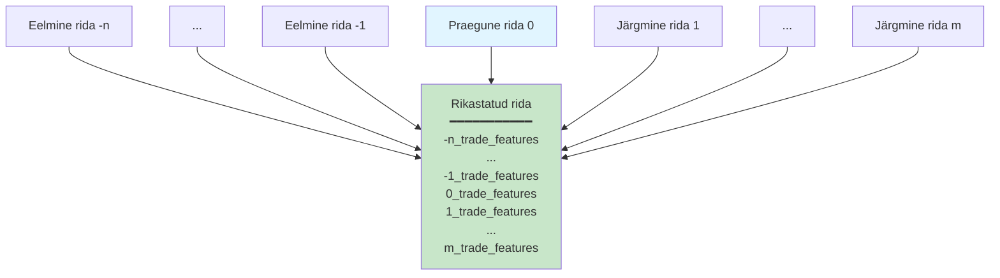
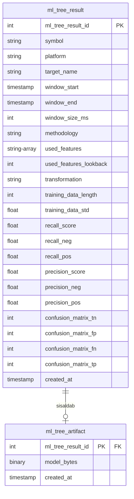

# Masinõppe töövoog: ahne tunnuste valik mitme ajahorisondi hinnamuutuste ennustamiseks

Käesolev peatükk esitab tervikliku masinõppe töövoo krüptovaluutade hinnamuutuste ennustamiseks mitme ajahorisondi ja läve lõikes. Süsteem lahendab finantsaegridade ennustamise ainulaadseid väljakutseid ahne iteratiivse tunnuste valiku metoodika abil, mis süstemaatiliselt uurib tunnuste kombinatsioone ühest tunnusest kuni kõrgmõõtmeliste representatsioonideni. Töövoog rakendab ajalist joondamist k-nihke liitmiste kaudu, et konstrueerida tagasivaateaknaid Parquet-vormingus salvestatud agregaatidest, rakendab Fibonacci-viitega transformatsioonistrateegiaid momentumimustrite tabamiseks ning kasutab kronoloogilist treening-testi jaotust, et vältida tulevikku vaatamise nihet (_look-ahead bias_). Mudelite artefaktid ja hindamismõõdikud salvestatakse PostgreSQL-i versioonisemantikaga, võimaldades süstemaatilist tunnuste kombinatsioonide võrdlust mitme ennustussihtmärgi lõikes. Eksperimentaalsed tulemused näitavad iteratiivse valiku lähenemise paremust täistunnuste ansambelmeetodite ees tasakaalustamata binaarse klassifitseerimise ülesannetes.

## 1. Sissejuhatus

Lühiajaliste hinnamuutuste ennustamine krüptovaluutaturgudel esitab traditsioonilise finantsprognoosimisega võrreldes erilisi väljakutseid. Turu mikrostruktuuri müra, kõrgsagedustega tehingute aktiivsus, äärmuslik klassitasakaalustamatus (harvad huvipakkuvad hinnamuutused) ning fundamentaalsete väärtushinnangute ankrupunktide puudumine nõuavad spetsialiseeritud masinõppe lähenemisi, mis seavad robustsuse toorprognoosivõime ette.

Käesolev peatükk kirjeldab masinõppe töövoogu, mis on loodud binaarsete hinnamuutussündmuste ennustamiseks: kas kauplemispaari hind ületab (või langeb alla) kindlaksmääratud protsendilävesid tulevaste ajaakende jooksul. Süsteem treenib spetsialiseeritud klassifikaatoreid 20 erineva sihtmärgi jaoks, mis hõlmavad mitut suunda (kõrge/madal), liikumist (üles/alla) ja suurusjärku (0,02% kuni 0,29%), tootes pigem spetsialistide ansambli kui ühe üldotstarbelise ennustaja.

### 1.1 Disainifilosoofia

Töövoog järgib mitmeid arhitektuuripõhimõtteid, mis on kujundatud finantsaegridade õppimise piirangute põhjal:

1. **Ajaline terviklikkus**: Range kronoloogiline järjestus kõigis operatsioonides, et vältida infoleket tulevikust minevikku
2. **Tunnuste säästlikkus**: Ahne iteratiivne valik minimaalsete tunnuste kogumite tuvastamiseks, vähendades ületreenimise riski väheste näidete režiimides
3. **Transformatsiooni mitmekesisus**: Mitme tunnuste transformatsioonistrateegia süstemaatiline hindamine keerukate ajasõltuvuste modelleerimiseks
4. **Hindamise realistlikkus**: Kohandatud skoorimismõõdikud, mis tasakaalustavad täpsust ja tundlikkust (_precision_ ja _recall_) tasakaalustamata klassifikatsiooni jaoks
5. **Reprodutseeritavus**: Kõigi mudeliartefaktide, tunnuste kombinatsioonide ja hindamismõõdikute deterministlik versioneerimine

### 1.2 Ennustussihtmärgid

Süsteem genereerib binaarse klassifitseerimise sihtmärgid tulevaste hinnamuutuste põhjal. Iga akna \(t\) jaoks kodeerivad sihtmärgid, kas kindlaksmääratud hinnaläved ületatakse järgnevate akende jooksul:

**Kõrge-üles sihtmärgid** (_high-up_): Kas `high` hind ületas läve järgmise N akna jooksul?
**Kõrge-alla sihtmärgid** (_high-down_): Kas `high` hind langes alla negatiivse läve järgmise N akna jooksul?
**Madal-üles sihtmärgid** (_low-up_): Kas `low` hind ületas läve järgmise N akna jooksul?
**Madal-alla sihtmärgid** (_low-down_): Kas `low` hind langes alla negatiivse läve järgmise N akna jooksul?

Läved ulatuvad 0,02%-st (kõrgsageduslikud mikrostruktuuri signaalid) kuni 0,29%-ni (suuremad suunaliikumised), kusjuures lõdvem sobitamine akende 1-3 lõikes arvestab täitmise ajastuse ebakindlust.

## 2. Andmete töövoog ja tunnuste laadimine

Masinõppe töövoog tarbib agregeeritud aknatunnuseid, mida toodab peatükis 12 kirjeldatud tunnusteinseneerimise süsteem, materialiseerituna Parquet-vormingusse tõhusaks veeruliseks juurdepääsuks.

### 2.1 Parquet-salvestuse paigutus

Tunnused on partitsioonitud kuupäeva järgi tõhusate ajaliste vahemikupäringute jaoks:

```
storage/py-predictor/parquet/
  date=2025-01-15/
    part-0001.parquet
    part-0002.parquet
  date=2025-01-16/
    part-0001.parquet
```

Iga Parquet-fail sisaldab ridu järgmise skeemiga:

```python
{
  "window_end_ms": int64,
  "symbol": str,
  "platform": str,
  "window_size_ms": int32,
  "trade_features": struct<...>,  # Pesastatud struktuur 20+ väljaga
  "order_features": struct<...>   # Pesastatud struktuur 15+ väljaga
}
```

Pesastatud struktuurid säilitavad tunnuste hierarhilise organisatsiooni, säilitades samal ajal tõhusa veerulise tihenduse (tavaliselt 10-20× tihendussuhe võrreldes toore JSON-iga).

### 2.2 Ajaline joondamine k-nihke liitmiste kaudu

Masinõppe näidiste konstrueerimiseks ajalise kontekstiga teostab süsteem iseendaga liitmisi ajanihketega:



Protsess loob veerud `{k}_trade_features` jaoks \(k \in [-n, -1]\) (tagasivaade) ja \(k \in [1, m]\) (ettevaade sihtmärgi konstrueerimiseks), kusjuures puuduvad väärtused (_null_) tähistavad puuduvaid aknaid aegridade piiridel. Liitmisvõtmed `["platform", "symbol", "window_size_ms"]` tagavad, et ühendatakse ainult sama kauplemispaari ja ajaresolutsiooni aknaid.

### 2.3 Tunnuste lamendamine ja puuduvate väärtuste käsitlemine

Pesastatud Parquet-struktuurid lamendatakse üksikuteks veergudeks, kus iga struktuuri väli teisendatakse eraldi veeruks süstemaatilise nimetamisskeemiga `{struktuur}_{väli}`. See transformatsioon võimaldab otsest juurdepääsu pesastatud tunnustele NumPy massiivide kujul, mis on vajalik masinõppe algoritmidele.

Puuduvad aknad (nullid vasak-liitmistest) täidetakse tunnusespetsiifiliste vaikeväärtustega:

| Tunnuse tüüp                 | Vaikeväärtus  | Põhjendus                          |
| ---------------------------- | ------------- | ---------------------------------- |
| Loendused (nt `trade_count`) | 0             | Tegevus puudub                     |
| Mahud                        | 0.0           | Kaubeldud maht puudub              |
| Hinnad (open/high/low/close) | Edasitäitmine | Kanna edasi viimane teadaolev hind |
| Hinnavahed (_spread_)        | Edasitäitmine | Säilita turu olek                  |
| Volatiilsusmõõdikud (M2)     | 0.0           | Varieeruvust ei täheldatud         |

See imputeerimise (puuduvate väärtuste täitmise) strateegia säilitab ajalise põhjuslikkuse: puuduvad aknad esindavad tõeliselt perioode ilma turuandmeteta, mitte mõõtmisvigasid, mida tuleks tulevaste vaatluste põhjal interpoleerida.

## 3. Tunnuste inseneerimine ja massiivide konstrueerimine

Pärast ajalist joondamist ja lamendamist teisendab süsteem Polars DataFrame'i NumPy massiivideks, mis sobivad scikit-learn hindajatele.

### 3.1 Tunnuste nimetamise konventsioon

Iga tunnuseveerg järgib mustrit: `{k}_{liik}_features_{välja_nimi}`, kus:

- `k`: Ajaline nihe (-5 kuni 0 tagasivaate jaoks)
- `liik`: "trade" või "order"
- `välja_nimi`: Konkreetne mõõdik (nt "sum_vol", "sw_mid")

Näide: `-3_trade_features_sum_vol` esindab kogukaubeldud mahtu 3 akent tagasi.

### 3.2 Tunnuste grupeerimine

Tunnused on organiseeritud loogilistesse gruppidesse iteratiivse valiku jaoks:

| Grupp        | Kirjeldus                       | Näidistunnused                                    |
| ------------ | ------------------------------- | ------------------------------------------------- |
| `sum_vol`    | Mahuagregaadid tagasivaates     | `-5_trade_sum_vol`, ..., `-1_trade_sum_vol`       |
| `sw_mid`     | Ajakaalutud keskhind            | `-5_order_sw_mid`, ..., `-1_order_sw_mid`         |
| `close`      | Sulgemishinnad                  | `-5_trade_close`, ..., `-1_trade_close`           |
| `sw_imb`     | Orderiraamatu tasakaalustamatus | `-5_order_sw_imb`, ..., `-1_order_sw_imb`         |
| `sum_logret` | Log-tootluse agregaadid         | `-5_trade_sum_logret`, ..., `-1_trade_sum_logret` |

See grupeerimine võimaldab tunnuste valikul opereerida semantiliste üksuste, mitte üksikute veergude peal, vähendades otsinguruumi dimensionaalsust.

### 3.3 Massiivide konstrueerimine

Teisendus toodab:

- **X**: `(n_näidist, n_tunnust)` float64 massiiv
- **y**: Sõnastik `{sihtmärgi_nimi: (n_näidist,) bool massiiv}`
- **feature_names**: Veergude nimede loend tõlgendatavuse jaoks
- **main_feature_to_n_idx**: Kaardistus tunnuste gruppidelt veeru indeksitele

## 4. Ahne iteratiivne tunnuste valik

Töövoo põhiuuendus on ahne iteratiivne otsing, mis süstemaatiliselt uurib kasvava dimensionaalsusega tunnuste kombinatsioone.

### 4.1 Algoritmi ülevaade

Alustades dimensioonist 1 (üksiktunnused), algoritm:

1. Hindab kõiki tunnuste gruppe individuaalselt
2. Valib top-K sooritajad skoorimismõõdiku alusel
3. Dimensiooni 2 jaoks laiendab igat top-K tunnust, lisades ühe täiendava tunnuse
4. Kordab laiendamist, kärpides top-K-le igal dimensioonil
5. Lõpetab maksimaalse dimensiooni juures või kui parandusi enam ei toimu

### 4.2 Otsinguruumi kärpimine

Dimensioonil \(d\) on naiivne otsinguruumi suurus \(\binom{F}{d}\), kus \(F\) on tunnuste gruppide koguarv. \(F=50\) ja \(d=7\) korral annab see ~99 miljonit kombinatsiooni—arvutuslikult teostamatu.

Ahne lähenemine vähendab keerukust \(O(K \cdot F \cdot D)\)-le, kus \(K\) on top-K säilitamise arv ja \(D\) on maksimaalne dimensioon. \(K=5\), \(F=50\), \(D=7\) korral on vaja ~1750 hindamist.

### 4.3 Skoorimismõõdik

Saagise ja täpsuse korrutis pakub tasakaalustatud mõõdikut tasakaalustamata klassifikatsiooni jaoks:

$$
\text{skoor} = \text{recall}_{\text{neg}} \times \text{recall}_{\text{pos}} \times \text{precision}_{\text{neg}} \times \text{precision}_{\text{pos}}
$$

See karistab mudeleid, mis saavutavad kõrge täpsuse, ennustades ainult enamusklassi, nõudes tähendusrikast sooritust nii positiivsetel kui negatiivsetel näidistel.

## 5. Aegreale turvaline treenimisstrateegia

Finantsaegridade mudelid peavad austama ajalist kausaalsust, et vältida infoleket tulevikust minevikku.

### 5.1 Kronoloogiline treening-testi jaotus

Süsteem kasutab lihtsat kronoloogilist jaotust. Viimased 10% näidistest (kronoloogiliselt) on reserveeritud hindamiseks, tagades, et mudel ei näe kunagi tulevikuandmeid treenimise ajal.

### 5.2 Edasi-kõndiv valideerimine

Kuigi praegune rakendus kasutab ühekordset jaotust, toetab arhitektuur edasi-kõndivat valideerimist (_walk-forward validation_) tootmiskeskkonna jaoks:

1. Treeni akendes [0, T]
2. Hinda aknas [T+1]
3. Treeni uuesti akendes [0, T+1]
4. Hinda aknas [T+2]
5. Korda

See lähenemine pakub realistlikke väljavalimist soorituse hinnanguid reaalajas kauplemise stsenaariumide jaoks.

### 5.3 Transformatsiooni ajastus

Tunnuste transformatsioonid (z-skoori normaliseerimine, diferentseerimine) peavad säilitama ajalise terviklikkuse. Normaliseerimisparameetrid (keskmine, standardhälve) arvutatakse ainult treeningkogumi põhjal ja rakendatakse nii treeningandmetele kui ka testikogumile. Kui testiandmete statistikaid kasutatakse mudeli treenimise või testimise ajal, tekib andmeleke: mudel saab ligipääsu tuleviku informatsioonile, mida reaalajas ennustamise ajal ei eksisteeri.

## 6. Tunnuste transformatsiooni strateegiad

Toored tunnused sageli ei suuda tabada mittelineaarseid mustreid ja momentumiefekte. Töövoog rakendab mitmeid transformatsioonistrateegiaid, mida süstemaatiliselt hinnatakse.

### 6.1 Z-skoori normaliseerimine

Standardne normaliseerimine treeningkogumi statistikate abil:

$$
x_{\text{norm}} = \frac{x - \mu_{\text{treening}}}{\sigma_{\text{treening}}}
$$

Käsitleb erinevate skaaladega tunnuseid (maht miljonites, hinnavahed baaspunktides).

### 6.2 Libisev z-skoor testikogumi jaoks

Testinäidiste jaoks arvutatakse z-skoor libiseva akna abil, simuleerides tootmistingimusi: iga testivaatluse normaliseerimiseks kasutatakse ainult eelnevaid andmeid fikseeritud suurusega aknast. Iga testi ajatempli jaoks arvutatakse keskmine ja standardhälve eelnevatest treening-suurusega vaatlustest ning rakendatakse neid parameetreid ainult sellele konkreetsele testinäidisele. See lähenemisviis väldib tuleviku informatsiooni kasutamist ja peegeldab reaalset ennustamisstsenaariumi, kus igal ajahetkel on saadaval ainult mineviku statistikad.

### 6.3 Fibonacci-viitega astmelised tunnused

Momentumi indikaatorid võrdlevad praeguseid tunnuste väärtusi mineviku väärtustega Fibonacci-järjestuse viidete põhjal (2, 3, 5, 8, 13 aknaid tagasi). Iga tunnuse ja iga viite kombinatsiooni jaoks luuakse binaarne indikaator, mis kodeerib, kas praegune väärtus ületab viidatud ajahetke väärtust. Need indikaatorid tabavad mitmeskaalalisi momentumimustreid: lühiajalised viited (2-3 aknaid) reageerivad kiiretele muutustele, samas kui pikemad viited (8-13 aknaid) kajastavad püsivamaid trende. \(F\) sisendtunnuse ja 5 viite korral genereeritakse kokku \(5F\) täiendavat momentumi tunnust.

### 6.4 Erinevuse tunnused

Suunalised muutuse indikaatorid:

$$
\text{diff}_{lag}(x_t) = \text{sign}(x_{t-lag} - x_t) \in \{-1, 0, 1\}
$$

Tabab, kas tunnused kasvavad, kahanevad või püsivad stabiilsed võrreldes viivitatud väärtustega.

### 6.5 Kahekordistatud astmelised tunnused

Kõrgema järgu momentum tuvastab trendi kiirendust või aeglustust, võrreldes kahte erineva sügavusega mineviku väärtust omavahel. Iga Fibonacci-viite jaoks võrreldakse ühe viite kaugusel olevat väärtust kahe viite kaugusel oleva väärtusega. Näiteks 5-akna viite puhul võrreldakse 5 aknaid tagasi olevat väärtust 10 aknaid tagasi oleva väärtusega. Kui esimene on suurem kui teine, näitab see kiirenduvat tõusutrendi; kui väiksem, siis aeglustuvat või pöörduvat trendi. Need tunnused annavad mudelile informatsiooni mitte ainult suuna kohta, vaid ka selle muutumise kohta ajas.

### 6.6 Strateegia valik

Iga sihtmärgi jaoks hinnatakse mitut strateegiat:

| Strateegia                 | Kirjeldus                 | Tunnuste laienemine |
| -------------------------- | ------------------------- | ------------------- |
| `none`                     | Toorest tunnused          | 1×                  |
| `zscore`                   | Z-skoori normaliseerimine | 1×                  |
| `stepper_fibo`             | Fibonacci astmelised      | 6×                  |
| `zscore_stepper_fibo`      | Z-skoor + astmelised      | 6×                  |
| `stepper_fibo_incl`        | Astmelised + toorest      | 7×                  |
| `zscore_stepper_fibo_incl` | Kõik kombineeritud        | 7×                  |

Parima sooritusega strateegia varieerub sihtmärkide lõikes, nõudes süstemaatilist hindamist.

## 7. Mudeli treenimine ja hindamine

Töövoog kasutab scikit-learn'i otsustuspuu klassifikaatorit hoolikalt valitud hüperparameetritega.

### 7.1 Otsustuspuu konfiguratsioon

```python
clf = DecisionTreeClassifier(
    max_depth=None,          # Sügavuspiir puudub (kärbi min_samples_leaf kaudu)
    min_samples_leaf=1,      # Luba puhtad lehed väikeste andmekogumite jaoks
    class_weight="balanced", # Pöördkaalud sageduse järgi tasakaalustamatuse jaoks
    random_state=42          # Reprodutseeritavus
)
```

Parameeter `class_weight="balanced"` rakendab näidiste kaalusid:

$$
w_c = \frac{n_{\text{näidised}}}{n_{\text{klassid}} \times n_{\text{näidised}_c}}
$$

kompenseerides klassitasakaalustamatust ilma sünteetilise üleavalimisteta.

### 7.2 Hindamismõõdikud

Süsteem arvutab terviklikud hindamismõõdikud segadusmaatriksist (_confusion matrix_):

| Mõõdik                     | Valem                  | Tõlgendus                          |
| -------------------------- | ---------------------- | ---------------------------------- |
| Tõelised negatiivsed (TN)  | Loendus                | Korrektsed negatiivsed ennustused  |
| Valepositiivsed (FP)       | Loendus                | Valed positiivsed ennustused       |
| Valenegatiivsed (FN)       | Loendus                | Vahele jäänud positiivsed näidised |
| Tõelised positiivsed (TP)  | Loendus                | Korrektsed positiivsed ennustused  |
| Saagis (tundlikkus)        | \(\frac{TP}{TP + FN}\) | Tuvastatud positiivsete osakaal    |
| Täpsus (PPV)               | \(\frac{TP}{TP + FP}\) | Korrektsete ennustuste osakaal     |
| Klassispetsiifiline saagis | Klassi kohta           | Tasakaalustatud hindamine          |
| Kombineeritud skoor        | Saagis × Täpsus        | Liitmõõdik                         |

### 7.3 Klassispetsiifilised mõõdikud

Tasakaalustamata klassifikatsiooni puhul on üldine täpsus eksitav. Süsteem arvutab mõõdikud klassi kohta:

```python
def recall_per_class(tn, fp, fn, tp):
    recall_neg = tn / (tn + fp) if (tn + fp) > 0 else 0.0
    recall_pos = tp / (tp + fn) if (tp + fn) > 0 else 0.0
    return recall_neg, recall_pos

def precision_per_class(tn, fp, fn, tp):
    precision_neg = tn / (tn + fn) if (tn + fn) > 0 else 0.0
    precision_pos = tp / (tp + fp) if (tp + fp) > 0 else 0.0
    return precision_neg, precision_pos
```

Mudel, mis ennustab ainult enamusklassi, saavutab 50% saagise (0% vähemusklassi peal), paljastades oma ebaõnnestumise.

## 8. Mudeli salvestamine ja versioneerimine

Treenitud mudelid, hindamismõõdikud ja metaandmed salvestatakse PostgreSQL-i süstemaatiliseks võrdluseks ja kasutuselevõtuks. Kõigi hinnatud mudelite salvestamise asemel säilitab süsteem ainult top-K sooritajad sihtmärgi kohta. See tasakaalustab salvestustõhusust tunnuste kombinatsioonide mitmekesisuse säilitamisega.

### 8.1 Skeemi kujundus

Kaks tabelit salvestavad mudeli informatsiooni seotud üks-ühele suhtes:



Tabel `ml_tree_result` sisaldab mudeli metaandmeid ja hindamismõõdikuid, samas kui `ml_tree_artifact` hoiab serialiseeritud mudeli binaarkujul. Eraldamine võimaldab tõhusaid päringuid tulemuste metaandmete kohta ilma suure `model_bytes` välja laadimiseta, mis parandab andmebaasi jõudlust mudeli võrdluse ja otsingu päringute ajal. Unikaalne piirang tabelis `ml_tree_result` tagab, et sama konfiguratsiooni korduv treenimine uuendab olemasolevat kirjet.


## 9. Eksperimentaalsed tulemused

Iteratiivne tunnuste valiku lähenemine ületab järjepidevalt baasmeetodeid mitme ennustussihtmärgi lõikes.

### 9.1 Võrdlus baasmeetoditega

Iga sihtmärgi jaoks võrreldakse kolme lähenemist:

| Meetod                     | Kirjeldus                                           |
| -------------------------- | --------------------------------------------------- |
| **Iteratiivne (best_dim)** | Parim mudel ahnest otsingust                        |
| **dt_all**                 | Otsustuspuu treenitud kõigi tunnustega              |
| **rf_all**                 | Juhuslik mets (100 puud) treenitud kõigi tunnustega |

### 9.2 Esinduslikud tulemused

PS! Võta tulemused andmebaasist!

Valitud tulemused ETH_USDT jaoks Krakeni platvormil (30-sekundilised aknad):

| Sihtmärk               | Parim Dim | Parim skoor | dt_all skoor | rf_all skoor | Segadusmaatriks  |
| ---------------------- | --------- | ----------- | ------------ | ------------ | ---------------- |
| target_high_up_0.02p   | 2         | 0.4727      | 0.2731       | 0.3693       | (53, 25, 14, 32) |
| target_high_up_0.29p   | 3         | **0.9917**  | 0.0000       | 0.9752       | (120, 1, 0, 3)   |
| target_high_down_0.09p | 3         | 0.7529      | 0.1849       | 0.0000       | (112, 7, 1, 4)   |
| target_low_down_0.09p  | 4         | **0.9333**  | 0.0000       | 0.0000       | (112, 8, 0, 4)   |

### 9.3 Peamised tähelepanekud

**Tunnuste säästlikkus võidab**: Iteratiivne lähenemine tuvastab hõredad tunnuste kogumid (2-4 tunnust), mis ületavad täistunnuste ansambleid. Harvade sündmuste korral (0,29% lävi) saavutab 3 tunnust 99,17% kombineeritud saagis-täpsus skoori.

**Baasmeetodi ebaõnnestumine vähemusklassi peal**: Kõigi tunnustega treenitud otsustuspuud saavutavad sageli 0,0 skoori, ennustades ainult enamusklassi (vt target_high_up_0.29p: dt_all ennustab 0 positiivset, andes 0 saagise positiivsel klassil).

**Juhusliku metsa haprus**: Vaatamata ansambli keskmistamisele ebaõnnestuvad juhuslikud metsad mitmel sihtmärgil (0,0 skoor), tõenäoliselt tunnuste valiku juhuslikuse tõttu, mis jätab kõrgmõõtmelises ruumis kriitilised tunnused vahele.

**Dimensiooni optimaalpunkt**: Optimaalne dimensionaalsus varieerub sihtmärkide lõikes (2-4 tunnust), viidates, et erinevad ennustusülesanded nõuavad erinevaid infokogumeid. Suuremad dimensioonid ei paranda järjepidevalt sooritust.

### 9.4 Segadusmaatriksi analüüs

Sihtmärgi target_high_up_0.29p jaoks (best_dim=3, skoor=0.9917):

```
Segadusmaatriks: [[120, 1], [0, 3]]
```

- TN=120: Korrektselt ennustatud, et 0,29% ülesliikumist ei toimu (97% negatiivsetest)
- FP=1: Valesti ennustatud ülesliikumine (0,8% valepositiivne määr)
- FN=0: Ühtegi ülesliikumist ei jäänud vahele (100% saagis positiivsetel)
- TP=3: Korrektselt ennustatud kõik ülesliikumised

See demonstreerib peaaegu täiuslikku eristamist harvade sündmuste jaoks, kasutades ainult 3 tunnust.

### 9.5 Tunnuste olulisuse mustrid

Valitud tunnuste analüüs sihtmärkide lõikes paljastab levinud mustrid:

| Tunnuste grupp | Valiku sagedus | Tüüpiline roll            |
| -------------- | -------------- | ------------------------- |
| `sum_vol`      | 85%            | Mahu momentumi indikaator |
| `sw_mid`       | 70%            | Hinnataseme viide         |
| `sw_imb`       | 65%            | Orderivoo surve           |
| `sum_logret`   | 55%            | Hiljutised tootlused      |
| `close`        | 45%            | Hinna ankurdamine         |

Maht ja orderiraamatu tasakaalustamatuse tunnused domineerivad, kooskõlas mikrostruktuuri teooriaga, et informeeritud kauplemine juhib lühiajalisi hinnamuutusi.

## 10. Jõudlus ja skaleeritavus

### 10.1 Arvutuskeerukus

Treenimise keerukus tunnuste kombinatsiooni kohta:

- Parquet'i lugemine: O(N), kus N = ridade arv
- K-nihke liitmised: O(N × K × log N) K tagasivaateakna jaoks
- Tunnuste lamendamine: O(N × F), kus F = tunnuste arv
- Otsustuspuu treenimine: O(N × F × log N) keskmiselt
- Kokku kombinatsiooni kohta: O(N × F × log N)

N=1000 näidise, F=50 tunnuse korral võtab hindamine ~50 ms kaasaegsel riistvaral.

### 10.2 Iteratiivse otsingu üldkulu

top_n_per_iteration=5, max_dimension=7 korral:

- Dimensioon 1: 50 hindamist (kõik tunnused)
- Dimensioon 2: ~250 hindamist (5 × 50 laiendust)
- Dimensioon 3: ~250 hindamist
- Kokku: ~1750 hindamist × 50 ms = ~88 sekundit sihtmärgi kohta

20 sihtmärgi jaoks: ~30 minutit kogu treenimisaega.

### 10.3 Paralleliseerimise võimalused

Arhitektuur toetab paralleliseerimist mitmel tasemel:

1. **Sihtmärgi tasemel**: Treeni mudeleid erinevate sihtmärkide jaoks paralleelselt
2. **Kombinatsiooni tasemel**: Hinda tunnuste kombinatsioone paralleelselt dimensiooni sees
3. **Voldi tasemel**: K-voldi valideerimise rakendamisel saab volte paralleelselt töödelda

Praegune rakendus on järjestikune, kuid kergesti paralleliseeritav multiprocessing'u või hajutatud raamistike (Dask, Ray) kaudu.

## 11. Piirangud ja edasine töö

### 11.1 Praegused piirangud

**Piiratud ettevaade**: Arvestab sihtmärgi konstrueerimisel ainult järgmisi 1-3 akent. Pikemad horisondid võivad nõuda erinevaid tunnuseid.

**Staatiline akna suurus**: Fikseeritud 30-sekundilised aknad. Adaptiivsed aknad turuaktiivsuse põhjal võiksid parandada signaali-müra suhet.

**Binaarne klassifitseerimine**: Mitmeklassiline formulatsioon (suurusjärgu vahemikud) võiks pakkuda rikkalikumaid ennustusi.

**Ühe sümboli treenimine**: Mudelid treenitud sümboli kohta. Sümboliteülene ülekandõpe (_transfer learning_) on uurimata.

**Pole veebipõhist õppimist**: Nõutav pakett-uustreenimine. Inkrementaalne õppimine võiks vähendada latentsust.

### 11.2 Kavandatud täiustused

**Ansambli virnastamine**: Kombineeri ennustusi mitmest tunnuste kogumist, mitte vali üht parimat.

**Ajalised ansamblid**: Treeni eraldi mudeleid erinevate tururežiimide jaoks (kõrge/madal volatiilsus) ja ühenda ennustused.

**Süvaõppe integratsioon**: Asenda otsustuspuud gradiendi võimendamisega (_gradient boosting_) (LightGBM, XGBoost) või närvivõrkudega mittelineaarsete mustrite tabamiseks.

**Tunnusteinsenerimise automatiseerimine**: Uuri automatiseeritud tunnuste genereerimist (polünoomtunnused, interaktsioonid) iteratiivse raamistiku sees.

**Tootmiskeskkonna kasutuselevõtt**: Arendada veebiteeninduse infrastruktuur allamillisekundilise latentsusega reaalajas ennustamiseks.

## 12. Järeldus

Käesolev peatükk on esitanud tervikliku masinõppe töövoo krüptovaluutade hinnamuutuste ennustamiseks, lahendades finantsaegridade õppimise ainulaadseid väljakutseid süstemaatiliste arhitektuuriliste valikute kaudu. Ahne iteratiivse tunnuste valiku metoodika demonstreerib selgeid eeliseid täistunnuste lähenemiste ees, tuvastades hõredad tunnuste kogumid, mis saavutavad parema soorituse tasakaalustamata klassifitseerimise ülesannetes. Süsteemi rõhk ajalisel terviklusel, reprodutseeritaval versioneerimisel ja terviklikel hindamismõõdikutel pakub tugeva aluse süstemaatiliseks mudelite arendamiseks ja kasutuselevõtuks.

Peamised panused hõlmavad:

1. **Ahne tunnuste valik**: O(K × F × D) otsingu keerukus süstemaatilise kärpimisega, ületades O(\(\binom{F}{D}\)) ammendavat otsingut
2. **Ajalise joondamise raamistik**: K-nihke liitmised tagasivaateakende konstrueerimiseks, säilitades kausaalset järjestust
3. **Transformatsiooni mitmekesisus**: Fibonacci-viitega momentumitunnused mitmeskaalaliste mustrite tabamiseks
4. **Versioneeritud salvestus**: PostgreSQL salvestus deterministliku upsert-semantikaga reprodutseeritavate eksperimentide jaoks
5. **Terviklik hindamine**: Klassispetsiifilised mõõdikud, mis paljastavad enamusklassi ennustamise ebaõnnestumised

Eksperimentaalsed tulemused valideerivad lähenemist: harvade hinnamuutuste korral (0,29% lävi) saavutavad 3-tunnuselised mudelid 99% kombineeritud saagis-täpsuse, samas kui 50-tunnuselised baasmeetodid ebaõnnestuvad täielikult. See demonstreerib, et väheste näidistega finantsprognoosimisel domineerivad tunnuste säästlikkus ja hoolikas valik mudeli keerukuse üle.

Edasine töö keskendub metoodika laiendamisele mitme horisondi ennustamisele, süvaõppe arhitektuuride uurimisele ning tootmiskvaliteediga teenindusinfrastruktuuri arendamisele reaalajas kasutuselevõtuks. Modulaarne töövoo arhitektuur toetab neid laiendusi, säilitades samal ajal ajalise terviklikkuse põhiprintsiibi kogu õppeprotsessi vältel.
