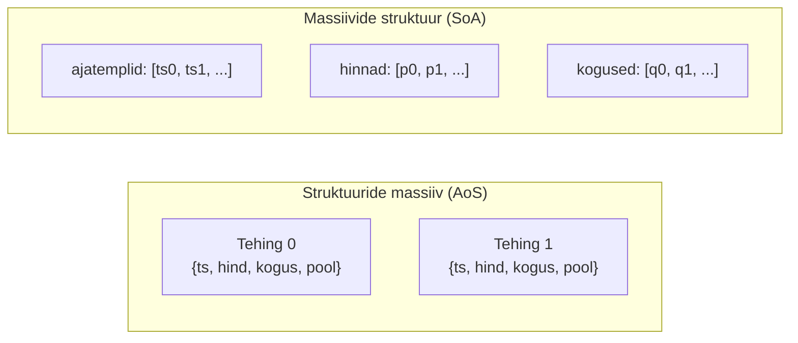
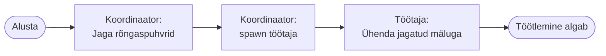
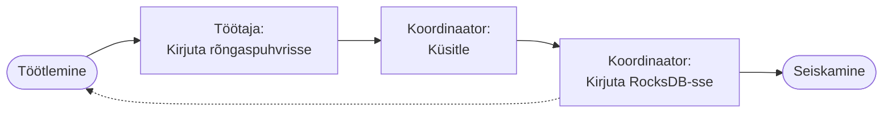

# Tunnuste genereerimine turuandmetest: paralleelne aknastatud lähenemine

Käesolev peatükk esitleb tunnuste genereerimise konveierit kõrgsagedusliku krüptovaluutade turuandmete jaoks. Süsteem rakendab ajaaknapõhist tunnuste eraldamist tehingusündmustest ja orderiraamatu hetkeseisudest, kasutades massiivide-struktuuride (Structure-of-Arrays) andmepaigutusi efektiivseks vektoriseeritud arvutuseks ning kohandatud lukuvabasid rõngaspuhvreid protsessidevaheliseks suhtluseks.

## Disaini eesmärgid

Rakendus seab prioriteediks:

1. **Arvutuslik efektiivsus**: NumPy vektoriseeritud operatsioonid delegeerivad arvutused optimeeritud BLAS rutiinidele
2. **Paralleelne skaleeritavus**: töö jaotamine mitme protsessi vahel GIL konfliktide vältimiseks
3. **Mälu efektiivsus**: massiivide-struktuuride paigutused ja null-koopia andmejuurdepääs
4. **Deterministlik taasesitus**: kontrollpunktipõhine taastamine ja joondatud aknapiirid
5. **Reaalajas töötlemine**: sujuv üleminek ajaloolistest andmetest reaalajas voogedastusele

Pythoni dünaamiline tüüpimine kehtestab jõudluskaristusi skalaaroperatsioonidele, kuid NumPy ndarray delegeerib massiivi operatsioone optimeeritud teekidele, saavutades vektoriseeritud arvutuste puhul natiivsete C rakendustega võrreldava jõudluse.

## Aknastamise arhitektuur

Süsteem kasutab fikseeritud intervalliga ajaaknaid. Aknapiirid määratakse Unix-i epohhi millisekundite täisarvulise jagamise kaudu:

```
window_start = (event_timestamp_ms // window_size_ms) * window_size_ms
```

Iga aknatöötaja hoiab kahepuhvrilist olekumasinat piiride üleminekuteks. Kontrollpunktide taastamiseks skaneeritakse RocksDB viimased kirjed binaarotsingu abil.

**Kaherežiimiline töö**: Ajalooline catch-up (RocksDB iteratsioon maksimaalse läbilaskega) → reaalajas voogedastus (ZeroMQ sub).

## Tehingutunnuste eraldamine

### Massiivide-struktuuride andmepaigutus



: Joonis 4.1 Struktuuride massiivi ja massiivide struktuuri võrdlus

Paigutuse eelised: vektoriseerimine (NumPy töötleb terveid massiive), vahemälu lokaalsus (järjestikune mälu), mälu efektiivsus (puudub Pythoni objekti üldkulu), null-koopia vaated (`memoryview`).

SoA kasutab Pythoni `array.array` moodulit: `timestamps` (`array('q')`), `prices` (`array('d')`), `quantities` (`array('d')`), `sides` (`array('B')`).

### Null-koopia NumPy teisendus

```python
ts = np.frombuffer(memoryview(self.ts), dtype=np.int64, count=n)
prices = np.frombuffer(memoryview(self.price_u), dtype=np.float64, count=n)
```

`np.frombuffer` funktsioon loob NumPy massiivi viite otse `array.array` sisemisele mälupuhvrile ilma andmeid kopeerimata. `memoryview` objekt pakub puhvri-protokolli liidest, mis võimaldab NumPy'l lugeda algseid andmeid ilma Pythoni objekti üldkuluta. Tulemuseks on vektoriseeritud arvutuste jaoks vajalik nullkuluga teisendus.

### Arvutatud tehingutunnused

| Kategooria     | Tunnused                                                |
| -------------- | ------------------------------------------------------- |
| OHLCV          | Open, High, Low, Close, Volume                          |
| Mahukaalutud   | VWAP lugeja (Σ price×qty), ostude/müükide maht          |
| Log-tootlused  | sum_logret, sum_logret², sum_logret³                    |
| Ajatunnused    | Esimene/viimane ajatempel, intervallide summa, max lõhe |
| Suuruse jaotus | Min/max tehingu suurus                                  |

: Tabel 4.1 Tehingutunnuste kategooriad

## Orderiraamatu tunnuste eraldamine

### Oleku haldamine

Kumbagi poolt esindab `_SideBook` struktuur: `prices` (sorteeritud loend), `volumes` (sõnastik hind→kogus), `total_qty` ja `total_notional` (jooksvad summad O(1) päringuteks).

Järkjärguline uuendus: taseme lisamine (`bisect.insort`), uuendamine (delta arvutus) või eemaldamine (kogus→0).

### Ajakaalutud tunnuste akumulatsioon

Iga orderiraamatu uuenduse jaoks on eelmisele olekule määratud kaal `w = t_curr - t_prev`, kus `w` on millisekundites mõõdetud ajavahemik, mille jooksul eelmine orderiraamatu olek püsis. See kaal võimaldab arvutada ajakaalutud keskmisi, mis arvestavad, kui kaua iga hind või maht aknas püsis, mitte ainult uuenduste arvu.

| Kategooria    | Tunnused                                        |
| ------------- | ----------------------------------------------- |
| Keskhinnad    | sw_mid, sw_micro (mahukaalutud)                 |
| Hinnavahe     | sw_spread, spread_min, spread_max               |
| Sügavus       | sw_bid, sw_ask, sw_imb (tasakaalustamatus)      |
| Parima taseme | sw_bid_best_sz, sw_ask_best_sz                  |
| Sündmused     | n_mid_up, n_mid_down, n_spread_widen, n_updates |
| Sulgemine     | close_mid, close_spread, close_bb, close_ba     |

: Tabel 4.2 Orderiraamatu tunnuste kategooriad

### Welfordi algoritm dispersiooniks

Jooksva dispersiooni arvutamine toimub Welfordi algoritmiga [4], mis võimaldab numbriliselt stabiilset dispersiooni arvutamist ühe läbimisega. Arvutus toimub valemiga (4.1):

```python
w_old, mean_old = acc.n_w, acc.mean_mid
w_new = w_old + w
delta = mid - mean_old
mean_new = mean_old + (w * delta) / w_new
acc.M2_mid += w * (mid - mean_new) * (mid - mean_old)
```

Võimaldab volatiilsuse hindamist ühe läbimisega ilma vaatluste salvestamiseta.

## Mitmeprotsessiline paralleliseerimine

Süsteem partitsioneerib töö dimensioonides: platvorm, sümbol, akna suurus, andmete liik. Töötajate arv vastab CPU tuumade arvule.

**Protsessi isolatsiooni eelised**: GIL vältimine (NumPy paralleelsus), mälu isolatsioon, vea isolatsioon, sõltumatu kontrollpunktimine.





: Joonis 4.2 Mitmeprotsessilise paralleeltöötluse järjestusdiagramm

## Kohandatud lukuvaba rõngaspuhver

### Arhitektuuri põhjendus

Pythoni `multiprocessing.Queue` kasutab pickle serialiseerimist ja lukke. Kohandatud rõngaspuhver elimineerib need kulud: null-serialiseerimine (MessagePack eelserialiseeritud), lukuvaba toiming (üksik-tootja üksik-tarbija), null-koopia lugemised.

### Sõnumi vorming

Rõngaspuhvri sissekanne koosneb neljast järjestikusest väljast: esimesed 4 baiti kodeerivad võtme pikkuse, järgmised 4 baiti kodeerivad väärtuse pikkuse, seejärel järgneb muutuva pikkusega võtme baidijada ja lõpuks muutuva pikkusega väärtuse baidijada. See formaat võimaldab efektiivselt lugeda ja dekodeerida andmeid ilma eelnevalt struktuuri suurust teadmata.

### Rõngaspuhvri struktuur

**Andmepuhver**: 4MB ringpuhver (2²² baiti), ümberkeerdumise jaoks bitioperatsioon `& mask`.

**Indekspuhver**: 24-baidine metaandmed (`r_from`, `w_end_marker`, `w_to`) redundantse topeltkirjutusega aatomilisuse tagamiseks.

### Jõudluse analüüs

Jõudluse mõõtmiseks loodi võrdlev benchmark [5], mis testis kolme IPC mehhanismi: kohandatud lukuvaba rõngaspuhver, multiprocessing.Queue eelserialiseeritud baitidega ja multiprocessing.Queue pickle objektidega. Iga test saatis 100 000 kuni 10 miljonit TradeWindowAggregate sõnumit (MessagePack serializeeritud, ~150 baiti) producer ja consumer protsesside vahel.

| Sõnumite arv | Rõngaspuhver | Queue + baidid | Queue + objektid | Kiirenemine  |
| ------------ | ------------ | -------------- | ---------------- | ------------ |
| 100 000      | 2,15 μs/sõn  | 6,39 μs/sõn    | 8,90 μs/sõn      | 3,0–4,1×     |
| 1 000 000    | 1,67 μs/sõn  | 5,95 μs/sõn    | 8,43 μs/sõn      | 3,5–5,0×     |
| 10 000 000   | 1,64 μs/sõn  | 5,96 μs/sõn    | 8,71 μs/sõn      | **3,6–5,3×** |

: Tabel 4.3 Rõngaspuhvri jõudluse võrdlus standardse Queue'ga

Lukuvaba rõngaspuhver saavutab **3,6× kiirema jõudluse** kui Queue eelserialiseeritud baitidega ja **5,3× kiirema** kui Queue pickle objektidega.

## Integratsioon ML konveieriga

**Tunnuste püsivus**: Andmed on järjestatud RocksDB's binaar komposiit-võtmete (`window_end_ms, symbol, kind, window_size_ms, platform`) alusel.

**Parquet eksport**: Kuupäevapõhine partitsioneerimine Polars paralleelseks laadimiseks.

**Tuletatud tunnused**: VWAP (`sum_pv / sum_vol`), volatiilsus (`sqrt(sum_logret2 / count)`), tasakaalustamatus (`(buy_vol - sell_vol) / sum_vol`).

## Kokkuvõte

Süsteem demonstreerib võtme-arhitektuurimustreid:

1. **Massiivide-struktuuride paigutused** võimaldavad vektoriseeritud arvutust NumPy tuumade kaudu
2. **Mitmeprotsessiline paralleliseerimine** kasutab CPU tuumad GIL konfliktideta
3. **Lukuvaba IPC** saavutab 3,6–5,3× kiirema sõnumiedastuse
4. **Ajakaalutud akumulatsioon** arvestab oleku püsivust pidevates orderiraamatu voogudes
5. **Kontrollpunktipõhine taastamine** võimaldab deterministlikku taasesitust

Pythoni numbrilise ökosüsteemi kombinatsioon hoolikalt arhitekteeritud paralleliseerimisega demonstreerib, et interpreteeritud keeled saavutavad andmeparalleelsete töökoormuste puhul natiivsete rakendustega võrreldava jõudluse.
